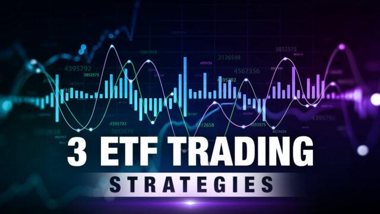

Exchange-traded funds (ETFs) have significantly reshaped the investment landscape over the past few decades. With more investors seeking cost-effective and flexible options for portfolio diversification, ETFs have become increasingly popular. These investment vehicles allow both novice and seasoned investors alike to access a range of asset classes, including stocks, bonds, and commodities, through a single purchase on a stock exchange.

For beginners beginning their investment journey, understanding the intricacies of ETF trading is crucial. It offers them a pathway to diversify their investment without the complexities often associated with traditional mutual funds. ETFs trade like stocks, providing liquidity and real-time pricing, while typically maintaining a lower expense ratio compared to mutual funds.



Equipping new investors with actionable strategies plays a vital role in ensuring they extract maximum benefit from their investments in ETFs. These strategies include foundational concepts essential for minimizing risks and enhancing returns. Furthermore, the advent of technology has introduced algorithmic trading, an automated method of executing trades that can offer efficiencies unattainable through manual trading. For beginners, insights into algorithmic trading can provide an edge by optimizing trade executions based on pre-defined criteria, such as price and volume.

This article aims to provide novice investors with a comprehensive understanding of the essential concepts and strategies related to ETF trading. By focusing on elementary yet effective trading strategies and highlighting the advantages of algorithmic trading, new investors can form a robust foundation for a successful investment journey. Ultimately, continuous learning and adaptability remain key components for investors navigating today's dynamic financial markets.

## Table of Contents

## Understanding ETFs

Exchange-Traded Funds (ETFs) are a type of investment vehicle that mirrors the trading characteristics of stocks while holding a diverse set of assets, such as stocks, commodities, or bonds. These funds are designed to track specific indices, commodities, or any other selection of assets, providing investors with a way to invest in a range of financial instruments through a single purchase. ETFs are traded on major stock exchanges, and their prices fluctuate throughout the trading day, just like individual stocks.

The primary mechanism that underpins ETF operations is arbitrage. This process ensures that the ETF price remains closely aligned with its Net Asset Value (NAV), which is the value of the underlying assets divided by the total number of shares. When an ETF trades at a price deviating significantly from its NAV, institutional investors, called Authorized Participants (APs), are incentivized to engage in arbitrage. APs can either assemble the underlying securities to create new ETF shares or purchase ETF shares to redeem them for the underlying securities, thereby correcting any mispricing.

ETFs are particularly attractive to beginner investors for several reasons. Firstly, they offer diversification, enabling investors to spread risk across various asset classes without needing to purchase each asset individually. Diversification is fundamental in reducing the risk associated with investing in volatile markets. An [ETF](/wiki/etf-trading-strategies) tracking a broad-based equity index like the S&P 500, for example, automatically provides exposure to 500 of the largest companies in the U.S., inherently reducing individual stock risk.

Another benefit of ETFs is their cost-effectiveness. Generally, ETFs have lower expense ratios compared to mutual funds, as they are passively managed and aim to replicate the performance of a particular index rather than outperform it. This makes them an economically viable option for investors looking to minimize fees.

ETFs also offer tax efficiency. In traditional mutual funds, investors may incur capital gains taxes when shares within the fund are bought and sold. In contrast, because of the in-kind creation and redemption mechanism of ETFs, the transfer of securities between APs and the ETF does not trigger taxable events, allowing holders to defer taxes.

Lastly, ETFs provide [liquidity](/wiki/liquidity-risk-premium) due to their trading nature. Investors can buy or sell ETF shares at market prices throughout the trading day, providing flexibility and ease of access to their funds, unlike mutual funds, which are priced only at the end of the trading day.

In summary, ETFs combine the features of both mutual funds and individual stocks, presenting an appealing option for beginner investors interested in accessing diversified asset exposure, liquidity, cost efficiency, and tax advantages, all within a single, easily traded instrument.

## Beginner ETF Trading Strategies

For those entering the world of ETF trading, establishing a clear and effective strategy is essential to navigate the complexities of the market. Among the popular strategies suitable for beginners are Dollar-Cost Averaging, Asset Allocation, and Sector Rotation. Each of these strategies offers unique advantages, particularly in terms of risk reduction and return maximization.

### Dollar-Cost Averaging (DCA)

Dollar-Cost Averaging is a straightforward strategy that involves investing a fixed amount of money at regular intervals, regardless of the market conditions. This method minimizes the effects of market [volatility](/wiki/volatility-trading-strategies) by spreading out the purchase of units over time, thus averaging the cost of investments. For example, an investor might allocate $500 monthly to purchase shares of an ETF. When prices are high, fewer shares are bought; when prices are low, more are acquired. This systematic investment approach reduces the risk of investing a large sum in a single transaction when prices might be unfavorable.

**Advantages:**

1. **Risk Mitigation:** By spreading investments over time, DCA diminishes the impact of market volatility.

2. **Emotional Control:** Investors are less likely to make impulsive decisions driven by market fluctuations.

3. **Feasibility:** It is a practical choice for investors with limited capital, allowing them to build a position gradually.

### Asset Allocation

Asset Allocation involves dividing an investment portfolio among different asset categories, such as stocks, bonds, and cash, with the goal of balancing risk and reward according to an individual's risk tolerance and investment horizon. For ETFs, this can mean selecting a mix of equity ETFs, bond ETFs, and perhaps commodity ETFs.

**Python Example:**

```python
portfolio = {
    'Equity_ETF': 50,  # 50% in equity ETFs
    'Bond_ETF': 30,    # 30% in bond ETFs
    'Commodity_ETF': 20 # 20% in commodity ETFs
}
```

**Advantages:**

1. **Diversification:** Spreading investments across multiple asset classes can reduce risk as different assets often react differently to economic events.

2. **Flexibility:** Investors can adjust allocations based on changing market conditions or personal circumstances.

3. **Customization:** Asset Allocation can be tailored to meet individual financial goals and risk tolerance levels.

### Sector Rotation

Sector Rotation is a more advanced strategy that involves shifting investments between different sectors of the economy to capitalize on the phases of the business cycle. Investors using ETFs can rotate between sector-specific ETFs, such as technology or healthcare, depending on economic forecasts and sector performance.

**Advantages:**

1. **Potential for High Returns:** By correctly predicting sector performance, investors can achieve above-average returns.

2. **Adaptability:** Investors can adjust their portfolio to reflect changes in economic conditions or market sentiment.

3. **Focus on Performance Drivers:** Assists in identifying sectors likely to benefit from specific economic trends or events.

Each of these strategies, while different in their approach, share the core objective of maximizing returns while minimizing risks. For beginners, understanding and effectively implementing these strategies can lead to more disciplined and potentially successful ETF trading.

## Algorithmic Trading in ETFs

Algorithmic trading, commonly referred to as algo trading, involves the use of advanced mathematical models and computer programs to make high-speed trading decisions in financial markets. In the context of ETFs (Exchange-Traded Funds), [algorithmic trading](/wiki/algorithmic-trading) enables investors to capitalize on market efficiencies by executing trades automatically based on predetermined criteria such as price movements, timing, and trading [volume](/wiki/volume-trading-strategy).

### Basics of Algorithmic Trading

Algorithmic trading systems are built on preset rules that determine when and how trades are executed. These systems can quickly analyze large datasets from multiple market sources, making decisions far quicker than human traders. Algorithms are designed to identify trading opportunities, execute them at optimal prices, and manage positions automatically.

Python has become a popular language for building algorithmic trading systems due to its extensive libraries and ease of use. For instance, packages like NumPy and pandas facilitate data manipulation, while libraries like `TA-Lib` offer a range of technical indicators essential for forming trading strategies.

### Potential Benefits in ETF Trading

One of the primary advantages of employing algorithmic trading in ETFs is the ability to neutralize emotional decision-making in trading. Algorithms operate according to quantifiable data, implementing trades without the influence of human psychology. This can enhance consistency in trading performance.

Another significant benefit is the efficiency gained from executing trades at the best possible prices. Algorithms can account for numerous market variables simultaneously, identifying opportunities that might be missed by manual methods. Additionally, algo trading allows investors to backtest strategies using historical data to refine trading rules and enhance decision-making.

### Utilization in ETF Trading

In ETF markets, algorithmic trading can be used to exploit pricing inefficiencies known as [arbitrage](/wiki/arbitrage) opportunities. For example, if an ETF is trading at a price different from its underlying asset values, algorithms can execute simultaneous buy and sell orders to capture this discrepancy, ensuring the ETF trades close to its net asset value.

Large institutions may use algorithmic trading to manage ETF portfolios, optimizing trade execution to minimize market impact costs. Algorithms can process information about various ETFs, manage risk through diversification, and adjust portfolios automatically based on shifting market conditions.

### Risks and Challenges

While algorithmic trading presents numerous advantages, it also comes with inherent risks. The primary challenge lies in the dependency on technology and the algorithms themselves. A flaw in the algorithm or a technical failure can lead to significant financial losses.

Moreover, market conditions can change rapidly, and algorithms might misinterpret unusual patterns as opportunities, resulting in suboptimal trades. This is why regular monitoring, testing, and updating of algorithms are crucial to ensure they align with current market conditions.

Market liquidity is another consideration. In low liquidity situations, even well-designed algorithms might struggle to execute large volumes of trades without affecting market prices unfavorably.

### Conclusion

Algorithmic trading transforms how investors approach ETF trading, offering speed, precision, and the ability to execute complex strategies with minimal human intervention. Nevertheless, caution must be exercised to mitigate risks associated with technological and market uncertainties. Embracing the potential of algorithmic trading can significantly enhance trading outcomes, provided that traders maintain vigilance over their automated systems.

## Technical Analysis and ETF Trading

Technical analysis is widely used for assessing and predicting the price movements of exchange-traded funds (ETFs). This method involves analyzing historical market data, primarily price and volume, to identify patterns and make trading decisions. Two of the most popular technical indicators in ETF trading are moving averages and the Relative Strength Index (RSI).

**Moving Averages**

Moving averages are used to smooth out price data by creating a constantly updated average price, which helps to filter out short-term fluctuations and highlight longer-term trends. There are two main types of moving averages: simple moving averages (SMA) and exponential moving averages (EMA).

- **Simple Moving Average (SMA):** The SMA is calculated by adding the prices over a specific period and then dividing by the number of periods. For example, a 10-day SMA would sum the closing prices for the last 10 days and divide by 10.
$$
  \text{SMA} = \frac{\sum_{i=1}^{n} P_i}{n}

$$

  Where $P_i$ is the price at day $i$, and $n$ is the number of periods.

- **Exponential Moving Average (EMA):** The EMA gives more weight to recent prices, making it more responsive to new information than the SMA. The formula for EMA involves using a multiplier, smoothing factor, and previous EMA value:
$$
  \text{EMA}_t = \left( \frac{P_t - \text{EMA}_{t-1}}{N+1} \right) + \text{EMA}_{t-1}

$$

  Where $P_t$ is the price at time $t$, $\text{EMA}_{t-1}$ is the EMA of the previous period, and $N$ is the number of periods.

Moving averages are often used to identify support and resistance levels and generate buy or sell signals through crossovers. For instance, when a short-term moving average crosses above a long-term moving average, it might indicate a buying opportunity.

**Relative Strength Index (RSI)**

RSI is a [momentum](/wiki/momentum) oscillator that measures the speed and change of price movements, oscillating between zero and 100. RSI is typically used to identify overbought or oversold conditions in a trading instrument:

- **Overbought Condition:** If RSI is above 70, it suggests that an asset might be overbought.
- **Oversold Condition:** If RSI is below 30, it suggests that an asset might be oversold.

The RSI is calculated using the formula:

$$
\text{RSI} = 100 - \left( \frac{100}{1 + \text{RS}}} \right)
$$

Where RS (Relative Strength) is the average of 'n' days' up closes divided by the average of 'n' days' down closes.

Understanding these indicators' principles and applying them to ETF trading can help beginners develop informed strategies. By using moving averages to observe trend directions and RSI to assess momentum, investors can make more judicious entry and [exit](/wiki/exit-strategy) decisions, ultimately optimizing their returns in the market. Implementing these tools in trading platforms can often be achieved via coding in Python or similar programming languages to automate detection processes and enable faster decision-making.

## The Role of Diversification in ETF Portfolios

Diversification is a cornerstone of investment strategy, aiming to reduce risk by allocating investments across a wide range of financial instruments, sectors, and geographic locations. Exchange-Traded Funds (ETFs) are inherently designed to facilitate diversification, making them an attractive option for investors seeking to balance risk and reward in their portfolios.

**ETFs and Natural Diversification**

ETFs are pooled investment securities that mimic the performance of a specific index, sector, commodity, or asset class. By tracking a comprehensive index, such as the S&P 500 or a sector-specific index, ETFs allow investors to gain exposure to a broad market segment without the need to purchase individual stocks or bonds. This inherent diversification feature is one of the primary reasons ETFs have gained popularity among investors.

For instance, an investor in a stock ETF tied to the S&P 500 benefits from diversification across 500 large-cap U.S. companies, reducing the impact of any single company's poor performance on the overall portfolio. Similarly, bond ETFs, which track various fixed-income sectors, provide exposure to numerous bonds, diversifying [interest rate](/wiki/interest-rate-trading-strategies) risk and credit risk.

**Constructing a Diversified ETF Portfolio**

To maximize diversification benefits, investors can strategically combine ETFs from different asset classes, geographies, and industries. Here’s a breakdown of how this can be achieved:

1. **Asset Class Diversification**: Including a mix of equity ETFs, bond ETFs, and commodity ETFs helps balance growth potential with income stability. Equity ETFs offer growth opportunities, while bond ETFs provide income and stability, and commodity ETFs can act as a hedge against inflation and currency fluctuations.

2. **Geographic Diversification**: By investing in ETFs focused on different regions or countries, investors can mitigate risks associated with economic downturns or political instability in a specific area. For example, combining U.S.-centric ETFs with emerging market ETFs reduces reliance on a single geographic economy.

3. **Industry Diversification**: Allocating ETF investments to various sectors—such as technology, healthcare, finance, and consumer goods—dilutes risk related to industry-specific downturns. By spreading investments across multiple sectors, investors can minimize the impact of sector volatility on their portfolio.

The ultimate goal of diversification within an ETF portfolio is to optimize returns while minimizing risk. A well-diversified ETF portfolio not only withstands market fluctuations better but also positions investors to take advantage of growth opportunities across different economic cycles.

Incorporating diversification strategies into an ETF portfolio requires regular assessment and adjustment. Investors should periodically review their portfolios to ensure that they align with their financial goals and risk tolerance, reflecting changes in market conditions and personal circumstances. By leveraging the intrinsic diversification of ETFs, investors can construct resilient portfolios that offer long-term growth and stability.

## Common Mistakes to Avoid in ETF Trading

New investors often find themselves overwhelmed by the complexity of financial markets, and ETF trading is no exception. One of the most common pitfalls they face is overtrading. Overtrading occurs when investors make too many trades based on short-term market movements or emotional reactions, leading to increased transaction costs and potentially diminished returns. To mitigate this, investors should focus on long-term goals and adhere to predetermined trading plans, thereby avoiding impulsive decisions driven by market noise.

Another critical mistake is ignoring expense ratios. Expense ratios are annual fees expressed as a percentage of the fund's average net assets, and they can significantly impact overall returns. Even a seemingly small difference in expense ratios can compound over time, eroding gains substantially. Investors should carefully evaluate the expense ratios of ETFs and consider lower-cost alternatives that align with their investment objectives.

The temptation of market timing is another common error among newcomers. Market timing involves trying to predict future market movements to buy low and sell high. However, this strategy often results in missed opportunities and increased trading costs due to its speculative nature. A more reliable approach is to maintain a disciplined investment strategy that involves regular contributions and diversification to capture long-term market growth.

Managing emotions is crucial in avoiding these mistakes. Emotional trading often leads to buying high during market euphoria and selling low during downturns, which can hinder portfolio performance. To manage emotions effectively, investors can benefit from techniques such as setting stop-loss orders to limit potential losses and maintaining a diversified portfolio to mitigate risk.

In summary, by avoiding overtrading, closely examining expense ratios, resisting the urge to time the market, and managing emotions, investors can enhance their ETF trading strategies. Emphasizing disciplined investment principles and focusing on a long-term perspective will help ensure more sustainable and successful investment outcomes.

## Conclusion

Exchange-Traded Funds (ETFs) represent a convenient and cost-efficient vehicle for both novice and experienced investors aiming to begin or expand their portfolios. Their inherent diversification, liquidity, and flexibility make them attractive to a wide range of investors. By incorporating well-founded strategies and embracing advanced tools such as algorithmic trading, new investors have the opportunity to enhance their potential returns and streamline their trading processes.

The use of algorithmic trading in ETFs allows for the automation of trading decisions, thereby minimizing human biases and optimizing the execution of trades based on predefined criteria. This can significantly improve the consistency and efficiency of an investor's portfolio management. As ETFs continue to integrate innovative trading strategies, the potential for improved financial outcomes increases.

Continuously learning and adapting to changes in the financial markets is essential for success in ETF trading. The dynamic nature of the markets necessitates a thorough understanding of various investment strategies and technical tools. Staying informed about current trends, regulatory changes, and economic indicators helps investors make informed decisions. Cultivating discipline in executing strategies and managing emotional responses to market fluctuations further aids in achieving long-term investment goals.

In conclusion, ETFs serve as an accessible entry point for investors seeking diversification and cost-effectiveness in building their investment portfolios. Through the application of solid strategies and the adoption of technology-driven trading tools, such as algorithmic trading, beginners can significantly optimize their investment outcomes. The journey of ETF trading demands relentless learning and adaptability, underscoring the importance of remaining knowledgeable and disciplined in strategy execution to navigate and succeed in the evolving landscape of financial markets.

## References & Further Reading

[1]: ["Exchange-Traded Funds Manual"](https://onlinelibrary.wiley.com/doi/book/10.1002/9781118266946) by Gregory Connor

[2]: Gastineau, G. L. (2010). ["The Exchange-Traded Funds Manual, Second Edition"](https://onlinelibrary.wiley.com/doi/book/10.1002/9781118266946). Wiley.

[3]: Poterba, J. M., & Shoven, J. B. (2002). ["Exchange-Traded Funds: A New Investment Option for Taxable Investors."](https://economics.mit.edu/sites/default/files/publications/Exchange-Traded%20Funds%20A%20New%20Investment%20Option.pdf) The American Economic Review, 92(2), 422-427.

[4]: Arnott, R. D., Hsu, J., & West, J. M. (2008). ["The Fundamental Index: A Better Way to Invest."](https://books.google.com/books/about/The_Fundamental_Index.html?id=ZT0FoLvE3MIC) Wiley.

[5]: ["The ETF Book: All You Need to Know About Exchange-Traded Funds"](https://www.amazon.com/ETF-Book-About-Exchange-Traded-Funds/dp/0470537469) by Richard A. Ferri

[6]: Chan, E. (2009). ["Quantitative Trading: How to Build Your Own Algorithmic Trading Business"](https://github.com/ftvision/quant_trading_echan_book) Wiley.