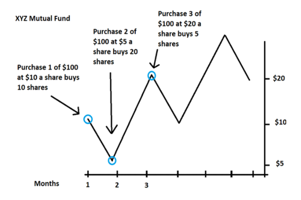

Exchange-Traded Funds (ETFs) have rapidly evolved into a pivotal investment tool for both individual and institutional investors. Originating as a simpler way to bundle stocks and track indexes, ETFs now offer unparalleled accessibility to a wide range of assets and markets. Their surge in popularity stems from their unique ability to combine the diversification benefits of mutual funds with the ease of stock trading.

The core of ETF trading revolves around strategies that effectively harness their advantages while mitigating risks. A well-structured trading strategy is indispensable in navigating the ETF landscape. It not only aids in achieving specific financial goals but also plays a crucial role in risk management. Whether an investor aims for long-term growth, portfolio diversification, or hedging against market volatility, ETFs present an array of strategic options.

For investors, the key lies in understanding the nuances of ETFs – from their operational mechanisms to the spectrum of options available in the market. Such knowledge is foundational in developing a trading strategy that aligns with individual investment objectives and risk tolerance levels. In this light, the burgeoning field of ETF trading is not just about choosing the right funds, but also about crafting strategies that resonate with evolving market dynamics and personal investment philosophies.

## Table of Contents

## Understanding ETFs

### Definition and Functioning

Exchange-Traded Funds (ETFs) are investment vehicles that combine the flexibility and ease of stock trading with the diversified risk of mutual funds. They function by tracking an index, a commodity, bonds, or a basket of assets like an index fund, but unlike mutual funds, they trade like common stocks on a stock exchange. ETF shares fluctuate in price during the trading day as they are bought and sold.

The operational mechanism of ETFs is structured around the creation and redemption process involving large financial institutions, often referred to as authorized participants (APs). APs have the ability to create new ETF shares by depositing a specified portfolio of securities with the fund in exchange for an equivalent value of ETF shares, typically in large blocks known as creation units. Conversely, they can also redeem ETF shares by delivering them back to the fund in exchange for the underlying assets. This process helps ensure that the ETF market price stays closely aligned with its net asset value.

One of the key functions of ETFs is to provide investors with an efficient way to gain exposure to a diverse range of assets and investment strategies. This includes traditional assets like stocks and bonds as well as more specialized exposures such as commodities, real estate, and various market sectors. The transparency of ETFs, with their holdings typically disclosed daily, adds to their appeal among investors who value visibility into their investment vehicles.

For a more in-depth understanding, the book “The ETF Book: All You Need to Know About Exchange-Traded Funds” by Richard A. Ferri provides a comprehensive guide to the functioning and variety of ETFs available to investors[1].

### History and Evolution

The inception of Exchange-Traded Funds (ETFs) marked a significant evolution in the investment world, offering a new vehicle that combined the diversification of mutual funds with the ease of trading individual stocks. The first ETF was introduced in Canada in 1990 with the launch of the Toronto Index Participation Fund, which tracked the TSE 35 and later the TSE 100 indices.

The ETF landscape took a significant turn in 1993 with the creation of the first U.S.-based ETF, the SPDR S&P 500 ETF (SPY), which remains one of the most heavily traded ETFs in the world. This launch set the stage for the proliferation of ETFs in the United States and globally. The success of SPY spurred the development of new ETFs that offered exposure to various market sectors, asset classes, and international markets.

Over the years, the ETF industry has witnessed exponential growth, both in terms of assets under management and the variety of funds available. Innovations in ETF structures have led to the introduction of various types of ETFs, including bond ETFs, commodity ETFs, and thematic ETFs that target specific investment trends or sectors. The 2000s saw the emergence of leveraged and inverse ETFs, providing investors with tools for more sophisticated trading strategies.

The ETF market has also adapted to changing investor needs and market conditions. For instance, the rise of environmental, social, and governance (ESG) concerns led to the development of ESG-focused ETFs. Technological advancements have further transformed ETF trading, with algorithmic trading and robo-advisors becoming increasingly prevalent.

For those interested in a more comprehensive history of ETFs, the article “A Comprehensive Guide to Exchange-Traded Funds (ETFs)” by Joanne M. Hill, Dave Nadig, and Matt Hougan provides an in-depth look at the evolution of ETFs, their impact on the investment landscape, and their growing role in investors' portfolios[2].

### Types of ETFs

Exchange-Traded Funds (ETFs) have diversified into various types to cater to different investor needs and market segments.

1. **Stock ETFs:** These are perhaps the most common and widely known type of ETFs. Stock ETFs track a specific index like the S&P 500 or NASDAQ. They offer investors a proportionate share in a pool of stocks, mirroring the performance of the index without the need to buy each stock individually.
2. **Bond ETFs:** These ETFs invest in various types of bonds including government, municipal, or corporate bonds. They are favored for their ability to provide a steady income stream and are generally considered lower risk than stock ETFs.
3. **Sector and Industry ETFs:** These ETFs provide exposure to a specific industry or sector of the economy, such as technology, healthcare, or energy. This allows investors to target more specific areas of the market without having to pick individual stocks.
4. **Commodity ETFs:** These ETFs invest in physical commodities like gold, oil, or agricultural goods. Commodity ETFs are useful for investors looking to hedge against inflation or diversify their portfolio beyond traditional stocks and bonds.
5. **International and Global ETFs:** These offer exposure to foreign markets, allowing investors to invest in stocks or bonds from specific countries or regions. International ETFs focus on specific countries, while global ETFs may invest worldwide, including the U.S.
6. **Thematic ETFs:** These are a newer breed of ETFs focusing on specific themes or trends, such as ESG (Environmental, Social, and Governance) principles, blockchain technology, or even specific business strategies.
7. **Inverse and Leveraged ETFs:** Inverse ETFs aim to earn gains from stock declines by shorting stocks. Leveraged ETFs use financial derivatives to amplify the returns of an underlying index. While they offer the potential for higher returns, they also carry higher risk and are generally used by more experienced traders.

Each type of ETF comes with its own set of characteristics, risks, and rewards. Investors should consider their investment goals, risk tolerance, and market outlook when choosing the right type of ETF for their portfolio. A comprehensive resource for understanding these different types of ETFs is “Exchange-Traded Funds For Dummies” by Russell Wild, which offers insights into how these ETFs work, their benefits, and how they can fit into an investment strategy[3].

## Advantages and Disadvantages of ETF Trading

### Benefits

Exchange-Traded Funds (ETFs) offer several distinct benefits that make them an attractive option for investors.

1. **Liquidity:** ETFs are known for their high liquidity. This is primarily because they trade on major stock exchanges, similar to stocks. This means investors can buy and sell ETF shares throughout the trading day at market price, which can be a significant advantage, especially in volatile market conditions.
2. **Diversification:** One of the chief benefits of ETFs is the diversification they offer. Many ETFs are designed to track a broad market index, sector, or commodity, thus providing exposure to a wide array of stocks or assets within a single ETF. This helps spread risk, as the performance of the ETF doesn't hinge on the success of a single asset.
3. **Lower Fees:** Generally, ETFs have lower expense ratios compared to mutual funds. The passive management structure of many ETFs – especially those that track an index – contributes to lower administrative costs. Lower fees mean more of an investor’s money is invested in the market, which can lead to higher net returns over time.
4. **Tax Efficiency:** ETFs are often more tax-efficient than mutual funds due to their unique structure. The in-kind transactions used by ETFs to create or redeem shares typically don’t result in a capital gains tax event. This efficiency is particularly beneficial for investors looking to minimize their tax liabilities.

### Risks and Limitations

While Exchange-Traded Funds (ETFs) offer numerous benefits, they are not without risks and limitations. Understanding these is crucial for investors to make informed decisions.

1. **Market Risk:** Like any investment in securities, ETFs are subject to market risk. The value of ETF shares can fluctuate based on the performance of the underlying assets or index. Economic conditions, interest rate changes, and political events can all impact market performance, affecting the value of ETF investments.
2. **Tracking Error:** This refers to the disparity between the performance of an ETF and its underlying index or assets. While ETFs aim to replicate the performance of their benchmarks, discrepancies can occur due to fund expenses, the timing of dividend reinvestments, or inefficiencies in executing the replication strategy. Over time, these differences can accumulate, leading to a significant divergence from the expected performance.
3. **Liquidity Risk:** Although most ETFs are praised for their liquidity, some niche or sector-specific ETFs may suffer from low trading volumes, making it harder to buy or sell shares quickly at market prices. This risk is particularly pertinent for thinly traded or specialized ETFs.
4. **Counterparty Risk:** ETFs that use derivatives or enter into swap agreements with other financial institutions to achieve their investment objectives face counterparty risk. If the counterparty fails to fulfill its obligations, the ETF could suffer losses.
5. **Tax Efficiency Risk:** While generally tax-efficient, certain ETF transactions can trigger tax events, such as capital gains distributions, which can impact the after-tax return for investors.
6. **Regulatory Risks:** Changes in government policies or regulations can impact the functioning and attractiveness of ETFs. Investors need to stay informed about regulatory changes that could affect their investments.
7. **Concentration Risk:** Some ETFs may be heavily concentrated in a particular sector, industry, or geographical region. Such concentration can increase risk if that specific area faces downturns.
8. **Interest Rate Risk:** For bond ETFs, changing interest rates can affect the fund’s value. Typically, when interest rates rise, bond prices fall, and vice versa.

## Core ETF Trading Strategies

### Dollar-Cost Averaging

Dollar-cost averaging (DCA) is a widely recognized investment strategy particularly well-suited for long-term investors, especially in the context of Exchange-Traded Funds (ETFs). This approach involves regularly investing a fixed sum of money into a specific ETF, irrespective of its price at the time. By doing so, investors buy more shares when prices are low and fewer when prices are high, which can potentially lower the average cost per share over time.

The key benefit of dollar-cost averaging is that it mitigates the impact of market volatility. Since the investment is spread out over time, investors avoid the risk of investing a large amount in an ETF at a potentially inopportune moment. This strategy is especially beneficial for those who might not have the time or expertise to monitor market fluctuations closely.

DCA is particularly effective for novice investors or those with a lower risk tolerance, as it encourages a disciplined investment approach, avoiding the pitfalls of trying to time the market. It's also a convenient strategy for those who wish to invest a portion of their regular income.

For ETF investors, dollar-cost averaging can be an efficient way to build a diversified portfolio while managing risk. Given the wide range of ETFs available, covering various asset classes and sectors, DCA allows investors to steadily increase their exposure to these markets without the need for active management.

### Asset Allocation

Asset allocation is a fundamental investment strategy that involves distributing investments across various asset classes to manage risk and enhance returns. Exchange-Traded Funds (ETFs) play a crucial role in this strategy due to their inherent nature of diversification, accessibility, and flexibility. ETFs offer exposure to a wide range of assets, including stocks, bonds, commodities, and even international markets, making them ideal tools for asset allocation.

By incorporating ETFs into an investment portfolio, investors can achieve a balanced mix of assets, which is essential for mitigating risks associated with market volatility. For instance, during a market downturn, the impact on a diversified ETF portfolio is often less severe compared to a portfolio concentrated in a single asset class. This diversification benefit is one of the primary reasons ETFs have become a popular choice for both individual and institutional investors.

Furthermore, ETFs enable investors to tailor their portfolios to specific risk tolerance levels and investment goals. For example, a more conservative investor might lean towards bond ETFs for stability and income, while a more aggressive investor might opt for stock ETFs for growth potential. Additionally, sector ETFs allow investors to capitalize on opportunities in specific industries without the need to select individual stocks.

### Swing Trading

Swing trading, a popular strategy among ETF investors, focuses on capturing gains from an ETF's price movements over a short to medium term. Typically, swing trades last from a few days to several weeks. The essence of swing trading lies in identifying trends and reversals in ETF prices, making it essential for traders to have a good grasp of technical analysis tools.

Technical analysis plays a vital role in swing trading ETFs. Traders often rely on tools like moving averages, Relative Strength Index (RSI), and Bollinger Bands to identify potential entry and exit points. For example, moving averages help to smooth out price data over a specific period, giving traders a clearer view of the trend direction. The RSI, a momentum oscillator, helps identify overbought or oversold conditions, signaling potential reversals. Bollinger Bands, comprising a middle SMA and two standard deviation lines, help assess the volatility and relative price levels of an ETF.

Swing traders also use chart patterns, such as flags, pennants, and head-and-shoulders, to predict future price movements. Candlestick patterns, such as the bullish engulfing or bearish harami, provide insights into market sentiment and potential reversals. These tools, when combined, can help swing traders time their trades more effectively, maximizing gains and minimizing risks.

One key resource that deeply explores the utilization of technical analysis in swing trading is "Technical Analysis of the Financial Markets" by John J. Murphy. This book offers comprehensive insights into various technical indicators and chart patterns, making it an invaluable resource for ETF swing traders[4].

### Sector Rotation

Sector rotation is a dynamic investment strategy that involves shifting the allocation of funds among different market sectors to capitalize on the changing economic and market cycles. By identifying which sectors are likely to outperform during different phases of the market and economic cycle, investors can adjust their ETF portfolios accordingly to maximize returns or minimize losses.

The fundamental principle behind sector rotation is that different sectors of the economy react differently to various stages of the economic cycle – expansion, peak, contraction, and trough. For instance, during economic expansions, cyclical sectors like technology and consumer discretionary typically outperform, while defensive sectors such as healthcare and utilities tend to do better during economic downturns.

To effectively implement a sector rotation strategy using ETFs, investors need to have a sound understanding of the current economic environment and how different sectors respond to it. This involves keeping a close watch on economic indicators, market trends, and sector performance data. Investors also need to be aware of the historical performance of sectors in various economic conditions.

Technical analysis tools are often employed in sector rotation strategies to identify sector trends and momentum. Indicators such as moving averages, relative strength index (RSI), and sector-specific ETFs' price movements are used to determine entry and exit points for different sectors.

### Short Selling

Short selling ETFs is a strategy employed by investors who anticipate a decline in the value of an ETF. This approach involves borrowing ETF shares and selling them in the market, with the aim of repurchasing them later at a lower price. The difference between the selling price and the buyback price represents the profit for the investor, excluding any fees or interest paid for borrowing the shares.

This strategy is particularly attractive in a bear market or when a specific sector or index is expected to underperform. ETFs, being diverse and covering various sectors and asset classes, provide a convenient way for investors to short sell against a broad market or specific sectors without targeting individual stocks.

However, short selling is accompanied by significant risks. Unlike traditional investing, where the maximum loss is the original investment, short selling can result in losses that exceed the initial investment. This is because there's theoretically no limit to how high a stock or ETF can rise, which would increase the cost of repurchasing the borrowed shares.

Another risk associated with short selling ETFs is the cost of borrowing the shares, which can vary depending on the ETF's availability and demand. Additionally, short sellers are responsible for paying any dividends that accrue on the borrowed shares during the period of the short.

Given these risks, short selling is generally recommended for experienced investors with a high tolerance for risk and a deep understanding of market dynamics. It's crucial for investors to conduct thorough research and market analysis before engaging in short selling.

### Seasonal Trends

Seasonal trends in the financial markets refer to patterns that recur at specific times during the year, influenced by various factors such as fiscal policies, consumer behavior, and economic cycles. Exchange-Traded Funds (ETFs) provide an efficient vehicle for capitalizing on these seasonal trends due to their diversified nature and ability to target specific sectors, industries, or themes.

A prime example of a seasonal trend is the "January Effect," where stock prices, particularly those of small-cap companies, often increase in January. This phenomenon is attributed to the sell-off in December for tax purposes, followed by a rebound in the new year. An investor can leverage this trend by investing in small-cap ETFs towards the end of the year and potentially profiting from the January rally.

Another significant seasonal trend is observed during the holiday season, where consumer spending typically surges, benefiting sectors like retail and consumer goods. Investors can exploit this pattern by investing in retail or consumer sector-specific ETFs before the holiday season begins.

Similarly, the energy sector often experiences seasonal fluctuations. For example, energy demands tend to rise during the summer, driving up prices for oil and gas. By investing in energy ETFs during the spring, investors can potentially capitalize on the seasonal increase in energy prices.

It's important to note that while these seasonal trends can be observed historically, they are not guaranteed to occur every year. Factors such as economic downturns, geopolitical events, or global pandemics can disrupt these patterns. Therefore, it's essential for investors to conduct thorough research and combine seasonal trend analysis with other fundamental and technical analysis techniques.

### Hedging

Hedging, in the context of investment, is a strategy used to offset potential losses in one investment by taking an opposing position in a related asset. Exchange-Traded Funds (ETFs) serve as an effective tool for hedging due to their versatility and ability to track a wide range of asset classes and sectors. By including ETFs in a portfolio, investors can mitigate risk and reduce the impact of market volatility.

One common approach to hedging with ETFs involves using inverse ETFs. These are designed to perform in the opposite direction to the index or benchmark they track. For instance, if an investor holds a portfolio predominantly composed of tech stocks and is concerned about a potential downturn in the tech sector, they could hedge their exposure by investing in an inverse ETF that gains when tech stocks fall.

Another strategy involves sector-specific ETFs. Investors can hedge against sector-specific risks by taking positions in ETFs that represent a different, potentially less volatile or negatively correlated sector. For example, an investor heavily invested in cyclical consumer stocks might hedge with ETFs focused on utilities or healthcare, which tend to be more stable during economic downturns.

ETFs tracking commodities or currencies can also be used as a hedge. For instance, an ETF tracking gold, a commodity often seen as a 'safe haven' during market turmoil, can be a hedge against inflation or stock market declines. Currency ETFs can help hedge against foreign exchange risk in a portfolio with international exposure.

It's crucial for investors to understand that while ETFs can be effective hedging tools, they do not eliminate risk entirely. Proper hedging requires a clear understanding of the correlations between different assets and the specific risks faced by the portfolio. Misjudging these correlations can lead to inadequate or excessive hedging, either of which can be detrimental.

For those seeking an in-depth exploration of hedging strategies using ETFs, "The ETF Handbook: How to Value and Trade Exchange-Traded Funds" by David J. Abner provides comprehensive insights and practical advice on utilizing ETFs effectively for hedging purposes.

In summary, ETFs offer a flexible and accessible means for hedging against market volatility and sector-specific risks. By carefully selecting the right ETFs, investors can create a more resilient portfolio, capable of weathering market fluctuations. "The ETF Handbook" by David J. Abner is an excellent resource for investors looking to deepen their understanding of ETF-based hedging strategies[5].

## Advanced ETF Trading Strategies

### Leveraged and Inverse ETFs

Leveraged and Inverse ETFs represent sophisticated investment strategies that cater to more experienced investors, offering unique opportunities but also higher risks. Leveraged ETFs are designed to provide a multiple of the daily performance of the index or benchmark they track. For instance, a 2x leveraged ETF aims to deliver twice the daily performance of its underlying index. This amplification works both ways, magnifying gains and losses, making leveraged ETFs suitable primarily for short-term trading due to their compounding effect over time.

Inverse ETFs, on the other hand, are constructed to profit from a decline in the price of the underlying index or asset class. They are used to short an index, allowing investors to gain exposure to negative movements without the need to sell stocks short. This makes inverse ETFs a valuable tool for hedging and for capitalizing on bearish market trends. However, similar to leveraged ETFs, they are generally considered suitable for short-term investments due to their daily rebalancing and the complexities associated with their performance over longer periods.

Both leveraged and inverse ETFs require a thorough understanding of the mechanisms and inherent risks. They are subject to volatility and can diverge significantly from the long-term performance of their underlying index. These ETFs are typically used by traders who have a specific expectation of market movements over a short time frame and are willing to take on the additional risk for potentially higher returns.

It's crucial for investors to understand the nuances of these ETFs, including the decay in value due to daily rebalancing and the impact of market volatility. The book "The ETF Book: All You Need to Know About Exchange-Traded Funds" by Richard A. Ferri provides an in-depth look into the workings of ETFs, including leveraged and inverse ETFs, offering valuable insights for those considering these advanced trading strategies.

### Thematic Investing

Thematic investing through ETFs presents a dynamic approach, enabling investors to capitalize on trends and sectors poised for growth. Unlike traditional investment strategies focusing on specific industries or geographies, thematic ETFs center around broader, often innovative themes that are expected to drive future growth. These themes can range from technological advancements, such as artificial intelligence and renewable energy, to societal shifts like the increasing focus on sustainable practices.

Investing in thematic ETFs offers an efficient way to gain exposure to a basket of companies aligned with a particular trend, without the need for extensive individual stock analysis. This approach allows investors to participate in the potential growth of emerging sectors that may not yet be represented in traditional market indices. It also provides diversification benefits, as these themes often cut across various industries and regions.

However, thematic investing is not without its risks. Trends can be unpredictable, and sectors may evolve differently than anticipated. Additionally, many thematic ETFs are relatively new with shorter track records, making it challenging to assess their long-term performance. Investors need to conduct thorough research, considering factors such as the ETF’s focus, holdings, and the sustainability of the underlying trend.

### International Exposure

ETFs offer a straightforward and efficient pathway for investors to gain international exposure, broadening their investment horizon beyond domestic markets. These funds encompass a wide range of geographical regions, from emerging markets to developed economies, allowing investors to tap into the growth potential of various countries and regions around the globe.

International ETFs are particularly valuable for portfolio diversification. They allow investors to spread their risk across different economic climates, currencies, and market dynamics, which can reduce overall portfolio volatility. This is especially important in a globalized economy where local markets may be affected by international events. By investing in a diverse set of international markets, investors can mitigate the impact of regional downturns.

Moreover, international ETFs provide access to sectors and industries not prevalent in the investor's home market. For example, a U.S. investor might use an international ETF to invest in European healthcare companies or Asian technology firms, sectors that may be underrepresented in the U.S. stock market.

However, investing in international ETFs involves certain complexities, such as currency risk, political and economic instability in certain regions, and differences in market regulations. These factors can influence the performance of international ETFs and should be considered when building an investment strategy.

## Day Trading ETFs

### Steps for Day Trading

Day trading with ETFs requires a strategic approach that involves careful selection and analysis. To succeed in this fast-paced trading environment, it is crucial to follow a structured method.

1. **Selection of Suitable ETFs**: The first step involves choosing the right ETFs. Focus on ETFs with high liquidity, as they allow easier entry and exit at desired price points. Look for ETFs that track major indices or sectors with high trading volumes and volatility, which provide more opportunities for day trading.
2. **Market Analysis**: Before trading, perform a thorough market analysis. This includes understanding current market trends, economic indicators, and news events that might impact the sectors or indices your chosen ETFs track.
3. **Technical Analysis**: Utilize technical analysis tools to identify trading opportunities. This involves studying price charts and applying technical indicators like moving averages, Relative Strength Index (RSI), and Bollinger Bands to predict future price movements. Understanding chart patterns such as head and shoulders, triangles, or flags can also provide valuable insights.
4. **Setting Entry and Exit Points**: Based on your analysis, establish clear entry and exit points for your trades. Use stop-loss orders to limit potential losses and take-profit orders to secure gains. This risk management strategy is crucial in day trading, where market conditions can change rapidly.
5. **Position Sizing**: Determine the size of your positions based on your overall trading capital and risk tolerance. It's important not to overexpose yourself in a single trade.
6. **Monitoring and Adjusting**: Continuously monitor the market and your positions throughout the trading day. Be prepared to adjust your strategy in response to new market information or if a trade isn't going as planned.
7. **Review and Learn**: At the end of each trading day, review your trades to understand what worked and what didn’t. This reflection is key to improving your strategy over time.

For a deeper understanding of day trading ETFs, the book "High Probability Trading Strategies: Entry to Exit Tactics for the Forex, Futures, and Stock Markets" by Robert C. Miner provides valuable insights. It covers essential aspects of market analysis and trade execution, which are fundamental in navigating the complexities of day trading with ETFs.

In summary, successful day trading in ETFs demands a blend of careful ETF selection, rigorous market and technical analysis, strategic planning of entry and exit points, disciplined risk management, and ongoing learning. The principles outlined in Robert C. Miner's book can further enhance one's understanding and proficiency in this trading domain.

### Risk Management

In day trading ETFs, risk management is paramount and forms the bedrock of successful trading strategies. Effective risk management encompasses several key aspects:

1. **Stop-Loss Orders**: Utilizing stop-loss orders is crucial in day trading. These orders help limit potential losses by automatically selling the ETF when it reaches a certain price. It's vital for traders to set these levels based on their risk tolerance and market analysis.
2. **Diversification**: While ETFs inherently provide diversification, traders should avoid over-concentration in any single ETF or market sector. Diversification across different ETFs can help mitigate risks associated with a specific industry or geographic region.
3. **Position Sizing**: Proper position sizing ensures that no single trade significantly impacts the overall trading capital. It's about balancing the potential profit against the risk taken. A common approach is to risk only a small percentage of the total capital on any single trade.
4. **Understanding Leverage**: Leveraged ETFs can amplify gains but also magnify losses. Traders must understand the implications of using leverage in their trades and manage their exposure accordingly.
5. **Continuous Monitoring**: Day trading requires constant market monitoring, as ETF prices can fluctuate rapidly. Staying informed about market conditions and news that might affect the price of an ETF is critical.
6. **Having a Plan**: Every trade should be executed as part of a well-thought-out trading plan, which includes predefined entry and exit points. This plan should be based on thorough research and analysis.
7. **Emotional Discipline**: Successful day trading requires emotional discipline to avoid impulsive decisions. Stick to the trading plan and don't let emotions drive trading actions.
8. **Use of Technology**: Utilizing trading platforms with real-time data, analytical tools, and automatic execution can enhance the effectiveness of risk management strategies.
9. **Regular Review**: Regularly review and adjust trading strategies based on market conditions and personal performance. What worked yesterday might not work tomorrow, so it's important to stay adaptive.
10. **Educational Resources**: Staying educated on market trends, trading strategies, and risk management techniques is essential. Resources like "The New Trading for a Living" by Dr. Alexander Elder provide insights into the psychological and technical aspects of trading, which are vital for effective risk management.

In summary, risk management in ETF day trading is a multi-faceted approach that requires discipline, continuous education, and the effective use of tools and strategies. Dr. Alexander Elder's "The New Trading for a Living" is an excellent resource for traders seeking to deepen their understanding of the complexities of market behavior and risk control.

## ETF Trading Tips for Beginners

### Getting Started

For beginners venturing into the world of ETF trading, a solid foundation is essential to navigate the markets effectively. Here are practical tips to get started:

1. **Educate Yourself**: Before diving into ETF trading, it's crucial to understand what ETFs are and how they work. Familiarize yourself with the basics of the stock market, different types of ETFs, and how they are traded. There are numerous online resources, books, and courses available for beginners. For a comprehensive understanding, consider reading "The ETF Book" by Richard A. Ferri.
2. **Set Clear Goals**: Define what you want to achieve through ETF trading. Are you looking for long-term growth, income, or short-term gains? Your trading strategy should align with your financial goals and risk tolerance.
3. **Create a Trading Plan**: A well-defined trading plan should include your investment goals, the strategies you will use, the ETFs you are interested in, and how much of your portfolio you want to allocate to each ETF. This plan should also outline how you will manage risk.
4. **Start Small**: As a beginner, it's wise to start with a small amount of money that you can afford to lose. This will allow you to learn and gain experience without risking significant financial loss.
5. **Diversify Your Portfolio**: ETFs offer an excellent opportunity for diversification. Instead of putting all your money into one type of ETF, spread your investment across different asset classes, sectors, or regions to mitigate risk.
6. **Use a Reputable Broker**: Choose a broker with a good reputation, low fees, and an easy-to-use trading platform. Many brokers offer ETFs with no commission fees, which can be a great option for beginners.
7. **Practice with a Demo Account**: Before investing real money, practice trading with a demo account. This can help you get used to the trading platform and experiment with different strategies without any financial risk.
8. **Stay Informed**: Keep up-to-date with market trends, economic news, and developments in the ETFs you are interested in. This will help you make informed trading decisions.
9. **Review and Adjust Your Strategy Regularly**: As you gain more experience and knowledge, review and adjust your trading strategy. The market changes, and so should your approach.
10. **Seek Professional Advice**: If unsure, consider seeking advice from a financial advisor, especially for significant investment decisions.

### Common Mistakes to Avoid

When trading ETFs, especially for beginners, it's important to be aware of common mistakes that can hinder success. By understanding these pitfalls, you can better navigate the complex landscape of ETF trading:

1. **Lack of Research**: One of the most significant mistakes is not conducting enough research before investing. It's crucial to understand the specific ETFs you're considering, including their holdings, performance history, and expense ratios.
2. **Ignoring Expense Ratios**: While ETFs generally have lower fees than mutual funds, they still vary widely in expense ratios. Overlooking these fees can eat into your returns over time.
3. **Overtrading**: Frequent trading can lead to higher transaction costs and taxes. It's important to have a strategic approach rather than reacting to short-term market fluctuations.
4. **Failing to Diversify**: Although ETFs are inherently diversified, focusing too heavily on one sector or region can expose your portfolio to unnecessary risk. Ensure your investments are spread across various sectors and asset classes.
5. **Misunderstanding Leverage**: Leveraged ETFs can offer higher returns but come with increased risk. Misunderstanding how these work can lead to significant losses, particularly over longer periods.
6. **Neglecting Market Liquidity**: Trading in ETFs with low liquidity can result in higher trading costs and price volatility. It's essential to check the average volume of trades for an ETF before investing.
7. **Timing the Market**: Trying to time the market is often futile and can lead to missed opportunities. A long-term, steady investment strategy tends to be more effective.
8. **Ignoring Tax Implications**: Different ETFs have varying tax implications. Understanding the tax consequences of your investment choices can help in efficient tax planning and maximizing after-tax returns.
9. **Chasing Performance**: Investing in an ETF solely because it has had high recent returns can be misleading. Past performance is not indicative of future results.
10. **Overlooking International Opportunities**: Limiting your portfolio to domestic ETFs can mean missing out on potential opportunities in international markets.

## Evaluating and Choosing ETFs

### Criteria for Selection

Selecting the right ETF requires careful consideration of various factors that impact its performance and suitability for your investment goals. Here are key criteria to consider:

- [ ]  **Expense Ratios**: This is the annual fee that ETFs charge their shareholders. It's expressed as a percentage of the fund's average assets over the year. A lower expense ratio means fewer costs eating into your returns, so it’s crucial to compare expense ratios among similar ETFs.
- [ ]  **Trading Volume**: High trading volumes indicate liquidity, meaning you can buy or sell the ETF easily without affecting its price. Low-volume ETFs can be harder to trade, potentially leading to price slippage.
- [ ]  **Tracking Error**: This measures how closely an ETF follows its benchmark index. A lower tracking error means the ETF does a better job mimicking the index’s performance. High tracking errors can indicate management issues or a strategy that doesn’t align well with the benchmark.
- [ ]  **Holdings Analysis**: Look into what the ETF actually holds. For instance, if you’re investing in a sector ETF, ensure it holds a diversified range of stocks within that sector and not just a few large companies.
- [ ]  **Performance History**: While past performance is not indicative of future results, understanding how the ETF has performed in different market conditions can give insights into its volatility and risk level.
- [ ]  **Fund Size**: Larger ETFs tend to be more stable and efficient. However, some niche or new areas may have smaller ETFs that are still good investment choices.
- [ ]  **Dividend Yield**: If you’re looking for income, consider the dividend yield of the ETF. Understand how dividends are paid and if they align with your income goals.
- [ ]  **Tax Considerations**: ETFs have different structures that can affect your tax liability, especially in regard to capital gains distributions.
- [ ]  **Issuer Reputation and Stability**: Research the fund manager and the company issuing the ETF. A reputable manager can be a sign of a well-managed ETF.
- [ ]  **Investment Strategy**: Ensure the ETF’s investment strategy aligns with your investment philosophy and goals. Some ETFs may use strategies like leveraging which might not suit all investors.

## Conclusion

In this comprehensive exploration of ETF (Exchange-Traded Funds) trading, we've navigated through various facets that are crucial for investors looking to master this dynamic area of the financial market. Starting with a foundational understanding, we've covered the definition, functioning, history, and the diverse types of ETFs, including stock, bond, sector, and commodity ETFs.

The advantages of ETF trading, such as liquidity, diversification, lower fees, and tax efficiency, make them an attractive option for a wide range of investors. However, it's also important to be aware of the risks and limitations, including market risk and tracking errors.

Core ETF trading strategies like dollar-cost averaging, asset allocation, swing trading, sector rotation, short selling, leveraging seasonal trends, and hedging have been detailed, offering investors a toolkit for various market conditions. We delved deeper into advanced strategies such as leveraging inverse ETFs, thematic investing, and gaining international exposure, highlighting the versatility and breadth of options available in ETF trading.

In conclusion, mastering ETF trading requires a blend of knowledge, strategy, and an understanding of the evolving market dynamics. Effective ETF trading strategies are significant for modern investors, offering opportunities for diversification, risk management, and achieving investment objectives in an ever-changing financial landscape.

## References & Further Reading

[1]: [“The ETF Book: All You Need to Know About Exchange-Traded Funds”](https://www.amazon.com/ETF-Book-About-Exchange-Traded-Funds/dp/0470537469) by Richard A. Ferri

[2]: [“A Comprehensive Guide to Exchange-Traded Funds (ETFs)”](https://www.amazon.com/Comprehensive-Guide-Exchange-Traded-Funds-ETFs/dp/1934667854) by Joanne M. Hill, Dave Nadig, and Matt Hougan

[3] : [“Exchange-Traded Funds For Dummies”](https://www.amazon.com/Exchange-Traded-Dummies-Business-Personal-Finance/dp/111982883X) by Russell Wild

[4]: ["Technical Analysis of the Financial Markets"](https://www.amazon.com/Technical-Analysis-Financial-Markets-Comprehensive/dp/0735200661) by John J. Murphy

[5]: ["The ETF Handbook"](https://www.amazon.com/ETF-Handbook-website-Exchange-Traded/dp/047055682X) by David J. Abner