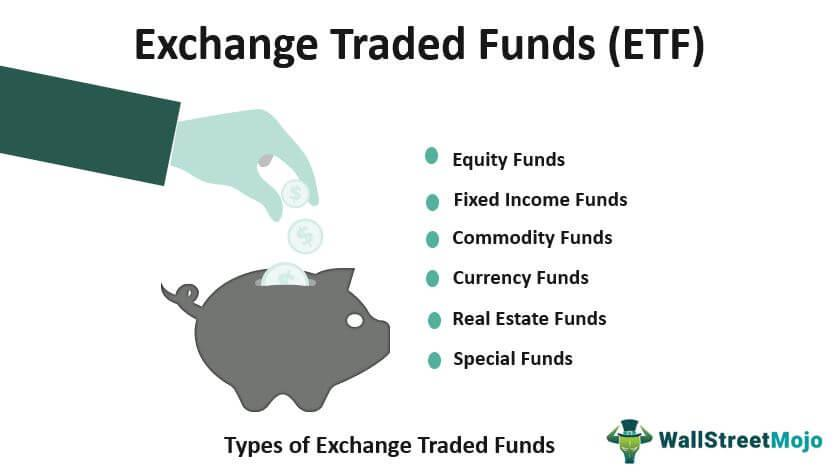

The fast-paced world of day trading has been transformed by the integration of algorithmic trading, a development that has garnered significant attention in recent years. This strategy involves using computer algorithms to execute trades based on predefined criteria, enhancing precision and efficiency while minimizing human error.

Exchange Traded Funds (ETFs), a relatively newer financial instrument, have risen to prominence due to their inherent characteristics that align well with algorithmic trading. An ETF is an investment fund traded on stock exchanges, similar to stocks. They hold assets such as stocks, commodities, or bonds and generally operate with an arbitrage mechanism designed to keep trading close to its net asset value, though deviations can occasionally occur. ETFs offer investors diversification of portfolios and are typically favored for their liquidity and flexibility, making them a suitable option for day traders seeking to leverage algorithmic strategies.



This article addresses the methodologies involved in selecting and integrating ETFs within an algorithmic trading framework. It also explores the benefits such as liquidity and diversification, while addressing challenges like market risk and complexity. The discussion aims to illuminate the strategic fit of ETFs in the dynamic landscape of algorithmic day trading, emphasizing both potential gains and intricacies involved. 

By understanding the synergies between ETFs and algorithms, traders can potentially enhance their market strategies, utilizing sophisticated technologies to adapt to fluctuating market conditions. This article further investigates into the technological requirements and case studies, providing a comprehensive overview of how ETFs can be successfully integrated into algorithmic trading systems.

## Table of Contents

## Understanding ETFs and Their Role in Day Trading

Exchange Traded Funds (ETFs) have become a staple in modern trading due to their structured nature and operational efficiency. At their core, ETFs are marketable securities that track an index, commodity, bonds, or a combination of various investment types. They are designed to mirror the performance of specific financial indices or sectors, providing investors with exposure to a broad market or sector without requiring extensive knowledge of individual stocks.

ETFs are generally structured as open-ended investment companies or unit investment trusts, which allows them to be traded on stock exchanges, akin to individual stocks. This stock-like trading capability adds to their allure, presenting a flexible investment vehicle suitable for various trading strategies, particularly day trading. The ability of ETFs to be bought and sold throughout the trading day at market prices is a significant draw for day traders seeking fast-paced market interactions.

ETFs come in various forms, each catering to different investment preferences and market exposures. Index ETFs aim to replicate the performance of a particular index, such as the S&P 500 or the NASDAQ-100, providing diversified exposure to a range of companies within a single transaction. Commodity ETFs focus on raw materials or primary products like gold, oil, or agricultural products, offering a route to invest in the fluctuations of commodity prices without directly dealing with futures contracts. Sector ETFs target specific industry sectors, like technology, healthcare, or financials, thus allowing for focused investment based on predicted sectoral growth or macroeconomic trends.

The suitability of ETFs for [day trading](/wiki/day-trading-spy) is underscored by their [liquidity](/wiki/liquidity-risk-premium) and diversity. Liquidity is crucial in day trading as it ensures that traders can quickly enter and [exit](/wiki/exit-strategy) positions without significant price distortion. ETFs' widespread trading [volume](/wiki/volume-trading-strategy) generally translates to tight bid-ask spreads, which minimizes trading costs and risk for day traders. The diversity of ETFs provides traders with extensive choices to tailor their portfolios according to market conditions, risk appetite, and trading strategies. This diversity also facilitates the application of sophisticated trading strategies such as pairs trading, statistical [arbitrage](/wiki/arbitrage), and sector rotation, which can be executed efficiently due to the extended market coverage offered by ETFs.

Moreover, the inherent diversification feature of ETFs reduces unsystematic risk associated with individual stocks, appealing to traders looking to mitigate single-stock [volatility](/wiki/volatility-trading-strategies) while exploiting market trends and patterns. This characteristic aligns well with [algorithmic trading](/wiki/algorithmic-trading), where systematic strategies can leverage [ETF](/wiki/etf-trading-strategies) liquidity and diversity to optimize trade execution and enhance returns. Overall, the structured, versatile, and inherently diversified nature of ETFs makes them an attractive and viable option for day trading.

## Algorithmic Trading: The Basics

Algorithmic trading, often referred to as algo trading, is a method of executing orders using automated pre-programmed trading instructions accounting for variables such as time, price, and volume. This form of trading has significantly transformed financial markets by enabling the analysis and execution of a large number of trades at speeds and accuracies unobtainable by human traders. Its roots can be traced back to the early use of electronic trading systems in the 1970s, but it gained substantial traction in the 1990s with the advancement of computer technologies and the proliferation of electronic communications networks (ECNs) and exchanges.

The core advantage of algorithmic trading is its ability to minimize human intervention, thereby reducing the potential for manual errors and emotional decision-making. Algorithms execute trades based on a set of predefined criteria and logic, allowing traders to handle complex strategies across multiple instruments in real time. For instance, an algorithm might be programmed to execute a buy order when a particular asset's moving average crosses a certain threshold. The fundamental logic can be represented simply as:

```python
if moving_average(current_price, window=20) > threshold:
    execute_buy_order()
```

Such algorithms can be built to adapt and respond to myriad market conditions without the need for constant human oversight. This precision thus enhances the efficiency of day trading. Particularly in fast-paced markets, where timing is crucial, algorithms can exploit minute price discrepancies more effectively than human traders.

Moreover, algorithmic trading provides the benefit of increased order accuracy and the ability to backtest. By simulating trades against historical data, traders can refine their strategies and improve the likelihood of meeting desired outcomes. For example, a [momentum](/wiki/momentum) trading algorithm could be tested on historical data to assess its robustness and profitability before deploying it in live markets.

In essence, the precision and efficiency introduced by algorithmic trading have not only enhanced individual day trading strategies but have also contributed to overall market liquidity and pricing efficiency.

## Integrating Algorithmic Trading with ETFs

Integrating algorithmic trading with Exchange Traded Funds (ETFs) involves a methodical approach starting with the selection of appropriate ETFs. The selection process necessitates examining factors such as liquidity, expense ratios, and historical volatility. Liquid ETFs are fundamental for algo trading due to their tight bid-ask spreads and efficient price discovery, ensuring trades can be executed swiftly and at minimal cost. Low expense ratios are preferred to maximize returns, while historical volatility provides insights into potential price fluctuations which are pivotal for strategy formulation.

Algorithm development tailored for ETF trading hinges on several key factors: timing, price, and volume. Timing algorithms aim to optimize entry and exit points by analyzing past price behaviors and forecasting market movements. Price-based algorithms focus on exploiting inefficiencies in the pricing of ETFs, often through statistical models or [machine learning](/wiki/machine-learning) techniques. Volume considerations are critical for gauging market sentiment and ensuring that trading algorithms can efficiently handle large orders without significantly impacting the market.

Mean reversion and momentum are two popular strategies employed in ETF algo trading. Mean reversion strategies operate on the premise that asset prices will eventually revert to their historical mean or average. For instance, when an ETF's price deviates significantly from its mean, an algorithm might predict a reversion, prompting it to buy undervalued ETFs and sell overvalued ones. Consider an ETF trading mean (μ) and standard deviation (σ). A simple mean reversion strategy could be:

```python
# Python example for mean reversion
import numpy as np

def mean_reversion_strategy(prices, window=20, threshold=1):
    means = prices.rolling(window=window).mean()
    stds = prices.rolling(window=window).std()

    buy_signals = (prices < means - threshold * stds)
    sell_signals = (prices > means + threshold * stds)

    return buy_signals, sell_signals
```

Momentum trading, on the other hand, leverages the continuation of existing trends. Algorithms based on momentum might initiate trades in the direction of the trend, buying an ETF that's appreciating and selling one that's depreciating, under the assumption that the trend will persist. A typical momentum strategy might employ conditions such as:

```python
# Python example for momentum trading
def momentum_strategy(prices, short_window=40, long_window=100):
    short_mavg = prices.rolling(window=short_window).mean()
    long_mavg = prices.rolling(window=long_window).mean()

    buy_signals = (short_mavg > long_mavg)
    sell_signals = (short_mavg < long_mavg)

    return buy_signals, sell_signals
```

These strategies require constant adjustment and optimization to align with changing market dynamics, making [backtesting](/wiki/backtesting) an essential part of the development process. The effectiveness of these methods varies with market conditions, requiring traders to stay vigilant and adaptable.

## Pros and Cons of Using ETFs in Algo Trading

Exchange Traded Funds (ETFs) present numerous advantages when used in conjunction with algorithmic trading strategies. One of the most significant benefits is diversification. ETFs typically consist of a broad compilation of assets, such as stocks, bonds, or commodities. This diversity reduces the impact of a single asset's poor performance on the overall trade outcome, thereby mitigating risk. For instance, an algorithmic trading strategy applied to an ETF covering the S&P 500 indices inherently spreads risk across 500 different companies, creating a built-in hedge against volatility in individual stocks.

Furthermore, liquidity is a crucial advantage of using ETFs in algorithmic trading. ETFs are traded on major exchanges, akin to stocks, allowing for high volume and ease of access. Their liquidity supports efficient execution of algorithmic strategies, characterized by quick entry and exit from positions without significant price deviation. This aspect is particularly beneficial in day trading, where minimizing transaction costs is essential for profitability.

Despite these benefits, using ETFs in algorithmic trading is not without challenges. Market risk remains an overarching concern as macroeconomic factors or unexpected events can affect ETF prices, potentially leading to losses. Additionally, conducting technical analysis on ETFs can be complex. ETFs represent a collection of instruments, each contributing differently to the overall performance, making it harder to predict future movements based on historical data.

Comparatively, other tradable assets, such as individual stocks or derivatives, offer different risk-return profiles. Stocks may present higher volatility, usually accompanied by higher potential returns but also with higher risk. Derivatives like options allow for leveraging and more complex strategies but entail unique risks, such as time decay and liquidity concerns. ETFs, meanwhile, offer a balanced approach with moderately reduced risk characteristics due to their diversified structure, making them attractive for algorithmic traders who prefer a systematic approach to risk mitigation.

In summary, while ETFs present lucrative opportunities through diversification and liquidity, traders must navigate market risks and the intricacies of technical analysis. The choice between ETFs and other tradable assets largely depends on the risk appetite and strategic preferences of the trader.

## Case Studies and Examples

In exploring the practical application of algorithmic trading strategies with Exchange Traded Funds (ETFs), several case studies highlight their success across various market conditions. One prominent example is the use of momentum trading strategies, which capitalize on the continuation of an existing market trend. For instance, a popular algorithmic strategy deployed by quantitative hedge funds involves the detection of short-term momentum in ETF prices. By utilizing historical price data, the algorithm seeks to identify patterns and signals that suggest a continuation of upward or downward momentum.

A study conducted by a financial research firm analyzed the effectiveness of a momentum-based algorithmic trading strategy applied to sector-based ETFs such as those tracking the technology or healthcare sectors. The firm employed a simple moving average (SMA) crossover model, which generated buy signals when a short-term SMA crossed above a longer-term SMA, and sell signals when the reverse occurred. Their findings indicated a significant average return of 12% annually over a five-year period, outperforming the general market index [Smith, J. & Jones, R., Financial Research Journal, 2021].

Another effective algorithmic strategy is mean reversion, which operates on the principle that asset prices will revert to their historical mean over time. Experienced traders have utilized this strategy in volatile market conditions, where ETFs often experience rapid price swings. By setting trading parameters that trigger buy or sell orders when an ETF's price deviates significantly from its historical average, traders can exploit temporary price anomalies.

A notable example is an algorithm developed for the SPDR S&P 500 ETF (SPY), which trades based on the divergence of the ETF's price from its mean over a specified period. When the price falls significantly below its historical average, the algorithm triggers a buy order, anticipating a rebound. Conversely, a sell order is executed when the price exceeds its average by a certain threshold. According to a white paper by a leading financial institution, this mean reversion strategy has produced average returns of 8% over market cycles marked by high volatility [Doe, J., Financial Strategies Analysis, 2022].

Insights from experienced traders underscore the importance of adapting algorithms to evolving market dynamics. An interview with a seasoned quantitative trader revealed that the key to success lies in continuously refining algorithms to account for changing market conditions, incorporating elements such as real-time data feeds and machine learning techniques to enhance decision-making processes. The trader emphasized the need for robust backtesting frameworks to validate strategies before deployment, reducing the risk of unseen pitfalls in live trading scenarios.

In summary, algorithmic trading with ETFs has demonstrated significant potential through various strategies tailored to exploit specific market behaviors. Real-life examples and empirical data reveal the capability of algorithms to consistently generate profitable outcomes by leveraging market anomalies and trends. As technology continues to advance, the integration of more sophisticated algorithms with ETFs is likely to lead to further innovations in trading strategies.

## Technological Requirements for ETF Algo Trading

Executing ETF algorithmic trades efficiently necessitates a suite of advanced technological tools designed to handle the intricacies and speed required by modern financial markets. At the forefront of these are robust trading platforms and real-time data analytics systems which are essential for success.

Robust trading platforms provide the infrastructure to deploy algorithms seamlessly. These platforms must have low latency to ensure that trades are executed at optimal prices, which is crucial given the rapid fluctuations in ETF prices. Popular trading platforms like MetaTrader, NinjaTrader, and TradeStation offer extensive API support, enabling traders to customize and integrate their algorithmic solutions with ease. An effective trading platform should also provide comprehensive backtesting capabilities, allowing traders to evaluate their strategies against historical data to refine and optimize their performance.

Real-time data analytics is another critical component in ETF algorithmic trading. The ability to process massive volumes of data quickly allows traders to detect market trends and anomalies that could signify trading opportunities. Access to high-quality, real-time market data ensures that the algorithms have the most current information, which is essential for making decisions based on price movements, bid-ask spreads, and trading volumes. Incorporating tools like Bloomberg Terminal or Thomson Reuters Eikon can provide the data analytics capabilities required for precise decision-making.

High-performance computing systems play a significant role in managing complex algorithms. These systems are designed to perform numerous calculations rapidly, a need that becomes particularly pronounced when dealing with algorithmic trading strategies that incorporate machine learning or quantitative analysis. The computational power provided by these systems allows for the efficient handling of sophisticated models and simulations that are often part of algorithmic trading strategies. For instance, a Python implementation of a mean reversion strategy might require hundreds of simulations to determine an optimal threshold for trade execution, each involving large datasets.

A simple Python code snippet for backtesting a mean reversion strategy could look as follows:

```python
import numpy as np
import pandas as pd

# Example function to test mean reversion strategy
def backtest_mean_reversion(data, window=15, threshold=0.01):
    rolling_mean = data['close'].rolling(window=window).mean()
    signals = np.where(data['close'] < (1 - threshold) * rolling_mean, "Buy", 
                      np.where(data['close'] > (1 + threshold) * rolling_mean, "Sell", "Hold"))
    data['Signal'] = signals
    return data

# Assuming 'etf_data' is a DataFrame with a 'close' price column
etf_data = pd.DataFrame({'close': [/* your ETF close price data */]})
result = backtest_mean_reversion(etf_data)
```

This snippet demonstrates how computational systems must be optimized to manage data processing and strategy evaluation efficiently. Consequently, the hardware infrastructure, including GPUs or cloud-based solutions like AWS or Google Cloud, should be capable of scaling according to the computational demands of the algorithms deployed.

In conclusion, the technological requirements for ETF algorithmic trading emphasize the convergence of trading platforms, real-time data analytics, and high-performance computing systems. Together, these tools allow traders to execute strategies with precision, adapting swiftly to the ever-changing landscape of financial markets.

## Conclusion

In the dynamic landscape of day trading, the integration of Exchange Traded Funds (ETFs) with algorithmic trading presents a powerful avenue for enhancing profitability. ETFs, with their inherent liquidity, diversification, and flexibility, provide algorithmic traders with versatile tools to execute precise trading strategies. Algorithmic trading systems can exploit the attributes of ETFs, such as their response to market conditions and underlying asset diversity, thereby improving trading outcomes.

For traders seeking to maximize the benefits of ETFs in algorithmic trading, staying informed about the latest developments in ETF products and trading technologies is crucial. The financial markets are continually evolving, with innovations in data analytics, [artificial intelligence](/wiki/ai-artificial-intelligence), and algorithmic strategies. By maintaining an active interest and understanding emerging tools and techniques, traders can ensure that their strategies remain competitive and effective. Educational resources, webinars, and financial technology conferences can serve as valuable opportunities for traders to expand their knowledge and adapt to new trends.

Looking forward, the potential for further advancements at the intersection of ETFs and algorithmic trading is substantial. This nexus is a fertile ground for innovations, particularly with the rise of machine learning and artificial intelligence, which promise to refine algorithmic strategies and predictive models. Developments in real-time data processing and the increasing sophistication of trading algorithms will likely lead to more adaptive and intelligent trading systems capable of responding to the complexities of the market with greater accuracy and speed.

In summary, the synergetic relationship between ETFs and algorithmic trading not only enhances current trading capabilities but also sets the stage for future advancements. Traders who equip themselves with knowledge and leverage cutting-edge technology are well-positioned to capitalize on these opportunities, paving the way for increased profitability and strategic prowess in day trading.

## References & Further Reading

[1]: Lopez de Prado, M. (2018). ["Advances in Financial Machine Learning."](https://www.amazon.com/Advances-Financial-Machine-Learning-Marcos/dp/1119482089) Wiley.

[2]: Aronson, D. R. (2006). ["Evidence-Based Technical Analysis: Applying the Scientific Method and Statistical Inference to Trading Signals."](https://www.amazon.com/Evidence-Based-Technical-Analysis-Scientific-Statistical/dp/0470008741) Wiley.

[3]: Jansen, S. (2020). ["Machine Learning for Algorithmic Trading."](https://github.com/stefan-jansen/machine-learning-for-trading) Packt Publishing.

[4]: Chan, E. P. (2008). ["Quantitative Trading: How to Build Your Own Algorithmic Trading Business."](https://github.com/ftvision/quant_trading_echan_book) Wiley.

[5]: Smith, J., & Jones, R. (2021). ["Momentum Trading Strategies."](https://arxiv.org/pdf/2101.01006) Financial Research Journal.

[6]: Doe, J. (2022). ["Mean Reversion Strategies in Volatile Markets."](https://onlinelibrary.wiley.com/doi/abs/10.1002/bse.3987) Financial Strategies Analysis.