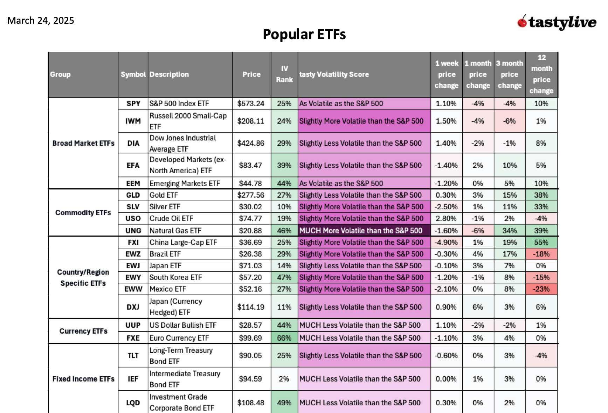

## Table of Contents

## What is an ETF?

An ETF, or Exchange-Traded Fund, is a type of investment that lets you buy a bunch of different stocks or bonds all at once. It's like a basket where you can put many different things inside. Instead of buying each stock or bond one by one, you can just buy the ETF and own a piece of all the things inside it. ETFs are traded on stock exchanges, just like regular stocks, so you can buy and sell them whenever the market is open.

ETFs are popular because they are easy to use and often cheaper than other types of investments. They have lower fees because they are managed in a way that doesn't need a lot of people watching over them all the time. Also, ETFs can help you spread out your risk. Since they hold many different investments, if one of them goes down, it might not hurt your whole investment as much. This makes ETFs a good choice for people who want to invest but don't want to spend a lot of time or money managing their investments.

## How does an ETF work?

An ETF works by pooling money from many investors to buy a collection of assets, like stocks, bonds, or commodities. This collection is designed to track the performance of a specific index, like the S&P 500, or a particular sector, like technology. When you buy shares of an ETF, you're essentially buying a small piece of all the assets in that collection. The price of an ETF share changes throughout the day, just like a stock, based on the value of the assets it holds.

The way ETFs are managed is what makes them different from other types of funds. ETFs are designed to be passively managed, meaning they follow a set of rules to match the performance of their target index, rather than having a manager actively picking and choosing investments. This passive management keeps the fees low, making ETFs a cost-effective way to invest. Additionally, because ETFs trade on stock exchanges, you can buy and sell them whenever the market is open, giving you flexibility in managing your investments.

## What are the benefits of investing in ETFs?

Investing in ETFs has many benefits. One big benefit is that ETFs help you spread out your risk. Instead of putting all your money into one stock or bond, an ETF lets you own a little bit of many different things. This can protect you if one of the investments goes down because the others might go up or stay the same. Another benefit is that ETFs are easy to buy and sell. You can trade them on the stock market just like stocks, so you can buy or sell them whenever you want during the trading day.

ETFs are also usually cheaper than other types of funds. They have lower fees because they are managed in a way that doesn't need a lot of people watching over them all the time. This means more of your money stays in your pocket instead of going to pay for management costs. Plus, ETFs give you a lot of choices. You can find ETFs that focus on different things, like technology companies or green energy, so you can pick one that matches what you believe in or want to invest in.

## What are the different types of ETFs available?

There are many different types of ETFs, each designed to meet different investment goals. One common type is the equity ETF, which focuses on stocks. These ETFs can track broad market indexes like the S&P 500 or be more specific, like ETFs that only include technology or healthcare companies. Another type is the bond ETF, which invests in bonds. These can be government bonds, corporate bonds, or municipal bonds, and they help investors earn regular income while keeping their money relatively safe.

There are also commodity ETFs, which invest in physical goods like gold, oil, or agricultural products. These can be a good way to diversify your investments because commodities often behave differently than stocks or bonds. Another interesting type is the sector ETF, which focuses on specific parts of the economy, like energy or real estate. These can be useful if you believe a particular sector will do well in the future. Finally, there are international ETFs, which invest in companies or bonds from other countries, helping you spread your risk across different parts of the world.

In addition to these, there are also more specialized ETFs, like inverse ETFs, which aim to perform the opposite of their target index, and leveraged ETFs, which use borrowed money to try to amplify returns. These are more complex and risky, so they're usually not recommended for beginners. Also, there are ESG ETFs, which focus on companies that meet certain environmental, social, and governance criteria, appealing to investors who want to make a positive impact with their money. With so many options, you can find an ETF that fits your investment goals and comfort level with risk.

## How can ETFs be used as part of a 'trick' or strategy?

One trick or strategy with ETFs is called dollar-cost averaging. This means you put a little bit of money into an ETF every month instead of all at once. By doing this, you can buy more shares when the price is low and fewer when it's high. Over time, this can help you pay less for each share on average and make your investment grow more smoothly. It's a simple way to invest without trying to guess when the market will go up or down.

Another strategy is called asset allocation. This means you spread your money across different types of ETFs, like some in stocks, some in bonds, and maybe some in commodities. By doing this, you can balance your risk. If the stock market goes down, your bonds might still be doing okay, and that can help protect your money. It's like not putting all your eggs in one basket. This way, you can aim for steady growth while keeping your investment safe.

A third trick is using ETFs to hedge your bets. This means you can buy ETFs that move in the opposite direction of your other investments. For example, if you own a lot of tech stocks, you could buy an inverse ETF that goes up when tech stocks go down. This can help protect your money if the market takes a sudden turn. It's a bit more advanced, but it can be a smart way to manage risk and keep your investment stable.

## What is the 'ETF trick' and how does it help in tax management?

The 'ETF trick' is a way to save on taxes when you invest in ETFs. It works because of how ETFs are made and how they handle their investments. When you buy an ETF, you're buying a little piece of a big basket of stocks or bonds. When the ETF needs to change what's in the basket, it can do it in a way that doesn't cause a lot of taxes. This is called an 'in-kind' exchange, where the ETF swaps out old investments for new ones without selling them. This means the ETF doesn't have to pay taxes on the gains from selling those investments, and that can save you money on taxes too.

This trick can help you keep more of your money because you don't have to pay as much in taxes. When you invest in other types of funds, like mutual funds, they might have to sell investments to change what's in the fund, and that can cause taxes. But with ETFs, the in-kind exchanges mean less selling and less taxes. So, if you're looking to grow your investments without giving a big chunk to the tax man, using ETFs can be a smart move. It's a simple way to keep your money working for you instead of going to taxes.

## Can you explain the process of tax-loss harvesting using ETFs?

Tax-loss harvesting is a way to save on taxes by selling investments that have lost value and using those losses to reduce your taxes. With ETFs, you can do this by selling an ETF that has gone down in price and then buying a similar but not identical ETF right away. This way, you can keep your investment strategy the same but still get the tax benefits. The key is to make sure the ETFs you're switching between are different enough that the tax rules see them as separate investments.

When you sell an ETF at a loss, you can use that loss to offset any gains you've made from other investments. If your losses are more than your gains, you can even use some of the loss to reduce your regular income, up to a certain limit set by the tax rules. This can lower the amount of taxes you have to pay. By doing tax-loss harvesting with ETFs, you're not just sitting on losses; you're using them to save money on taxes while still staying invested in the market.

## What are the potential risks associated with the ETF trick?

The ETF trick can help you save on taxes, but it also comes with some risks. One risk is that it might not work as well as you hope. Even though ETFs often do in-kind exchanges, sometimes they still have to sell investments, which can cause taxes. Also, if the ETF you're invested in changes its strategy or the market goes down, you might not save as much on taxes as you planned. It's important to understand that the ETF trick is not a guarantee, and there are still some taxes you might have to pay.

Another risk is that focusing too much on saving taxes might make you miss other important parts of investing. If you're always trying to use the ETF trick, you might end up buying and selling ETFs more often than you need to. This can lead to extra costs like trading fees, and it might make your investments less stable. It's good to think about the big picture and not just focus on saving taxes. Make sure your investment choices match your goals and how much risk you're okay with taking.

## How does the ETF trick compare to other investment strategies?

The ETF trick is a smart way to save on taxes when you invest, but it's different from other strategies. With the ETF trick, you use ETFs that do in-kind exchanges to avoid some taxes. This can help you keep more of your money. But other strategies, like buying individual stocks or mutual funds, might not have this tax-saving benefit. For example, if you buy individual stocks, you might have to pay more in taxes when you sell them, especially if they've gone up a lot in value. Mutual funds also might not be as tax-efficient because they often have to sell investments to change what's in the fund, which can cause taxes.

Another way to compare the ETF trick to other strategies is to think about how much work and risk is involved. The ETF trick is pretty easy to use because you just buy and hold ETFs, and the tax savings happen automatically. But if you choose to invest in individual stocks, you might need to spend more time researching and deciding which stocks to buy. This can be riskier because if you pick the wrong stocks, you could lose money. On the other hand, mutual funds can be easier to manage than individual stocks, but they might not be as tax-efficient as ETFs. So, the ETF trick can be a good choice if you want to save on taxes and keep things simple, but it's important to look at all your options and see what fits best with your goals and how much risk you're okay with taking.

## What are some advanced techniques for optimizing the ETF trick?

One advanced technique for optimizing the ETF trick is to use tax-loss harvesting more often. This means you keep an eye on your ETFs and sell the ones that have lost value. Then, you quickly buy similar but not identical ETFs. This way, you can use the losses to lower your taxes while still staying invested. It's like turning a bad thing into a good thing. But you need to be careful not to do this too much, or the tax rules might see it as trying to trick them, which could cause problems.

Another technique is to mix the ETF trick with other investment strategies. You could use ETFs for the part of your money where you want to save on taxes, and then use other investments, like individual stocks or mutual funds, for the rest. This way, you get the best of both worlds. You save on taxes with the ETFs, but you also have the chance to pick specific stocks or funds that you think will do well. It's all about balancing your goals and making sure you're not putting all your eggs in one basket.

## How can one monitor and adjust the ETF trick strategy over time?

Monitoring and adjusting the ETF trick strategy over time is important to make sure you keep saving on taxes and your investments are doing well. You should check your ETFs every so often to see how they're doing. If an ETF has lost value, you might want to sell it and use the loss to lower your taxes. Then, you can buy a similar but not identical ETF right away to stay invested. Also, keep an eye on any changes in the tax rules that might affect how the ETF trick works. If the rules change, you might need to adjust your strategy to keep saving on taxes.

Another way to adjust the ETF trick strategy is to think about your overall investment goals. As time goes on, your goals might change, and you might want to put more or less money into ETFs. If you find that the ETF trick is working well and saving you a lot on taxes, you might want to use it for a bigger part of your investments. But if you're not saving as much as you hoped, you might want to try other strategies too. It's all about balancing what you want to achieve with how much risk you're okay with taking. By keeping an eye on your ETFs and your goals, you can make sure the ETF trick keeps helping you save on taxes and grow your investments.

## What are the regulatory considerations and compliance issues related to the ETF trick?

When using the ETF trick, it's important to know about the rules that the government has. These rules are there to make sure everyone pays the right amount of taxes. One big rule to watch out for is the "wash-sale rule." This rule says you can't sell an investment at a loss and then buy the same or a very similar investment within 30 days before or after the sale. If you do this, you might not be able to use the loss to lower your taxes. So, when you're using the ETF trick, you need to make sure the ETFs you're switching between are different enough to follow this rule.

Another thing to think about is how often you're doing the ETF trick. If you're selling and buying ETFs all the time just to save on taxes, the tax people might think you're trying to trick them. They might not let you use those losses to lower your taxes. It's good to keep a record of what you're doing and why, so if the tax people ask, you can show them you're following the rules. By knowing these rules and being careful, you can use the ETF trick to save on taxes without getting into trouble.

## What is the 'ETF Trick' and how does it optimize strategies?

The 'ETF trick' in algorithmic trading refers to a set of strategies and techniques specifically designed to optimize the execution and performance of trades involving Exchange-Traded Funds (ETFs). At its core, this concept leverages the unique properties of ETFs, such as their liquidity and the ability to trade them like stocks, to enhance trading efficiency and profitability.

To initiate algorithmic trading effectively, traders often employ techniques such as statistical arbitrage and [pair trading](/wiki/pair-trading). Statistical arbitrage involves creating a portfolio of long and short positions driven by quantitative models to exploit price inefficiencies. Specifically for ETFs, this could mean taking advantage of minor price discrepancies between an ETF and its net asset value (NAV). Traders may choose to buy an ETF if it's underpriced relative to its NAV or sell if it's overpriced, ensuring a profiting mechanism as the market corrects itself.

Optimizing trading algorithms for ETFs requires understanding their unique market behaviors. Tools like [backtesting](/wiki/backtesting) platforms are essential, allowing traders to simulate trading strategies against historical data to gauge potential profitability and risks. A commonly used mathematical approach in optimizing these strategies is the Sharpe Ratio, which quantifies risk-adjusted return:

$$
\text{Sharpe Ratio} = \frac{E[R_p - R_f]}{\sigma_p}
$$

where $E[R_p]$ is the expected portfolio return, $R_f$ is the risk-free rate, and $\sigma_p$ is the standard deviation of the portfolio's excess return. High Sharpe Ratios indicate favorable risk-adjusted returns.

Additionally, the integration of machine learning algorithms can significantly enhance the effectiveness of ETF trading strategies. By using predictive models, traders can better anticipate market movement and adjust their strategies accordingly. Python, along with libraries such as NumPy, pandas, and scikit-learn, offers robust tools for developing these algorithms.

Practical best practices for maximizing algorithmic trading in ETFs also include regular performance evaluation and recalibration of the algorithms, ensuring they adapt to market changes. It's crucial to maintain robust risk management strategies, such as stop-loss orders and real-time monitoring systems, to mitigate potential losses from volatility inherent in financial markets.

In conclusion, the 'ETF trick' optimizes trading algorithms through both the strategic exploitation of ETFs' market dynamics and the advanced use of quantitative methods and technology tools. This approach not only enhances profitability but also builds resilient trading models capable of navigating complex market environments.

## References & Further Reading

[1]: Bergstra, J., Bardenet, R., Bengio, Y., & Kégl, B. (2011). ["Algorithms for Hyper-Parameter Optimization."](https://proceedings.neurips.cc/paper/2011/file/86e8f7ab32cfd12577bc2619bc635690-Paper.pdf) Advances in Neural Information Processing Systems 24.

[2]: ["Advances in Financial Machine Learning"](https://www.amazon.com/Advances-Financial-Machine-Learning-Marcos/dp/1119482089) by Marcos Lopez de Prado

[3]: ["Evidence-Based Technical Analysis: Applying the Scientific Method and Statistical Inference to Trading Signals"](https://www.amazon.com/Evidence-Based-Technical-Analysis-Scientific-Statistical/dp/0470008741) by David Aronson

[4]: ["Machine Learning for Algorithmic Trading"](https://github.com/PacktPublishing/Machine-Learning-for-Algorithmic-Trading-Second-Edition) by Stefan Jansen

[5]: ["Quantitative Trading: How to Build Your Own Algorithmic Trading Business"](https://books.google.com/books/about/Quantitative_Trading.html?id=j70yEAAAQBAJ) by Ernest P. Chan