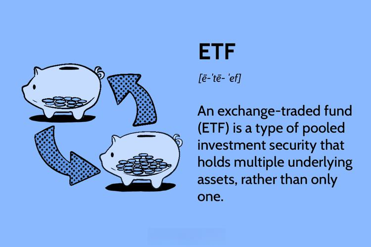

Exchange-Traded Funds (ETFs) are investment vehicles that allow investors to buy shares representing a diversified portfolio of assets, typically tracking an index. These financial instruments are traded on stock exchanges, making them as accessible as individual stocks. Their role in the financial markets is significant due to their ability to offer broad market exposure, cost efficiency, and ease of trading. ETFs provide investors with an effective means of achieving diversification without the need to purchase each underlying asset individually, thus facilitating portfolio management and risk mitigation.

Algorithmic trading refers to the use of computer algorithms to manage trading decisions, execution, and order placement in financial markets. By utilising pre-programmed instructions, algorithms can optimize how and when trades are made based on vast amounts of market data. When applied to ETFs, algorithmic trading can significantly enhance trading strategies by improving trade execution speed and precision, reducing human error, and capitalizing on market opportunities with refined financial models.



The purpose of this article is to explore the 'ETF trick' in algorithmic trading. This concept involves leveraging algorithmic strategies specifically for ETF trading to amplify profits and operational efficiency. By dissecting how algorithms can be tailored to the unique characteristics of ETFs, this article aims to provide insights into strategy optimization, ultimately enabling traders to maximize returns and minimize risks.

## Table of Contents

## Understanding ETFs

An Exchange-Traded Fund ([ETF](/wiki/etf-trading-strategies)) is an investment fund traded on stock exchanges, much like stocks. ETFs hold assets such as stocks, bonds, or other securities, and they often operate with an [arbitrage](/wiki/arbitrage) mechanism designed to keep trading close to its net asset value, though deviations can occasionally occur. The underlying assets are typically represented by the shares issued by the company, which investors can buy or sell during trading hours, making ETFs a versatile tool for investors seeking exposure to specific asset classes or market indices.

### Benefits of ETFs

**Diversification:** ETFs provide an efficient way to diversify an investment portfolio. By holding a basket of different securities, ETFs allow investors to spread risk across various assets. This characteristic makes ETFs attractive for those looking to invest in broad market indices or specific sectors without purchasing multiple individual securities.

**Liquidity:** ETFs are highly liquid owing to their structure. They are listed on regular exchanges just like individual stocks, enabling investors to buy and sell them throughout the trading day at market prices. This liquidity is facilitated by market makers who supply a continuous two-way price, ensuring that investors can enter and exit positions efficiently.

**Cost-Effectiveness:** ETFs typically feature lower expense ratios compared to mutual funds. This cost advantage is largely due to the passive management style associated with many ETFs, which aim to track an index rather than actively managing a portfolio of securities. Additionally, the ability to buy and sell ETFs via a brokerage account means investors may incur lower transaction fees compared to traditional funds, further enhancing their cost efficiency.

### Differentiation from Mutual Funds and Other Investment Vehicles

ETFs differ from mutual funds in several key aspects. Mutual funds, unlike ETFs, are not traded on exchanges and are typically purchased directly from the fund manager at the closing net asset value (NAV) at the end of the trading day. This limitation means mutual funds do not offer the intraday trading flexibility that ETFs provide.

In contrast to stocks, ETFs offer the advantage of diversification, as buying a single ETF share can give exposure to a whole market index, sector, or commodity. Moreover, the transparency of ETFs allows investors to see their holdings and know precisely what they are investing in, which is not always possible with mutual funds, especially those with frequent portfolio changes or less frequent disclosures.

Other investment vehicles like closed-end funds function quite differently. They often issue a fixed number of shares and do not offer the same [liquidity](/wiki/liquidity-risk-premium) and trading flexibility as ETFs. Furthermore, unlike open-ended ETFs, closed-end funds can trade at significant premiums or discounts to their NAV.

These characteristics make ETFs a popular choice among both retail and institutional investors aiming to balance risk, cost, and accessibility in their investment strategies.

## The Basics of Algorithmic Trading

Algorithmic trading is an advanced method of executing orders using automated and pre-programmed trading instructions. These instructions account for variables such as time, price, and [volume](/wiki/volume-trading-strategy). By leveraging computational power, [algorithmic trading](/wiki/algorithmic-trading) reduces the influence of human errors or emotional biases in trading decisions and thus enhances efficiency and profitability in financial markets.

At its core, a trading algorithm is composed of several essential components, each ensuring that the strategy is executed optimally:

1. **Data Collection and Processing**: The foundation of algorithmic trading strategies relies on access to high-quality, real-time financial data. This data is processed to detect trading signals. Data can range from historical price data, order book data, to other fundamental data that might affect prices.

2. **Trade Signal Generation**: Based on the processed data, signals are generated which indicate the market conditions under which a trade should be executed. Algorithms typically utilize technical indicators or complex functions such as moving averages, momentum oscillators, or machine learning models to generate these signals.

3. **Execution Logic**: Once a trade signal is identified, the execution logic of an algorithm determines the specific details of the trade, such as order size and timing. Strategies are crafted to minimize the market impact and optimize the fill rate of executed orders. Common execution strategies include simple rules like "buy if the stock price crosses above its moving average" or more complex ones like VWAP (Volume Weighted Average Price).

4. **Risk Management**: This component ensures that the trades conform to predefined risk parameters. Algorithms incorporate stop-loss orders, position limits, and risk-reward ratios to protect capital.

Algorithmic trading offers several distinct advantages over traditional human trading practices:

- **Speed**: Algorithms can execute orders at a pace much faster than human capabilities. The time advantage can be particularly beneficial in markets where prices change rapidly, allowing for more favorable entry and exit points.

- **Accuracy**: Precision is critical in trading, as even small errors can lead to substantial financial losses. Algorithmic trading reduces the propensity for such errors, executing trades exactly as specified.

- **Emotionless Trades**: Human traders are subject to psychological biases which can result in irrational trading decisions. Algorithms operate based on data and fixed rules, removing emotional elements like fear and greed from trading decisions.

Overall, algorithmic trading has revolutionized market practices by bringing about a significant transformation in how trades are executed. This methodical approach, backed by computational power and logic, enables traders and financial institutions to leverage technology for maximizing trading efficiency and outcomes.

## Applying Algorithmic Trading to ETFs

Algorithmic trading, when applied to Exchange-Traded Funds (ETFs), offers numerous advantages aimed at optimizing investment strategies. A primary benefit is enhanced portfolio management. Algorithms can process large volumes of data and execute trades based on predetermined criteria, allowing for real-time portfolio adjustments that can respond to market conditions faster than manual trading. This automation aids in maintaining an optimal asset allocation and can reduce human error, thereby enhancing overall portfolio performance.

Risk mitigation is another critical benefit. Algorithmic trading systems can be programmed to incorporate risk management techniques such as stop-loss orders and limit orders. These tools help protect investments by automatically exiting or entering positions based on market conditions, minimizing potential losses. Additionally, algorithms can employ advanced techniques like [volatility](/wiki/volatility-trading-strategies) scaling and portfolio rebalancing to manage risk exposures effectively.

In ETF algorithmic trading, typical strategies involve both long and short positions. Long positions involve buying ETFs with the expectation of price increases, while short positions capitalize on anticipated price declines. Algorithms facilitate these strategies by analyzing historical data and current market trends to determine the most opportune times to initiate or [exit](/wiki/exit-strategy) positions. Mean reversion and [momentum](/wiki/momentum)-based strategies are among the popular approaches. Mean reversion assumes that prices will revert to their mean over time, while momentum strategies attempt to capitalize on upward or downward trends in asset prices.

Successful examples of algorithmic trading strategies in ETFs include pairs trading and [statistical arbitrage](/wiki/statistical-arbitrage). Pairs trading involves finding two ETFs that historically move together, then taking a long position in one and a short position in the other when they diverge, expecting convergence. Statistical arbitrage leverages complex mathematical and statistical models to identify and exploit short-term pricing inefficiencies among ETFs.

One exemplary case is the application of [machine learning](/wiki/machine-learning) models to enhance strategy performance. By employing techniques such as [reinforcement learning](/wiki/reinforcement-learning), traders can optimize their algorithms' decision-making processes based on historical trades and outcomes. This approach allows for continuous learning and adaptation, significantly improving the algorithms' efficiency and accuracy in predicting market movements.

Ultimately, integrating algorithmic trading with ETFs can lead to more systematic and disciplined trading practices, leveraging technology to make informed decisions and maximize returns while managing associated risks.

## The 'ETF Trick': Optimizing Strategies

The 'ETF trick' in algorithmic trading refers to a set of strategies and techniques specifically designed to optimize the execution and performance of trades involving Exchange-Traded Funds (ETFs). At its core, this concept leverages the unique properties of ETFs, such as their liquidity and the ability to trade them like stocks, to enhance trading efficiency and profitability.

To initiate algorithmic trading effectively, traders often employ techniques such as statistical arbitrage and [pair trading](/wiki/pair-trading). Statistical arbitrage involves creating a portfolio of long and short positions driven by quantitative models to exploit price inefficiencies. Specifically for ETFs, this could mean taking advantage of minor price discrepancies between an ETF and its net asset value (NAV). Traders may choose to buy an ETF if it's underpriced relative to its NAV or sell if it's overpriced, ensuring a profiting mechanism as the market corrects itself.

Optimizing trading algorithms for ETFs requires understanding their unique market behaviors. Tools like [backtesting](/wiki/backtesting) platforms are essential, allowing traders to simulate trading strategies against historical data to gauge potential profitability and risks. A commonly used mathematical approach in optimizing these strategies is the Sharpe Ratio, which quantifies risk-adjusted return:

$$
\text{Sharpe Ratio} = \frac{E[R_p - R_f]}{\sigma_p}
$$

where $E[R_p]$ is the expected portfolio return, $R_f$ is the risk-free rate, and $\sigma_p$ is the standard deviation of the portfolio's excess return. High Sharpe Ratios indicate favorable risk-adjusted returns.

Additionally, the integration of machine learning algorithms can significantly enhance the effectiveness of ETF trading strategies. By using predictive models, traders can better anticipate market movement and adjust their strategies accordingly. Python, along with libraries such as NumPy, pandas, and scikit-learn, offers robust tools for developing these algorithms.

Practical best practices for maximizing algorithmic trading in ETFs also include regular performance evaluation and recalibration of the algorithms, ensuring they adapt to market changes. It's crucial to maintain robust risk management strategies, such as stop-loss orders and real-time monitoring systems, to mitigate potential losses from volatility inherent in financial markets.

In conclusion, the 'ETF trick' optimizes trading algorithms through both the strategic exploitation of ETFs' market dynamics and the advanced use of quantitative methods and technology tools. This approach not only enhances profitability but also builds resilient trading models capable of navigating complex market environments.

## Challenges and Risks in ETF Algorithmic Trading

ETF Algorithmic Trading presents numerous challenges and risks, though it offers significant potential for enhancing trading efficiency. One of the primary pitfalls is that algorithms can be highly susceptible to market volatility. Given that ETFs involve numerous underlying securities, an algorithm must account for the potential fluctuations within these assets. During volatile periods, incorrect algorithmic decisions can lead to significant financial losses. It is crucial that algorithms are designed with flexibility and adaptability to efficiently navigate such rapidly changing market conditions.

The risk of overfitting is another potential challenge. An algorithm that is tailored too closely to past market conditions may perform poorly in future scenarios. Overfitting occurs when a model captures noise instead of useful data trends, leading to overly complex models that do not generalize well to new data. Mitigation strategies include employing robust backtesting methods and validation against out-of-sample data to ensure the algorithm captures meaningful patterns rather than irrelevant fluctuations.

Another risk is related to execution costs and slippage. Slippage occurs when there is a delay between the signal to trade and the actual execution of the trade, leading to less favorable prices. High-frequency trading strategies, common in algorithmic trading, are particularly susceptible to slippage. Ensuring low latency and high execution efficiency is vital. This can be achieved by selecting strategies that consider transaction costs and developing algorithms that execute trades in a manner minimizing slippage and maximizing the opportunity for price improvement.

Furthermore, technical failures and cybersecurity threats pose significant risks. That a robust infrastructure supports the trading algorithm to minimize downtime is essential. Regular audits and updates can prevent technical glitches. Moreover, cybersecurity measures are necessary to guard against potential attacks that could compromise trading algorithms or lead to unauthorized transactions.

To enhance trade resilience and mitigate these risks, traders should focus on the scalability and robustness of their algorithms. This includes utilizing machine learning techniques for dynamic adaptation to new data inputs and assumptions. Additionally, traders can employ diversification strategies not only within the ETF assets but also by using various algorithms to balance risk exposure.

In conclusion, while algorithmic trading of ETFs can offer competitive advantages in terms of speed and processing power, being aware of and addressing these risks with thoughtful strategies is essential for long-term success. Automated systems should be developed with a focus on flexibility and resilience, maintaining efficient performance in both stable and volatile markets.

## Case Studies and Practical Applications

Exchange-Traded Funds (ETFs) have benefited significantly from algorithmic trading, resulting in numerous success stories that underscore the potential efficiencies and profitability achievable through this integration. This section discusses some notable case studies and practical applications where algorithmic trading has optimized ETF investment strategies, while also addressing the challenges and learning points.

### Example 1: Renaissance Technologies

Renaissance Technologies, a pioneer in [quantitative trading](/wiki/quantitative-trading), has successfully applied complex algorithms to trade ETFs among other asset classes. Their Medallion Fund, known for astronomical returns, often employs market-neutral strategies that capitalize on pricing inefficiencies across diverse markets, including ETFs. The key to their success is the leverage of massive datasets and high-frequency trading algorithms that execute trades faster than the blink of an eye, exploiting even minute pricing discrepancies. This illustrates how speed and data analysis prowess can transform ETF trading.

### Example 2: AQR Capital Management

AQR Capital Management is another asset manager that leverages algorithmic trading for ETFs. They utilize [factor](/wiki/factor-investing)-based investment strategies, such as momentum and value investing. Through systematic trading algorithms, they efficiently rebalance portfolios in response to market shifts, which helps mitigate risks associated with human cognitive biases. For instance, in times of market downturn, their algorithms can swiftly adjust ETF holdings to preserve capital while positioning for future growth. 

### Lessons from Failures

In contrast, some algorithmic trading strategies have backfired due to over-reliance on historical data and lack of adaptability to unforeseen market conditions. A notable example was the volatility-driven flash crash on May 6, 2010, where algorithms interacted in unexpected ways leading to a rapid plunge and recovery in ETF prices. This incident highlights the importance of incorporating robust risk management, including circuit breakers and portfolio stress testing, to prevent catastrophic losses.

### Practical Insights for the 'ETF Trick'

1. **Diversification Across Strategies**: Successful algorithmic trading in ETFs often combines multiple strategies—momentum, mean-reversion, and statistical arbitrage—to distribute risk and improve returns. Traders should ensure their algorithms are not myopic but can adapt across various market conditions.

2. **Adaptive Learning Models**: Implementing machine learning techniques can enhance algorithm performance by enabling continuous learning from live data. Algorithms that evolve in response to dynamic market conditions are less likely to fail under stress.

3. **Robust Testing Frameworks**: Before deploying any trading strategy, comprehensive back-testing with historical data and forward-testing with simulated real-time data are crucial. This testing helps uncover potential weaknesses in algorithmic strategies and ensures resilience.

4. **Portfolio Optimization Tools**: Utilizing advanced optimization tools can further refine ETF trading strategies. For example, Python libraries such as `pandas` for data manipulation, `numpy` for numerical calculations, and machine learning frameworks like `scikit-learn` can be employed to enhance the accuracy and efficiency of trading algorithms.

```python
import pandas as pd
import numpy as np
from sklearn.linear_model import LinearRegression

# Example: ETF price prediction model using linear regression
def train_model(data):
    X = data[['feature1', 'feature2', 'feature3']]
    y = data['price']
    model = LinearRegression().fit(X, y)
    return model

# Sample data
data = pd.DataFrame({
    'feature1': [0.1, 0.2, 0.3],
    'feature2': [1.1, 1.2, 1.3],
    'feature3': [2.1, 2.2, 2.3],
    'price': [10, 20, 30]
})

model = train_model(data)
```

By incorporating these insights and leveraging cutting-edge computational tools, traders can optimize their ETF trading algorithms to achieve enhanced profitability and market resilience.

## Conclusion

Algorithmic trading possesses significant potential to enhance Exchange-Traded Fund (ETF) investment outcomes by leveraging speed, precision, and the ability to process vast amounts of data. It allows for the systematic execution of trades based on predefined criteria, optimizing both entry and exit points, thereby potentially improving returns while managing risks more effectively. By automating the trading process, algorithmic strategies reduce human errors and emotional biases, thus enhancing the overall consistency and efficiency of ETF investments.

A deep understanding of both technical aspects and market dynamics is crucial for successful implementation of algorithmic trading strategies in the context of ETFs. Technical proficiency encompasses the design, coding, and backtesting of trading algorithms, requiring traders to possess skills in programming languages like Python and understanding mathematical models that could include anything from simple moving averages to complex machine learning algorithms. Simultaneously, comprehending market factors such as liquidity, volatilities, and macroeconomic indicators ensures that these algorithms are effectively aligned with real-world conditions, thus securing a more resilient trading strategy.

Traders are encouraged to explore algorithmic solutions to boost their ETF trading performance. As markets evolve, the integration of innovative algorithmic techniques allows traders to remain competitive and adapt to changing environments. By constantly refining and optimizing algorithms through backtesting against historical data and making necessary adjustments in real-time trading, traders can enhance their strategic edge. Furthermore, utilizing advanced tools such as statistical arbitrage and machine learning techniques can help in identifying hidden patterns and market inefficiencies, offering the potential to unlock new avenues for profit in ETF trading.

In summary, combining a strong grasp of both technical and market aspects with innovative algorithmic strategies can significantly improve ETF trading outcomes. Embracing algorithmic solutions not only optimizes performance but also provides a robust framework for navigating the complexities of modern financial markets.

## References & Further Reading

[1]: Bergstra, J., Bardenet, R., Bengio, Y., & Kégl, B. (2011). ["Algorithms for Hyper-Parameter Optimization."](https://proceedings.neurips.cc/paper/2011/file/86e8f7ab32cfd12577bc2619bc635690-Paper.pdf) Advances in Neural Information Processing Systems 24.

[2]: ["Advances in Financial Machine Learning"](https://www.amazon.com/Advances-Financial-Machine-Learning-Marcos/dp/1119482089) by Marcos Lopez de Prado

[3]: ["Evidence-Based Technical Analysis: Applying the Scientific Method and Statistical Inference to Trading Signals"](https://www.amazon.com/Evidence-Based-Technical-Analysis-Scientific-Statistical/dp/0470008741) by David Aronson

[4]: ["Machine Learning for Algorithmic Trading"](https://github.com/PacktPublishing/Machine-Learning-for-Algorithmic-Trading-Second-Edition) by Stefan Jansen

[5]: ["Quantitative Trading: How to Build Your Own Algorithmic Trading Business"](https://books.google.com/books/about/Quantitative_Trading.html?id=j70yEAAAQBAJ) by Ernest P. Chan