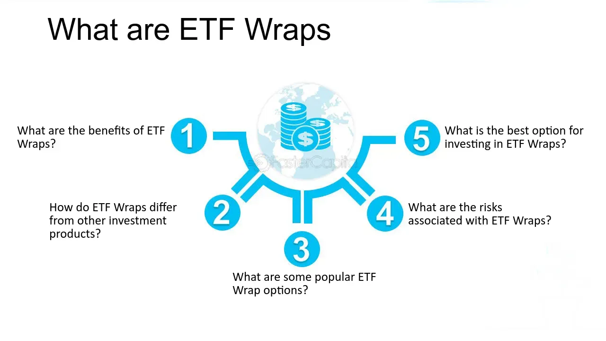

## Table of Contents

## What is an ETF Wrap?

An ETF Wrap is a type of investment product that combines different exchange-traded funds (ETFs) into one portfolio. This makes it easier for investors to diversify their investments without having to buy each ETF separately. Think of it like a basket where you put different fruits instead of buying each fruit one by one.

These wraps are managed by professionals who choose and adjust the ETFs based on the investment goals and risk levels of the investor. This can be helpful for people who don't have the time or knowledge to manage their investments on their own. By using an ETF Wrap, investors can benefit from a diversified portfolio that is taken care of by experts.

## How does an ETF Wrap work?

An ETF Wrap works by putting together a bunch of different ETFs into one easy-to-manage package. Imagine you want to invest in different things like stocks, bonds, and maybe some commodities. Instead of buying each ETF one by one, you can just buy into an ETF Wrap. This wrap includes a mix of ETFs that are chosen to match your investment goals and how much risk you're okay with taking.

Once you're in an [ETF](/wiki/etf-trading-strategies) Wrap, professionals manage it for you. They pick which ETFs to include and when to change them. This is great if you don't have the time or know-how to manage your investments yourself. The professionals keep an eye on the market and adjust the ETFs in the wrap to try and get the best results for you. This way, you get a diversified portfolio without having to do all the work yourself.

## What are the key components of an ETF Wrap?

An ETF Wrap is made up of a bunch of different ETFs all put together in one package. These ETFs can be about stocks, bonds, commodities, or other kinds of investments. The mix of ETFs in the wrap is chosen to match what the investor wants and how much risk they're okay with taking. So, if someone wants to focus on growing their money over time, the wrap might have more ETFs that invest in stocks. If they want something safer, it might have more bonds.

The other big part of an ETF Wrap is the professional management. Instead of the investor having to pick and choose which ETFs to buy and when to sell them, a team of experts does that work. They keep an eye on the market and make changes to the ETFs in the wrap to try and get the best results. This makes it easier for the investor because they don't have to do all the work themselves. They just need to pick an ETF Wrap that fits their goals and let the pros handle the rest.

## Who typically uses ETF Wraps and why?

People who don't have a lot of time to manage their investments often use ETF Wraps. These might be busy professionals or anyone who wants to invest but doesn't want to spend time [picking](/wiki/asset-class-picking) out different ETFs and keeping up with the market. ETF Wraps make it easy because they come with a mix of ETFs already picked out by experts. This way, the investor can just choose a wrap that matches their goals and let the professionals handle the rest.

Another group that uses ETF Wraps are people who are new to investing. They might not know a lot about the different kinds of investments out there, like stocks, bonds, and commodities. ETF Wraps can help them get started because they offer a diversified portfolio without the investor having to learn everything right away. It's like getting a helping hand from experts who know what they're doing, which can make investing less scary and more manageable.

## What are the benefits of using an ETF Wrap for investment?

One big benefit of using an ETF Wrap for investment is that it makes things easier for you. Instead of having to pick and choose different ETFs on your own, you can just buy into one ETF Wrap. This wrap already has a mix of ETFs that are chosen by experts to match what you want and how much risk you're okay with. So, you save time and don't have to be an expert yourself.

Another benefit is that ETF Wraps help you spread out your investments. They include different kinds of ETFs, like ones for stocks, bonds, and maybe commodities. This means your money isn't all in one place, which can be safer. Plus, since professionals manage the ETF Wrap, they keep an eye on the market and make changes to try and get the best results for you. This can help your investments grow over time without you having to do all the work.

## What are the potential drawbacks of ETF Wraps?

One downside of ETF Wraps is that they can cost more than just buying ETFs on your own. Since professionals manage the ETF Wrap, they charge fees for their work. These fees can add up over time and eat into the money you make from your investments. So, while it's easier to let someone else handle things, it might end up costing you more.

Another potential issue is that you have less control over your investments. When you use an ETF Wrap, you're trusting the professionals to pick the right mix of ETFs for you. If you have specific ideas about where you want to invest your money, you might not be happy with the choices they make. It's like giving someone else the keys to your car; they might drive it differently than you would.

Lastly, ETF Wraps might not be as flexible as buying individual ETFs. If you want to change your investment strategy or move your money around, it can be harder to do with an ETF Wrap. You're kind of locked into the choices the professionals make, which might not always fit with what you want to do with your investments as time goes on.

## How do ETF Wraps compare to other investment vehicles like mutual funds?

ETF Wraps and mutual funds are both ways to invest your money, but they work a bit differently. An ETF Wrap is like a basket that holds a bunch of different ETFs. These ETFs are chosen by professionals to match what you want and how much risk you're okay with. This means you get a mix of investments without having to pick each one yourself. Mutual funds, on the other hand, are also managed by professionals, but they pool money from many investors to buy a variety of stocks, bonds, or other assets. The key difference is that ETF Wraps focus on using ETFs, while mutual funds can invest in a broader range of assets directly.

When it comes to costs and control, ETF Wraps and mutual funds also have some differences. ETF Wraps often come with management fees because experts are choosing and adjusting the ETFs for you. These fees can be higher than the fees for some mutual funds, which can affect how much money you make in the end. On the other hand, with mutual funds, you might have more control over what you're investing in because you can choose from a wider variety of funds. However, like ETF Wraps, mutual funds are also managed by professionals, so you're still trusting someone else to make investment decisions for you.

## What are the costs associated with ETF Wraps?

ETF Wraps come with costs that you should know about. One big cost is the management fee. Since professionals manage the ETF Wrap and choose which ETFs to include, they charge a fee for their work. This fee can be higher than what you'd pay if you bought ETFs on your own. Over time, these fees can add up and take a chunk out of the money you make from your investments.

There might also be other costs with ETF Wraps. For example, the ETFs inside the wrap can have their own fees, called expense ratios. These are smaller fees that come with owning the ETFs themselves. When you add up the management fee and the expense ratios of the ETFs, the total cost of an ETF Wrap can be higher than you might expect. It's a good idea to look at all these costs before deciding if an ETF Wrap is right for you.

## How can an investor select the right ETF Wrap for their portfolio?

To pick the right ETF Wrap for your portfolio, start by thinking about your investment goals. Do you want to grow your money over time, or are you looking for something safer? Your goals will help you decide which kind of ETF Wrap is best for you. For example, if you want to grow your money, you might pick an ETF Wrap with more ETFs that invest in stocks. If you want something safer, you might go for one with more bonds. Also, think about how much risk you're okay with taking. Some ETF Wraps are riskier than others, so make sure the one you pick matches your comfort level.

Next, look at the costs. ETF Wraps come with management fees because professionals pick and manage the ETFs for you. These fees can add up, so make sure you understand how much you'll be paying. Also, check the expense ratios of the ETFs inside the wrap, because those are extra costs you'll have to deal with. Finally, think about the company that manages the ETF Wrap. Look for a company with a good track record and one that you trust to make smart choices with your money. By considering your goals, risk level, costs, and the managing company, you can find an ETF Wrap that fits your needs.

## What role does diversification play in an ETF Wrap?

Diversification is super important in an ETF Wrap. It's like not putting all your eggs in one basket. When you use an ETF Wrap, you get a mix of different ETFs, which means your money is spread out across different kinds of investments, like stocks, bonds, and maybe even commodities. This helps lower the risk because if one type of investment doesn't do well, the others might still be okay. So, if the stock market goes down, your bonds might help balance things out.

The professionals who manage the ETF Wrap pick the ETFs to make sure your money is spread out in a smart way. They look at the market and adjust the mix of ETFs to try and get the best results for you. This means you don't have to worry about picking the right mix yourself. Diversification in an ETF Wrap helps you build a strong and balanced portfolio without having to do all the work.

## How do tax considerations affect the choice of an ETF Wrap?

When picking an ETF Wrap, you need to think about taxes. ETFs can be more tax-friendly than other kinds of investments because they usually have fewer capital gains distributions. This means you might not have to pay as much in taxes each year. But, the tax benefits can change depending on which ETFs are in the wrap and how the professionals manage them. So, it's a good idea to look at the tax situation of the ETF Wrap before you decide to invest.

Also, think about where you're keeping your ETF Wrap. If it's in a tax-advantaged account like an IRA or a 401(k), you might not have to worry as much about taxes right away. But if it's in a regular account, you'll need to think about how the taxes will affect your money. Talking to a tax advisor can help you understand how an ETF Wrap will work with your taxes and make sure you're picking the best one for your situation.

## What are the latest trends and innovations in the ETF Wrap market?

In the ETF Wrap market, one of the latest trends is the focus on customization. More and more, investors want ETF Wraps that can be tailored to their specific needs and goals. This means companies are offering more options for investors to pick and choose the ETFs they want in their wrap. It's like going to a buffet where you can select exactly what you want on your plate. This trend is making ETF Wraps more flexible and appealing to a wider range of investors.

Another innovation in the ETF Wrap market is the use of technology. Companies are using new tools and platforms to help investors manage their ETF Wraps more easily. For example, some platforms now offer real-time data and analytics, so investors can see how their wrap is doing at any moment. This makes it easier for people to make smart choices about their investments. Plus, with the rise of robo-advisors, more investors can get professional advice and management without paying high fees, which is changing the way people think about ETF Wraps.

## References & Further Reading

[1]: Bergstra, J., Bardenet, R., Bengio, Y., & Kégl, B. (2011). ["Algorithms for Hyper-Parameter Optimization."](https://papers.nips.cc/paper/4443-algorithms-for-hyper-parameter-optimization) Advances in Neural Information Processing Systems 24.

[2]: ["Advances in Financial Machine Learning"](https://www.amazon.com/Advances-Financial-Machine-Learning-Marcos/dp/1119482089) by Marcos Lopez de Prado

[3]: ["Evidence-Based Technical Analysis: Applying the Scientific Method and Statistical Inference to Trading Signals"](https://www.amazon.com/Evidence-Based-Technical-Analysis-Scientific-Statistical/dp/0470008741) by David Aronson

[4]: ["Machine Learning for Algorithmic Trading"](https://github.com/stefan-jansen/machine-learning-for-trading) by Stefan Jansen

[5]: ["Quantitative Trading: How to Build Your Own Algorithmic Trading Business"](https://www.amazon.com/Quantitative-Trading-Build-Algorithmic-Business/dp/1119800064) by Ernest P. Chan