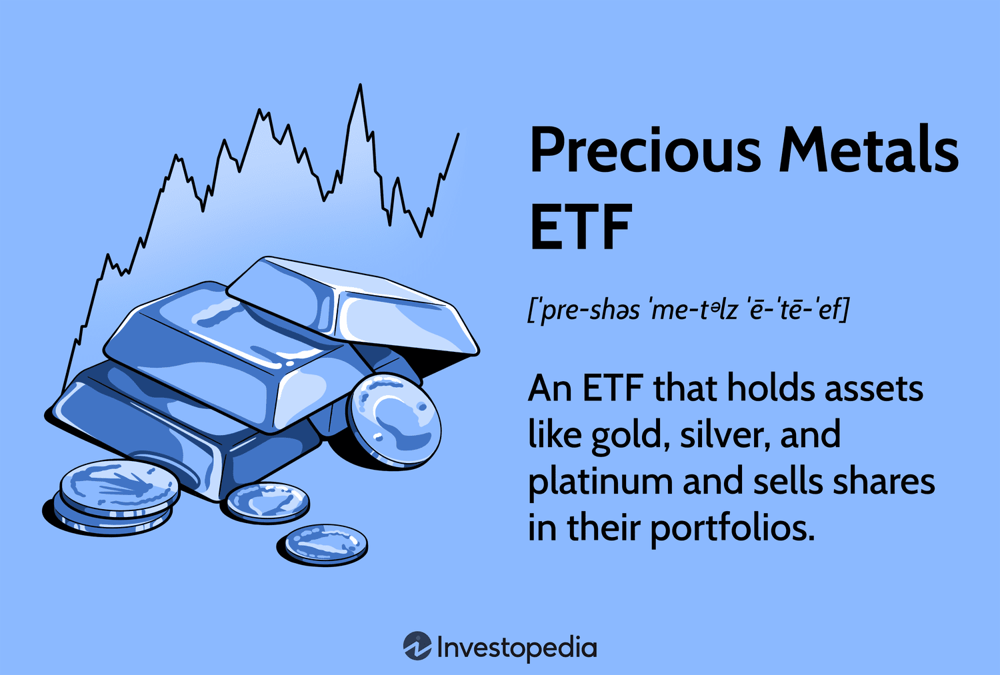

## Table of Contents

## What are ETFs and how do they work?

ETFs, or Exchange-Traded Funds, are a type of investment that combines the features of mutual funds and stocks. They are baskets of securities, like stocks, bonds, or commodities, that you can buy and sell on a stock exchange, just like individual stocks. This makes them easy to trade throughout the day at market prices, unlike mutual funds which are only traded once a day after the market closes.

When you invest in an ETF, you're essentially buying a small piece of each of the assets that the ETF holds. For example, if an ETF tracks the S&P 500, your investment will give you exposure to all the companies in that index. ETFs are managed by professionals who aim to match the performance of a specific index or sector, and they often have lower fees than actively managed mutual funds. This makes them a popular choice for investors looking for a cost-effective way to diversify their portfolios.

## Why might someone invest in ETFs focused on the metals and mining sector?

Someone might invest in ETFs focused on the metals and mining sector because they want to take advantage of the growth and stability that this industry can offer. Metals like gold, silver, and copper are important in many industries, from electronics to construction. When these industries do well, the demand for metals goes up, which can increase the value of the ETFs that invest in these metals and mining companies.

Another reason is to diversify their investment portfolio. By investing in a metals and mining [ETF](/wiki/etf-trading-strategies), an investor can spread their money across many different companies in this sector, instead of putting all their money into just one or two companies. This can help reduce risk because if one company doesn't do well, the others might still perform okay, balancing things out.

Lastly, some people invest in these ETFs as a hedge against inflation. When the value of money goes down, the price of metals often goes up. This means that if inflation starts to rise, the value of a metals and mining ETF might also increase, helping to protect the investor's money from losing value.

## What are the main types of metals and mining ETFs available?

There are different types of metals and mining ETFs that people can invest in. One type is called a broad-based metals and mining ETF. This kind of ETF invests in a lot of different companies that mine different metals like gold, silver, copper, and more. It's a good choice if you want to spread your investment across the whole metals and mining industry instead of focusing on just one type of metal.

Another type is a metal-specific ETF. These ETFs focus on just one type of metal, like gold or silver. For example, a gold ETF will invest in companies that mine gold, or it might even hold physical gold itself. This can be a good choice if you believe that one particular metal is going to do really well in the future.

Lastly, there are ETFs that focus on the mining part of the industry. These mining ETFs invest in companies that do the actual mining work, no matter what metal they are mining. This can be a good option if you think that the mining companies themselves are going to do well, even if the prices of the metals they mine go up and down.

## How do metals and mining ETFs differ from other sector ETFs?

Metals and mining ETFs focus on companies that mine metals like gold, silver, and copper. They are different from other sector ETFs because they often track the prices of these metals, which can be influenced by things like inflation, industrial demand, and global economic conditions. For example, when people worry about inflation, they might buy more gold, which can make the price of gold go up and affect the value of a gold ETF.

Other sector ETFs might focus on industries like technology, healthcare, or energy. These ETFs are influenced by different factors. For example, a technology ETF might go up or down based on new product releases or changes in consumer demand for tech products. Unlike metals and mining ETFs, these sector ETFs don't usually track the prices of physical commodities but rather the performance of the companies within their specific industry.

In summary, while metals and mining ETFs are tied closely to commodity prices and the global demand for metals, other sector ETFs are more influenced by company performance, industry trends, and economic policies specific to their sectors. This makes metals and mining ETFs a unique choice for investors looking to diversify their portfolios with assets that can act as a hedge against inflation or economic uncertainty.

## What are the risks associated with investing in metals and mining ETFs?

Investing in metals and mining ETFs comes with its own set of risks. One big risk is that the prices of metals like gold, silver, and copper can go up and down a lot. This can happen because of things like changes in how much people want these metals, problems in the countries where they are mined, or big changes in the world economy. If the price of the metal goes down, the value of your ETF will probably go down too. This can be a problem if you need to sell your ETF when the price is low.

Another risk is that mining companies can have their own problems. Things like accidents at mines, strikes by workers, or new laws about the environment can make it hard for these companies to make money. If the companies in the ETF are not doing well, the value of the ETF can go down even if the price of the metal is okay. This means you are not just betting on the price of the metal, but also on how well the companies are run.

Also, ETFs that focus on one type of metal or just a few companies can be riskier than ETFs that spread their investments across many different metals and companies. If something bad happens to one metal or one company, it can have a big effect on the value of the ETF. This is called concentration risk. So, it's important to think about how much risk you are okay with before you decide to invest in a metals and mining ETF.

## How can metals and mining ETFs be used for diversification in a portfolio?

Metals and mining ETFs can help you spread out your investments, which is called diversification. When you invest in these ETFs, you're not putting all your money into just one company or one type of metal. Instead, you're investing in a whole bunch of different companies that mine different metals like gold, silver, and copper. This can help lower your risk because if one company or one metal doesn't do well, the others might still be okay, balancing things out.

Another way these ETFs can help with diversification is by adding something different to your portfolio. Most people have stocks and bonds, but adding metals and mining ETFs can give you exposure to commodities, which often behave differently from stocks and bonds. For example, when the stock market is going down, the price of gold might go up. This means that if part of your portfolio is in a metals and mining ETF, it might help cushion the blow if other parts of your portfolio are not doing well.

## What are some popular metals and mining ETFs and their key features?

One popular metals and mining ETF is the SPDR S&P Metals & Mining ETF (XME). This ETF focuses on companies that mine metals and minerals in the United States. It tries to match the performance of the S&P Metals & Mining Select Industry Index. This means it includes a lot of different mining companies, which can help spread out the risk. XME is good for people who want to invest in the metals and mining industry but don't want to pick individual companies.

Another well-known ETF is the iShares MSCI Global Gold Miners ETF (RING). This ETF invests in companies that mine gold all around the world. It follows the MSCI ACWI Select Gold Miners Investable Market Index. If you think gold prices are going to go up, this ETF could be a good choice because it focuses only on gold mining companies. RING can be a bit riskier because it focuses on just one metal, but it can also offer big rewards if gold does well.

The VanEck Vectors Gold Miners ETF (GDX) is also very popular. It invests in companies that mine gold and silver, but it focuses more on gold. GDX tries to match the performance of the NYSE Arca Gold Miners Index. This ETF is good for people who want to invest in gold but also want some exposure to silver. Like RING, it can be a bit riskier because it focuses on precious metals, but it can be a good way to diversify your portfolio with commodities.

## How do global economic factors influence the performance of metals and mining ETFs?

Global economic factors can have a big impact on how well metals and mining ETFs do. For example, when the world economy is growing, there is usually more demand for metals like copper and steel because they are used in things like building and making machines. This can make the price of these metals go up, which can help the value of ETFs that invest in companies that mine these metals. On the other hand, if the world economy is slowing down, people might not need as much metal, and the price can go down, which can hurt the value of these ETFs.

Another big [factor](/wiki/factor-investing) is inflation. When people worry about inflation, they often buy more gold and silver because these metals are seen as a good way to keep your money safe. This can make the price of gold and silver go up, which can help ETFs that focus on these metals do better. But if inflation is not a big worry, people might not buy as much gold and silver, and the prices can stay the same or even go down, which can make these ETFs not do as well. So, keeping an eye on global economic conditions can help you understand what might happen to your metals and mining ETFs.

## What are the tax implications of investing in metals and mining ETFs?

When you invest in metals and mining ETFs, you need to think about taxes. If you sell your ETF and make a profit, you have to pay capital gains tax. If you hold the ETF for less than a year, it's called a short-term capital gain, and you pay tax on it at your regular income tax rate. If you hold it for more than a year, it's a long-term capital gain, and the tax rate is usually lower. This is important to know because it can affect how much money you keep after selling your ETF.

Also, some metals and mining ETFs might give you dividends. Dividends are payments from the companies in the ETF to you, the investor. These dividends are usually taxed as regular income, but there can be some special rules. For example, if the ETF holds a lot of gold and pays out dividends, those dividends might be taxed differently because gold is considered a collectible. It's a good idea to talk to a tax professional to understand all the tax rules and how they apply to your specific situation.

## How do you evaluate the performance of a metals and mining ETF?

To evaluate the performance of a metals and mining ETF, you need to look at a few things. First, check the ETF's total return, which is how much the ETF has grown over time, including any dividends it has paid out. You can compare this to other ETFs or to the market as a whole to see if it's doing well. Also, look at the ETF's expense ratio, which is how much it costs to own the ETF. A lower expense ratio means you get to keep more of your returns. Finally, think about how the ETF is doing compared to the price of the metals it focuses on. If the ETF is supposed to track the price of gold, for example, see if it's doing a good job at that.

Another way to evaluate the performance is to look at the ETF's [volatility](/wiki/volatility-trading-strategies), which is how much its price goes up and down. If an ETF's price is very stable, it might be less risky, but it might also not grow as much. On the other hand, if the price moves a lot, it could be riskier but also have the chance for bigger gains. You can also look at the ETF's holdings to see if it's spread out across many different companies or if it's focused on just a few. A more diversified ETF might be less risky. By looking at all these things, you can get a good idea of how well a metals and mining ETF is doing and if it's a good fit for your investment goals.

## What are some advanced strategies for trading metals and mining ETFs?

One advanced strategy for trading metals and mining ETFs is to use technical analysis. This means looking at charts and patterns to try to guess where the price of the ETF might go next. You can use things like moving averages, which help you see the overall trend of the ETF's price, or the Relative Strength Index (RSI), which can tell you if the ETF is overbought or oversold. By using these tools, you can try to buy the ETF when you think the price is going to go up and sell it when you think the price is going to go down. This can help you make more money, but it's also riskier because you're trying to predict the future.

Another strategy is to use options. Options are contracts that give you the right to buy or sell the ETF at a certain price by a certain date. You can use options to make money if you think the price of the ETF is going to go up or down a lot. For example, you can buy a call option if you think the price is going to go up, or a put option if you think it's going to go down. This can be a good way to make money, but it's also very risky because you can lose all the money you put into the option if the price doesn't move the way you thought it would. It's important to learn a lot about options and how they work before you start using them.

## How might future trends in the metals and mining industry affect ETF investments?

Future trends in the metals and mining industry could have a big impact on ETF investments. One trend to watch is the growing demand for green technology and renewable energy. As more countries try to use less fossil fuels and more clean energy, the need for metals like copper, lithium, and nickel will go up. These metals are used in things like electric car batteries and solar panels. If the demand for these metals goes up, the price will probably go up too, which can make ETFs that focus on these metals do better.

Another trend is how new technology can change the way mining is done. New machines and ways of finding metals can make mining cheaper and safer. This can help mining companies make more money, which can be good for ETFs that invest in these companies. But, there are also challenges like new laws about the environment and worries about how mining affects the earth. If new laws make it harder or more expensive to mine, it could hurt the value of ETFs that focus on mining companies. So, it's important to keep an eye on these trends and think about how they might affect your investments.

## References & Further Reading

[1]: Lech, A. M. (2013). ["A Practical Guide to Algorithmic Strategies and Trading Systems."](https://www.wiley.com/en-us/High+Frequency+Trading%3A+A+Practical+Guide+to+Algorithmic+Strategies+and+Trading+Systems-p-9780470579770) Wiley Trading.

[2]: Lopez de Prado, M. (2018). ["Advances in Financial Machine Learning."](https://www.amazon.com/Advances-Financial-Machine-Learning-Marcos/dp/1119482089) Wiley.

[3]: Chan, E. (2009). ["Quantitative Trading: How to Build Your Own Algorithmic Trading Business."](https://github.com/ftvision/quant_trading_echan_book) Wiley.

[4]: Aronson, D. R. (2006). ["Evidence-Based Technical Analysis: Applying the Scientific Method and Statistical Inference to Trading Signals."](https://www.amazon.com/Evidence-Based-Technical-Analysis-Scientific-Statistical/dp/0470008741) Wiley.

[5]: Jansen, S. (2018). ["Machine Learning for Algorithmic Trading - Second Edition."](https://www.amazon.com/Machine-Learning-Algorithmic-Trading-alternative/dp/1839217715) Packt Publishing.