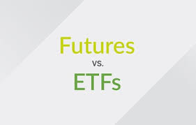

Exchange-Traded Funds (ETFs) and futures contracts represent two fundamental, yet distinctly different, trading instruments that cater to a broad spectrum of investment strategies in the financial markets. ETFs offer the diversification of mutual funds with the agility of stock trading, making them a go-to for investors seeking exposure to a variety of asset classes through a single transaction. They track an index, commodity, bonds, or a basket of assets like an index fund, yet trade on exchanges like a stock.

On the other hand, futures are standardized contracts to buy or sell a specific asset at a predetermined price at a specified time in the future, and are primarily used for hedging risk or speculating on the price movement of the underlying asset. These instruments are critical for investors looking to manage risk or leverage their positions in the market.

The interest in understanding the nuances between ETFs and futures has surged as investors seek to optimize their portfolios, manage risks, and capitalize on market opportunities. Both instruments come with their own set of features, risks, and benefits, which are important to grasp in the context of an ever-evolving financial landscape. The ability to discern their differences is not just a matter of preference but a strategic necessity for informed decision-making in investment.

## Table of Contents

## Understanding ETFs

Exchange-Traded Funds (ETFs) are investment funds traded on stock exchanges, much like stocks. An ETF holds assets such as stocks, commodities, or bonds and generally operates with an arbitrage mechanism designed to keep it trading close to its net asset value, although deviations can occasionally occur. A key characteristic of ETFs is their ability to offer diversified exposure to a particular index, market, or sector, combining the flexibility of stock trading with the diversification benefits of mutual funds.

ETFs are commonly used for a range of investment strategies, including hedging, income generation, price speculation, or to simply gain market exposure with lower fees than actively managed funds. They are lauded for their transparency, as holdings are disclosed daily, and for their tax efficiency in comparison to traditional mutual funds.

The variety of [ETF](/wiki/etf-trading-strategies)s available to investors is vast. They can be broadly categorized into equity ETFs, which may focus on specific sectors, market capitalizations, or investment styles; fixed-income ETFs that target government, municipal, or corporate debt; commodity ETFs that invest in physical goods or commodity-related businesses; and specialty ETFs, which can cover anything from currencies to [volatility](/wiki/volatility-trading-strategies) indices. Additionally, there are international ETFs that provide exposure to foreign markets, and thematic ETFs that focus on specific investment themes or trends.

A significant advantage of ETFs is their accessibility for the average investor, allowing for the creation of a diversified portfolio with relatively low capital. Moreover, their structure as a traded fund enables investors to buy and sell shares throughout the trading day at market-determined prices.

For those looking to deep dive deeper into the mechanics and strategic uses of ETFs, "The ETF Book" by Richard A. Ferri provides a comprehensive guide to understanding these versatile instruments, their construction, and their place in the investment landscape[1].

## Understanding Futures

Futures contracts are agreements to buy or sell an underlying asset at a predetermined price at a specified time in the future. Serving as a cornerstone of the financial markets, futures are utilized for both hedging and speculative purposes. They allow producers and consumers to lock in prices for commodities—such as oil or grains—to protect against price volatility, and they enable traders to speculate on price movements without the need to hold the actual asset.

Each futures contract contains specific details including the quantity of the asset, delivery date, and settlement terms. Contracts are standardized to facilitate trading on a futures exchange, where they are bought and sold by participants who agree to take on the obligations set by the contract. Unlike the spot market where assets are traded immediately, futures contracts are a form of derivative trading because their value is derived from the performance of an underlying asset.

The obligations of a futures contract are twofold: the buyer agrees to purchase the asset when the contract expires, and the seller agrees to deliver the asset at the agreed-upon price regardless of current market prices. It's important to note that most futures positions are settled before expiration, often through offsetting trades which means the contracts are sold or bought to close the position and the physical delivery of the asset is rare in practice.

Standardization of futures contracts means that the exchanges have predetermined the minimum quality, quantity, and delivery locations for the underlying asset, making these contracts fungible and easier to trade. This also facilitates market [liquidity](/wiki/liquidity-risk-premium), as traders can confidently buy and sell contracts knowing that each one meets strict exchange requirements.

The role of futures in financial markets is also vital for price discovery and risk management. By reflecting expectations about the future price of an asset, futures prices help to establish a consensus about its potential market value, while the ability to hedge with futures can protect against adverse price movements.

For a detailed analysis of the structure and function of futures markets, one can reference "Futures, Options, and Swaps" by Robert W. Kolb, which offers an extensive look at the mechanics of futures contracts and their application within the broader financial landscape[2].

## Comparison Framework: ETFs vs. Futures

When comparing ETFs and futures, several key criteria must be scrutinized to understand their fundamental differences and to determine which instrument may be more suitable for an investor's strategy.

**Leverage and Margin Requirements**: Futures contracts typically offer higher leverage, allowing traders to control large amounts of the underlying asset with a relatively small amount of capital. However, this also increases risk, as gains and losses are amplified. ETFs usually offer less leverage unless one is trading on margin or using leveraged ETFs.

**Liquidity**: Liquidity varies greatly between ETFs and futures markets. Some futures contracts, especially those for major commodities or financial indices, are highly liquid with tight bid-ask spreads. ETFs can also be highly liquid, particularly those tracking major indices, but less popular ETFs may have lower liquidity.

**Market Access and Trading Hours**: Futures markets often provide nearly 24-hour access, allowing traders to respond to global events in real-time. ETFs are generally limited to the trading hours of the exchange they are listed on, which can limit immediate market access.

**Costs and Fees**: ETFs typically incur management fees, known as expense ratios, and may also have brokerage fees associated with buying and selling shares. Futures do not have management fees, but trading them may involve paying brokerage commissions, exchange, and clearing fees.

**Tracking Errors**: ETFs can experience tracking errors relative to their underlying index or assets due to fund expenses or timing issues. Futures contracts, by design, closely follow the price of the underlying asset as they approach expiration, though early in the contract there can be a disparity.

**Market History**: ETFs have been around since the 1990s, providing a modern tool for diversified investment. Futures have a longer history, dating back to the 19th century for agricultural commodities, and have been used extensively for risk management and speculative trading.

**Taxation**: Tax treatment for ETFs and futures can differ significantly. In the U.S., for example, long-term capital gains from ETFs held for more than a year are taxed at a lower rate, whereas futures are subject to a 60/40 tax rule where 60% of gains are treated as long-term, regardless of the holding period.

**Slippage and Commission**: Both ETFs and futures can experience slippage, which is the difference between the expected price of a trade and the price at which the trade is executed. Commissions for both will vary based on the brokerage and the volume of the trade.

**Investment Size and Longevity**: The size of investment in ETFs can be as small as one share, making it accessible to retail investors. Futures contracts are larger and standardized, which might present a higher entry barrier. The longevity of an ETF or a futures contract position can vary depending on investment goals and market conditions.

**Account Deposits and Eligibility for Trading**: Opening an account to trade ETFs generally requires less capital than an account for trading futures, where initial margin and maintenance margin must be met. Eligibility for trading futures often requires a higher level of investor qualification due to the complexity and risk involved.

**Global Trading Considerations**: International investors may face restrictions when attempting to trade certain ETFs or futures based on their domicile, with regulations differing widely between regions.

Each of these criteria plays a crucial role in an investor's decision to use ETFs or futures.

## Financial Leverage and Margin

Financial leverage and margin are critical concepts in the trading of ETFs and futures, with each instrument offering distinct opportunities and requirements.

**In ETF trading, leverage is typically accessed through borrowing**, allowing an investor to gain a larger exposure to the market with a smaller initial capital outlay. Some ETFs are inherently leveraged, meaning they aim to deliver multiples of the daily performance of the index they track. However, the leverage in such ETFs is reset daily, which can lead to compounding effects that may significantly differ from the long-term return of the underlying index, especially in volatile markets.

**Futures, by contrast, are naturally leveraged products**. Traders are only required to put up a fraction of the value of the contract, known as the initial margin, which is a performance bond rather than a down payment. Futures margins are determined by exchanges and are subject to change based on market volatility. This built-in leverage allows for substantial gains from small movements in the underlying asset's price, but it can also magnify losses, potentially exceeding the initial margin placed.

The maintenance margin is the minimum equity an investor must maintain in their futures trading account. If the balance drops below this level due to trading losses, the investor must replenish the funds to maintain the position, known as a margin call. In ETF trading, a margin call can also occur, but it is a result of borrowing funds to purchase more shares rather than a feature of the product's structure.

Leverage amplifies the results of market movements, enhancing both profits and losses. While it can be a powerful tool for capital efficiency, it can also increase the risk to levels that may be unacceptable for some investors. Understanding how leverage works in both ETFs and futures is essential for managing this risk. It's important for traders to recognize their risk tolerance and have strategies in place to manage leveraged positions, such as the use of stop-loss orders.

## Liquidity and Market Access

Liquidity refers to how quickly and easily an asset can be bought or sold in the market without affecting its price. In general, the higher the liquidity, the more active the market. **ETFs are known for their high liquidity**, particularly those that track major indices, because they trade on stock exchanges like individual stocks. This means that they can be bought and sold throughout the trading day at current market prices. The liquidity of an ETF is also influenced by the liquidity of the underlying assets it holds. For example, an ETF that tracks a major index like the S&P 500 is typically more liquid than one tracking a niche market sector.

**Futures contracts also offer high liquidity**, especially for contracts that are close to expiration or those that are centered on widely traded commodities and financial instruments. The liquidity in futures is partly due to the standardized nature of the contracts, which makes it easier for traders to enter and exit positions. Futures exchanges facilitate this liquidity by providing a central marketplace where all trades for a particular contract are conducted.

Market access is another important consideration. **ETFs are accessible during the trading hours of the exchange they are listed on**, which can limit trading to specific times of the day. In contrast, **futures contracts often trade nearly around the clock on electronic trading platforms**, providing the ability to respond to market-moving events as they occur, even outside of regular trading hours. This extended market access is particularly beneficial in managing risk and capitalizing on opportunities that arise outside of standard market hours.

However, market access can also be limited by regulatory restrictions, which may vary by country. For example, not all ETFs may be available to investors in certain regions due to local regulations, and similarly, traders in some countries may have restricted access to certain futures markets.

In terms of trading strategies, the liquidity of ETFs makes them well-suited for both active and passive investment strategies, while the extended access of futures markets makes them ideal for more time-sensitive strategies that require the ability to quickly adjust positions in response to global events.

## Costs, Fees, and Hidden Expenses

When considering the costs, fees, and hidden expenses associated with ETFs and futures, investors must navigate a landscape of explicit and implicit costs that can impact overall investment returns.

**ETFs are known for their relatively low management fees**, often referred to as the expense ratio, which covers the cost of operating the fund. These fees are deducted from the ETF’s net asset value (NAV) daily and can range significantly depending on the fund’s strategy, size, and complexity. In addition to management fees, investors may incur brokerage commissions when buying and selling ETF shares, although many brokers now offer commission-free trading on a wide range of ETFs. There can also be bid-ask spreads, which is the difference between the price a buyer is willing to pay for an ETF and the price a seller is willing to accept. For less liquid ETFs, this spread can be wider, adding to the cost of trading.

**Futures trading, on the other hand, does not involve management fees**. However, traders typically pay commission and brokerage fees for each transaction they execute. Additional costs can include exchange fees, clearing fees, and data fees, depending on the platform used and the volume of the trade. Moreover, futures traders must maintain margin accounts, which can incur interest charges if the trader borrows money from the broker to meet margin requirements.

Both ETFs and futures may have hidden costs that are not immediately apparent. For ETFs, these can include the potential for tracking error—where the ETF does not perfectly replicate the performance of the underlying index or assets—and the cost impact of rebalancing the ETF portfolio. For futures, hidden costs can manifest in the form of rollover costs when a trader moves from an expiring contract to a new one, potentially affecting returns, especially when the market is in contango or backwardation.

Investors must also be mindful of the liquidity premium in both ETFs and futures. In less liquid markets, the cost of entering and [exit](/wiki/exit-strategy)ing positions can be higher due to wider bid-ask spreads for ETFs and less favorable pricing for futures contracts.

## Taxation

The tax treatment of ETFs and futures is a critical consideration for investors as it can significantly affect net investment returns.

**ETFs are generally treated for tax purposes as securities**. In the United States, this means that long-term capital gains from ETFs held for more than one year are taxed at a lower rate, while short-term capital gains from ETFs sold within a year are taxed as ordinary income. Additionally, dividends received from ETFs are subject to taxation, and the specific tax rate may depend on whether they are qualified or non-qualified dividends.

**Futures contracts have a unique tax treatment under the U.S. tax code, often referred to as the 60/40 rule**. Under Section 1256 of the Internal Revenue Code, 60% of gains or losses from futures trading are treated as long-term, regardless of the holding period, while the remaining 40% are treated as short-term. This can be beneficial from a tax perspective, as the blended rate can result in lower taxes on gains compared to other short-term investments.

Moreover, futures traders benefit from mark-to-market accounting, which means that their gains and losses are tallied at the end of each year, even if the positions are not closed. This allows losses to be deducted in the current tax year, which can be advantageous for tax planning.

The differences in tax treatment between ETFs and futures can influence investment strategies, especially when considering the holding period and the investor's tax bracket. Tax considerations can also impact the choice between trading ETFs or futures for short-term speculation versus long-term investment.

## Tracking Errors and Market History

Tracking errors in ETFs refer to the divergence between the performance of the ETF and the performance of the index or asset it is designed to replicate. This discrepancy can arise from a variety of [factor](/wiki/factor-investing)s including fund expenses, the timing of trades, and the method of index replication used by the ETF. For example, an ETF may use a sampling strategy to replicate an index, which may lead to tracking differences, especially in less liquid markets or in markets where securities are difficult to purchase. Additionally, the rebalancing of an ETF's holdings, necessary to maintain alignment with the index, can also contribute to tracking error.

In the case of futures, pricing is linked to the underlying asset through the futures contract specifications, but can diverge due to the futures market's own dynamics. The pricing of futures contracts takes into account various factors including the current spot price of the underlying asset, the time to expiration of the contract, and the risk-free [interest rate](/wiki/interest-rate-trading-strategies). Furthermore, futures prices are influenced by supply and demand within the futures market itself, which can cause the futures price to trade at a premium or discount to the spot price, known as 'contango' and 'backwardation' respectively.

The history of the ETF market began in earnest in the 1990s with the launch of the first successful ETF in the United States, the SPDR S&P 500 ETF (SPY), which allowed investors to gain exposure to the S&P 500 index with the ease of trading a single stock. Since then, the ETF industry has grown exponentially, with a diverse range of products covering various asset classes, sectors, and investment strategies.

Futures markets have a much longer history, dating back to the 18th century with the Dojima Rice Exchange in Japan. Modern futures markets developed in the mid-19th century with the establishment of the Chicago Board of Trade (CBOT) in 1848. These markets were created to meet the needs of farmers and commodity users to hedge against price fluctuations. Since then, futures trading has expanded to include financial futures such as currencies, indices, and interest rates.

Understanding the nature of tracking errors and the historical context of these markets provides investors with insight into the maturity and robustness of ETFs and futures as financial instruments. It also underscores the importance of considering these factors when building and managing an investment portfolio that may include these products.

## Size, Value, and Longevity

The size and value of contracts and holdings in ETFs and futures vary significantly and can influence the type of investors who use these instruments. ETFs are accessible to all levels of investors, from retail to institutional. They can be purchased in quantities as small as one share, making them suitable for smaller portfolios. The value of an ETF share is determined by the net asset value of the underlying holdings divided by the number of shares outstanding, allowing for investment in a diversified portfolio at a fraction of the cost of purchasing all the underlying assets individually.

In contrast, futures contracts are standardized in terms of contract size, which can represent a significant investment in the underlying asset. For example, one standard gold futures contract on the COMEX is for 100 troy ounces of gold. The large contract size means futures are often utilized by institutional investors or well-capitalized individual traders. However, many futures exchanges now offer e-mini and micro contract sizes that are more accessible to individual traders with smaller account sizes.

Longevity and sustainability are other important considerations. **ETFs, given their structure and regulation, can offer a sustainable option for long-term investment**, especially those tracking broad indices. Their open-ended nature allows for new shares to be created as demand increases, which can contribute to the longevity of the ETF. However, the continued success of an ETF also depends on its ability to attract and maintain enough investment capital to remain viable.

**Futures contracts, meanwhile, have a set expiration date, at which point the contract must be settled by delivery of the underlying asset or cash settlement**. The finite lifespan of a futures contract necessitates an active approach to management, as traders must decide whether to roll over a contract as it nears expiration or to close their position. This feature of futures can be beneficial for short-term trading strategies and for those looking to hedge against price movements over a specific time frame.

Both investment types have demonstrated sustainability in the financial markets. ETFs have grown substantially since their inception in the 1990s, and futures have been traded for centuries. The adaptability of both markets to evolving financial landscapes and investor needs suggests that they will continue to be integral components of global financial markets.

## Regulations and Eligibility

The regulatory environment for ETFs and futures is structured to protect investors and ensure market integrity, with each having distinct regulatory frameworks and eligibility requirements.

**ETFs are regulated as securities by the Securities and Exchange Commission (SEC)** in the United States and by equivalent bodies in other jurisdictions. They must comply with the Investment Company Act of 1940, which includes requirements for daily disclosure of holdings, adherence to diversification standards, and limitations on the use of leverage. Investors must meet the eligibility requirements set forth by brokerages, which typically include having a brokerage account and sufficient funds to purchase the ETF shares. Most retail investors meet these criteria and can easily invest in ETFs.

**Futures, however, are regulated by the Commodity Futures Trading Commission (CFTC)** in the United States and are subject to rules set by the exchanges where they are traded, such as the Chicago Mercantile Exchange (CME) or the Intercontinental Exchange (ICE). Trading futures requires a margin account, and traders must deposit an initial margin, which is a fraction of the contract’s total value. Futures traders must also meet the "suitability" requirements, which assess an investor’s trading experience, financial sophistication, and ability to bear the risks. The National Futures Association (NFA) also enforces strict regulations on futures brokers, ensuring that they maintain high ethical standards.

Additionally, specific regulations may apply to certain types of futures traders. For example, those classified as "commodity pool operators" or "commodity trading advisors" must register with the CFTC and adhere to additional disclosure and reporting requirements.

The regulatory environment for both ETFs and futures undergoes continuous review and adjustments to adapt to evolving market conditions and financial innovations. This dynamic regulatory landscape ensures that both investment vehicles operate under strict oversight, providing transparency and fairness for all market participants.

## Global Trading Considerations

Global trading considerations are a significant aspect of investing in ETFs and futures, particularly for EU residents interested in US-domiciled ETFs and the reverse scenario. **EU investors face certain restrictions when it comes to trading US ETFs due to the Markets in Financial Instruments Directive (MiFID II)** and the Packaged Retail and Insurance-based Investment Products (PRIIPs) regulation, which require detailed disclosures that many US ETF providers do not provide. Consequently, this limits direct access for EU retail investors to US ETFs, although institutional investors can sometimes navigate these restrictions.

Conversely, **EU-domiciled ETFs are accessible to EU investors and are designed to comply with EU regulations**, offering a wide range of investment options across various asset classes. These ETFs are subject to the Undertakings for Collective Investment in Transferable Securities (UCITS) directive, ensuring a high level of investor protection and product transparency. For US investors, access to EU ETFs may be limited, but it is possible through platforms that cater to international trading and for investors who meet certain eligibility criteria.

The accessibility of EU ETFs for EU residents tends to be more straightforward due to the harmonized regulatory framework across the European Union, which allows for cross-border distribution of investment products. However, tax considerations, reporting requirements, and the investor’s country-specific regulations also play a role in determining the suitability of these investments.

For global traders, the implications of these regulations require careful consideration to ensure compliance and to optimize the potential benefits of ETFs within a diversified portfolio. Understanding the nuances of international ETF trading can offer opportunities for portfolio diversification and exposure to different markets and economies.

## Strategic Uses in a Portfolio

ETFs and futures serve distinct strategic purposes in an investor's portfolio, catering to different needs and investment approaches.

**ETFs are widely used for portfolio diversification** due to their broad range of asset classes, including stocks, bonds, commodities, and real estate. They allow investors to gain exposure to specific sectors, markets, or investment themes without having to purchase the individual underlying assets. This can lower transaction costs and simplify portfolio management. Additionally, ETFs are often used as a tool for asset allocation, enabling investors to adjust their exposure to different market segments quickly and efficiently. For long-term investors, ETFs offer an easy way to implement a buy-and-hold strategy to build wealth over time, taking advantage of potential compound growth.

**Futures contracts, with their leverage and liquidity, are frequently utilized for hedging purposes**. Investors and corporations use futures to protect against price movements in the underlying asset, which can be critical for budgeting and planning. For example, an airline company may use oil futures to hedge against the risk of rising fuel prices. Speculators, on the other hand, use futures to bet on the direction of price movements to profit from short-term fluctuations in the market.

Both ETFs and futures can be incorporated into a sophisticated investment strategy known as risk parity, where an investor allocates capital based on the risk contributed by each asset or asset class, rather than by capital allocation. By using ETFs and futures, investors can achieve a desired risk level across various assets, potentially improving the risk-return profile of the portfolio.

In times of increased market volatility, ETFs can offer stability through diversification, while futures can be used to hedge against downside risks or to speculate on market movements. The decision to use ETFs, futures, or a combination of both depends on the investor's objectives, risk tolerance, investment horizon, and market outlook.

## Are Futures Cheaper than ETFs?

The cost-effectiveness of futures compared to ETFs is contingent upon various factors, including direct and indirect costs, the investor's strategy, and the intended holding period.

Futures contracts can be considered cheaper than ETFs in terms of direct costs because they typically do not [carry](/wiki/carry-trading) management fees like ETFs, which have expense ratios that cover the costs of managing the fund. Additionally, futures contracts often have lower commission rates due to the high [volume](/wiki/volume-trading-strategy) and competitive nature of the futures markets. Moreover, for investors who trade in large volumes, the lower execution costs in futures can make a significant difference.

However, when it comes to indirect costs, the picture is more nuanced. Futures traders must consider the potential costs of rolling over contracts to maintain a position, as futures have expiration dates. This rollover can lead to additional costs if the market is in contango, where the future price is higher than the spot price, leading to a negative roll yield. ETFs, on the other hand, do not expire and do not require rolling, but they may incur costs from bid-ask spreads when shares are bought and sold.

For short-term traders, the leverage available in futures trading can provide a cost-effective means of gaining significant market exposure with a smaller capital outlay compared to purchasing ETFs outright or on margin. However, the leverage inherent in futures also introduces higher risk and the potential for greater indirect costs in the form of margin interest and larger losses if the market moves against the position.

For long-term investors, the compounding of ETF expense ratios can add to the cost over time, but this must be balanced against the simplicity of holding a long-term position in an ETF compared to the active management required to maintain a futures position.

In assessing cost-effectiveness, investors must also weigh the impact of taxation. As mentioned earlier, futures benefit from the 60/40 tax treatment in the U.S., which can result in tax savings compared to the short-term capital gains taxes that could apply to frequently traded ETFs.

*Ultimately, whether futures or ETFs are more cost-effective will depend on the investor's specific circumstances, including their trading frequency, time horizon, risk tolerance, and the tax implications of their trading activities.*

## Can ETFs Hold Futures?

Yes, certain types of ETFs can and do hold futures contracts. These ETFs are typically known as commodity or futures-based ETFs. They use futures contracts to gain exposure to commodities like oil, gold, or agricultural products without actually holding the physical asset. The strategic importance of these ETFs lies in their ability to provide investors with an accessible, liquid, and cost-effective means of gaining exposure to commodity markets, which can be difficult and complex to invest in directly.

The composition of these ETFs is structured around the futures contracts for the commodities they aim to track. They may hold contracts with varying expiration dates to manage the roll process (the method of selling expiring futures and buying the next period’s futures to maintain exposure). This process is critical in managing the potential impacts of contango and backwardation, which can affect the performance of the ETF relative to the spot price of the commodity.

Futures-based ETFs are also used for diversification purposes, as commodities often exhibit low correlation with traditional asset classes like stocks and bonds. This means that they can potentially reduce portfolio volatility and enhance returns through diversification. Moreover, these ETFs can be a strategic tool for hedging against inflation, as commodities can serve as an inflation hedge.

However, investing in these ETFs requires an understanding of the complexities involved with futures contracts, including the contango effect, where the futures price is above the expected future spot price, and backwardation, where the future price is below the expected future spot price. These market conditions can lead to a situation where the ETF does not perfectly replicate the performance of the underlying commodity.

## Conclusion

In the dynamic landscape of financial instruments, both ETFs and futures offer unique advantages and serve distinct strategic roles within an investor's portfolio. Choosing between ETFs and futures depends largely on the individual investor's financial goals, risk tolerance, investment horizon, and market expertise.

ETFs are generally well-suited for a wide range of investors, from those just starting out to seasoned veterans. They provide a straightforward means to diversify across various asset classes, sectors, or regions with a single transaction. For investors seeking a passive investment strategy that aligns with broader market performance or specific sectoral trends, ETFs can be an excellent choice. They also serve active traders who value the liquidity and flexibility to take advantage of short-term market movements.

Futures, with their inherent leverage and efficiency in capital use, appeal to investors who are comfortable with higher levels of risk and seek to hedge positions or speculate on price movements. They can be a powerful tool for sophisticated investors who understand the nuances of contract specifications and the implications of margin requirements.

Ultimately, the decision to invest in ETFs or futures should be informed by a comprehensive understanding of the instruments, a clear assessment of personal investment goals, and a well-considered strategy.

## References & Further Reading

[1]: ["The ETF Book"](https://www.amazon.com/ETF-Book-About-Exchange-Traded-Funds/dp/0470130636) by Richard A. Ferri

[2]: ["Futures, Options, and Swaps"](https://www.amazon.com/Futures-Options-Swaps-Robert-Kolb/dp/1405150491) by Robert W. Kolb