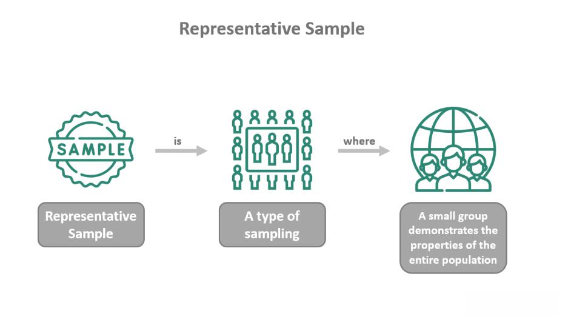

In recent decades, passive investing has increasingly gained traction over active investing, primarily due to its cost-effectiveness and ability to deliver market-conforming returns. At the forefront of this investment trend are Exchange-Traded Funds (ETFs), which are designed to track market indices and mimic their performance. ETFs are popular instruments in passive investment strategies because they offer investors diversified exposure while typically incurring lower fees than actively managed funds. 

A central feature of ETFs is their method of index replication, which can substantially impact their performance and costs. ETFs employ two main methods of index replication: full replication and representative sampling. Full replication involves holding all constituent securities of an index in exact proportions, thereby aiming to match the index's performance precisely and minimize tracking errors. Conversely, representative sampling involves holding a subset of an index's securities that are chosen based on specific criteria to mimic the index's overall performance; however, this method often leads to increased turnover and potentially higher tracking errors.

This article explores the advantages and disadvantages of these replication methods, particularly in the context of algorithmic trading. Algorithmic trading strategies, which rely on computer programs to execute trades at high speeds and volumes, are sensitive to the nuances of index replication methods. Understanding these subtleties can significantly influence the effectiveness and profitability of trading strategies.

The analysis presented here draws on a detailed examination of a recent comprehensive study conducted by Dyer and Guest (2022). This study offers insights into how these replication methods perform across various market conditions and their implications for investors and algorithmic traders. Thus, for investors and algorithmic traders looking to optimize their strategies, knowledge of index replication methods is paramount.

## Table of Contents

## Understanding Full Replication

Full replication is an investment strategy employed by Exchange-Traded Funds (ETFs) to closely track the performance of a particular market index by holding all the constituent securities in exact proportions. This approach aims to minimize tracking errors— the discrepancies between the fund's performance and the index it is intended to replicate. 

The primary advantage of full replication is its ability to deliver precise index performance matching. By maintaining a portfolio that mirrors the index, this method significantly reduces the risk of deviations due to sampling errors or selection biases, potentially leading to lower investment risk. Such meticulous replication ensures that investors receive returns that are highly consistent with the underlying index, which is of particular importance for passive investors seeking reliable performance.

However, implementing a full replication strategy is not without its challenges. One of the primary difficulties arises from the high transaction and administrative costs associated with the frequent rebalancing required by market fluctuations and periodic changes in index composition. ETFs tracking indices with a large number of constituents are particularly susceptible to these costs, as each security must be bought or sold in the precise quantity to maintain the index's exact proportions.

The rebalancing process can be described mathematically. Let $P_t$ represent the portfolio at time $t$, and let $w_{i,t}$ and $p_{i,t}$ denote the weight and price of the $i$-th security, respectively. Full replication requires solving:
$$
P_t = \sum_{i=1}^{N} w_{i,t} \times p_{i,t}
$$
Where $N$ is the total number of securities in the index. Frequent rebalancing ensures that $P_t$ remains aligned with the index, but each rebalance involves transaction costs, denoted as $c$, which can be significant.

Despite these costs, full replication can offer superior index tracking accuracy and lower overall risk levels, making it a preferred strategy for certain funds, especially when precise index alignment is paramount. The trade-off between cost efficiency and tracking precision often guides the choice of replication method based on the specific objectives and constraints of the fund.

## Exploring Representative Sampling

Representative sampling represents a method of index replication wherein a fund holds a subset of the securities that make up an index. This approach focuses on selecting a fraction of the index's securities based on specified criteria intended to emulate the broader index's performance. It requires careful consideration of factors such as sector distribution, market capitalization, and historical [volatility](/wiki/volatility-trading-strategies) to create a portfolio that closely reflects the index.

The primary advantage of representative sampling is its ability to reduce costs associated with managing an [ETF](/wiki/etf-trading-strategies) or index fund. By holding fewer securities, transaction costs and management expenses can be significantly lower compared to full replication, which mandates holding every security within an index. However, this reduction in cost often comes at the expense of increased turnover and higher management fees.

One of the challenges of representative sampling is the potential for tracking errors. Tracking error measures the divergence between the performance of the sampled portfolio and that of the index it aims to mirror. Since not all securities from the index are included, the sampled portfolio may react differently to market events, which can lead to discrepancies in returns. Tracking error is typically quantified as the standard deviation of the difference between the returns of the fund and the index.

$$
\text{Tracking Error} = \sqrt{\frac{1}{n-1} \sum_{i=1}^{n} (R_{p,i} - R_{i})^2}
$$

Where:
- $R_{p,i}$ is the return of the portfolio at time $i$,
- $R_{i}$ is the return of the index at time $i$,
- $n$ is the number of time periods.

Despite its challenges, representative sampling remains a viable strategy for many funds, particularly when the index in question has a large number of constituents. This method allows investors to balance cost savings against the risk of tracking error, making it an attractive option for those with cost constraints or when full replication proves impractical. Indeed, while the precision of returns might be slightly compromised, the overall reduction in operating costs can enhance net returns, particularly in markets with lower volatility and high [liquidity](/wiki/liquidity-risk-premium), where deviations from the index are less impactful.

In essence, representative sampling is a strategic trade-off between cost and precision in index replication. It necessitates sophisticated portfolio construction and ongoing management to ensure the selected securities maintain alignment with the index’s risk and return profile, while balancing the investor’s cost objectives and risk tolerance.

## Full Replication vs. Representative Sampling: A Comparative Study

Dyer and Guest's research in 2022 presents a thorough examination of 3,365 U.S.-based equity physical ETFs and mutual funds over a decade, from 2010 to 2020. The study's core objective was to statistically compare the performance of funds employing full replication with those using representative sampling.

The findings reveal that funds with full replication strategies outperform their representative sampling counterparts by approximately 60 basis points annually. This performance advantage in full replication is attributed to its ability to match the index's returns more accurately, thereby minimizing tracking errors. In a full replication strategy, all constituent securities of an index are held in exact proportions. This reduces the performance deviation from the benchmark and aligns more closely with the predictable risk-return profile desired by many investors.

Representative sampling, in contrast, involves holding a carefully selected subset of an index's securities to mimic the index's performance. While it may offer cost benefits under specific conditions, this method frequently results in increased turnover and higher management fees. These factors collectively contribute to the underperformance observed in sampling funds. The higher turnover is a byproduct of the frequent adjustments needed to ensure the subset remains reflective of the index's performance.

Interestingly, the study notes that the performance gap between the two methods narrows significantly for sampling funds tracking indices with a large number of constituents. In such scenarios, the practical challenges of full replication—namely managing and transacting a vast number of securities—can elevate costs. As a result, the cost savings from sampling larger indices can nearly offset the traditionally higher tracking errors, making representative sampling a more viable option.

In summary, while full replication tends to deliver better performance relative to representative sampling, the choice between the two strategies may vary depending on the specific characteristics and constraints of the index being tracked.

## Impact on Algorithmic Trading Strategies

In [algorithmic trading](/wiki/algorithmic-trading), the replication method employed by ETFs has a marked influence on a strategy's effectiveness and profitability. Full replication and representative sampling, the two primary techniques, each present unique implications for trading algorithms.

Full replication involves holding all the securities in the index in exact proportions. This method minimizes tracking errors, ensuring that the ETF closely follows its benchmark index. For algorithmic trading, this precision is advantageous as it aligns with index-based strategies that rely on accurately replicating market movements. When an algorithm predicts price changes in the broader market or a specific index, full replication guarantees that these predictions effectively correspond to the ETF's performance. This close adherence enables the simplification of algorithmic models since fewer adjustments are necessary to account for discrepancies between the ETF and its index. For algorithms that operate on high-frequency trading ([HFT](/wiki/high-frequency-trading-strategies)) principles, this precision can be critical, ensuring that trades are executed based on real-time market dynamics.

Conversely, representative sampling involves holding a subset of securities from a specific index. This approach is often used to reduce costs associated with maintaining entire portfolios. However, it tends to introduce tracking errors as the ETF may not perfectly mimic the index's performance. Algorithms working with sampling-based ETFs might need more sophistication to account for these deviations. Complex models must evaluate the significance of tracking errors in real-time trading decisions. For example, the variance in returns between the ETF and its benchmark can be represented mathematically as:

$$
\sigma^2_{\text{tracking}} = \sigma^2_{\text{ETF}} + \sigma^2_{\text{index}} - 2 \cdot \text{Cov}(\text{ETF}, \text{index})
$$

where $\sigma^2_{\text{tracking}}$ is the tracking error variance, $\sigma^2_{\text{ETF}}$ and $\sigma^2_{\text{index}}$ are the variances of the ETF and the index respectively, and $\text{Cov}(\text{ETF}, \text{index})$ represents the covariance. Algorithms must adjust their predictive models to account for this higher variability.

Moreover, representative sampling can lead to increased portfolio turnover, necessitating algorithms to frequently adapt to changes in portfolio composition to maintain optimal trading strategies. The necessity to frequently rebalance positions may lead to elevated transaction costs, which algorithms need to [factor](/wiki/factor-investing) into profitability assessments.

In conclusion, full replication offers simplicity and lower risk for algorithmic models by ensuring closer index alignment, crucial for strategies relying on high correlation with market indices. Representative sampling requires more complex algorithmic interventions to manage increased turnover and higher tracking errors but may be preferred for cost-sensitive strategies. Each replication method's impact on algorithmic trading underscores the need for tailored algorithmic designs specific to the chosen replication methodology.

## Conclusion: Choosing the Right Replication Method

The decision between full replication and representative sampling in exchange-traded funds (ETFs) is crucial and should be based on specific index characteristics, cost considerations, and the intended strategy goals. Full replication is typically favored by long-term investors who value exact index tracking and minimal risk exposure. By holding all securities in the index, full replication aims to achieve precise performance matching, effectively minimizing tracking errors. This approach is particularly suitable for investors who prioritize consistency in returns and are willing to bear higher initial costs for the benefit of reduced risk over the investment horizon.

On the other hand, representative sampling may provide operational efficiencies for cost-sensitive strategies or when tracking indices with a large number of constituents. By selecting a subset of the securities, this method focuses on reducing transaction and administrative costs. However, it may introduce higher tracking errors due to potential deviations from the index's exact performance. These errors could be manageable for investors with tighter budget constraints or those pursuing trading strategies that can tolerate some variance in returns.

Ultimately, the choice between these replication methods will depend on individual circumstances and investment objectives. Factors such as the size of the index, the investor's risk tolerance, time horizon, and the financial resources available for managing the ETF will play a critical role in shaping this decision. Balancing the trade-offs between accuracy, cost, and complexity in management is essential to making an informed choice that aligns with one’s investment goals.

## References & Further Reading

[1]: ["Exchange-Traded Funds for the Long Run: What They Are, How They Work, and Simple Strategies for Successful Long-Term Investing"](https://www.amazon.com/Exchange-Traded-Funds-Long-Run-Successful/dp/0470138946) by Lawrence Carrel

[2]: Gastineau, G. L. (2010). ["The Exchange-Traded Funds Manual"](https://onlinelibrary.wiley.com/doi/book/10.1002/9781118266946) (2nd ed.). John Wiley & Sons.

[3]: Elton, E. J., Gruber, M. J., Comer, G., & Li, K. (2002). ["Spiders: Where Are the Bugs?"](https://www.jstor.org/stable/10.1086/339891) Journal of Business.

[4]: ["An Evaluation of Alternative Indexing Strategies"](https://papers.ssrn.com/sol3/papers.cfm?abstract_id=2242028) by Daniel W. Wallick, Brian R. Wimmer, and James Balsamo, The Journal of Portfolio Management

[5]: Agapova, A. (2011). ["Conventional mutual index funds versus exchange-traded funds"](https://www.sciencedirect.com/science/article/pii/S138641811000042X) Journal of Financial Markets.

[6]: Gastineau, G. L. (2004). ["The Benchmark Index ETF Performance Problem"](https://www.pm-research.com/content/iijpormgmt/30/2/96) Financial Analysts Journal.

[7]: ["A Comprehensive Guide to Exchange-Traded Funds (ETFs)"](https://www.cfainstitute.org/-/media/documents/support/research-foundation/exchange-traded-funds.ashx) - Investopedia

[8]: Poterba, J. M., & Shoven, J. B. (2002). ["Exchange-Traded Funds: A New Investment Option for Taxable Investors"](https://economics.mit.edu/sites/default/files/publications/Exchange-Traded%20Funds%20A%20New%20Investment%20Option.pdf) National Bureau of Economic Research.