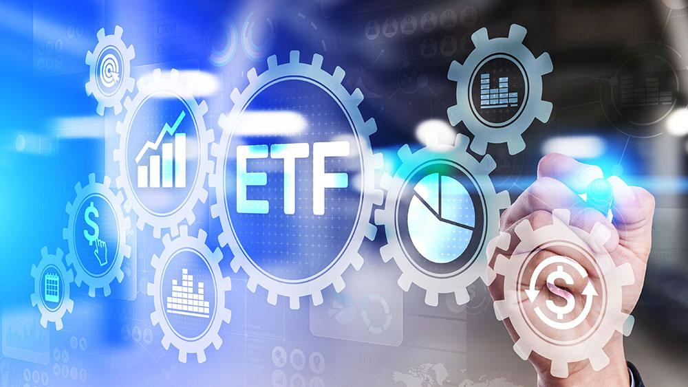

## Table of Contents

## What is an ETF?

An ETF, or Exchange-Traded Fund, is a type of investment that works like a mutual fund but trades on a stock exchange like a stock. It's a basket of securities, like stocks or bonds, that you can buy and sell throughout the day at market prices. This makes it easy for people to invest in a variety of assets without having to buy each one separately.

ETFs are popular because they offer diversification, which means spreading out your investments to reduce risk. Instead of putting all your money into one stock, you can invest in an ETF that holds many different stocks. This can help protect your money if one company doesn't do well. Also, ETFs usually have lower fees than mutual funds, which means you get to keep more of your investment returns.

## What is full replication in the context of ETFs?

Full replication in the context of ETFs means that the ETF tries to own all the same things as the index it is trying to copy. For example, if an ETF is based on the S&P 500 index, it will buy all 500 stocks in that index. This way, the ETF's performance will closely match the performance of the index.

This method is good because it gives a very accurate copy of the index. But, it can be hard to do if the index has a lot of different things in it, or if some of those things are hard to buy. Also, it might cost more to manage an ETF that uses full replication because it needs to keep buying and selling to match the index exactly.

## What is representative sampling in ETFs?

Representative sampling in ETFs means the fund doesn't buy every single thing in the index it's trying to copy. Instead, it picks a smaller group of things that are similar to the whole index. This smaller group is chosen to act like the bigger index, so the ETF can still give you a good idea of how the index is doing without having to buy everything in it.

This method is useful because it can be cheaper and easier to manage than buying everything in the index. If an index has thousands of different stocks or bonds, it might be too hard or too expensive to buy them all. By using representative sampling, the ETF can still track the index pretty well, but with less work and lower costs.

## How does full replication work in ETFs?

Full replication in ETFs means the ETF tries to own all the same things as the index it wants to copy. For example, if an ETF is based on the S&P 500, it will buy all 500 stocks in that index. This way, the ETF's performance will be very close to the performance of the index. It's like trying to match the index exactly by owning everything it has.

This method is good because it gives a very accurate copy of the index. But, it can be hard to do if the index has a lot of different things in it, or if some of those things are hard to buy. Also, it might cost more to manage an ETF that uses full replication because it needs to keep buying and selling to match the index exactly. So, while full replication can give you a very close match to the index, it might also be more expensive and harder to manage.

## How does representative sampling work in ETFs?

Representative sampling in ETFs means the fund doesn't buy every single thing in the index it wants to copy. Instead, it picks a smaller group of things that are similar to the whole index. This smaller group is chosen to act like the bigger index, so the ETF can still give you a good idea of how the index is doing without having to buy everything in it.

This method is useful because it can be cheaper and easier to manage than buying everything in the index. If an index has thousands of different stocks or bonds, it might be too hard or too expensive to buy them all. By using representative sampling, the ETF can still track the index pretty well, but with less work and lower costs.

## What are the advantages of full replication for ETFs?

Full replication in ETFs means the ETF tries to own all the same things as the index it wants to copy. This can be really good because it makes the ETF's performance match the index very closely. If you want your investment to act exactly like the index, full replication is the best way to do that. It's like having a perfect copy of the index in your investment.

But, full replication can be hard to do. If the index has a lot of different things in it, or if some of those things are hard to buy, it can be a lot of work. Also, it might cost more to manage an ETF that uses full replication because it needs to keep buying and selling to match the index exactly. So, while full replication can give you a very close match to the index, it might also be more expensive and harder to manage.

## What are the advantages of representative sampling for ETFs?

Representative sampling in ETFs means the fund picks a smaller group of things that are similar to the whole index. This way, the ETF can still give you a good idea of how the index is doing without having to buy everything in it. It's like choosing a few friends to represent a whole class. If those friends are a good mix, they can show what the whole class is like without needing everyone there.

This method is really useful because it can be cheaper and easier to manage than buying everything in the index. If an index has thousands of different stocks or bonds, it might be too hard or too expensive to buy them all. By using representative sampling, the ETF can still track the index pretty well, but with less work and lower costs. It's like taking a shortcut that still gets you to the same place, but faster and with less effort.

## What are the potential drawbacks of full replication in ETFs?

Full replication in ETFs can be really hard to do. If the index has a lot of different things in it, like thousands of stocks or bonds, it can be a lot of work to buy them all. Some of those things might also be hard to buy, which makes it even trickier. It's like trying to collect every single card in a huge card game set - it takes a lot of time and effort.

Also, full replication can be more expensive. Because the ETF needs to keep buying and selling to match the index exactly, it costs more to manage. These extra costs can add up and might mean you get to keep less of your investment returns. So, while full replication can give you a very close match to the index, it might also be more expensive and harder to manage than other methods.

## What are the potential drawbacks of representative sampling in ETFs?

Representative sampling in ETFs means the fund picks a smaller group of things to act like the whole index. But this can be tricky because if the smaller group isn't a good match, the ETF might not do a good job of copying the index. If the fund picks the wrong things, the ETF's performance might be different from what you expect. It's like trying to guess what a whole class is like by only talking to a few students - if you pick the wrong students, you might get the wrong idea about the class.

Also, even though representative sampling can be cheaper and easier to manage, there's still a chance that the ETF won't track the index as well as one that uses full replication. If the market changes a lot, the smaller group might not be able to keep up with the whole index. This can mean that your investment might not do as well as it could if it had all the things in the index. So, while representative sampling can save time and money, it might not always give you the best match to the index's performance.

## How do the costs compare between full replication and representative sampling ETFs?

Full replication ETFs can be more expensive to manage because they need to buy and sell all the things in the index to match it exactly. This means more trading, which can lead to higher costs. These costs can add up and might mean you keep less of your investment returns. It's like trying to keep a big garden perfectly matching a detailed plan - it takes a lot of work and money to keep everything just right.

Representative sampling ETFs are usually cheaper because they only need to buy a smaller group of things to act like the whole index. This means less trading and lower management costs. It's like taking care of a smaller garden that still looks like the big one but doesn't need as much work. But, if the smaller group isn't chosen well, the ETF might not track the index as closely, which can affect your returns.

## In what scenarios would full replication be more suitable for an ETF?

Full replication is a good choice for an ETF when you really want the ETF to match the index as closely as possible. If you're investing in a well-known index like the S&P 500, and you want your investment to act exactly like that index, full replication is the way to go. It's like having a perfect copy of the index, so you know exactly what you're getting.

But, full replication works best when the index isn't too big or too hard to copy. If the index has a lot of different things in it, or if some of those things are hard to buy, full replication can be a lot of work and might cost more. So, if the index is easy to match and you want a very close copy, full replication is a good choice.

## In what scenarios would representative sampling be more suitable for an ETF?

Representative sampling is a good choice for an ETF when the index it's trying to copy is really big or has a lot of different things in it. If an index has thousands of stocks or bonds, it can be too hard or too expensive to buy them all. By using representative sampling, the ETF can pick a smaller group of things that act like the whole index. This makes it easier and cheaper to manage the ETF, so you can still get a good idea of how the index is doing without having to buy everything in it.

But, representative sampling works best when you're okay with the ETF not matching the index exactly. If the smaller group of things is chosen well, the ETF can still track the index pretty well. But if the market changes a lot, the smaller group might not keep up with the whole index as closely as you'd like. So, if you want to save on costs and don't mind a little less accuracy, representative sampling can be a smart choice for your ETF.

## What is Exploring Representative Sampling?

Representative sampling represents a method of index replication wherein a fund holds a subset of the securities that make up an index. This approach focuses on selecting a fraction of the index's securities based on specified criteria intended to emulate the broader index's performance. It requires careful consideration of factors such as sector distribution, market capitalization, and historical [volatility](/wiki/volatility-trading-strategies) to create a portfolio that closely reflects the index.

The primary advantage of representative sampling is its ability to reduce costs associated with managing an [ETF](/wiki/etf-trading-strategies) or index fund. By holding fewer securities, transaction costs and management expenses can be significantly lower compared to full replication, which mandates holding every security within an index. However, this reduction in cost often comes at the expense of increased turnover and higher management fees.

One of the challenges of representative sampling is the potential for tracking errors. Tracking error measures the divergence between the performance of the sampled portfolio and that of the index it aims to mirror. Since not all securities from the index are included, the sampled portfolio may react differently to market events, which can lead to discrepancies in returns. Tracking error is typically quantified as the standard deviation of the difference between the returns of the fund and the index.

$$
\text{Tracking Error} = \sqrt{\frac{1}{n-1} \sum_{i=1}^{n} (R_{p,i} - R_{i})^2}
$$

Where:
- $R_{p,i}$ is the return of the portfolio at time $i$,
- $R_{i}$ is the return of the index at time $i$,
- $n$ is the number of time periods.

Despite its challenges, representative sampling remains a viable strategy for many funds, particularly when the index in question has a large number of constituents. This method allows investors to balance cost savings against the risk of tracking error, making it an attractive option for those with cost constraints or when full replication proves impractical. Indeed, while the precision of returns might be slightly compromised, the overall reduction in operating costs can enhance net returns, particularly in markets with lower volatility and high [liquidity](/wiki/liquidity-risk-premium), where deviations from the index are less impactful.

In essence, representative sampling is a strategic trade-off between cost and precision in index replication. It necessitates sophisticated portfolio construction and ongoing management to ensure the selected securities maintain alignment with the index’s risk and return profile, while balancing the investor’s cost objectives and risk tolerance.

## What is the impact on algorithmic trading strategies?

In [algorithmic trading](/wiki/algorithmic-trading), the replication method employed by ETFs has a marked influence on a strategy's effectiveness and profitability. Full replication and representative sampling, the two primary techniques, each present unique implications for trading algorithms.

Full replication involves holding all the securities in the index in exact proportions. This method minimizes tracking errors, ensuring that the ETF closely follows its benchmark index. For algorithmic trading, this precision is advantageous as it aligns with index-based strategies that rely on accurately replicating market movements. When an algorithm predicts price changes in the broader market or a specific index, full replication guarantees that these predictions effectively correspond to the ETF's performance. This close adherence enables the simplification of algorithmic models since fewer adjustments are necessary to account for discrepancies between the ETF and its index. For algorithms that operate on high-frequency trading ([HFT](/wiki/high-frequency-trading-strategies)) principles, this precision can be critical, ensuring that trades are executed based on real-time market dynamics.

Conversely, representative sampling involves holding a subset of securities from a specific index. This approach is often used to reduce costs associated with maintaining entire portfolios. However, it tends to introduce tracking errors as the ETF may not perfectly mimic the index's performance. Algorithms working with sampling-based ETFs might need more sophistication to account for these deviations. Complex models must evaluate the significance of tracking errors in real-time trading decisions. For example, the variance in returns between the ETF and its benchmark can be represented mathematically as:

$$
\sigma^2_{\text{tracking}} = \sigma^2_{\text{ETF}} + \sigma^2_{\text{index}} - 2 \cdot \text{Cov}(\text{ETF}, \text{index})
$$

where $\sigma^2_{\text{tracking}}$ is the tracking error variance, $\sigma^2_{\text{ETF}}$ and $\sigma^2_{\text{index}}$ are the variances of the ETF and the index respectively, and $\text{Cov}(\text{ETF}, \text{index})$ represents the covariance. Algorithms must adjust their predictive models to account for this higher variability.

Moreover, representative sampling can lead to increased portfolio turnover, necessitating algorithms to frequently adapt to changes in portfolio composition to maintain optimal trading strategies. The necessity to frequently rebalance positions may lead to elevated transaction costs, which algorithms need to [factor](/wiki/factor-investing) into profitability assessments.

In conclusion, full replication offers simplicity and lower risk for algorithmic models by ensuring closer index alignment, crucial for strategies relying on high correlation with market indices. Representative sampling requires more complex algorithmic interventions to manage increased turnover and higher tracking errors but may be preferred for cost-sensitive strategies. Each replication method's impact on algorithmic trading underscores the need for tailored algorithmic designs specific to the chosen replication methodology.

## References & Further Reading

[1]: ["Exchange-Traded Funds for the Long Run: What They Are, How They Work, and Simple Strategies for Successful Long-Term Investing"](https://www.amazon.com/Exchange-Traded-Funds-Long-Run-Successful/dp/0470138946) by Lawrence Carrel

[2]: Gastineau, G. L. (2010). ["The Exchange-Traded Funds Manual"](https://onlinelibrary.wiley.com/doi/book/10.1002/9781118266946) (2nd ed.). John Wiley & Sons.

[3]: Elton, E. J., Gruber, M. J., Comer, G., & Li, K. (2002). ["Spiders: Where Are the Bugs?"](https://www.jstor.org/stable/10.1086/339891) Journal of Business.

[4]: ["An Evaluation of Alternative Indexing Strategies"](https://papers.ssrn.com/sol3/papers.cfm?abstract_id=2242028) by Daniel W. Wallick, Brian R. Wimmer, and James Balsamo, The Journal of Portfolio Management

[5]: Agapova, A. (2011). ["Conventional mutual index funds versus exchange-traded funds"](https://www.sciencedirect.com/science/article/pii/S138641811000042X) Journal of Financial Markets.

[6]: Gastineau, G. L. (2004). ["The Benchmark Index ETF Performance Problem"](https://www.pm-research.com/content/iijpormgmt/30/2/96) Financial Analysts Journal.

[7]: ["A Comprehensive Guide to Exchange-Traded Funds (ETFs)"](https://www.cfainstitute.org/-/media/documents/support/research-foundation/exchange-traded-funds.ashx) - Investopedia

[8]: Poterba, J. M., & Shoven, J. B. (2002). ["Exchange-Traded Funds: A New Investment Option for Taxable Investors"](https://economics.mit.edu/sites/default/files/publications/Exchange-Traded%20Funds%20A%20New%20Investment%20Option.pdf) National Bureau of Economic Research.