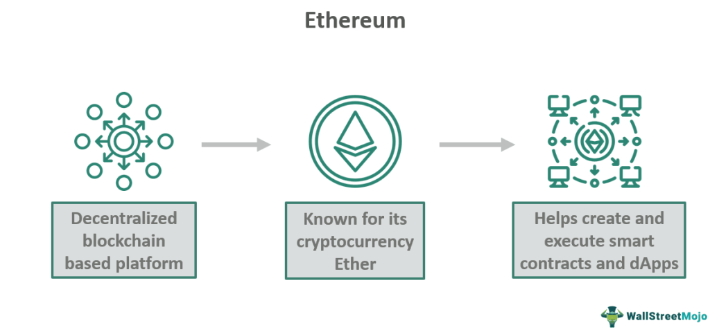

The world of cryptocurrency is vast and continually evolving, with Ethereum standing out as a pivotal platform. Established by Vitalik Buterin and launched in 2015, Ethereum has significantly expanded the landscape of blockchain technology. Unlike Bitcoin, which primarily functions as a digital currency, Ethereum serves as a decentralized platform that enables developers to build and deploy a wide range of blockchain-based applications. Ethereum's native cryptocurrency, Ether (ETH), acts as the lifeblood of this ecosystem, not only serving as a digital currency but also playing a crucial role in powering decentralized applications (DApps) and smart contracts.

Ether is indispensable for executing operations on the Ethereum platform. It is utilized to pay for transaction fees, providing the necessary fuel to drive the network's capabilities. This utility distinguishes Ether from other cryptocurrencies and underscores its unique position within the digital asset arena.



As Ethereum continues to gain prominence, the interest in algorithmic trading with Ether has surged. Algorithmic trading involves using computer programs to execute trades based on predetermined criteria, allowing for faster and more precise trading decisions. In the volatile cryptocurrency market, this can lead to increased efficiency and potentially higher profits.

This article seeks to explore the intricacies of Ethereum and Ether while examining the benefits and challenges associated with algorithmic trading in this rapidly changing domain. As algorithmic trading becomes increasingly sophisticated, it is transforming the approach to cryptocurrency investment, paving the way for innovative strategies and solutions. Join us as we explore how algorithmic trading is shaping the future of cryptocurrency investment!

## Table of Contents

## Understanding Ethereum and Ether

Ethereum is a robust blockchain platform designed to facilitate the creation and operation of decentralized applications (dApps) beyond just digital currency. As a decentralized platform, Ethereum provides a reliable foundation for building applications that operate without any downtime, fraud, control, or interference from third parties ([Ethereum Whitepaper](https://ethereum.org/en/whitepaper/)).

Central to this ecosystem is Ether (ETH), the platform's native digital currency, which plays a crucial role in the Ethereum network. Ether is used primarily as “gas” to fuel smart contracts and decentralized applications by paying for computation and transaction fees on the network. Users must pay Ether to have their transactions processed on the Ethereum blockchain, making it an essential component that drives activity across the Ethereum ecosystem.

### Operation of Ether within Ethereum

Ether operates within this blockchain framework by functioning as both a [cryptocurrency](/wiki/cryptocurrency) and a resource that allows developers to create agreements and applications without relying on traditional legal mechanisms like contracts. This is primarily enabled through smart contracts—self-executing contracts with the terms of the agreement directly written into code. Ethereum's scripting language, Solidity, is used to write these smart contracts, which run on the Ethereum Virtual Machine (EVM).

The execution and completion of smart contracts are recorded on the blockchain. This immutability ensures security and transparency. Ether's role as "gas" is vital here as it ensures that malicious actors cannot run inefficient or defective code indefinitely; since each step of executing a contract costs a small amount of Ether, there is a natural limit imposed on the resource usage ([Buterin, 2014](https://ethereum.org/en/whitepaper/)).

### Ethereum vs. Bitcoin

While Ether and Bitcoin are both cryptocurrencies, several unique characteristics distinguish Ethereum from Bitcoin:

1. **Purpose and Functionality**: Bitcoin was created as an alternative currency or digital gold, primarily enabling peer-to-peer transfers of value. Ethereum, however, was developed as a versatile platform to support decentralized applications and smart contracts in addition to a cryptocurrency.

2. **Smart Contracts**: Ethereum's support for Turing-complete programming languages allows developers to write complex logic and programs executed on the blockchain. In contrast, Bitcoin's scripting language is intentionally limited to ensure simplicity and security, primarily focusing on transactions ([Antonopoulos, 2017](https://www.bitcoinbook.info/)).

3. **Block Time**: Ethereum's block time, approximately 12–15 seconds, is significantly shorter than Bitcoin's 10 minutes. This shorter time enhances the speed and efficiency of transactions and applications running on the network.

4. **Consensus Mechanism**: Initially, both Ethereum and Bitcoin used Proof of Work (PoW) to validate transactions. However, Ethereum is transitioning to Proof of Stake (PoS) with Ethereum 2.0, intending to improve scalability and reduce energy consumption.

### Conclusion

The intrinsic design of Ethereum, focusing on decentralization and automation through smart contracts, highlights its departure from the original cryptocurrency concept introduced by Bitcoin. As such, Ethereum plays a significant role in the evolving landscape of blockchain technology, with Ether being the vital asset facilitating this evolution. Understanding the nuanced differences between these blockchain platforms underscores Ethereum's potential as a foundational technology for future decentralized innovations.

## Exploring Algorithmic Trading

Algorithmic trading leverages computer programs to execute financial transactions at speeds and frequencies that far exceed human capabilities. This approach involves algorithms that process vast amounts of market data, allowing for quick decision-making in the constantly evolving cryptocurrency markets. By relying on predetermined strategies, [algorithmic trading](/wiki/algorithmic-trading) reduces the emotional factors that can influence manual trading decisions, promoting a more disciplined approach.

Increased efficiency is one of the primary benefits of algorithmic trading in the cryptocurrency market. Algorithms can analyze multiple market conditions and execute trades simultaneously across various exchanges. This is particularly advantageous in the cryptocurrency sector, where market dynamics change rapidly. The use of algorithms minimizes human error, as these calculations and commands are executed with precision, adhering to the defined trading strategies without deviation. This also includes the ability to execute trades at optimal prices, dynamically adjusting to market movements.

Different types of algorithms cater to varying trading strategies. Arbitrage algorithms take advantage of price discrepancies of the same asset across different markets. In cryptocurrency trading, where the market operates 24/7 and is highly fragmented, such opportunities are abundant. For instance, if Ether is priced differently on two exchanges, an algorithm could purchase it on the cheaper exchange while simultaneously selling it on the more expensive one, capturing the price margin.

Trend-following algorithms identify and exploit patterns in price movements. By analyzing historical data, these algorithms attempt to predict the future direction of asset prices and open positions accordingly. For example, a trend-following strategy might trigger a buy order when an asset's price moves above its moving average, anticipating a continued upward trend. Python libraries such as pandas and numpy can facilitate the development of such strategies by providing robust data manipulation and analysis tools.

Market-making algorithms focus on providing [liquidity](/wiki/liquidity-risk-premium) to the market by placing both buy and sell orders. These algorithms aim to profit from the spread between the buy and sell prices. By maintaining a consistent presence in the market, market-making strategies help stabilize prices and reduce [volatility](/wiki/volatility-trading-strategies). A market-making algorithm continuously adjusts prices and volumes of orders to remain competitive, ensuring that trades are executed even in less liquid conditions.

```python
# Example of a simple moving average crossover algorithm in Python
import pandas as pd

# Sample data
data = {'Price': [10.0, 10.5, 11.0, 12.0, 11.5, 11.0, 10.8, 11.2]}
df = pd.DataFrame(data)

# Calculate moving averages
df['SMA_short'] = df['Price'].rolling(window=3).mean()
df['SMA_long'] = df['Price'].rolling(window=5).mean()

# Define signals
df['Signal'] = 0  # Default to no action
df.loc[df['SMA_short'] > df['SMA_long'], 'Signal'] = 1  # Buy signal
df.loc[df['SMA_short'] < df['SMA_long'], 'Signal'] = -1  # Sell signal

print(df[['Price', 'SMA_short', 'SMA_long', 'Signal']])
```

The application of algorithmic trading in cryptocurrencies like Ether is reshaping the trading landscape by introducing advanced, systematic, and technology-driven methods that enhance trading effectiveness. As technologies and methodologies continue to evolve, the scope and impact of algorithmic trading are expected to diversify, fostering both opportunity and competition in this dynamic market.

## The Intersection of Ethereum, Ether, and Algo Trading

Ethereum’s dynamic environment offers unparalleled opportunities for algorithmic trading strategies. The platform’s inherent characteristics, such as its programmability and decentralized nature, are catalysts for innovative trading approaches.

Ethereum's smart contracts and decentralized finance (DeFi) protocols significantly influence algorithmic trading tactics. Smart contracts are self-executing contracts with terms written into code, providing automation and transparency. These contracts can streamline trading processes, reduce transaction costs, and eliminate the need for intermediaries. DeFi protocols expand this potential by creating decentralized exchanges (DEXs), lending platforms, and yield farming opportunities, which algorithmic traders can leverage to exploit price discrepancies, [arbitrage](/wiki/arbitrage) opportunities, and liquidity provisions.

For instance, arbitrage trading is particularly effective on Ethereum due to the multitude of token pairs and price variations across DEXs such as Uniswap, SushiSwap, and Balancer. An algorithm can quickly identify and execute trades across these platforms to profit from price differences. Python libraries like `web3.py` facilitate interaction with the Ethereum blockchain, allowing for seamless integration of algorithmic strategies with smart contract functionalities.

However, employing algorithmic trading with Ether on the Ethereum network presents several challenges. Network congestion and high transaction fees, known as gas fees, can erode profits, especially during peak demand periods. The volatility of Ether’s price further complicates algorithmic strategies, requiring robust risk management protocols.

Case studies highlight successful implementations of algorithmic trading strategies on Ethereum. One notable example is arbitrage trading across multiple DEXs. Algorithms identify price discrepancies in real-time and execute trades within seconds, capitalizing on the efficiency of smart contracts. Another example involves market-making strategies on DEXs, where algorithms provide liquidity by placing buy and sell orders around the mid-price, [earning](/wiki/earning-announcement) transaction fees from traders.

Despite the technical challenges, the intersection of Ethereum, Ether, and algorithmic trading remains a fertile ground for innovation. By leveraging Ethereum’s unique capabilities, traders can refine their strategies and explore new possibilities in cryptocurrency trading.

## Benefits and Risks of Algo Trading with Ether

Algorithmic trading, when applied to Ether, offers several compelling benefits that enhance the trading process. One of the primary advantages is improved market analysis. Algorithmic trading systems can analyze large datasets quickly, identifying patterns and trends that might not be visible to human traders. This facilitates more informed decision-making and allows traders to capitalize on market movements with greater precision. Additionally, algorithmic trading can increase trading [volume](/wiki/volume-trading-strategy) by executing large numbers of trades rapidly without human intervention. This high-speed execution reduces the time between decision-making and action, enabling traders to take advantage of fleeting opportunities in the market.

Despite these advantages, algorithmic trading in the Ethereum marketplace is not without its risks. Market volatility is a significant challenge, as the price of Ether can fluctuate dramatically. Sudden market swings can result in substantial gains or losses, and algorithms may not always respond effectively to extreme conditions or unexpected events. Technical failures pose another risk, as algorithms rely heavily on the underlying technology. System outages or glitches can lead to incorrect trades or missed opportunities, which can have financial repercussions.

To mitigate these risks, traders can adopt several strategies to enhance the effectiveness of algorithmic trading. Diversifying trading strategies can provide a buffer against market volatility by spreading risk across different approaches. Implementing robust risk management protocols is essential, such as setting stop-loss orders to limit potential losses. Regularly updating and testing algorithms can help ensure they perform reliably under various market conditions. Moreover, incorporating [machine learning](/wiki/machine-learning) techniques can enable algorithms to adapt to changing market dynamics, improving their ability to handle volatility.

Effective system monitoring and maintenance are crucial in minimizing technical failures. This includes ensuring that all software and hardware components are up-to-date and functioning correctly. Establishing contingency plans, such as backup systems and manual override options, can also prepare traders for unforeseen technical issues.

Overall, algorithmic trading with Ether presents both opportunities and challenges. By carefully considering the benefits and risks and implementing strategies to address potential pitfalls, traders can maximize their chances of success in the dynamic Ethereum marketplace.

## Future Trends in Ether Algorithmic Trading

Emerging trends in the cryptocurrency trading space are poised to significantly influence the future of algorithmic trading with Ether (ETH) on the Ethereum network. As the digital landscape continues to expand, several key developments emerge, including the integration of [artificial intelligence](/wiki/ai-artificial-intelligence) (AI) and machine learning (ML) technologies, alongside evolving regulatory and technological frameworks.

AI and ML are increasingly critical in enhancing algorithmic trading strategies. These technologies enable the analysis of vast datasets at unprecedented speeds, facilitating more accurate predictions of market trends and price movements. By employing machine learning algorithms, traders can develop models that learn from historical data, continually improving their decision-making process. For instance, neural networks can be utilized to identify patterns and correlations in trading data that are invisible to human analysts. Python libraries like TensorFlow and PyTorch are commonly used for crafting such models, offering robust frameworks for implementing AI-powered trading strategies.

```python
import tensorflow as tf

# Example of a simple neural network model in TensorFlow
model = tf.keras.models.Sequential([
    tf.keras.layers.Dense(128, activation='relu', input_shape=(input_shape,)),
    tf.keras.layers.Dense(64, activation='relu'),
    tf.keras.layers.Dense(1)  # Output layer for prediction
])

model.compile(optimizer='adam',
              loss='mean_squared_error',
              metrics=['mae'])

# model.fit(train_data, train_labels, epochs=10)
```

Regulatory changes are also increasingly shaping the future landscape of algorithmic trading. As Ethereum continues to evolve, with its transition from proof of work (PoW) to proof of stake (PoS) consensus mechanisms, regulators around the world are closely monitoring developments to ensure market stability and protect investors. This transition is anticipated to improve energy efficiency and enhance the viability of Ethereum as a platform for trading and innovation. However, it also necessitates rigorous compliance with emerging legal frameworks, which are still catching up with the rapid pace of technological change in the cryptocurrency sector.

Simultaneously, technological advancements, such as the development of scaling solutions like sharding and layer-2 protocols, promise to increase Ethereum's transaction throughput and reduce latency. These improvements are critical for the efficiency of algorithmic trading, allowing for faster execution and settlement of trades. The enhanced capabilities of Ethereum could lead to increased adoption of Ether in algorithmic trading systems, offering greater liquidity and reduced transaction costs.

The convergence of these trends—AI and ML integration, regulatory evolution, and technological enhancement—suggests a dynamic future for algorithmic trading with Ether. Stakeholders in this space must remain agile, adapting to technological innovations and responding proactively to regulatory developments, while exploiting the analytical power of machine learning to maintain a competitive edge in the market. As the Ethereum ecosystem continues to mature, the potential for algorithmic trading to transform cryptocurrency investment is vast, promising increased efficiency, accuracy, and profitability for traders.

## Conclusion

Ethereum and its native currency, Ether, stand as central figures in the cryptocurrency ecosystem, driving the development of decentralized applications and smart contracts. Throughout this exploration, we've seen how the distinct characteristics of Ethereum position it uniquely compared to other cryptocurrencies. Algorithmic trading further accentuates this uniqueness by providing a systematic approach to trading Ether, enhancing efficiency, and reducing human error.

Algorithmic trading, with its capacity for high-speed execution and data-driven decisions, holds transformative potential within the cryptocurrency ecosystem. This technique is particularly beneficial in navigating the dynamic environment of Ethereum's blockchain, offering solutions for market volatility and fostering innovations in trading strategies. By utilizing algorithms to analyze patterns and trends, traders can optimize their interactions with Ether and leverage opportunities beyond human capability.

The intersection of technology and finance is ever-evolving, and continued exploration in algorithmic trading is crucial. Ethereum's flexible and scalable platform invites further innovation, creating a fertile ground for new trading algorithms and strategies. This continual development highlights the growing collaboration between technological advancements, such as artificial intelligence and blockchain technology, and financial strategies, pushing the boundaries of what's possible.

Staying informed about ongoing developments in this rapidly changing field is essential. As regulatory landscapes shift and technological advancements continue to emerge, keeping abreast with these changes ensures preparedness for the future. Encouraging innovation within algorithmic trading on Ethereum promotes not only growth within the cryptocurrency sector but also enhances overall market resilience.

In conclusion, the fusion of Ethereum, Ether, and algorithmic trading signifies an exciting frontier in finance's future. This convergence of technology and trading strategies offers vast potential for growth, innovation, and transformation within the cryptocurrency market. As Ethereum and algorithmic trading evolve hand in hand, they promise to reshape the financial landscape, offering new opportunities and challenges for traders and investors alike.

## References & Further Reading

[1]: Antonopoulos, A. M. (2017). ["Mastering Bitcoin: Unlocking Digital Cryptocurrencies"](https://books.google.com/books/about/Mastering_Bitcoin.html?id=IXmrBQAAQBAJ). O'Reilly Media.

[2]: Buterin, V. (2014). ["Ethereum Whitepaper"](https://ethereum.org/en/whitepaper/).

[3]: Narang, R. K. (2009). ["Inside the Black Box: The Simple Truth About Quantitative Trading"](https://onlinelibrary.wiley.com/doi/book/10.1002/9781118267738) Wiley Finance.

[4]: Dune Analytics. ["Ethereum Operational Infrastructure"](https://dune.com/home).

[5]: Pettersen, G. (2021). ["Algorithmic Trading with Python: A User Guide"](https://www.interactivebrokers.com/campus/ibkr-quant-news/machine-learning-for-algorithmic-trading-in-python-a-complete-guide-part-i/) Packt Publishing.

[6]: Gandal, N., & Halaburda, H. (2014). ["Competition in the Cryptocurrency Market"](https://papers.ssrn.com/sol3/papers.cfm?abstract_id=2506463). 

[7]: Mougayar, W. (2016). ["The Business Blockchain: Promise, Practice, and Application of the Next Internet Technology"](https://books.google.com/books/about/The_Business_Blockchain.html?id=CEsPDAAAQBAJ) Wiley.