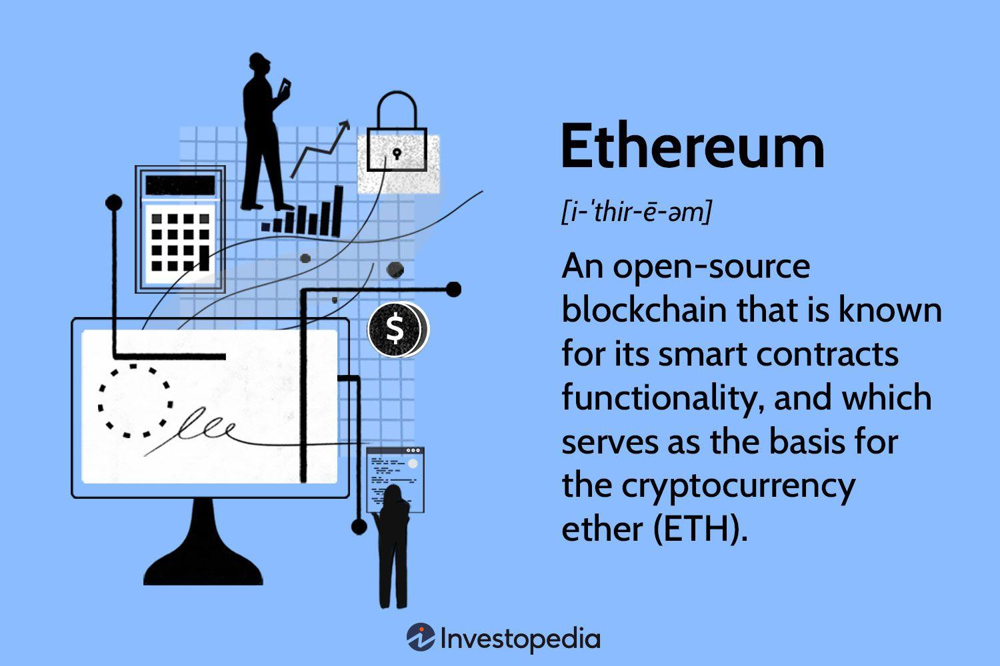

## Table of Contents

## What is Ether (ETH) and its role in the Ethereum ecosystem?

Ether (ETH) is the cryptocurrency used on the Ethereum network. It's like the money you use to pay for things, but on the internet. People use ETH to pay for services and to reward the people who help run the Ethereum network. Just like you need dollars to buy things in a store, you need ETH to use the Ethereum network.

ETH plays a big role in the Ethereum ecosystem. It's not just money; it's also used to run smart contracts, which are like automatic agreements that work by themselves on the internet. When you want to use these smart contracts, you pay with ETH. This makes the Ethereum network work smoothly and helps people trust that the agreements will happen as planned.

## How is Ether different from other cryptocurrencies like Bitcoin?

Ether (ETH) and Bitcoin (BTC) are both cryptocurrencies, but they work in different ways and have different goals. Bitcoin is mainly used as a digital version of money that you can send to anyone anywhere without a bank. It's like digital cash that people use to buy things or keep as a store of value. Bitcoin's main focus is being a secure and decentralized way to handle money, and it does this by using a technology called blockchain to keep track of all transactions.

On the other hand, Ether is not just money; it's also the fuel that powers the Ethereum network. Ethereum is like a big computer that runs on the internet, and it lets people create and use smart contracts, which are like automatic agreements that do things on their own. You need Ether to pay for using this computer and to run these smart contracts. So, while Bitcoin is focused on being a digital currency, Ether is more about making the Ethereum network work and letting people build all sorts of applications on it.

In simple terms, if Bitcoin is like digital cash you can use to buy things, Ether is more like the gas you need to make a car (the Ethereum network) run. Both are important and useful, but they serve different purposes in the world of cryptocurrencies.

## What are the basic uses of Ether within Ethereum applications?

Ether is used in many ways within Ethereum applications. One main use is to pay for transactions on the Ethereum network. When you want to send Ether to someone else or use a smart contract, you need to pay a small fee in Ether. This fee is called "gas," and it helps keep the network running smoothly by rewarding the people who process the transactions.

Another use of Ether is to run smart contracts. Smart contracts are like automatic agreements that do things on their own when certain conditions are met. For example, a smart contract could automatically send money to someone when they finish a job. To make these smart contracts work, you need to pay with Ether. This makes sure that the network has enough resources to run the contracts and that people can trust them to work as planned.

Overall, Ether is important for making the Ethereum network work. It's used to pay for transactions and to run smart contracts, which are key parts of many Ethereum applications. Without Ether, the network wouldn't be able to do all the cool things it does, like letting people create and use decentralized apps.

## How can someone acquire Ether, and what are the common methods of purchase?

You can get Ether by buying it from a [cryptocurrency](/wiki/cryptocurrency) exchange. These are like online shops where you can trade your regular money, like dollars or euros, for cryptocurrencies like Ether. To do this, you need to sign up for an account on an exchange, put some money into it, and then use that money to buy Ether. Some popular exchanges where you can do this are Coinbase, Binance, and Kraken. Just make sure to pick a trustworthy exchange and keep your account safe.

Another way to get Ether is by [earning](/wiki/earning-announcement) it. This can be done through a process called mining, but it's a bit complicated and needs special computer equipment. A simpler way is to get paid in Ether for doing work or selling things. Some people offer services or products and ask to be paid in Ether. Also, you can take part in something called airdrops, where new projects give away free Ether or other tokens to people who sign up or do certain tasks.

Lastly, you can also get Ether as a gift or through trading with other people. Sometimes friends or family might give you Ether as a present. Or you might trade things you have, like other cryptocurrencies or goods and services, directly with someone who has Ether. Just remember to be careful and use safe methods when trading or receiving Ether from others.

## What are the transaction fees associated with using Ether, and how are they calculated?

When you use Ether to do things on the Ethereum network, like sending it to someone or using a smart contract, you have to pay a small fee. This fee is called "gas," and it's measured in units called "gwei." The amount of gas you need depends on how complex the thing you're doing is. For example, sending Ether to someone is simple and doesn't need much gas, but using a smart contract that does a lot of stuff can need more gas.

The total fee you pay is figured out by multiplying the amount of gas needed by the gas price you choose. The gas price is how much you're willing to pay for each unit of gas, and you can set it yourself. If you choose a higher gas price, your transaction will probably happen faster because miners, who process transactions, will want to work on it first. But if you choose a lower gas price, it might take longer, but you'll pay less. So, you can decide how quickly you want your transaction to happen by choosing the right gas price.

## How does the Ethereum network use Ether to incentivize miners?

The Ethereum network uses Ether to reward miners for the work they do. Miners are special people who use powerful computers to help keep the Ethereum network running. They check and process transactions, making sure they are correct and adding them to the blockchain, which is like a big, shared record book. To thank them for this hard work, the network gives them Ether. This is a big reason why miners want to keep the network running smoothly and securely.

The amount of Ether miners get depends on how much work they do. When a miner successfully adds a new block of transactions to the blockchain, they get a certain amount of Ether as a reward. This reward is set by the network and can change over time. Also, miners can earn extra Ether from the transaction fees that people pay when they use the network. These fees, called gas, are paid in Ether and go to the miners who process the transactions. So, the more transactions miners process, the more Ether they can earn.

## What are smart contracts and how does Ether facilitate their execution?

Smart contracts are like automatic agreements that live on the Ethereum network. They're special pieces of code that do things on their own when certain conditions are met. For example, a smart contract could automatically send money to someone when they finish a job, or it could unlock a digital door when you pay a certain amount of Ether. These contracts are stored on the blockchain, which means they're safe and everyone can see them, but nobody can change them without everyone agreeing.

Ether is really important for making smart contracts work. When you want to use a smart contract, you need to pay a small fee in Ether, called "gas." This gas is like the fuel that makes the smart contract run. The more complicated the contract is, the more gas it needs. By paying with Ether, you make sure the Ethereum network has enough resources to run the contract and that it will work as planned. This way, Ether helps keep the whole system running smoothly and makes sure people can trust the smart contracts to do what they're supposed to do.

## Can you explain the concept of gas and its relationship with Ether?

Gas is like the fuel you need to do things on the Ethereum network. When you want to send Ether to someone or use a smart contract, you have to pay a small fee, and that fee is called gas. Gas is measured in units called "gwei," and the amount of gas you need depends on how complex the thing you're doing is. For example, sending Ether to someone is simple and doesn't need much gas, but using a smart contract that does a lot of stuff can need more gas.

The total fee you pay is figured out by multiplying the amount of gas needed by the gas price you choose. The gas price is how much you're willing to pay for each unit of gas, and you can set it yourself. If you choose a higher gas price, your transaction will probably happen faster because miners, who process transactions, will want to work on it first. But if you choose a lower gas price, it might take longer, but you'll pay less. So, you can decide how quickly you want your transaction to happen by choosing the right gas price. Ether is the currency you use to pay for this gas, making it essential for all actions on the Ethereum network.

## What are some advanced Ethereum applications that rely heavily on Ether?

One advanced Ethereum application that relies heavily on Ether is decentralized finance, or DeFi. DeFi is like a big online bank that works without a central authority. People use Ether to do things like lend, borrow, and trade money on these DeFi platforms. For example, you might use Ether to lend money to someone and earn interest, or you might use it to borrow money by putting up Ether as collateral. All these actions need gas, which is paid in Ether, so Ether is really important for making DeFi work.

Another advanced application is non-fungible tokens, or NFTs. NFTs are like unique digital items that you can own and trade, such as art, music, or even virtual land. When you create, buy, or sell an NFT, you need to pay gas fees in Ether. This means that Ether is crucial for the whole NFT market to function. Without Ether, people wouldn't be able to do things like mint new NFTs or transfer them to someone else, which are key parts of the NFT ecosystem.

## How does the Ethereum 2.0 upgrade affect Ether and its functionality?

Ethereum 2.0, also known as Eth2, is a big update to the Ethereum network that aims to make it faster, more secure, and better at handling lots of transactions at once. One of the main changes in Ethereum 2.0 is switching from a system called "proof of work" to a new system called "proof of stake." In the old system, miners used powerful computers to process transactions and were rewarded with Ether. In the new system, instead of mining, people can become "validators" by locking up some of their Ether as a kind of security deposit. If they do a good job validating transactions, they get rewarded with more Ether. This change makes the network more energy-efficient and helps it handle more transactions without slowing down.

Another important part of Ethereum 2.0 is the introduction of "sharding," which is like splitting the network into smaller pieces that can work on different parts of the blockchain at the same time. This means more transactions can happen at once, making the whole network faster and more efficient. Ether plays a key role in all these changes because it's used to pay for transactions and to reward validators. So, even though Ethereum 2.0 changes how the network works, Ether remains important for making everything run smoothly and for keeping the network secure and decentralized.

## What are the security measures in place to protect Ether transactions and holdings?

The Ethereum network has many ways to keep your Ether safe. One big way is using something called the blockchain. The blockchain is like a big, shared record book that everyone on the network can see, but nobody can change it without everyone agreeing. This makes it really hard for someone to cheat or steal your Ether. Also, when you send Ether to someone, you use a special code called a private key. This private key is like a secret password that only you know, and you need it to move your Ether. So, as long as you keep your private key safe, nobody else can use your Ether.

Another important way to protect your Ether is by using secure wallets. There are different types of wallets, like software wallets on your computer or phone, and hardware wallets that are like special USB drives. Hardware wallets are really safe because they keep your private key offline, which means it's harder for hackers to steal it. It's also a good idea to use strong passwords and turn on two-[factor](/wiki/factor-investing) authentication (2FA) on your wallet and exchange accounts. This adds an extra layer of security, making it even harder for someone to get into your account without your permission.

## What future developments are anticipated for Ether and the Ethereum network?

The Ethereum network is always working on getting better, and one big thing coming up is Ethereum 2.0. This update will make the network faster and able to handle more transactions at once. Instead of using a lot of energy to mine Ether, the network will use a new way called "proof of stake." This means people can help run the network by locking up some of their Ether, and they'll get more Ether as a reward. This change will make the network more energy-friendly and easier to use for everyone.

Another future development is making it easier for regular people to use Ethereum. Right now, it can be a bit hard to understand and use, but the team behind Ethereum is working on making it more user-friendly. They want to create better tools and apps that let people do things like buy things, save money, or even play games using Ether without needing to know all the complicated stuff. This will help more people use Ether and make the whole Ethereum network more popular and useful.

## References & Further Reading

[1]: Antonopoulos, A. M. (2017). ["Mastering Bitcoin: Unlocking Digital Cryptocurrencies"](https://books.google.com/books/about/Mastering_Bitcoin.html?id=IXmrBQAAQBAJ). O'Reilly Media.

[2]: Buterin, V. (2014). ["Ethereum Whitepaper"](https://ethereum.org/en/whitepaper/).

[3]: Narang, R. K. (2009). ["Inside the Black Box: The Simple Truth About Quantitative Trading"](https://onlinelibrary.wiley.com/doi/book/10.1002/9781118267738) Wiley Finance.

[4]: Dune Analytics. ["Ethereum Operational Infrastructure"](https://dune.com/home).

[5]: Pettersen, G. (2021). ["Algorithmic Trading with Python: A User Guide"](https://www.interactivebrokers.com/campus/ibkr-quant-news/machine-learning-for-algorithmic-trading-in-python-a-complete-guide-part-i/) Packt Publishing.

[6]: Gandal, N., & Halaburda, H. (2014). ["Competition in the Cryptocurrency Market"](https://papers.ssrn.com/sol3/papers.cfm?abstract_id=2506463). 

[7]: Mougayar, W. (2016). ["The Business Blockchain: Promise, Practice, and Application of the Next Internet Technology"](https://books.google.com/books/about/The_Business_Blockchain.html?id=CEsPDAAAQBAJ) Wiley.