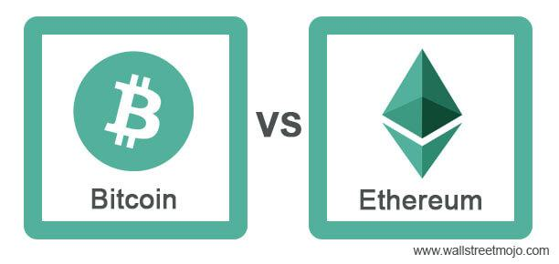

Cryptocurrency trading involves the exchange of digital currencies on various trading platforms. It has gained immense popularity due to the high volatility and potential for substantial returns in this nascent market. The cryptocurrency market operates 24/7, which appeals to individual traders and institutional investors seeking diversification and hedge opportunities. 

Among cryptocurrencies, Ether and Bitcoin are significant players. Bitcoin, the first cryptocurrency, paved the way for the creation and adoption of various digital currencies, while Ethereum, a decentralized platform, enables the development of smart contracts and decentralized applications (dApps) with Ether as its native currency. Ether is crucial for executing transactions within the Ethereum network, acting as fuel for dApps and applications. Together, Ether and Bitcoin comprise a considerable share of the cryptocurrency market capitalization and serve as benchmarks for overall market sentiment.



Algorithmic trading, a method of executing orders using automated pre-programmed trading instructions, is increasingly applied in the cryptocurrency market. This approach offers advantages such as increased efficiency, speed, reduced human error, and the ability to execute complex strategies that would be difficult to perform manually. Algorithmic trading leverages mathematical models and historical data to optimize trading strategies, and its adoption is growing within the crypto market, attracting both novice and experienced traders.

The purpose of this article is to explore the intersection of Ether, Ethereum, Bitcoin, and algorithmic trading. By examining the roles of Ether and Bitcoin in the broader cryptocurrency ecosystem and the impact of algorithmic trading on market dynamics, this article aims to provide insights into the opportunities and challenges faced by traders in this domain.

## Table of Contents

## Understanding Ethereum and Ether

Ethereum is a decentralized blockchain platform designed to support the creation and deployment of smart contracts and decentralized applications (dApps). Unlike traditional blockchain networks that primarily function as simple ledgers for cryptocurrencies, Ethereum offers a more flexible framework that enables developers to build complex applications without needing a central authority. This innovation has positioned Ethereum as a foundational pillar for decentralized finance (DeFi), NFTs, and many other emerging blockchain technologies.

Ether (ETH) serves as the native cryptocurrency of the Ethereum platform. While it shares certain traits with other cryptocurrencies, such as acting as a store of value and a medium of exchange, its primary function is to operate as the "fuel" for the network. Ether is required to execute transactions and operations on the Ethereum blockchain, commonly referred to as "gas." Each transaction or smart contract execution involves a computational cost, quantified in gas units. Ether is used to pay for this gas, thereby incentivizing miners (or validators, in the context of Ethereum 2.0) to process and validate transactions.

Smart contracts on the Ethereum blockchain are self-executing contracts with the terms of the agreement directly written into code. These contracts run automatically when predetermined conditions are met and are integral to the functionality of decentralized applications. The ability to automate and enforce terms without intermediaries enhances security and reduces costs. dApps built on Ethereum leverage smart contracts to provide various services, such as financial transactions, supply chain management, and digital identity verification.

Ether's importance in the Ethereum ecosystem extends beyond facilitating transactions. It also acts as a means for network participants to signal activity and stake in the system, particularly with Ethereum's transition to a proof-of-stake (PoS) consensus mechanism. As miners have evolved into validators, they are required to "stake" Ether to participate in the network's consensus process, ensuring its security and reliability. This shift to PoS is expected to significantly enhance Ethereum's scalability and energy efficiency, further solidifying Ether's essential role in the network's operation.

In summary, Ethereum distinguishes itself as a robust blockchain platform designed to support smart contracts and dApps. At the same time, Ether plays a multifaceted role by facilitating transactions, rewarding validators, and underpinning the network's overall economic and operational model.

## Bitcoin: The Pioneer of Cryptocurrencies

Bitcoin, introduced in 2008 by an anonymous individual or group known as Satoshi Nakamoto, is widely recognized as the first [cryptocurrency](/wiki/cryptocurrency), fundamentally transforming the financial landscape. As detailed in the Bitcoin whitepaper titled "Bitcoin: A Peer-to-Peer Electronic Cash System," Bitcoin was conceived as a decentralized digital currency that facilitates peer-to-peer transactions without the need for intermediaries like banks or financial institutions.

The inception of Bitcoin marked the advent of blockchain technology, providing a transparent and secure method of recording transactions on a decentralized ledger. This innovation addressed critical issues in digital transactions, such as double-spending and trustworthiness in currency exchanges. Bitcoin's public ledger is maintained by a network of nodes, leveraging a consensus mechanism known as Proof of Work (PoW). Participants, termed miners, solve complex mathematical problems to validate transactions and are rewarded with newly minted bitcoins, ensuring the system's integrity and incentivizing continual participation.

Bitcoin's significance extends beyond its technological framework; it reshaped perceptions about digital currencies, offering an alternative to traditional fiat currencies and enabling financial inclusion for unbanked populations globally. Its deflationary nature, with a capped supply of 21 million coins, positioned Bitcoin as "digital gold," attracting investors seeking a store of value resistant to inflationary pressures.

Bitcoin's pioneering role catalyzed the emergence of thousands of alternative cryptocurrencies, each leveraging and expanding upon the foundational blockchain principles. Ethereum, introduced by Vitalik Buterin in 2015, represents one such advancement. While Bitcoin is primarily a store of value and a transaction medium, Ethereum was designed to facilitate decentralized applications (dApps) and smart contracts, significantly broadening the use cases for blockchain technology. 

The success and widespread adoption of Bitcoin underscored the viability of digital currencies, propelling interest and innovation within the fintech sector. This interest laid the groundwork for a vibrant cryptocurrency ecosystem, with Bitcoin inspiring new projects and technologies that continue to evolve the digital currency landscape.

## Algorithmic Trading: An Overview

Algorithmic trading, often referred to as algo trading, involves using computer algorithms to execute financial market trades at speeds and frequencies that surpass human capability. These algorithms might be based on a range of variables including price, timing, and [volume](/wiki/volume-trading-strategy), enabling traders to make data-driven decisions rapidly and efficiently. Historically, [algorithmic trading](/wiki/algorithmic-trading) has been popularized in traditional financial markets, such as equities and [forex](/wiki/forex-system), due to its potential to maximize trading profits and mitigate human error.

A key advantage of algorithmic trading is efficiency. Algorithms can process vast amounts of data and execute trades within fractions of a second, ensuring that opportunities are seized at the optimal moment. This high-speed trading reduces the latency between identifying an opportunity and executing a trade, hence minimizing the risk associated with price fluctuations. Moreover, algorithms can operate without the influence of human emotions, thus adhering strictly to predefined strategies.

Another significant advantage is the ability to backtest trading strategies using historical market data. By simulating trades using past data, traders can gauge the potential performance of their strategies under various market conditions, thereby refining their approach before deploying it in live markets. Additionally, algorithmic trading offers scalability, allowing traders to manage multiple strategies and assets simultaneously—a task that would be nearly impossible manually.

The adoption of algorithmic trading in the cryptocurrency market has been growing steadily. Cryptocurrencies like Bitcoin and Ether exhibit high [volatility](/wiki/volatility-trading-strategies), offering abundant opportunities for high-frequency trading strategies to be profitable. Algorithms play a crucial role in this market by enabling traders to conduct [arbitrage](/wiki/arbitrage) across different exchanges, implement trend-following strategies, and manage portfolio risks effectively. 

In recent years, the proliferation of cryptocurrency exchanges and the 24/7 nature of crypto markets have further accelerated the adoption of algorithmic trading. Traders are not limited by market hours, and with continuous market operations, algorithms can capitalize on price discrepancies at any time, increasing the potential for profitable trades. As the cryptocurrency market continues to mature, the use of algorithmic trading is anticipated to expand, driven by technological advancements and increasing trader interest.

## Algorithmic Trading with Ether and Bitcoin

Algorithmic trading, often referred to as algo trading, utilizes computer programs or systems to execute a defined set of instructions for placing trades in order to generate profits at a speed and frequency that is impossible for a human trader. When applied to cryptocurrencies like Ether (ETH) and Bitcoin (BTC), algorithmic trading can leverage market data to execute trades based on predetermined criteria.

### Application to Ether and Bitcoin

Algorithmic trading strategies developed for traditional financial markets can be adapted for use with cryptocurrencies. These strategies are typically based on technical analysis, statistical models, and [machine learning](/wiki/machine-learning) algorithms. Given the volatile nature of the crypto market, algo trading can help manage risk and optimize trading efficiency.

### Popular Algorithmic Trading Strategies

1. **Trend Following:**
   This strategy involves the identification of upward or downward market trends. Indicators such as moving averages, channel breakouts, and related mathematical indicators are used to forecast trends. For example, a simple moving average (SMA) crossover strategy might be employed, where a buy signal is generated when a short-term SMA crosses above a long-term SMA.

   ```python
   # Example of SMA crossover strategy in Python
   short_window = 40
   long_window = 100

   signals = pd.DataFrame(index=bitcoin_data.index)
   signals['signal'] = 0.0
   signals['short_mavg'] = bitcoin_data['Close'].rolling(window=short_window, min_periods=1).mean()
   signals['long_mavg'] = bitcoin_data['Close'].rolling(window=long_window, min_periods=1).mean()
   signals['signal'][short_window:] = np.where(signals['short_mavg'][short_window:] > signals['long_mavg'][short_window:], 1.0, 0.0)
   signals['positions'] = signals['signal'].diff()
   ```

2. **Arbitrage:**
   Arbitrage strategies exploit price discrepancies of identical or similar financial instruments on different markets or in different forms. For Ether and Bitcoin, arbitrage opportunities often arise due to the varying exchange rates across different crypto exchanges globally. A classic arbitrage strategy involves buying the cryptocurrency on a lower-priced exchange and selling it on a higher-priced one.

### Benefits and Challenges

**Benefits:**
- **Speed and Accuracy:** Algorithms can execute trades at speeds far beyond human capability, enabling rapid response to market events.
- **Emotionless Trading:** Algorithmic strategies are not influenced by human emotions, potentially minimizing unsystematic behavior and biases.
- **Backtesting Capability:** Strategies can be tested against historical data to ascertain their viability before they are implemented live.

**Challenges:**
- **Market Volatility:** The high volatility and price fluctuations in the crypto markets can pose risks, as algorithms need constant refinement to adapt to market changes.
- **Technical Glitches:** As these strategies rely on technology and infrastructure, any malfunction can result in significant trading losses. Network outages or server failures need contingency plans.
- **Liquidity:** Trading large volumes can sometimes impact the market, particularly in crypto exchanges with lower liquidity, thus eroding potential profits.

Algorithmic trading for Ether and Bitcoin presents both opportunities and hurdles. By implementing sophisticated algorithmic strategies, traders can potentially improve their market performance, but must also carefully manage the associated risks.

## Tools and Platforms for Crypto Algo Trading

Numerous algorithmic trading platforms and tools have emerged in the cryptocurrency market, catering to both beginner and advanced traders looking to trade major cryptocurrencies like Ether and Bitcoin. These platforms offer varying features and capabilities, allowing users to execute trades with increased precision and automation.

One widely used platform is **Coinigy**, which aggregates data from numerous cryptocurrency exchanges. It provides an API that allows algorithmic traders to execute strategies across different markets. Its user interface is intuitive, which makes it suitable for beginners, while the advanced functionality satisfies seasoned traders.

**3Commas** is another platform known for its automation capabilities, offering features like automated trading bots, smart trading terminals, and a wide array of tools for risk management. The platform supports both Ether and Bitcoin, making it versatile for traders focused on these assets.

For traders seeking advanced mathematical models, **QuantConnect** provides an open-source algorithmic trading engine suitable for [backtesting](/wiki/backtesting) and deploying strategies. It uses the Lean Algorithm Framework, which supports equities, futures, forex, and cryptocurrencies. Traders fluent in Python can write scripts to handle trades, as demonstrated in this example for a simple moving average strategy:

```python
class MovingAverageAlgorithm(QCAlgorithm):
    def Initialize(self):
        self.SetStartDate(2020, 1, 1)    
        self.SetCash(10000)               
        self.SetBrokerageModel(BrokerageName.GDAX, AccountType.Cash)
        self.AddCrypto("BTCUSD", Resolution.Daily)
        self.fastMA = self.EMA("BTCUSD", 10, Resolution.Daily)
        self.slowMA = self.EMA("BTCUSD", 50, Resolution.Daily)

    def OnData(self, data):
        if not self.fastMA.IsReady or not self.slowMA.IsReady:
            return

        if self.fastMA.Current.Value > self.slowMA.Current.Value:
            self.SetHoldings("BTCUSD", 1.0)
        elif self.fastMA.Current.Value < self.slowMA.Current.Value:
            self.Liquidate("BTCUSD")
```

**AlgoTrader** is a robust platform offering comprehensive services for trading digital assets. It features a strategy design and backtesting environment, and seamless integration with various cryptocurrency exchanges. It supports both Bitcoin and Ether trading, making it suitable for advanced users seeking a thorough trading solution.

For beginners, **Kryll** is an advantageous platform, as it requires no coding expertise. Users can create trading strategies through a drag-and-drop interface and access numerous pre-made strategies in the market.

When selecting a platform, beginners should consider ease of use, educational resources, and community support. **Shrimpy** is another platform that provides an easy entry point with social trading features, allowing users to mimic successful traders.

Advanced traders might prioritize platforms like QuantConnect or AlgoTrader, focusing on support for multi-asset trading, advanced analytics, and backtesting capabilities. The choice of platform depends heavily on the individual trader's goals, technical skill, and desired assets.

## Risks and Rewards of Crypto Algorithmic Trading

Algorithmic trading within the cryptocurrency markets offers a dynamic landscape marked by both potential risks and significant rewards. Understanding these elements is crucial for any trader looking to engage with Ether, Bitcoin, or other cryptocurrencies through algorithmic strategies.

### Potential Risks

One of the primary risks associated with algorithmic trading in cryptocurrency is market volatility. Cryptocurrencies are notorious for their price fluctuations, which can be attributed to various factors such as regulatory news, technological advancements, or changes in market sentiment. This volatility can lead to substantial losses if not properly managed. 

Furthermore, technical glitches pose another significant risk. These can arise from errors in the algorithm code or failures in the trading infrastructure. For example, an algorithm might execute trades based on outdated data due to a lag in the price feed, potentially resulting in significant financial losses.

### Reward Potential

Despite these risks, the rewards of algorithmic trading are compelling. Algorithms provide increased trading accuracy by executing trades based on pre-defined criteria, minimizing human error. They also enable faster execution speeds, allowing traders to capitalize on fleeting market opportunities that would be impossible to seize through manual trading.

For instance, algorithms can analyze multiple markets simultaneously and execute trades within milliseconds, which is critical in high-frequency trading strategies where speed is vital. This efficiency not only enhances potential profitability but also allows for the exploration of complex trading strategies like arbitrage or [market making](/wiki/market-making), which require the rapid processing of large datasets.

### Risk Management Strategies

To manage these risks effectively, traders should employ stringent strategy testing and robust risk management protocols. It is essential to backtest algorithms using historical data to understand how they perform under different market conditions. Python's libraries such as `pandas` for data manipulation and `[backtrader](/wiki/backtrader)` for backtesting are popular tools for this process.

Here is a simple example of backtesting a moving average crossover strategy in Python:

```python
import backtrader as bt

class SMA_Crossover(bt.SignalStrategy):
    def __init__(self):
        sma1, sma2 = bt.ind.SMA(period=10), bt.ind.SMA(period=30)
        self.signal_add(bt.SIGNAL_LONG, bt.ind.CrossOver(sma1, sma2))

# Initialize the cerebro engine
cerebro = bt.Cerebro()
cerebro.addstrategy(SMA_Crossover)

# Fetch data and add it to cerebro
data = bt.feeds.YahooFinanceData(dataname='BTC-USD', fromdate=datetime(2022, 1, 1), todate=datetime(2023, 1, 1))
cerebro.adddata(data)

# Run backtesting
cerebro.run()
```

Additionally, implementing stop-loss orders and regularly updating the algorithm to adapt to changing market conditions are valuable practices. Ensuring the reliability of the technical infrastructure by using redundant systems can help mitigate risks associated with technology failures.

In conclusion, while algorithmic trading in cryptocurrency markets is associated with certain risks, the potential rewards make it an appealing venture. With proper risk management and strategy adaptability, traders can effectively navigate the complexities of crypto markets, leveraging algorithmic trading to achieve enhanced performance.

## Future Trends in Crypto Algorithmic Trading

Cryptocurrency algorithmic trading continues to evolve, driven by technological advances, particularly in [artificial intelligence](/wiki/ai-artificial-intelligence) (AI) and machine learning (ML). These technologies are reshaping trading strategies, making them more adaptive and sophisticated. AI and ML algorithms can process vast amounts of data in real-time, identifying patterns and insights that are imperceptible to human traders. This capability enhances predictive accuracy and allows for more responsive trading strategies, primarily through automated decision-making based on historical data and market signals.

Machine learning models, such as neural networks and decision trees, have become instrumental in developing trading algorithms that can adapt to changing market conditions. These models are used to optimize strategies based on risk management, sentiment analysis, and price forecast. For instance, predictive analytics powered by ML can improve trend-following strategies by forecasting price movements more accurately. Moreover, AI can be employed in anomaly detection, identifying unusual trading activity that might indicate potential market disruptions or opportunities for arbitrage.

Algorithmic traders are increasingly integrating [reinforcement learning](/wiki/reinforcement-learning), a type of ML where algorithms learn to make decisions by receiving feedback from the environment, into their strategies. This approach allows trading algorithms to learn from past trades and improve their performance over time, balancing exploration and exploitation to maximize returns.

Regulatory developments are also significantly affecting algorithmic trading practices in cryptocurrencies. As the market matures, regulatory bodies worldwide are focusing on establishing frameworks to ensure fair and transparent trading practices, mitigate systemic risks, and protect investors. These regulations can shape the development and deployment of algorithmic trading systems, imposing requirements for risk management protocols, algorithm testing, and audit trails.

In the European Union, for example, the Markets in Financial Instruments Directive II (MiFID II) requires governance and testing of trading algorithms, mandating measures to ensure they operate as intended and do not contribute to market volatility or other unintended consequences. Similarly, the United States Commodity Futures Trading Commission (CFTC) has been proactive in proposing rules around automated trading systems to enhance market integrity.

As regulatory environments evolve, they are expected to encourage greater scrutiny and transparency in algorithmic trading operations. This evolution could drive more standardized practices and reinforce the importance of compliance within the crypto trading ecosystem. Traders and firms must stay informed about regulatory changes and adapt their strategies accordingly to maintain compliance while leveraging the benefits of AI and ML in algorithmic trading.

## Conclusion

In conclusion, the article has navigated the intricate relationship between cryptocurrencies, specifically Ether and Bitcoin, and the domain of algorithmic trading. Both Ether and Bitcoin serve as pivotal elements within the cryptocurrency landscape, with Ethereum's platform facilitating smart contracts and decentralized applications, and Bitcoin's role as the first cryptocurrency setting the stage for subsequent digital currencies. The advent of algorithmic trading offers new dimensions to trading efficiency and accuracy, leveraging speed and systematic strategies to optimize transactions involving these cryptocurrencies.

Algorithmic trading presents a transformative potential for traders by enabling automated decision-making based on complex algorithms, capable of executing trades at speeds and volumes impossible for a human trader to achieve manually. This capability is particularly pertinent to assets like Ether and Bitcoin, which operate in markets characterized by high volatility and 24/7 activity. The application of algorithmic trading strategies, such as [trend following](/wiki/trend-following) and arbitrage, shows significant promise in harnessing the dynamics of these digital currencies.

Despite the opportunities, it's crucial for traders to approach cryptocurrency algorithmic trading with a solid foundation of understanding and adaptability. This involves continuously learning and refining strategies, acknowledging the inherent risks such as market fluctuations and technical failures, and implementing robust risk management protocols. By staying informed and responsive to advancements and regulatory developments, traders can better navigate the evolving landscape of crypto algorithmic trading, harnessing its potential to enhance their trading efficacy.

## References & Further Reading

[1]: Nakamoto, S. (2008). ["Bitcoin: A Peer-to-Peer Electronic Cash System."](https://nakamotoinstitute.org/library/bitcoin/)

[2]: Buterin, V. (2013). ["Ethereum White Paper."](https://ethereum.org/en/whitepaper/)

[3]: Narayanan, A., Bonneau, J., Felten, E., Miller, A., & Goldfeder, S. (2016). ["Bitcoin and Cryptocurrency Technologies: A Comprehensive Introduction."](https://press.princeton.edu/books/hardcover/9780691171692/bitcoin-and-cryptocurrency-technologies) Princeton University Press.

[4]: Gandal, N., & Halaburda, H. (2016). ["Can We Predict the Winner in a Market with Network Effects? Competition in Cryptocurrency Market."](https://papers.ssrn.com/sol3/papers.cfm?abstract_id=2832836)

[5]: Lopez de Prado, M. (2018). ["Advances in Financial Machine Learning."](https://www.amazon.com/Advances-Financial-Machine-Learning-Marcos/dp/1119482089) Wiley.

[6]: Chan, E. (2013). ["Algorithmic Trading: Winning Strategies and Their Rationale."](https://github.com/ftvision/quant_trading_echan_book) Wiley.

[7]: Peters, G. W., & Panayi, E. (2015). ["Understanding Modern Banking Ledgers through Blockchain Technologies: Future of Transaction Processing and Smart Contracts on the Internet of Money."](https://papers.ssrn.com/sol3/papers.cfm?abstract_id=2692487)