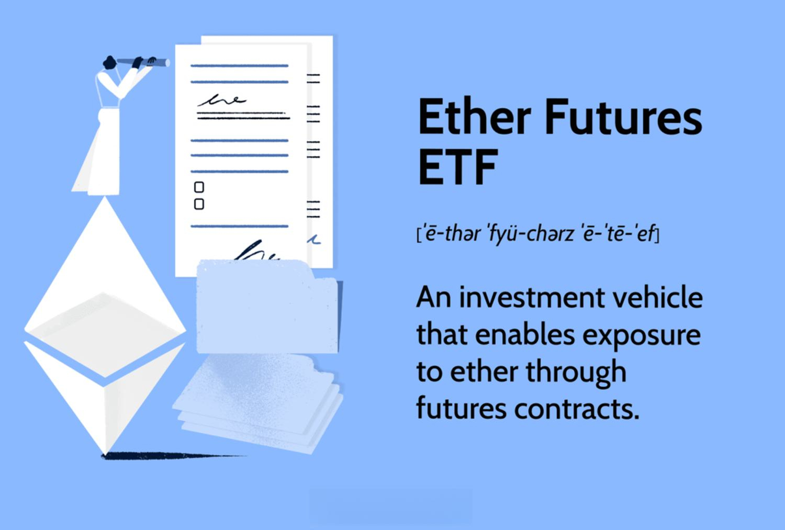

The world of financial markets is vast and ever-evolving, and one of the latest areas of interest is the intersection of Ether futures ETFs with cryptocurrency investments. As cryptocurrencies continue to gain traction, understanding financial instruments like Ether futures ETFs becomes imperative for investors looking to diversify their portfolios. Ether futures ETFs represent a pioneering intersection of traditional financial markets and digital currencies, offering a regulated pathway to access the otherwise volatile crypto space.

In essence, an Ether futures ETF allows investors to speculate on the future price of Ether, the native cryptocurrency of the Ethereum blockchain, without directly owning the digital asset. This innovation provides a streamlined opportunity to engage with cryptocurrency markets within the established frameworks of stock exchanges, potentially involving less complexity than directly managing cryptocurrency holdings. Given the regulated nature of these ETFs, they appeal to institutional investors seeking exposure to cryptocurrency price movements with some level of regulatory oversight.



Investors must grasp the intrinsic mechanism of Ether futures ETFs and their contextual role within financial markets to make well-versed decisions. This article will navigate through the intricacies of how these funds operate, the inherent advantages and risks they pose, and the broader implications for cryptocurrency investments. Furthermore, the article will cover algorithmic trading, which has become increasingly pertinent in cryptocurrency markets. These automated systems enable investors to execute trading strategies efficiently, managing the volatility and seizing arbitrage opportunities. Hence, understanding algorithmic trading is crucial for both seasoned investors and those new to the field.

With this foundation, we will explore the essential elements concerning Ether and its futures ETFs. Understanding these can provide investors with the insight needed to capitalize on the burgeoning opportunities within the cryptocurrency spectrum.

## Table of Contents

## Understanding Ether and the Ethereum Network

Ether is the native cryptocurrency of the Ethereum blockchain, a decentralized platform launched in 2015 by a group of developers including Vitalik Buterin. The Ethereum platform expands upon the foundational technology of Bitcoin by introducing the concept of smart contracts—self-executing contracts with the terms of the agreement directly written into code. This innovation facilitates the development of decentralized applications (dApps), which operate without any need for a central authority, providing greater transparency and resilience.

The Ethereum network is distinguished by its transition to a proof-of-stake (PoS) consensus model, which occurred through the Ethereum 2.0 upgrade, finalized in 2022. Unlike the proof-of-work (PoW) model which requires significant computational resources to mine cryptocurrency, PoS allows users to validate blocks and secure the network by staking their Ether. This approach not only reduces energy consumption but also democratizes the process, as voting power is proportional to the number of coins staked rather than computing power, thereby enhancing security and scalability.

Ethereum has become a linchpin in the decentralized finance (DeFi) ecosystem. DeFi refers to financial services that can be accessed and utilized without traditional banking institutions, primarily relying on blockchain technology to offer services such as lending, borrowing, and trading. Ethereum's robust infrastructure and ability to facilitate smart contracts have propelled it to the forefront of DeFi, enabling a wide array of financial products and services that are traditionally handled by centralized systems.

Ether's prominence in financial markets is further bolstered by its role as 'gas' within the Ethereum network. Gas refers to the fee required to conduct transactions and execute smart contracts on the network. The gas fees serve as compensation for miners (or validators in PoS) who perform the work of processing and verifying computations. Consequently, demand for Ether is driven not only by its use as a digital currency but also by its indispensability for operating on the Ethereum platform.

The growing ecosystem around Ethereum includes numerous tokens and standards, such as ERC-20 for fungible tokens and ERC-721 for non-fungible tokens (NFTs). These standards facilitate the creation and exchange of tokens compatible with the Ethereum blockchain, further enhancing the network's utility and adoption. This diversification and innovation have elevated Ether to a significant standing within financial markets, as investors and developers continue to explore new uses and applications for the platform's versatile architecture.

In summary, Ether's fundamental role within the Ethereum network, its transition to environmentally friendly consensus mechanisms, and its pivotal position in powering dApps and DeFi solutions underscore its importance and growing influence in the [cryptocurrency](/wiki/cryptocurrency) space.

## The Emergence of Ether Futures ETFs

Ether futures ETFs represent an innovative step in the integration of cryptocurrency into mainstream financial markets. Unlike direct investments in the cryptocurrency, these financial products provide investors the opportunity to gain exposure to Ether’s price movements through futures contracts. This method allows investors to speculate on the future price of Ether without the necessity of owning the actual cryptocurrency. 

The development of these ETFs comes from the growing interest and acceptance of digital assets. By trading on traditional exchanges, Ether futures ETFs offer a structured and regulated environment for investors who are often concerned about the security and [volatility](/wiki/volatility-trading-strategies) associated with direct cryptocurrency investments. This characteristic aligns with the needs of institutional investors and cautious individual investors, who may find comfort in the oversight provided by regulatory bodies such as the U.S. Securities and Exchange Commission (SEC).

In October 2023, the approval of the first Ether futures ETFs marked a pivotal moment in cryptocurrency’s evolution. This approval not only signals increased regulatory acceptance but also reflects a broader trend of digital asset integration into conventional financial systems. This development highlights the transition of cryptocurrency from a niche asset class to a more universally recognized and potentially integral component of global financial markets.

The emergence of these ETFs demonstrates the ongoing maturity and adoption of cryptocurrencies like Ether. As the financial landscape continues to evolve, products like Ether futures ETFs are likely to attract widespread attention, offering a viable pathway for participation in the dynamic world of cryptocurrencies.

## How Ether Futures ETFs Work

Ether futures ETFs operate by holding and managing derivatives contracts that speculate on the future price of Ether (ETH), the native cryptocurrency of the Ethereum blockchain. Instead of directly holding Ether, these ETFs provide investors a way to gain exposure to its price volatility through futures contracts. Here's a closer look at how these financial instruments function:

Futures Contracts: Ether futures ETFs primarily utilize futures contracts, which are agreements to buy or sell Ether at a predetermined price at a specific time in the future. These contracts are standardized and traded on regulated exchanges, making them a reliable tool for price speculation or hedging against market volatility.

Regulatory Oversight: One key feature that makes Ether futures ETFs attractive, especially to institutional investors, is their regulation. In the United States, for example, such products require approval from the Securities and Exchange Commission (SEC). This regulatory oversight aims to provide investor protection, transparency, and reduce the risk of market manipulation.

Trading on Stock Exchanges: Investors can trade [ETF](/wiki/etf-trading-strategies) shares on stock exchanges just like traditional stocks. This setup facilitates ease of access, as investors can buy and sell shares through brokerage accounts without needing specialized knowledge of cryptocurrency exchanges or wallets. Trading on stock exchanges also offers additional security measures that come with traditional financial markets.

Leverage and Risk Management: Some Ether futures ETFs might use leverage, amplifying potential returns but also increasing risk exposure. The structure of these ETFs allows investors to hedge their portfolios against adverse price movements in the crypto market, thereby using these instruments for risk management.

Convenience and Security: By not requiring investors to hold the underlying cryptocurrency, Ether futures ETFs mitigate concerns about digital asset security and custody. This convenience enables broader participation from investors who are wary of the complexities and security risks associated with direct cryptocurrency transactions.

Overall, Ether futures ETFs represent a bridge between traditional financial markets and the expanding digital asset landscape, offering a regulated and accessible means of participating in cryptocurrency price movements.

## Pros and Cons of Investing in Ether Futures ETFs

Investing in Ether futures ETFs comes with a range of advantages and disadvantages that potential investors should carefully consider before engaging with these financial products.

### Pros of Investing in Ether Futures ETFs

1. **Regulatory Compliance**: One of the primary benefits of investing in Ether futures ETFs is their regulatory compliance. These products are typically overseen by financial regulatory bodies such as the U.S. Securities and Exchange Commission (SEC). This regulatory oversight can provide a sense of security and trust for investors, as it ensures that the ETFs adhere to established financial regulations and reporting standards.

2. **Ease of Access**: Ether futures ETFs are traded on traditional stock exchanges, making them easily accessible to investors. This availability removes the complexity that often accompanies direct investments in cryptocurrencies, such as the need for digital wallets and understanding blockchain technology.

3. **Diversification**: By investing in Ether futures ETFs, investors can gain exposure to the cryptocurrency market without directly buying cryptocurrencies. This exposure allows for diversification within an investment portfolio, helping to mitigate overall risk. Investors can strategically allocate their investments in a manner that balances exposure across traditional and alternative markets.

4. **Potentially Lower Operational Risks**: Compared to direct investment in cryptocurrencies, Ether futures ETFs may present lower operational risks. Issues such as hacking, security breaches in cryptocurrency exchanges, or loss of access to digital wallets are mitigated in a regulated ETF framework, where custodianship and governance standards aim to protect investor interests.

### Cons of Investing in Ether Futures ETFs

1. **Liquidity Concerns**: Liquidity, or the ease with which an asset can be bought or sold in the market without affecting its price, can be a concern with Ether futures ETFs. While ETFs generally offer better liquidity than direct cryptocurrency investments, fluctuations in the cryptocurrency market can impact the liquidity of these ETFs, especially during periods of high volatility.

2. **High Volatility**: The cryptocurrency market is notorious for its high volatility, and this characteristic extends to Ether futures ETFs. Price swings can be dramatic, and while they present opportunities for potential gains, they also increase the risk of significant losses.

3. **Higher Expense Ratios**: Ether futures ETFs may have higher expense ratios compared to other traditional ETFs. This higher cost is often due to the complexities and risks involved in managing futures contracts, which can include fees for management, brokerage, and regulatory compliance.

4. **Potential Price Discrepancies**: The price of an Ether futures ETF can sometimes deviate from the actual price of Ether due to the nature of futures contracts and market demand. This discrepancy, known as tracking error, can lead to differences between the ETF's performance and the underlying asset it aims to replicate, potentially affecting the expected returns for investors.

In summary, while Ether futures ETFs offer regulated exposure to Ether's price movements and a convenient entry into the cryptocurrency market, they are not without their risks. Investors should thoroughly assess these factors against their own risk tolerance and investment objectives.

## Algorithmic Trading in Cryptocurrency

Algorithmic trading is increasingly significant in the cryptocurrency market due to its ability to process large volumes of data and execute trades at speeds impossible for human traders. By leveraging algorithms, investors can implement complex strategies such as [arbitrage](/wiki/arbitrage), market-making, and [momentum](/wiki/momentum) trading, which are particularly well-suited to the cryptocurrency market's volatile nature. 

One critical advantage of [algorithmic trading](/wiki/algorithmic-trading) in cryptocurrency is its potential to capitalize on price discrepancies between different exchanges. For instance, a trader could use an algorithm to buy Ether at a lower price on one exchange and sell it at a higher price on another, thereby exploiting arbitrage opportunities. This process can be automated to execute within milliseconds, maximizing potential gains and minimizing human error.

Additionally, algorithmic trading helps manage the high volatility characteristic of cryptocurrencies. By using predefined rules and conditions—such as moving average crossovers, relative strength index thresholds, or other technical indicators—algorithms can automatically initiate buy or sell orders. This way, traders can discipline their approach to managing assets, making data-driven decisions without emotional influence.

Here is an example of a simple moving average crossover strategy implemented in Python, which could be used in cryptocurrency trading:

```python
import pandas as pd

def moving_average_strategy(prices, short_window=40, long_window=100):
    signals = pd.DataFrame(index=prices.index)
    signals['price'] = prices
    signals['short_mavg'] = prices.rolling(window=short_window, min_periods=1).mean()
    signals['long_mavg'] = prices.rolling(window=long_window, min_periods=1).mean()
    signals['signal'] = 0.0
    signals['signal'][short_window:] = np.where(
        signals['short_mavg'][short_window:] > signals['long_mavg'][short_window:], 1.0, 0.0)
    signals['positions'] = signals['signal'].diff()

    return signals

# Example prices data (this would be replaced with real market data)
prices_data = pd.Series([...])
signals = moving_average_strategy(prices_data)
```

The algorithm computes the short-term and long-term moving averages and generates buy signals when the short-term average crosses above the long-term average, indicating a potential upward trend.

Investors venturing into algorithmic trading for cryptocurrencies should be aware of the associated risks. These include the rapid evolution of market conditions, which may render certain strategies obsolete, and the technological risks related to software and network reliability. Understanding these aspects is essential for both experienced traders and newcomers to avoid significant losses and harness algorithmic trading's full potential in navigating the cryptocurrency market.

## The Outlook for Ether Futures ETFs

The performance of Ether futures ETFs is poised to be influenced by various factors, including broader cryptocurrency market trends, regulatory developments, and the adoption of related financial products. As Ether futures ETFs start to gain traction in traditional financial markets, several aspects will shape their outlook and potential growth trajectory.

Cryptocurrency market trends are fundamental drivers of Ether futures ETFs’ performance. The cryptocurrencies' inherent volatility can result in significant price swings, impacting futures contracts and ultimately the ETFs that hold them. This volatility may be both an opportunity and a risk for investors, allowing for potential gains but also posing challenges in terms of price stability and predictive analytics.

Regulatory developments play a crucial role in the landscape of Ether futures ETFs. With the approval of these financial products in October 2023, regulatory bodies such as the U.S. Securities and Exchange Commission (SEC) have demonstrated increased willingness to integrate cryptocurrency-based assets into the regulated financial ecosystem. However, ongoing regulatory scrutiny remains, given the rapidly evolving cybersecurity issues, anti-money laundering (AML) concerns, and the need for robust investor protection measures. Changes in regulation can influence investor confidence and the operational framework of these ETFs.

The adoption of related financial products will also affect Ether futures ETFs’ success. As the acceptance of cryptocurrency continues to grow, new assets and technologies are likely to emerge, which may complement or compete with Ether futures ETFs. Advances in blockchain technology, as well as increased institutional interest, could lead to the development of more sophisticated investment products. This potential for innovation may enhance [liquidity](/wiki/liquidity-risk-premium) and create a broader market for cryptocurrency-based ETFs.

While the initial launch of Ether futures ETFs was moderate in terms of market impact, these products are positioned to set a precedent for further crypto-based offerings. The introduction of well-regulated and user-friendly cryptocurrency investment options can stimulate wider participation from retail and institutional investors alike. Despite this, investors should remain vigilant. Monitoring technological advancements and remaining updated on regulatory shifts is essential for capitalizing on the benefits while managing risks associated with Ether futures ETFs.

Overall, the outlook for Ether futures ETFs is intertwined with the broader evolution of the cryptocurrency market and its regulation, echoing both the promise and uncertainty that accompanies innovative financial solutions.

## Conclusion

Ether futures ETFs offer investors a promising avenue to gain exposure to cryptocurrency markets in a structured and regulated environment. These financial instruments bridge the gap between traditional investing and the dynamic world of digital currencies, making them accessible to a broader investor base. However, despite their appeal, it's important for investors to carefully assess the risks associated with Ether futures ETFs. These risks include potential price volatility, liquidity constraints, and the intricacies of managing futures contracts. Conducting thorough due diligence is crucial to understanding these risks and aligning investments with personal financial goals.

The integration of algorithmic trading in cryptocurrency markets adds another layer of sophistication to investment strategies. By leveraging advanced algorithms, traders can potentially enhance returns by automating transactions, optimizing execution times, and efficiently managing complex trading strategies. Algorithmic trading can be particularly beneficial in cryptocurrency markets, which are known for their high volatility and rapid price fluctuations. The ability to quickly adapt to market conditions can provide a significant edge to informed investors.

As the financial markets continue to evolve, keeping abreast of developments surrounding Ether futures ETFs, technological advancements, and regulatory changes is essential. The landscape is constantly shifting, driven by innovation in financial products and changing regulatory frameworks. This dynamic environment presents both challenges and opportunities for investors seeking to capitalize on the growth of cryptocurrencies. Staying informed and adaptable will be key to successfully navigating these developments and maximizing investment potential in Ether futures ETFs.

## References & Further Reading

[1]: ["Investing in Ethereum and Ether Futures ETFs"](https://www.nerdwallet.com/article/investing/ethereum-etfs) - Investopedia

[2]: Lopez de Prado, M. (2018). ["Advances in Financial Machine Learning"](https://www.amazon.com/Advances-Financial-Machine-Learning-Marcos/dp/1119482089) - Wiley.

[3]: Hurlburt, G. (2021). ["SEC Approves Bitcoin Futures ETFs - Implications for Ether ETFs"](https://www.coindesk.com/policy/2021/10/15/sec-approves-bitcoin-etf-opening-crypto-to-wider-investor-base/) - Forbes

[4]: Jansen, S. (2020). ["Machine Learning for Algorithmic Trading: Predictive Models to Extract Signals"](https://www.amazon.com/Machine-Learning-Algorithmic-Trading-alternative/dp/1839217715) - Packt Publishing.

[5]: Chan, E. (2017). ["Quantitative Trading: How to Build Your Own Algorithmic Trading Business"](https://github.com/ftvision/quant_trading_echan_book) - Wiley.

[6]: ["Ethereum's Transition to Proof of Stake and its Implications"](https://podcasts.apple.com/gb/podcast/bitcoin-hard-talk/id1769631667) - CoinDesk

[7]: ["Ethereum Futures Explained"](https://www.coindesk.com/learn/cme-ethereum-futures-explained/) - CME Group

[8]: Aronson, D. R. (2006). ["Evidence-Based Technical Analysis: Applying the Scientific Method and Statistical Inference to Trading Signals"](https://www.amazon.com/Evidence-Based-Technical-Analysis-Scientific-Statistical/dp/0470008741) - Wiley.