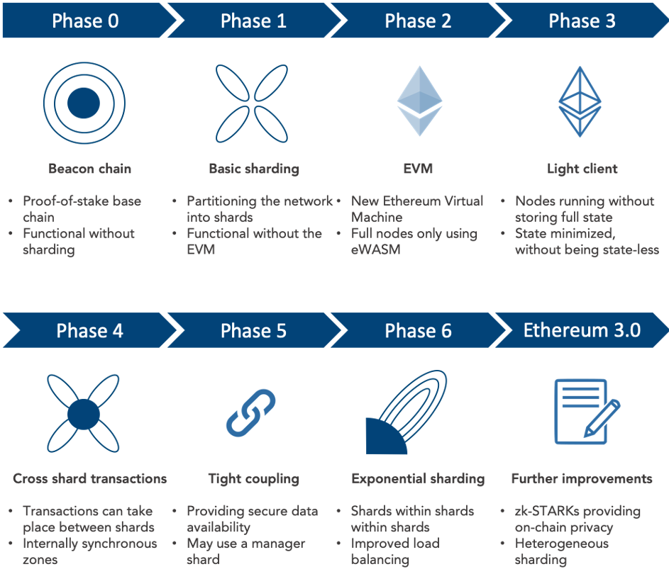

## Table of Contents

## What is Ethereum 2.0?

Ethereum 2.0, also known as Eth2 or Serenity, is a major upgrade to the Ethereum blockchain. It aims to make the network faster, more scalable, and more energy-efficient. The main change is switching from a proof-of-work system, where miners solve complex puzzles to validate transactions, to a proof-of-stake system. In proof-of-stake, validators are chosen to create new blocks based on the number of coins they hold and are willing to "stake" as collateral.

This upgrade is being rolled out in several phases. The first phase, called the Beacon Chain, was launched in December 2020. It introduced the proof-of-stake mechanism but didn't yet include the existing Ethereum network. The next major phase, called the Merge, happened in September 2022, combining the old Ethereum chain with the new Beacon Chain. Future phases will focus on improving scalability through shard chains, which will allow the network to process many transactions at the same time.

## Why is Ethereum transitioning to Ethereum 2.0?

Ethereum is moving to Ethereum 2.0 mainly to solve big problems with its current system. The old Ethereum uses a lot of energy because it relies on miners solving hard math problems to add new transactions. This makes it slow and expensive, especially when many people want to use it at the same time. By switching to Ethereum 2.0, the network will use a new method called proof-of-stake, which is much kinder to the environment and can handle more transactions faster.

The change to Ethereum 2.0 is happening in steps. The first step, called the Beacon Chain, started in December 2020 and set up the new proof-of-stake system. Then, in September 2022, the Merge happened, which connected the old Ethereum with the new system. Future steps will make the network even better by adding something called shard chains, which will let Ethereum process many transactions at once, making it much quicker and easier to use for everyone.

## What are the main components of Ethereum 2.0?

Ethereum 2.0 has three main parts that work together to make the network better. The first part is the Beacon Chain, which started in December 2020. It's like the brain of Ethereum 2.0 and helps manage the new proof-of-stake system. Instead of miners using lots of energy to solve puzzles, validators are chosen to add new blocks based on how many coins they have and are willing to lock up as a promise to behave.

The second part is the Merge, which happened in September 2022. This step connected the old Ethereum network with the new Beacon Chain, switching everything over to the proof-of-stake system. It's a big change that makes Ethereum use less energy and work faster. The third part is shard chains, which will come in the future. Shard chains will split the network into smaller pieces, so it can handle many transactions at the same time, making everything quicker and easier for users.

## How does the Beacon Chain work in Ethereum 2.0?

The Beacon Chain is the central part of Ethereum 2.0 that keeps everything running smoothly. It's like the main control center that manages the new way of adding transactions called proof-of-stake. Instead of miners solving hard math problems, the Beacon Chain picks validators to add new blocks based on how many Ethereum coins they have and are willing to lock up as a promise to behave. This makes the network much more energy-efficient and easier to manage.

The Beacon Chain also helps coordinate all the other parts of Ethereum 2.0, like the future shard chains. These shard chains will split the network into smaller pieces, so it can handle many transactions at the same time. By doing this, the Beacon Chain makes sure that Ethereum 2.0 can grow and become faster and more useful for everyone who uses it.

## What is sharding and how does it improve Ethereum 2.0?

Sharding is a way to make Ethereum 2.0 faster and able to handle more transactions at the same time. Imagine a big library with just one librarian trying to help everyone. It would be slow, right? Now, if you split the library into smaller sections, each with its own librarian, things would move much quicker. That's what sharding does for Ethereum. It breaks the network into smaller parts called shards, and each shard can process its own set of transactions without waiting for the others.

By using sharding, Ethereum 2.0 can process many more transactions per second than it could before. This means that when lots of people want to use Ethereum at the same time, like during big events or when new apps are launched, the network won't get slow or expensive. Sharding helps make Ethereum more useful for everyone, from people using it for simple payments to developers building big apps on it.

## How does Ethereum 2.0 transition from Proof of Work to Proof of Stake?

Ethereum 2.0 moves from Proof of Work to Proof of Stake in a big step called the Merge. Before the Merge, Ethereum used Proof of Work, where miners used lots of computer power to solve hard puzzles and add new transactions to the blockchain. This way was slow, used a lot of energy, and could get expensive when many people wanted to use Ethereum at the same time. The Merge changed all that by connecting the old Ethereum network with a new system called the Beacon Chain, which uses Proof of Stake instead.

In Proof of Stake, validators are chosen to add new transactions based on how many Ethereum coins they have and are willing to lock up as a promise to behave. This new way is much kinder to the environment because it doesn't need as much energy. It also makes things faster and cheaper for everyone using Ethereum. The Merge happened in September 2022, and it was a big moment that set Ethereum on a path to be more efficient and easier to use.

## What are the benefits of using Proof of Stake in Ethereum 2.0?

Using Proof of Stake in Ethereum 2.0 has many benefits. It's much better for the environment because it doesn't need lots of energy like the old Proof of Work system did. Instead of miners using big computers to solve hard puzzles, validators are chosen to add new transactions based on how many Ethereum coins they have and are willing to lock up. This means Ethereum 2.0 uses less power, which is good for the planet.

Proof of Stake also makes Ethereum faster and cheaper to use. With Proof of Work, when lots of people wanted to use Ethereum at the same time, it could get slow and expensive. But with Proof of Stake, the network can handle more transactions quickly and at a lower cost. This makes it easier for everyone, from people making simple payments to developers building big apps, to use Ethereum without worrying about high fees or slow service.

## What is the role of validators in Ethereum 2.0?

In Ethereum 2.0, validators play a key role in keeping the network running smoothly. Instead of miners using a lot of energy to solve hard puzzles like in the old system, validators are chosen to add new transactions to the blockchain. They do this by locking up some of their Ethereum coins as a promise to behave honestly. This is called staking, and it's the heart of the new Proof of Stake system. Validators are picked based on how many coins they stake, which makes the process fair and energy-efficient.

Validators also help keep Ethereum 2.0 secure and trustworthy. If they try to cheat or mess up the network, they can lose the Ethereum they staked. This rule encourages them to do their job well. By doing their part, validators make sure that transactions are processed quickly and at a lower cost, making Ethereum easier and cheaper for everyone to use. Their work is crucial for the success of Ethereum 2.0 and its goal to be a faster, greener, and more scalable blockchain.

## How will Ethereum 2.0 affect transaction speed and scalability?

Ethereum 2.0 will make transactions much faster and the network more scalable. The old Ethereum used a system called Proof of Work, where miners had to solve hard puzzles to add new transactions. This made things slow and expensive when many people wanted to use it at the same time. But Ethereum 2.0 switches to Proof of Stake, where validators are chosen to add transactions based on how many coins they hold and lock up. This new way is quicker and can handle more transactions at once, making everything smoother for users.

Another big change in Ethereum 2.0 is something called sharding. Sharding splits the network into smaller parts, or shards, each able to process its own set of transactions. This means the network can do many things at the same time, like a big library with lots of librarians helping different people. With sharding, Ethereum 2.0 can handle a lot more activity without getting slow or expensive, making it easier for everyone to use, whether they're making simple payments or building big apps on the network.

## What are the potential challenges and risks associated with Ethereum 2.0?

Moving to Ethereum 2.0 is a big change, and it comes with some challenges and risks. One big worry is about security. The new Proof of Stake system relies on validators, and if a lot of them decide to work together to cheat, they could cause problems. This is called a 51% attack, and it's something that people need to watch out for. Another challenge is making sure the transition from the old system to the new one goes smoothly. If there are bugs or mistakes, it could slow down the network or cause other issues.

Another risk is that the new system might not work as well as people hope. The idea of sharding sounds great, but it's never been done on a big blockchain like Ethereum before. If it doesn't work right, it could make the network slow or hard to use. Also, some people might not want to switch to the new system right away, which could split the community and make things confusing. But the team behind Ethereum is working hard to solve these problems and make Ethereum 2.0 a success.

## How can someone participate in Ethereum 2.0 as a validator?

To participate in Ethereum 2.0 as a validator, you need to stake at least 32 Ethereum coins. This means you lock up your coins to show you're committed to helping the network. You can do this by setting up special software on your computer or using a staking service that does it for you. Once you're set up, you'll be chosen to add new transactions to the blockchain based on how many coins you've staked. It's important to keep your computer running well because if you mess up or try to cheat, you could lose your staked Ethereum.

Being a validator is a big responsibility but also a way to help make Ethereum 2.0 work better. You'll earn rewards in Ethereum for doing your job well, which can be a good way to make money if you're willing to keep your coins locked up for a while. But remember, you need to be careful and follow the rules, or you could lose your stake. It's a great way to be part of the future of Ethereum and help make it faster and more energy-efficient for everyone.

## What is the expected timeline for the full implementation of Ethereum 2.0?

The full implementation of Ethereum 2.0 is happening in steps, and it's taking some time. The first big step was the Beacon Chain, which started in December 2020. This set up the new way of adding transactions called Proof of Stake. The next big step, called the Merge, happened in September 2022. This connected the old Ethereum with the new system, making everything run on Proof of Stake.

The next steps are still coming. One of the most important ones is sharding, which will split the network into smaller parts to make it faster and able to handle more transactions at once. This part is expected to roll out over the next few years. While it's hard to say exactly when everything will be done, the team behind Ethereum is working hard to make sure all these changes happen smoothly and on time.

## What are the strategies for algo trading in the era of Ethereum 2.0?

As Ethereum 2.0 reshapes the landscape of blockchain technology with its shift to Proof of Stake (PoS), [algorithmic trading](/wiki/algorithmic-trading) strategies must evolve to harness these advancements. Developers and traders need to consider both the opportunities and challenges presented by Ethereum 2.0, particularly its improved scalability, reduced transaction fees, and enhanced network efficiency.

### Developing New Algorithms or Adapting Existing Ones

With Ethereum 2.0, traders should focus on incorporating PoS mechanisms into algorithmic models. Unlike the Proof of Work (PoW) consensus, PoS offers lesser energy consumption and faster transaction confirmations, enabling more trades to be executed in less time. New algorithms might leverage these changes by prioritizing speed and cost efficiency, processing more data, and executing trades according to the reduced latency.

Mathematically, traders could use optimization techniques that account for the improved throughput and lower fees $\text{Cost}_{\text{Tx}}$ in their objective functions:

$$
\text{Objective: Maximize } \frac{\text{Profit}_{\text{Net}}}{\text{Cost}_{\text{Tx}}}
$$

### Incorporating Ethereum 2.0 Features into Trading Systems

To fully utilize Ethereum 2.0's features, algorithmic systems must integrate smart contracts more efficiently. The upgrade facilitates faster and cheaper transactions, allowing for finer granularity in trading strategies such as high-frequency trading. Traders should adapt their systems to monitor Ethereum’s Beacon Chain for network status, and shard chain activity for localized data processing.

### Risk Management and Backtesting Strategies

Risk management in the wake of Ethereum 2.0 necessitates rigorous [backtesting](/wiki/backtesting) to evaluate performance. Models must adapt to Ethereum's enhanced network to predict transactional hazards like failed trades or price slippage. Historical data simulation with Python libraries such as pandas and NumPy can simulate trading conditions post-upgrade:

```python
import pandas as pd
import numpy as np

def backtest(trade_data, fee_reduction):
    # Adjust trade data for Ethereum 2.0 fee reductions
    trade_data['adjusted_fee'] = trade_data['fee'] * (1 - fee_reduction)
    # Calculate potential return
    trade_data['return'] = (trade_data['sell_price'] - trade_data['buy_price']) - trade_data['adjusted_fee']
    return trade_data['return'].mean()

trade_data = pd.DataFrame({
    'buy_price': [100, 200, 300],
    'sell_price': [110, 210, 320],
    'fee': [1, 2, 3]
})

print(backtest(trade_data, 0.7))  # Example backtest with 30% fee reduction
```

### Tools and Platforms Supporting Ethereum 2.0-Based Algo Trading

Several platforms and tools have already started integrating Ethereum 2.0 capabilities. Platforms like MetaTrader 5 and QuantConnect offer APIs supporting Ethereum’s new features, focusing on decentralized trading strategies and automated contract execution. Traders should leverage these tools to enhance the reliability and efficiency of their crypto trading operations.

### Case Studies of Successful Trading Strategies Post-Ethereum 2.0 Upgrade

Post upgrade, some trading strategies have capitalized on Ethereum 2.0’s improved scalability and efficiency. For example, [arbitrage](/wiki/arbitrage) strategies that exploit price discrepancies across exchanges have become more feasible with faster transaction times. Similarly, market-making algorithms benefit from stable network conditions and lower fees, allowing for tighter bid-ask spreads. Firms that adopted these strategies early on have reported improved returns and trading [volume](/wiki/volume-trading-strategy).

By strategically adapting and integrating Ethereum 2.0 features, algorithmic traders can potentially achieve significant advantages, unlocking new opportunities in the evolving [cryptocurrency](/wiki/cryptocurrency) market landscape.

## References & Further Reading

[1]: Buterin, V. (2019). ["Ethereum: A Next-Generation Smart Contract and Decentralized Application Platform."](https://www.blockchainlab.com/pdf/Ethereum_white_paper-a_next_generation_smart_contract_and_decentralized_application_platform-vitalik-buterin.pdf) Ethereum Whitepaper.

[2]: Antonopoulos, A. M., & Wood, G. (2018). ["Mastering Ethereum: Building Smart Contracts and DApps"](https://www.amazon.com/Mastering-Ethereum-Building-Smart-Contracts/dp/1491971940). O'Reilly Media.

[3]: Mougayar, W. (2016). ["The Business Blockchain: Promise, Practice, and Application of the Next Internet Technology"](https://books.google.com/books/about/The_Business_Blockchain.html?id=CEsPDAAAQBAJ). Wiley.

[4]: Nakamoto, S. (2009). ["Bitcoin: A Peer-to-Peer Electronic Cash System."](https://nakamotoinstitute.org/library/bitcoin/) Bitcoin Whitepaper.

[5]: Kissel, R. (2013). ["The Science of Algorithmic Trading and Portfolio Management"](https://www.sciencedirect.com/book/9780124016897/the-science-of-algorithmic-trading-and-portfolio-management). Academic Press.

[6]: Casper, V. L., & Zamfir, V. (2018). ["Ethereum Proof of Stake: Casper the Friendly Finality Gadget."](https://www.researchgate.net/publication/320626951_Casper_the_Friendly_Finality_Gadget) arXiv.

[7]: Wood, G. (2014). ["Ethereum: A Secure Decentralised Generalised Transaction Ledger."](https://ethereum.github.io/yellowpaper/paper.pdf) Ethereum Yellow Paper.

[8]: Dummermuth, E. (2022). ["Ethereum 2.0: Implications for Investors and Restructuring the Blockchain"](https://cointelegraph.com/learn/articles/ethereum-upgrades-a-beginners-guide-to-eth-2-0). Binance Academy.