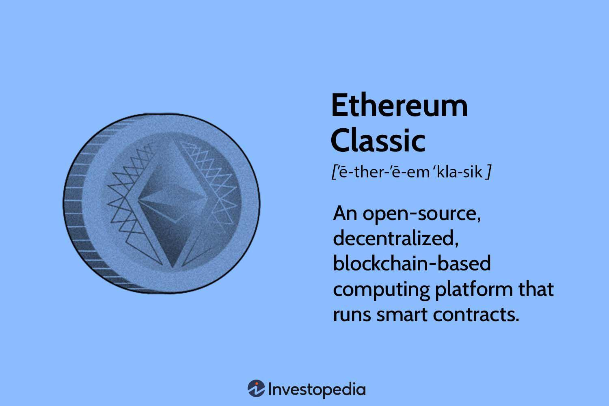

## Table of Contents

## What is Ethereum Classic and how does it differ from Ethereum?

Ethereum Classic is a cryptocurrency that came about after a big disagreement in the Ethereum community. Back in 2016, a group of people hacked into a project called The DAO, which was built on the Ethereum network, and stole a lot of money. To fix this, the Ethereum team decided to change the history of their blockchain to give the money back. But not everyone agreed with this change. The people who didn't want to change the history kept using the old version of Ethereum, and they called it Ethereum Classic.

The main difference between Ethereum and Ethereum Classic is how they handle problems. Ethereum's team decided to change their blockchain to fix the hack, which is called a hard fork. Ethereum Classic's team believed that once something is written on the blockchain, it should stay there forever, no matter what. This idea is called "code is law." So, Ethereum Classic kept the original blockchain without any changes. Both cryptocurrencies work in similar ways and can be used to create smart contracts and decentralized apps, but they have different communities and philosophies about how to manage their networks.

## When was Ethereum Classic created and why did it come into existence?

Ethereum Classic was created in July 2016. It came into existence because of a big problem that happened on the Ethereum network. A group of hackers stole a lot of money from a project called The DAO, which was built on Ethereum. The people who run Ethereum decided to change their blockchain to get the money back. This change is called a hard fork. But not everyone agreed with this decision.

Some people thought that changing the blockchain was wrong. They believed that once something is written on the blockchain, it should stay there no matter what. This idea is called "code is law." So, these people decided to keep using the old version of Ethereum without the change. They called this old version Ethereum Classic. That's why Ethereum Classic exists today. It's a different version of Ethereum that follows a different set of rules about how to handle problems.

## What was the DAO hack and how did it lead to the creation of Ethereum Classic?

The DAO hack was a big problem that happened on the Ethereum network in 2016. A group of hackers found a way to steal a lot of money from a project called The DAO, which was like a big investment fund built on Ethereum. The hackers used a special trick in the code to take out more money than they were supposed to, and they ended up stealing about $50 million worth of Ethereum. This made a lot of people very upset and worried about the safety of their money on the Ethereum network.

Because of the hack, the people who run Ethereum decided to change their blockchain to get the stolen money back. This change, called a hard fork, meant going back in time on the blockchain and moving the money away from the hackers. But not everyone agreed with this idea. Some people thought that once something is written on the blockchain, it should never be changed, no matter what. They believed in the idea of "code is law." So, these people decided to keep using the old version of Ethereum without the change, and they called it Ethereum Classic. This is how Ethereum Classic was created, as a different version of Ethereum that follows a different set of rules about how to handle problems.

## What are the core principles and values that Ethereum Classic stands for?

Ethereum Classic stands for the idea that the blockchain should never be changed, no matter what happens. This is called "code is law." It means that once something is written on the blockchain, it should stay there forever. Ethereum Classic believes that this is important because it keeps the blockchain honest and fair. If people can change the blockchain whenever they want, then it's not really a safe place to keep your money or do business.

Another important value for Ethereum Classic is being decentralized. This means that no one person or group should be in charge of the network. Everyone who uses Ethereum Classic has a say in how it works. This is different from some other cryptocurrencies where a small group of people make all the decisions. Ethereum Classic thinks that being decentralized makes the network stronger and more fair for everyone who uses it.

## How does the Ethereum Classic blockchain work?

Ethereum Classic is a type of blockchain, which is like a digital record book that keeps track of all transactions and activities on the network. It works by having many computers around the world, called nodes, that all agree on what information should be added to the record book. When someone wants to send money or do something else on the network, they create a transaction and send it to the nodes. The nodes then check to make sure the transaction is valid and add it to a group of other transactions, called a block. Once a block is full, it gets added to the blockchain, and everyone on the network can see it.

The process of adding new blocks to the blockchain is called mining. Miners are special nodes that use their computers to solve hard math problems. When a miner solves a problem, they get to add a new block to the blockchain and earn some Ethereum Classic as a reward. This helps keep the network secure because miners have to work hard to add new blocks, and it's very hard for someone to cheat or change the blockchain without everyone noticing. This is how Ethereum Classic stays honest and fair for everyone who uses it.

## What are the main differences between Ethereum Classic and other cryptocurrencies?

Ethereum Classic is different from many other cryptocurrencies because it believes in the idea of "code is law." This means that once something is written on the Ethereum Classic blockchain, it should never be changed, no matter what happens. This principle was important when Ethereum Classic was created after a big disagreement over changing the Ethereum blockchain to fix a hack. Many other cryptocurrencies might change their blockchain if there is a big problem, but Ethereum Classic sticks to its rule that the blockchain should always stay the same.

Another way Ethereum Classic is different is that it focuses a lot on being decentralized. This means that no one person or group is in charge of the network. Instead, everyone who uses Ethereum Classic has a say in how it works. This is different from some other cryptocurrencies where a small group of people make the decisions. Ethereum Classic thinks that being decentralized makes the network stronger and more fair for everyone who uses it.

## What are the current uses and applications of Ethereum Classic?

Ethereum Classic is used for a lot of the same things as other cryptocurrencies. People can send and receive money on the Ethereum Classic network. They can also use it to buy things or trade it for other cryptocurrencies. Some people even use Ethereum Classic to invest and try to make money if the price goes up. Just like other cryptocurrencies, Ethereum Classic can be stored in digital wallets and used to pay for things online.

Another important use of Ethereum Classic is for smart contracts. These are like special computer programs that automatically do what they are supposed to do when certain things happen. For example, if you want to rent a house, you can use a smart contract on Ethereum Classic to make sure the money is paid and the keys are given at the right time, without needing a middleman. Ethereum Classic's focus on "code is law" means that once a smart contract is set up, it will always work the way it was written, which some people find very useful for business and other deals.

## How has the Ethereum Classic community evolved since its inception?

Since Ethereum Classic started in 2016, its community has grown and changed a lot. At first, it was a small group of people who believed strongly in the idea that the blockchain should never be changed, no matter what. They called this idea "code is law." Over time, more people joined the community because they liked this idea and wanted to be part of a network that stuck to its principles. The community has also become more organized, with groups and teams working together to make Ethereum Classic better and more useful for everyone.

The Ethereum Classic community has also faced some challenges. There have been disagreements about how to keep the network safe and how to make it grow. Some people wanted to change the way Ethereum Classic works to make it faster and cheaper, but others thought that any change would go against the idea of "code is law." Despite these challenges, the community has stayed strong and kept working together. They have also started to use Ethereum Classic for more things, like smart contracts and other special computer programs, showing that the network is still growing and changing even years after it started.

## What are the technical challenges and security concerns facing Ethereum Classic?

Ethereum Classic faces some technical challenges that make it hard for the network to work well. One big problem is that it can be slow and expensive to use. When a lot of people want to use Ethereum Classic at the same time, the network can get crowded, and it takes longer for transactions to go through. This can also make it more expensive because people have to pay more to get their transactions done quickly. Another challenge is keeping the network safe from attacks. Hackers might try to take over the network by using a lot of computer power to change what's written on the blockchain. This is called a 51% attack, and it's something that Ethereum Classic has to watch out for all the time.

Security is also a big worry for Ethereum Classic. Because the network believes in "code is law," it doesn't change the blockchain even if there's a problem. This means that if there's a bug in the code, it can be hard to fix without breaking the rules. For example, in 2020, Ethereum Classic was attacked, and hackers were able to steal money because of a problem in the code. The community had to decide how to respond without going against their principles. They ended up making some changes to make the network safer, but it was a tough decision. Keeping the network safe while sticking to their beliefs is an ongoing challenge for Ethereum Classic.

## What are the future development plans for Ethereum Classic?

The people who work on Ethereum Classic have some big plans for the future. They want to make the network faster and cheaper to use. Right now, it can take a long time for transactions to go through, and it can be expensive. They are working on new ways to make the network handle more transactions at the same time without making it more expensive. They also want to make it easier for people to use Ethereum Classic for smart contracts and other special computer programs. This means making the code better and fixing any problems that might come up.

Another big plan for Ethereum Classic is to keep the network safe. They know that hackers might try to attack the network, so they are always working on new ways to stop them. They are also thinking about how to make the network even more decentralized, so no one person or group can control it. This is important because it keeps the network fair for everyone who uses it. The Ethereum Classic team wants to keep growing the community and making the network better, all while sticking to their belief in "code is law."

## How does Ethereum Classic plan to improve its scalability and performance?

Ethereum Classic is working on making its network faster and able to handle more transactions at the same time. Right now, when a lot of people want to use Ethereum Classic, it can get slow and expensive. They are looking at new ways to fix this problem. One idea is to use something called sharding, which is like splitting the network into smaller parts so each part can work on its own transactions. This could make the whole network faster and able to do more things at once. They are also thinking about changing how they do mining to make it quicker and less expensive for everyone.

Another way Ethereum Classic wants to get better is by making it easier for people to use smart contracts and other special computer programs. They are working on making the code better and fixing any problems that might come up. This means that people can use Ethereum Classic for more things without having to wait a long time or pay a lot of money. The team is always trying to find new ways to make the network work better while still sticking to their belief in "code is law." This means they want to keep the network fair and honest for everyone who uses it.

## What are the long-term prospects and potential impacts of Ethereum Classic on the blockchain ecosystem?

Ethereum Classic has the potential to be a big part of the blockchain world because it sticks to its belief in "code is law." This means that once something is written on the Ethereum Classic blockchain, it should never be changed. This idea is important to a lot of people who use cryptocurrencies because it keeps the network honest and fair. If Ethereum Classic can keep growing and stay safe from hackers, it could become a popular choice for people who want to use smart contracts and other special computer programs. They might choose Ethereum Classic because they know it will always do what it's supposed to do, without any changes.

In the long run, Ethereum Classic could also help make the whole blockchain ecosystem better. By showing that it's possible to have a network that never changes its history, Ethereum Classic could encourage other cryptocurrencies to think about how they handle problems. This could lead to new ideas and ways of making blockchain networks safer and more fair for everyone. But, Ethereum Classic will need to keep working on making its network faster and cheaper to use, so more people will want to join and use it. If it can do that, Ethereum Classic could have a big impact on how people think about and use blockchain technology in the future.

## References & Further Reading

[1]: DuPont, Q. (2019). ["Cryptocurrency and Blockchains."](https://www.wiley.com/en-us/Cryptocurrencies+and+Blockchains-p-9781509520237) Polity.

[2]: Mougayar, W. (2016). ["The Business Blockchain: Promise, Practice, and Application of the Next Internet Technology."](https://books.google.com/books/about/The_Business_Blockchain.html?id=CEsPDAAAQBAJ) Wiley.

[3]: Antonopoulos, A. M., & Wood, G. (2018). ["Mastering Ethereum: Building Smart Contracts and Dapps."](https://www.amazon.com/Mastering-Ethereum-Building-Smart-Contracts/dp/1491971940) O'Reilly Media.

[4]: Franco, P. (2014). ["Understanding Bitcoin: Cryptography, Engineering, and Economics."](https://onlinelibrary.wiley.com/doi/book/10.1002/9781119019138) Wiley.

[5]: Narayanan, A., Bonneau, J., Felten, E., Miller, A., & Goldfeder, S. (2016). ["Bitcoin and Cryptocurrency Technologies."](https://press.princeton.edu/books/hardcover/9780691171692/bitcoin-and-cryptocurrency-technologies) Princeton University Press.

[6]: Vigna, P., & Casey, M. J. (2015). ["The Age of Cryptocurrency: How Bitcoin and Digital Money Are Challenging the Global Economic Order."](https://archive.org/details/ageofcryptocurre0000vign) St. Martin's Press.