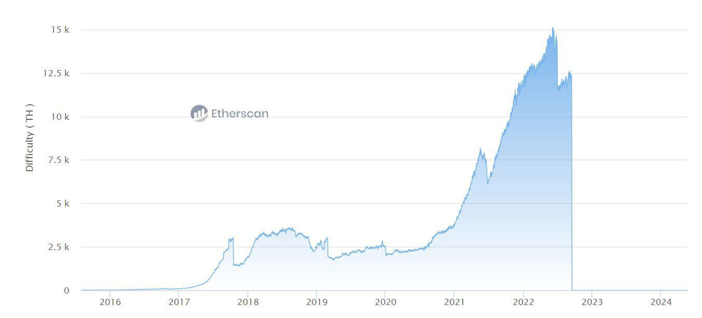

Ethereum is a decentralized, open-source blockchain platform that has become a pivotal component of the cryptocurrency ecosystem since its inception in 2015. Unlike Bitcoin, which primarily functions as a digital currency, Ethereum extends its blockchain capabilities to enable decentralized applications (DApps) through smart contracts. These programmable contracts are essential for automating and executing agreements without intermediaries, revolutionizing various industries, including finance, supply chain, and more.

Within blockchain networks, mining is the consensus mechanism that ensures network security and transaction verification. In traditional Proof-of-Work (PoW) systems like Ethereum's original model, miners solve complex mathematical puzzles using computational power. Successful miners are rewarded with newly minted cryptocurrency, incentivizing honest participation. However, this process is energy-intensive, raising ecological concerns.

The Ethereum Difficulty Bomb is a mechanism designed to increase mining difficulty exponentially over time, ultimately leading to the "Ice Age." This feature was embedded in Ethereum’s protocol as part of a strategic plan to transition away from PoW to a more sustainable and scalable Proof-of-Stake (PoS) consensus mechanism in Ethereum 2.0, also known as Eth2 or Serenity. The Difficulty Bomb aims to dissuade miners from continuing with PoW by making it increasingly challenging and less profitable, thus hastening the shift to PoS.

Ethereum 2.0 represents a comprehensive upgrade intended to improve the network's scalability, security, and energy efficiency. The Difficulty Bomb plays a crucial role in this transition, serving as a deterrent against stagnation in the PoW system and expediting the adoption of PoS. In PoS, validators, rather than miners, take an active role, securing the network by staking their holdings as collateral. This transition not only reduces energy consumption but also significantly alters the economic incentives within the Ethereum network.

As these transitions occur, they influence algorithmic trading, which involves using computer algorithms to execute trades based on pre-set rules. Market dynamics shift as mining rewards and costs fluctuate, impacting cryptocurrency valuation and trading volumes. Algorithmic traders must adapt to these changes, adjusting their strategies to account for the evolving landscape induced by the Difficulty Bomb and the Ethereum 2.0 shift. Understanding these developments is vital for traders seeking to optimize their strategies and manage risks in the fast-evolving cryptocurrency market.

## Table of Contents

## Understanding Ethereum's Difficulty Bomb

Ethereum's Difficulty Bomb is a critical mechanism in the Ethereum blockchain designed to gradually increase the difficulty level of mining Ethereum over time. Introduced through Ethereum Improvement Proposal (EIP) 2 in 2015, the Difficulty Bomb complicates the mining process by exponentially elevating the time required to produce new blocks. This technical hurdle was envisioned to incentivize the transition from the existing Proof-of-Work (PoW) consensus model to Proof-of-Stake (PoS), aligning with Ethereum's broader technological evolution.

### Technical Functionality

The Difficulty Bomb works by implementing an exponential increase in the difficulty level used by miners to solve cryptographic puzzles required for adding new blocks to the blockchain. The mathematical function governing this mechanism can be described as:

$$

\text{Difficulty}_{\text{new}} = \text{Difficulty}_{\text{old}} + \text{base^\text{exponential factor}}
$$

where the base and exponential factor are constants set to define the growth rate of the difficulty. This increase not only slows down block production but eventually threatens to bring mining nearly to a halt, commonly referred to as the "Ice Age." The intended effect is a powerful motivator for miners to embrace Ethereum's shift to PoS, which vastly diverges from the energy-intensive PoW system.

### Purpose and Intentions

The creation and escalation of the Difficulty Bomb serve to encourage the Ethereum community to actively participate in Ethereum's strategic transitions. By imposing increasing constraints on the PoW chain, developers effectively push the system towards PoS, promising more scalable, secure, and sustainable blockchain economics that align with increasing demands and ethical standards in computing.

### Transition from Proof-of-Work to Proof-of-Stake

Ethereum's transition from PoW to PoS, marked by the Ethereum 2.0 upgrade, seeks to supplant energy-hungry mining practices with a more efficient system where validating nodes provide security to the network by staking [cryptocurrency](/wiki/cryptocurrency), rather than expending computational resources. The Difficulty Bomb complements this transition by naturally deterring PoW mining.

### Historical Adjustments

Throughout Ethereum's development, the Difficulty Bomb has been deliberately postponed through several network upgrades. Adjustments have been made during pivotal updates like the Byzantium, Constantinople, and Muir Glacier hard forks. These interventions were required to provide developers and the community additional time for thorough testing and implementation of Ethereum 2.0 features without precipitating a premature Ice Age.

Each adjustment, largely achieved by resetting the bomb's timing mechanism, has instigated robust discussions regarding strategy and timeline, offering insight into Ethereum's iterative technology management in pursuit of systemic evolution. The balancing act of deferring the Difficulty Bomb showcases Ethereum's methodical approach to integrating formidable optimizations while ensuring network stability.

The Difficulty Bomb embodies a tactical innovation within Ethereum, underpinning its transformative journey towards a state-of-the-art blockchain protocol while posing complex challenges and opportunities for stakeholders adapting to this evolving cryptosystem.

## Challenges in Ethereum Mining Due to the Difficulty Bomb

The Ethereum Difficulty Bomb is a critical mechanism designed to incrementally increase the complexity of mining computations on the Ethereum network. This escalation directly impacts miners, whose operations and profitability are adversely affected. As mining difficulty rises, miners must invest in more advanced hardware or increase their energy consumption to solve the complex cryptographic problems necessary for block verification, directly affecting their cost structures.

### Economic Impacts on Mining Operations

Mining operations can be broadly categorized into small and large scales. Small miners, often with limited capital, find maintaining profitability increasingly challenging. The need for continuous investment in state-of-the-art mining rigs can outpace the financial capabilities of smaller operations. As a result, they may be compelled to [exit](/wiki/exit-strategy) the mining sector or seek alternative revenue streams within the cryptocurrency market.

Conversely, large mining operations might have the necessary resources to adapt to these challenges. However, they face pressures of an escalating energy requirement and operational costs. Even with economies of scale, the intensified difficulty from the bomb increases the break-even point for these entities, potentially affecting their return on investment (ROI).

### Ecological Impacts

The ecological implications of the Ethereum Difficulty Bomb are significant. As mining difficulty surges, energy consumption follows suit. This increase has broader environmental repercussions, particularly in regions relying on non-renewable energy sources for electricity. The heightened energy demand exacerbates the carbon footprint of mining operations, raising concerns about sustainability in the cryptocurrency industry.

### Challenges in Transitioning to Ethereum 2.0

The transition to Ethereum 2.0, involving a shift from a Proof-of-Work (PoW) consensus mechanism to Proof-of-Stake (PoS), presents distinct challenges for miners. The PoS model does not require mining in the traditional sense, displacing miners from their central role within the network. Miners must navigate this transition, often needing to liquidate physical assets that become obsolete or repurpose them for other blockchain networks still operating on PoW.

### Diversification of Mining Operations

In response to the looming challenges, miners are exploring diversification strategies to maintain viability. Some miners diversify by reallocating resources to mine other PoW cryptocurrencies where difficulty levels and competition may be less intense. Others pivot towards staking, leveraging their accumulated Ethereum holdings in the PoS system to generate returns. Additionally, there is an exploration into offering services that capitalize on their technical expertise, such as blockchain development or consultancy.

Ultimately, the Ethereum Difficulty Bomb compels miners to reevaluate their business models, pushing them towards innovative solutions to sustain profitability. As the ether network progresses, adaptability will be crucial for miners seeking continued relevance in the evolving blockchain ecosystem.

## Implications for Algorithmic Trading

Algorithmic trading, or algo trading, involves utilizing computer programs to execute trades based on predefined strategies and quantitative market analysis. It leverages mathematical models and complex algorithms to make trading decisions at speeds and frequencies that are unattainable by human traders. In the context of cryptocurrency markets, algo trading plays a crucial role by enabling traders to efficiently manage their portfolios, capitalize on market inefficiencies, and reduce manual intervention errors.

The Ethereum Difficulty Bomb, a mechanism designed to exponentially increase the mining difficulty of Ethereum over time, profoundly influences market dynamics and trading strategies. This mechanism aims to facilitate Ethereum’s transition from a Proof-of-Work (PoW) consensus mechanism to Proof-of-Stake (PoS). The increasing difficulty can lead to slower block times and potentially impact transaction throughput and fees. Such changes create a fluctuating environment in terms of Ethereum's supply rate, affecting its market valuation and [volatility](/wiki/volatility-trading-strategies).

For algo traders, the Ethereum Difficulty Bomb presents both challenges and opportunities. As mining difficulty escalates, the rate of Ether production declines, which can drive price volatility. Algo traders can exploit these variations by developing strategies that capitalize on the volatility. For example, mean reversion and [momentum](/wiki/momentum)-based strategies can be adjusted to short-term market shifts caused by changes in mining difficulty.

Additionally, algorithmic traders can use predictive models to anticipate shifts due to mining difficulty changes. Machine learning techniques, such as time series analysis and regression models, can be employed to forecast price movements based on historical data sets encompassing mining difficulty and blockchain performance metrics. By predicting these shifts, traders can optimize buy and sell signals to maximize profits.

Furthermore, risk management becomes essential for algo trading amid network transitions like Ethereum's move to PoS. Traders must continuously monitor and adjust their strategies to ensure they remain robust against network-induced volatility. This could involve setting tighter stop-loss limits, diversifying portfolios across other cryptocurrencies, or enhancing model parameters to adapt to new market conditions.

In summary, the Ethereum Difficulty Bomb significantly impacts [algorithmic trading](/wiki/algorithmic-trading) by altering market dynamics and providing unique opportunities to exploit volatility and inefficiencies. By integrating advanced predictive models and risk management strategies, algo traders can effectively navigate the complexities introduced by Ethereum's ongoing transformation, maintaining their competitive edge in the ever-evolving crypto market landscape.

## Evaluating the Future of Ethereum and Algo Trading

Ethereum 2.0 represents a major shift from the existing Proof-of-Work (PoW) model to a Proof-of-Stake (PoS) framework, fundamentally altering the blockchain's operational dynamics. This transition is expected to significantly impact both mining and trading activities within the Ethereum ecosystem.

**Impact on Mining:**
The shift to Ethereum 2.0 will eliminate traditional mining by replacing it with staking, reducing the energy consumption associated with the PoW process. This change will make the network more environmentally sustainable and economically accessible, as participants will no longer need extensive mining hardware. Instead, stakeholders will validate transactions by holding and 'staking' a certain amount of Ethereum tokens. As a result, current mining operations face obsolescence unless they pivot to support other PoW cryptocurrencies or transition into staking.

**Trading Implications:**
Ethereum 2.0’s transition is likely to lead to greater network scalability, reduced transaction fees, and enhanced security. These improvements can create a more attractive environment for investors and traders, potentially increasing [liquidity](/wiki/liquidity-risk-premium) and market activity. Markets might observe a shift in trading volumes as participants adjust to the changes in network operations. 

**Long-term Consequences for the Crypto Market:**
As Ethereum completes its transition, the broader blockchain ecosystem may experience several long-term repercussions. Ethereum's success in executing this transition could encourage other blockchain networks to consider similar moves to PoS systems, fostering a more sustainable and efficient crypto landscape. The changes in how transaction verification occurs may trigger shifts in investment modalities, particularly for those heavily invested in hardware-based mining.

**Preparation for Future Technological Shifts:**
Traders looking to prepare for these changes should increase their technical literacy concerning PoS systems and the comparative advantages of Ethereum 2.0. Developing expertise in staking and understanding how PoS can influence transaction validation times and costs will be crucial. Incorporating flexible strategies that allow rapid adoption of new crypto technologies can provide competitive edges in adjusting portfolios to align with market evolutions.

**Algorithmic Trading Developments:**
With more predictable transaction times and lower costs on Ethereum 2.0, algorithmic traders could exploit numerous new opportunities. The enhanced blockchain efficiency will likely encourage the deployment of advanced algorithms that make use of high-frequency trading strategies. Furthermore, as the network becomes more robust, the associated reduction in volatility and risk could attract institutional investors, increasing the stakes in algorithmic trading systems. 

**Overall Future Outlook:**
Ethereum's transition to 2.0 is poised to redefine the landscape of digital currencies, emphasizing sustainability, efficiency, and security. For miners, the necessity to adapt or pivot is immediate as staking becomes the central transaction validation method. Traders, particularly those using algorithmic strategies, may find new profit avenues given the improved network conditions. As these changes transpire, the crypto market must remain adaptable, arming itself with tools and knowledge appropriate for a rapidly evolving technological frontier.

## Conclusion

Understanding the Ethereum Difficulty Bomb is crucial for both miners and traders. This mechanism, designed to increase mining complexity over time, plays a pivotal role in Ethereum's transition to Ethereum 2.0. As this transition unfolds, stakeholders face a myriad of challenges and opportunities. Mining operations must adapt to ever-increasing difficulties, impacting both profitability and strategy. For traders, particularly those employing algorithmic strategies, the dynamic nature of Ethereum's network requires flexibility and adaptability. Algorithmic trading strategies must be agile enough to capitalize on the volatility and changes associated with Ethereum's shift to Proof-of-Stake (PoS).

Technological advancements continuously reshape the crypto trading landscape, presenting both risks and opportunities. As Ethereum evolves, staying informed about network changes is essential for sustaining a competitive edge. In algorithmic trading, adaptive strategies are crucial; incorporating [machine learning](/wiki/machine-learning) and [artificial intelligence](/wiki/ai-artificial-intelligence) can help predict market shifts influenced by network updates, such as the Difficulty Bomb.

To remain competitive, traders and miners must proactively engage with Ethereum's ongoing developments. This involves integrating new tools and techniques to anticipate and respond to Ethereum's transition, ensuring that participants are not caught off guard by market shifts. As Ethereum 2.0 progresses, a comprehensive understanding of these changes will be vital for thriving in the evolving cryptocurrency ecosystem.

## References & Further Reading

[1]: Buterin, V. (2014). ["A Next-Generation Smart Contract and Decentralized Application Platform."](https://ethereum.org/content/whitepaper/whitepaper-pdf/Ethereum_Whitepaper_-_Buterin_2014.pdf) Ethereum Whitepaper.

[2]: Wood, G. (2014). ["Ethereum: A Secure Decentralised Generalised Transaction Ledger."](https://ethereum.github.io/yellowpaper/paper.pdf) Ethereum Yellow Paper.

[3]: Saleh, F. (2020). ["Blockchain without Waste: Proof-of-Stake."](https://academic.oup.com/rfs/article-abstract/34/3/1156/5868423) The Review of Financial Studies.

[4]: Ethereum Foundation. (2021). ["Ethereum 2.0 Phases."](https://ethereum.org/en/roadmap/) Ethereum.org.

[5]: Misiuk, B. (2020). ["The Ethereum Difficulty Bomb Explained."](https://www.investopedia.com/terms/d/difficulty-bomb.asp) Medium.

[6]: Swende, M. (2017). ["Metropolis Byzantium & Constantinople Proposals."](https://www.jstor.org/stable/j.ctt1r2dsx) Ethereum Foundation Blog.

[7]: Antonopoulos, A. M., & Wood, G. (2018). ["Mastering Ethereum: Building Smart Contracts and DApps."](https://github.com/ethereumbook/ethereumbook) O'Reilly Media.