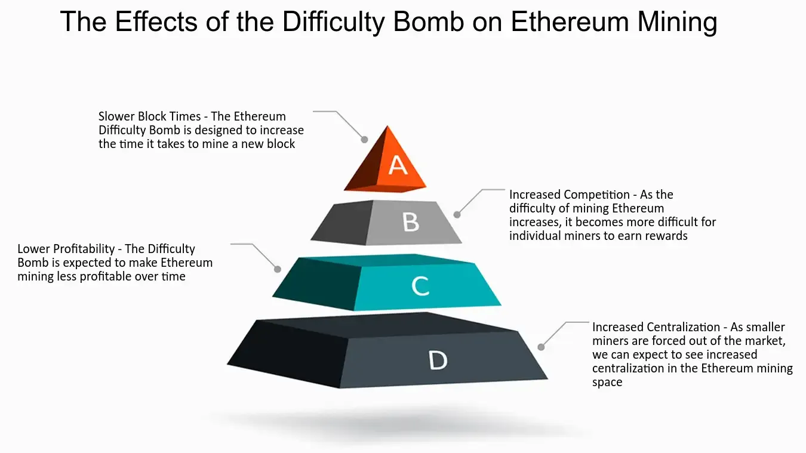

## Table of Contents

## What is the Ethereum Difficulty Bomb?

The Ethereum Difficulty Bomb is a feature built into Ethereum's software that makes mining new blocks harder over time. It's like a timer that slowly increases the difficulty of solving the math problems miners need to solve. This was added to Ethereum to help switch from its current way of working, called Proof of Work, to a new way called Proof of Delay.

The main reason for the Difficulty Bomb is to push Ethereum to move to the new system. If Ethereum doesn't switch before the bomb gets too strong, it could slow down the whole network. This would make transactions take longer and cost more. By making mining harder, it encourages everyone to update to the new system, which should be faster and use less energy.

## How does the Difficulty Bomb affect Ethereum mining?

The Ethereum Difficulty Bomb makes mining Ethereum harder as time goes on. It does this by slowly increasing the difficulty of the math problems that miners need to solve to add new blocks to the blockchain. This means that over time, miners need more powerful computers or more time to solve these problems, which can make mining less profitable and slower.

If the Difficulty Bomb keeps getting stronger without Ethereum switching to the new system, it could cause big problems. The whole network might slow down a lot, making transactions take much longer and cost more. This is why it's important for Ethereum to move to the new system before the Difficulty Bomb becomes too hard to handle.

## What is the purpose of the Difficulty Bomb in Ethereum?

The Difficulty Bomb in Ethereum is like a timer that makes mining harder over time. It was added to push Ethereum to switch from its old way of working, called Proof of Work, to a new way called Proof of Delay. The old way uses a lot of energy and can be slow, so the new way should be better.

If Ethereum doesn't switch to the new system before the Difficulty Bomb gets too strong, it could slow down the whole network. This would make transactions take longer and cost more. By making mining harder, the Difficulty Bomb encourages everyone to update to the new, faster, and more energy-efficient system.

## When was the Ethereum Difficulty Bomb first introduced?

The Ethereum Difficulty Bomb was first introduced in September 2015, when Ethereum launched its main network. It was put in place to help Ethereum move from its old way of working, called Proof of Work, to a new way called Proof of Delay. The old way uses a lot of energy and can be slow, so the new way is meant to be better.

The Difficulty Bomb slowly makes mining harder over time. This is like a timer that pushes everyone to update to the new system before it gets too hard to mine. If Ethereum doesn't switch before the bomb gets too strong, it could slow down the whole network, making transactions take longer and cost more.

## How has the Difficulty Bomb been delayed in the past?

The Ethereum Difficulty Bomb has been delayed several times in the past to give the network more time to switch to the new system. Each time, Ethereum's developers would change the code to push back when the bomb would start making mining much harder. This was done by adjusting the difficulty increase rate or by resetting the timer, which gave miners and users more time to prepare for the switch.

For example, in 2017, Ethereum delayed the Difficulty Bomb with a software update called Byzantium. This update slowed down the bomb's effect, giving Ethereum more time to work on the new system. Then, in 2019, another update called Constantinople came along, which delayed the bomb even more. These delays helped keep the network running smoothly while the switch to the new system was being worked on.

## What are the current challenges faced by Ethereum miners due to the Difficulty Bomb?

Ethereum miners are facing challenges because of the Difficulty Bomb. It makes the math problems they need to solve to mine new blocks harder over time. This means miners need more powerful computers or more time to mine, which can make it less profitable. If the Difficulty Bomb keeps getting stronger, it could slow down the whole Ethereum network, making transactions take longer and cost more.

To deal with these challenges, miners need to keep upgrading their equipment to keep up with the increasing difficulty. This can be expensive and might not be worth it if the rewards from mining go down. The pressure from the Difficulty Bomb also pushes miners to support the switch to the new system, called Proof of Delay, which should be faster and use less energy. If Ethereum doesn't switch soon, the problems for miners could get even worse.

## How does the Difficulty Bomb relate to Ethereum's transition to Proof of Stake?

The Difficulty Bomb is a way to make Ethereum switch from its old way of working, called Proof of Work, to a new way called Proof of Stake. In Proof of Work, miners use a lot of energy to solve math problems and add new blocks to the blockchain. The Difficulty Bomb makes these math problems harder over time, which can slow down the whole network if Ethereum doesn't switch to Proof of Stake soon. By making mining harder, the Difficulty Bomb pushes everyone to update to the new system, which should be faster and use less energy.

The transition to Proof of Stake is important because it's meant to solve the problems that come with Proof of Work, like high energy use and slow transaction times. In Proof of Stake, instead of miners solving math problems, people can "stake" their Ethereum to help run the network. This new way should make the network faster and more energy-efficient. The Difficulty Bomb is like a timer that reminds everyone to make this switch happen before it's too late and the network slows down too much.

## What are the potential impacts of the Difficulty Bomb on Ethereum's network security?

The Difficulty Bomb can affect Ethereum's network security in a few ways. As the bomb makes mining harder over time, it can slow down the network. If the network slows down too much, it might be easier for bad actors to attack it. For example, if blocks take longer to be added to the blockchain, someone could try to change past transactions more easily. This could make the network less secure because it's harder to keep the blockchain safe and up-to-date.

On the other hand, the Difficulty Bomb also pushes Ethereum to switch to Proof of Stake, which could make the network more secure in the long run. In Proof of Stake, people stake their Ethereum to help run the network instead of solving math problems. This new way should be faster and use less energy, which can make it harder for bad actors to attack. By encouraging the switch to Proof of Stake, the Difficulty Bomb helps Ethereum become more secure and stable over time.

## How can miners prepare for the effects of the Difficulty Bomb?

Miners can prepare for the effects of the Difficulty Bomb by keeping their mining equipment up to date. As the bomb makes mining harder, miners will need more powerful computers to solve the math problems quickly. This can be expensive, but it's important to stay competitive. Miners should also keep an eye on the news about Ethereum's plans to switch to Proof of Stake. By staying informed, they can be ready to switch their mining operations to the new system when it's time.

Another way miners can prepare is by saving up some of their mining rewards. As mining gets harder and less profitable, having some savings can help them get through the tough times. Miners might also want to think about joining a mining pool. In a mining pool, miners work together to solve the math problems, which can make it easier to keep [earning](/wiki/earning-announcement) rewards even as the Difficulty Bomb makes things harder. By being ready and working together, miners can handle the challenges of the Difficulty Bomb better.

## What are the technical details of how the Difficulty Bomb increases mining difficulty?

The Ethereum Difficulty Bomb works by slowly making the math problems that miners need to solve harder over time. It does this by adding a special number, called the "difficulty bomb [factor](/wiki/factor-investing)," to the normal difficulty level of mining. This factor starts off small but gets bigger and bigger as time goes on. The more the factor grows, the harder it becomes for miners to solve the problems and add new blocks to the blockchain.

As the difficulty bomb factor increases, it can make mining take longer and use more energy. This is because miners need more powerful computers to solve the harder problems quickly. If the difficulty gets too high, it could slow down the whole Ethereum network, making transactions take longer and cost more. That's why the Difficulty Bomb is meant to push Ethereum to switch to a new system called Proof of Stake, which should be faster and use less energy.

## How might the Difficulty Bomb influence Ethereum's market dynamics and miner profitability?

The Ethereum Difficulty Bomb can change how the market works and how much money miners make. As the bomb makes mining harder, miners need more powerful computers to keep up. This can make mining less profitable because they have to spend more money on equipment and energy. If mining gets too hard and slow, fewer people might want to mine Ethereum, which could make the price of Ethereum go down because there are fewer people adding new blocks to the blockchain.

On the other hand, the Difficulty Bomb pushes Ethereum to switch to a new system called Proof of Stake. This new system should make mining easier and use less energy, which could be good for miners in the long run. If Ethereum switches to Proof of Stake successfully, miners who adapt to the new system might find it more profitable. But if the switch takes too long, the Difficulty Bomb could keep making mining harder and less profitable, affecting the market and how much money miners make until the switch happens.

## What are the proposed solutions or alternatives to mitigate the effects of the Difficulty Bomb?

One way to deal with the Ethereum Difficulty Bomb is to delay it again. This has been done before with software updates like Byzantium and Constantinople. By changing the code, developers can push back when the bomb starts making mining much harder. This gives Ethereum more time to work on switching to the new system called Proof of Stake. Delaying the bomb helps keep the network running smoothly and gives miners more time to prepare for the change.

Another solution is to remove the Difficulty Bomb completely. Some people think this could be a good idea if Ethereum is having trouble switching to Proof of Stake. Without the bomb, mining would stay at a normal level of difficulty, and miners wouldn't have to worry about it getting harder over time. However, removing the bomb might make it harder for Ethereum to switch to the new system because there wouldn't be the same pressure to make the change. So, it's a tricky decision that needs to balance the needs of miners and the future of Ethereum.

A third option is to speed up the switch to Proof of Stake. If Ethereum can move to the new system quickly, the Difficulty Bomb won't be a problem anymore. In Proof of Stake, people stake their Ethereum to help run the network instead of solving math problems, which should be faster and use less energy. By working hard to make this switch happen, Ethereum can avoid the issues caused by the Difficulty Bomb and make the network better for everyone.

## What is Ethereum's Difficulty Bomb and how does it work?

Ethereum's Difficulty Bomb is a critical mechanism in the Ethereum blockchain designed to gradually increase the difficulty level of mining Ethereum over time. Introduced through Ethereum Improvement Proposal (EIP) 2 in 2015, the Difficulty Bomb complicates the mining process by exponentially elevating the time required to produce new blocks. This technical hurdle was envisioned to incentivize the transition from the existing Proof-of-Work (PoW) consensus model to Proof-of-Stake (PoS), aligning with Ethereum's broader technological evolution.

### Technical Functionality

The Difficulty Bomb works by implementing an exponential increase in the difficulty level used by miners to solve cryptographic puzzles required for adding new blocks to the blockchain. The mathematical function governing this mechanism can be described as:

$$

\text{Difficulty}_{\text{new}} = \text{Difficulty}_{\text{old}} + \text{base^\text{exponential factor}}
$$

where the base and exponential factor are constants set to define the growth rate of the difficulty. This increase not only slows down block production but eventually threatens to bring mining nearly to a halt, commonly referred to as the "Ice Age." The intended effect is a powerful motivator for miners to embrace Ethereum's shift to PoS, which vastly diverges from the energy-intensive PoW system.

### Purpose and Intentions

The creation and escalation of the Difficulty Bomb serve to encourage the Ethereum community to actively participate in Ethereum's strategic transitions. By imposing increasing constraints on the PoW chain, developers effectively push the system towards PoS, promising more scalable, secure, and sustainable blockchain economics that align with increasing demands and ethical standards in computing.

### Transition from Proof-of-Work to Proof-of-Stake

Ethereum's transition from PoW to PoS, marked by the Ethereum 2.0 upgrade, seeks to supplant energy-hungry mining practices with a more efficient system where validating nodes provide security to the network by staking [cryptocurrency](/wiki/cryptocurrency), rather than expending computational resources. The Difficulty Bomb complements this transition by naturally deterring PoW mining.

### Historical Adjustments

Throughout Ethereum's development, the Difficulty Bomb has been deliberately postponed through several network upgrades. Adjustments have been made during pivotal updates like the Byzantium, Constantinople, and Muir Glacier hard forks. These interventions were required to provide developers and the community additional time for thorough testing and implementation of Ethereum 2.0 features without precipitating a premature Ice Age.

Each adjustment, largely achieved by resetting the bomb's timing mechanism, has instigated robust discussions regarding strategy and timeline, offering insight into Ethereum's iterative technology management in pursuit of systemic evolution. The balancing act of deferring the Difficulty Bomb showcases Ethereum's methodical approach to integrating formidable optimizations while ensuring network stability.

The Difficulty Bomb embodies a tactical innovation within Ethereum, underpinning its transformative journey towards a state-of-the-art blockchain protocol while posing complex challenges and opportunities for stakeholders adapting to this evolving cryptosystem.

## References & Further Reading

[1]: Buterin, V. (2014). ["A Next-Generation Smart Contract and Decentralized Application Platform."](https://ethereum.org/content/whitepaper/whitepaper-pdf/Ethereum_Whitepaper_-_Buterin_2014.pdf) Ethereum Whitepaper.

[2]: Wood, G. (2014). ["Ethereum: A Secure Decentralised Generalised Transaction Ledger."](https://ethereum.github.io/yellowpaper/paper.pdf) Ethereum Yellow Paper.

[3]: Saleh, F. (2020). ["Blockchain without Waste: Proof-of-Stake."](https://academic.oup.com/rfs/article-abstract/34/3/1156/5868423) The Review of Financial Studies.

[4]: Ethereum Foundation. (2021). ["Ethereum 2.0 Phases."](https://ethereum.org/en/roadmap/) Ethereum.org.

[5]: Misiuk, B. (2020). ["The Ethereum Difficulty Bomb Explained."](https://www.investopedia.com/terms/d/difficulty-bomb.asp) Medium.

[6]: Swende, M. (2017). ["Metropolis Byzantium & Constantinople Proposals."](https://www.jstor.org/stable/j.ctt1r2dsx) Ethereum Foundation Blog.

[7]: Antonopoulos, A. M., & Wood, G. (2018). ["Mastering Ethereum: Building Smart Contracts and DApps."](https://github.com/ethereumbook/ethereumbook) O'Reilly Media.