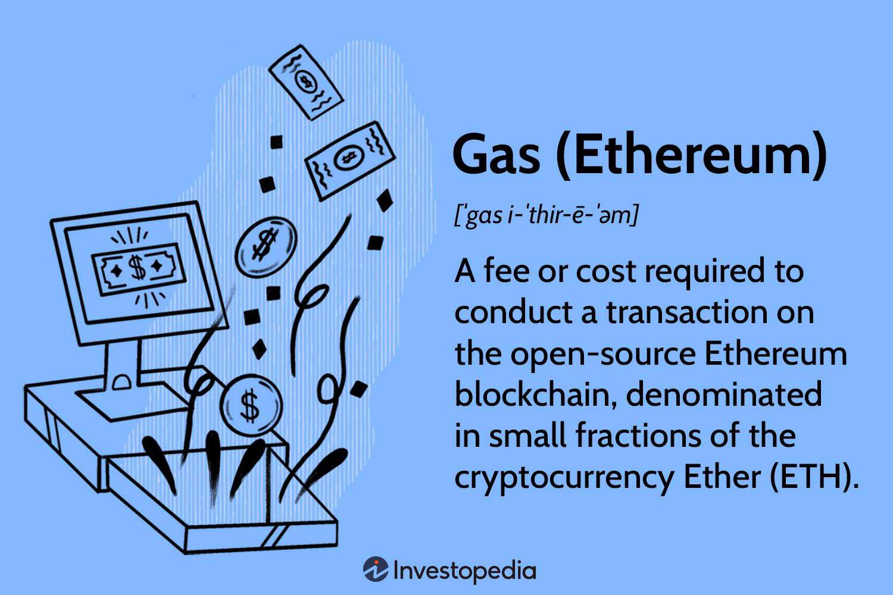

The Ethereum Merge marks a significant advancement for the Ethereum blockchain, signifying the transition from the traditional Proof of Work (PoW) to the more eco-friendly and efficient Proof of Stake (PoS) consensus mechanism. This crucial development holds substantial implications across various sectors, with a profound impact on blockchain algorithmic trading. As traders seek to harness the benefits of these new blockchain dynamics, comprehending the intricacies of the Ethereum Merge becomes essential for refining and potentially enhancing trading strategies.

The transition embodies more than just a technical adjustment; it represents a fundamental shift that has rippling effects in the world of trading. By understanding these changes, traders can better position themselves to leverage the evolving attributes of the Ethereum blockchain. The upgrade is expected to enhance transaction security, scalability, and sustainability, which are critical components for traders aiming to optimize their strategies in the cryptocurrency landscape.



In this article, we will examine how the Merge influences algorithmic trading, highlighting the aspects traders must consider as they adapt to this new environment. We'll offer insights into the updated Ethereum network, discuss its anticipated benefits, possible challenges, and suggest strategies to assist traders in navigating and thriving in this post-Merge landscape. With this transition, the Ethereum ecosystem sets the stage for both challenges and new opportunities, encouraging traders to rethink and adapt their approaches to maintain and enhance their competitive edge in the ever-evolving crypto markets.

## Table of Contents

## Understanding the Ethereum Merge

The Ethereum Merge represents a seminal shift for the Ethereum blockchain, transitioning from the Proof of Work (PoW) to the Proof of Stake (PoS) consensus mechanism. This transformation is pivotal as it aims to enhance Ethereum’s security, scalability, and sustainability. The prior PoW system functioned like a competitive race where miners used significant computational power to solve complex mathematical problems, thereby validating transactions and securing the network. This method, while robust, resulted in substantial energy consumption. In contrast, PoS replaces miners with validators, who are selected to propose new blocks based on the number of tokens staked in the network, substantially lowering energy usage.

The energy reduction aspect of the Merge is especially noteworthy. The PoS mechanism operates under the premise that stakeholders are invested in maintaining the network’s security and protocol integrity since they have a financial stake in the ecosystem. This directly translates into energy-efficient operations, with evidence suggesting potential reductions in total energy expenditure by over 99%[1]. As a result, Ethereum's carbon footprint significantly diminishes, aligning with global sustainability efforts.

The transition fundamentally alters the transaction processing dynamics on the Ethereum network. Under PoW, the focus was on hash power to secure network activity. PoS shifts this focus toward financial commitment, where the chance to validate and earn transaction fees depends on the amount of Ethereum staked. Validators receive rewards proportionate to their stake, reinforcing decentralized participation aligned with vested interest in the platform's health. This new validation method is expected to improve Ethereum's processing capacity and network consensus, thereby enhancing its scalability.

Overall, the Ethereum Merge is a strategic upgrade that moves towards more eco-friendly and economically efficient blockchain activities. With the PoS system, stakeholders are incentivized to maintain high levels of network security and robustness, compelling a new wave of blockchain participation dynamics. These changes unavoidably influence trading activities, demanding that traders adapt strategies in light of modified transaction processing and validation conditions.

[1] Buterin, V. (2018). "Proof of Stake: How I Learned to Love Weak Subjectivity." Ethereum Blog. [online] Available at: https://blog.ethereum.org/2018/01/02/proof-of-stake-how-i-learned-to-love-weak-subjectivity [Accessed Day Month Year].

## Algorithmic Trading in Blockchain

Algorithmic trading utilizes automated systems to execute trades with speed and precision, relying on algorithms crafted to detect market trends and perform trades based on specific criteria. This approach leverages technology to capitalize on favorable market conditions, ensuring trades are executed at the most opportune moments, minimizing latency and human errors.

In the context of blockchain and [cryptocurrency](/wiki/cryptocurrency) trading, algorithmic strategies become essential due to the inherent [volatility](/wiki/volatility-trading-strategies) and dynamic shifts characteristic of these markets. Cryptocurrencies, like Ethereum, often experience rapid price fluctuations, which can be challenging to navigate without the use of automated systems. Algorithmic trading provides traders with tools to manage such volatility effectively, offering a competitive edge through real-time analysis and execution capabilities.

Algorithmic systems in crypto trading are designed to maximize trading precision and provoke potential profit maximization. They analyze vast arrays of data, including price movements, historical patterns, and market sentiment, to make informed decisions. This process often involves the implementation of [machine learning](/wiki/machine-learning) and [artificial intelligence](/wiki/ai-artificial-intelligence) techniques to enhance decision-making and optimize trading strategies.

With Ethereum's recent upgrade, transitioning to a Proof of Stake (PoS) consensus mechanism through the Ethereum Merge, new opportunities and challenges arise for [algorithmic trading](/wiki/algorithmic-trading). The transition promises enhanced security and reduced energy costs, factors that influence trading algorithms and strategies. As validators replace miners in creating new blocks, transaction finality and block production rates shift, requiring traders to potentially recalibrate their algorithms to align with these changes.

Overall, algorithmic trading systems must be adaptable, continuously refined to incorporate the benefits of technological advancements while addressing the challenges posed by market conditions and structural changes within the cryptocurrency ecosystems. Ethereum's upgrade serves as a catalyst for such adaptations, urging traders to reassess and innovate their approaches to capture the evolving dynamics of the crypto market.

## Impact of the Ethereum Merge on Algo Trading

The Ethereum Merge, transitioning from Proof of Work (PoW) to Proof of Stake (PoS), has profound implications for algorithmic trading. The new PoS mechanism alters transaction finality times and block production rates, which impacts the speed and efficiency of trading algorithms employed by traders. Consequently, algorithm models must adapt to these new parameters to maintain competitive performance.

With the implementation of PoS, Ethereum’s network security is enhanced while energy consumption is substantially reduced. This increased security requires adjustments in algorithmic strategies, as enhanced trust in network operations may influence trading dynamics. The lower energy costs associated with PoS can lead to reduced transaction fees, thus affecting the cost-effectiveness of algorithmic trading operations. Traders and algorithm developers might need to recalibrate their systems to capitalize on these economic shifts.

Changes in network stability and validator behavior post-Merge necessitate revisions in risk management strategies. As validators replace miners, their behavior and incentives differ, influencing the mechanisms of transaction verification and block generation. Algorithmic trading models must be adjusted to account for the variability in transaction finality and validator reliability. This recalibration ensures that trading strategies remain robust in the face of new network dynamics.

Furthermore, the transition to PoS may demand algorithm developers recalibrate their systems for optimal performance under the new consensus mechanism. The need to adjust models and code to align with the PoS framework is critical for maintaining a competitive advantage. For instance, adjusting the timing of algorithm triggers in response to new block production rates could involve altering the parameters used within the trading algorithms. This might be achieved through Python code to efficiently implement these changes:

```python
def adjust_algorithm_parameters(current_parameters, block_rate_change, transaction_fee_reduction):
    # Example: Adjust parameters based on block rate and transaction fee changes
    adjusted_parameters = current_parameters.copy()
    adjusted_parameters['block_time'] *= block_rate_change
    adjusted_parameters['transaction_cost_factor'] *= transaction_fee_reduction
    return adjusted_parameters

# Example usage
current_params = {'block_time': 12, 'transaction_cost_factor': 1.0}
new_params = adjust_algorithm_parameters(current_params, block_rate_change=0.8, transaction_fee_reduction=0.9)
```

In summary, the Ethereum Merge represents a transformative influence on algorithmic trading within the blockchain ecosystem. The necessary adaptations, from recalibrating algorithms to revising risk management strategies, highlight the need for traders and developers to be vigilant and proactive in the evolving crypto landscape.

## Strategies for Adapting to the New Environment

To adapt to the Ethereum Merge, traders must make significant adjustments to their algorithmic trading strategies to align with changes in the transaction dynamics of the Proof of Stake (PoS) environment. Below are key strategies that can assist traders in maximizing their returns while minimizing risks:

1. **Revising Trading Algorithms**: With the transition to PoS, the fundamental mechanisms of transaction validation and block proposal differ significantly from the previous Proof of Work (PoW) system. Traders should update their algorithms to reflect these changes. The new PoS mechanism could lead to variations in latency, transaction confirmation times, and block frequency. Therefore, programmatically adjusting algorithms to handle these variables can enhance trading performance.

2. **Reassessing Staking Strategies**: PoS introduces the opportunity to generate returns through staking. Traders can optimize their portfolios by identifying which assets to stake and how much to allocate. This decision should be based on anticipated returns, validator reliability, and potential risks associated with each staking opportunity. Calculating expected yields may involve weighing the staking rewards against the probability of slashing (loss of staked assets due to validator malfunction).

3. **Testing in Simulated Environments**: To mitigate risks associated with unforeseen changes in the network’s behavior post-Merge, testing algorithms in simulated environments is crucial. These simulations can mimic Ethereum's operational state post-Merge, enabling traders to observe how their strategies perform under new conditions. Tools like backtesting frameworks can be used for this purpose. In Python, simulations might be implemented with libraries such as PyAlgoTrade or Backtrader.

    ```python
    import backtrader as bt

    class MyStrategy(bt.Strategy):
        def __init__(self):
            self.dataopen = self.datas[0].open

        def next(self):
            if self.dataopen[0] > self.dataopen[-1]:  # Example condition
                self.buy(size=10)
            elif self.dataopen[0] < self.dataopen[-1]:
                self.sell(size=10)

    cerebro = bt.Cerebro()
    cerebro.addstrategy(MyStrategy)
    cerebro.run()
    ```

4. **Diversifying Trading Approaches**: A diverse set of strategies may be required to effectively handle the variability and complexity of the PoS system. By employing a variety of trading techniques such as market-making, arbitrage, and momentum trading, traders can exploit different aspects of the blockchain. This diversification helps in balancing risk and enhancing the opportunity to benefit from the unique characteristics of Ethereum's PoS.

5. **Continuous Monitoring and Updates**: Post-Merge, the Ethereum network will evolve, necessitating ongoing adjustments to trading algorithms. Regularly updating these algorithms based on new metrics and insights will be essential for maintaining a competitive edge. Implementing real-time monitoring tools can aid in the surveillance of market dynamics and network conditions, ensuring strategies are consistently optimized and responsive to change.

By implementing these strategies, traders can effectively transition to and thrive in Ethereum's post-Merge PoS environment, optimizing their returns while navigating the challenges of a newly structured blockchain ecosystem.

## Conclusion

The Ethereum Merge is a transformative step for the blockchain, with far-reaching consequences for algorithmic trading. This upgrade from Proof of Work (PoW) to Proof of Stake (PoS) introduces several adjustments that traders must navigate, but also unveils new possibilities for enhancing trading strategies. By understanding and internalizing these changes, traders are better positioned to thrive within the evolving crypto landscape. 

Adapting algorithms to the new consensus mechanism will require diligence and a solid grasp of the technical modifications post-Merge. The shift to PoS enhances network efficiency, alters block production timings, and could potentially reduce transaction fees, making it imperative for traders to reformulate their strategies in response to these adjustments. Strategies such as revising trading algorithms, adjusting staking methodologies, and continuously testing within conditions that mimic the updated network environment will prove beneficial.

In this newly emerged framework, staying informed and agile becomes indispensable. Traders must regularly monitor and update their strategies to keep pace with ongoing developments on the Ethereum network. Utilizing data-driven approaches and leveraging advanced technologies could offer competitive edges in algorithmic trading.

The future of algorithmic trading on Ethereum holds promise, provided that traders embrace these changes with a proactive mindset. By aligning their trading systems to the nuanced dynamics of a PoS-based Ethereum, traders can harness the full potential of the blockchain's post-Merge era, setting the stage for increased efficiency and profitability in their trading endeavors.

## References & Further Reading

[1]: Buterin, V. (2018). ["Proof of Stake: How I Learned to Love Weak Subjectivity."](https://blog.ethereum.org/2014/11/25/proof-stake-learned-love-weak-subjectivity) Ethereum Blog.

[2]: Narayanan, A., Bonneau, J., Felten, E., Miller, A., & Goldfeder, S. (2016). ["Bitcoin and Cryptocurrency Technologies: A Comprehensive Introduction."](https://press.princeton.edu/books/hardcover/9780691171692/bitcoin-and-cryptocurrency-technologies) Princeton University Press.

[3]: Antonopoulos, A. M. (2018). ["Mastering Ethereum: Building Smart Contracts and DApps."](https://www.amazon.com/Mastering-Ethereum-Building-Smart-Contracts/dp/1491971940) O'Reilly Media.

[4]: Vigna, P., & Casey, M. J. (2015). ["The Age of Cryptocurrency: How Bitcoin and Digital Money Are Challenging the Global Economic Order."](https://archive.org/details/ageofcryptocurre0000vign) St. Martin's Press.

[5]: Malkiel, B. G. (2015). ["A Random Walk Down Wall Street: The Time-Tested Strategy for Successful Investing."](https://yourknowledgedigest.org/wp-content/uploads/2020/04/a-random-walk-down-wall-street.pdf) W. W. Norton & Company.