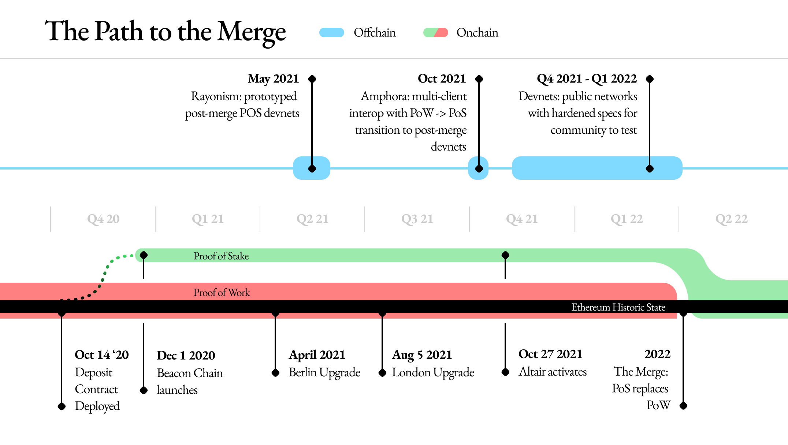

## Table of Contents

## What is Ethereum?

Ethereum is a type of cryptocurrency, similar to Bitcoin, but it's more than just a digital currency. It's a platform where people can build and use applications that run on blockchain technology. Blockchain is like a digital ledger that records transactions and other information in a way that's very secure and hard to change.

One of the coolest things about Ethereum is that it allows for something called smart contracts. These are like digital agreements that automatically carry out the terms of a contract when certain conditions are met. For example, if you're renting a house, a smart contract could automatically send the rent money to the landlord's account every month without needing a middleman.

Ethereum has its own cryptocurrency called Ether, which people use to pay for transactions and services on the Ethereum network. Just like Bitcoin, the value of Ether can go up and down, and people can buy, sell, or trade it. Ethereum is used by many people and businesses around the world, making it a big part of the growing world of blockchain technology.

## What is meant by the Ethereum Network Transition?

The Ethereum Network Transition refers to the process of upgrading the Ethereum blockchain from one version to another. This is important because it helps to improve the network's performance, security, and features. Imagine if you had an old phone and you wanted to upgrade to a new model with better features; that's kind of what the Ethereum Network Transition is like for the blockchain.

One of the major transitions that Ethereum has been working on is called Ethereum 2.0, or Eth2. This upgrade aims to make the network faster and more energy-efficient. Instead of using a lot of electricity to process transactions like the old version, Eth2 uses a new method that's kinder to the environment. This transition is happening in stages, so it's a big project that takes time and careful planning to make sure everything goes smoothly.

## Why is the Ethereum Network transitioning?

The Ethereum Network is transitioning mainly to solve some big problems it has been facing. One big issue is that it can be slow and expensive to use. When a lot of people want to use Ethereum at the same time, it can take a long time for their transactions to go through, and they might have to pay more money to get their transactions processed faster. Another problem is that the way Ethereum works now uses a lot of electricity, which is not good for the environment. By transitioning, Ethereum wants to make things faster, cheaper, and more eco-friendly.

The transition to Ethereum 2.0 is a big plan to fix these problems. It changes the way the network works from something called "Proof of Work" to "Proof of Stake." Proof of Work is what makes Ethereum use so much electricity because it needs a lot of computers working hard to process transactions. Proof of Stake is different because it lets people who own a lot of Ether help run the network without using as much power. This makes the whole system more efficient and kinder to the planet. The transition is happening in stages to make sure everything goes smoothly and the network keeps working well during the change.

## What are the main goals of the Ethereum Network Transition?

The main goal of the Ethereum Network Transition is to make the Ethereum blockchain faster and cheaper to use. Right now, when a lot of people want to use Ethereum at the same time, it can get slow and people might have to pay more money to get their transactions done quickly. By transitioning, Ethereum wants to fix this problem so that more people can use it easily and without spending too much.

Another important goal is to make Ethereum better for the environment. The current way Ethereum works, called "Proof of Work," uses a lot of electricity because it needs many computers working hard to process transactions. The transition to "Proof of Stake" will change this. With Proof of Stake, people who own a lot of Ether can help run the network without using as much power. This makes Ethereum kinder to the planet and more sustainable in the long run.

Overall, the transition aims to improve the user experience by making transactions quicker and less costly, while also reducing the environmental impact of the network. These changes are being rolled out in stages to ensure a smooth transition and keep the network running well during the upgrade.

## What is Ethereum 2.0 and how does it relate to the transition?

Ethereum 2.0, also called Eth2, is a big upgrade to the Ethereum blockchain. It's like getting a new version of a computer program, but for a whole network. The main goal of Ethereum 2.0 is to make the network faster and cheaper to use. Right now, if lots of people want to use Ethereum at the same time, it can get slow and they might have to pay more to get their transactions done quickly. Ethereum 2.0 wants to fix this so that more people can use it easily and without spending too much money.

Another important part of Ethereum 2.0 is making the network better for the environment. The current way Ethereum works, called "Proof of Work," uses a lot of electricity because it needs many computers working hard to process transactions. Ethereum 2.0 will change this to a new way called "Proof of Stake." With Proof of Stake, people who own a lot of Ether can help run the network without using as much power. This makes Ethereum kinder to the planet. The transition to Ethereum 2.0 is happening in stages to make sure everything goes smoothly and the network keeps working well during the change.

## What is the difference between Proof of Work (PoW) and Proof of Stake (PoS)?

Proof of Work (PoW) and Proof of Stake (PoS) are two different ways that a blockchain like Ethereum can choose who gets to add new transactions to the chain. With PoW, computers have to solve hard math problems to add a new block of transactions. This is called mining, and it uses a lot of electricity because the computers need to work really hard. The first computer to solve the problem gets to add the block and is rewarded with some [cryptocurrency](/wiki/cryptocurrency). This method makes the network secure because it's hard for anyone to change the transactions once they're added.

Proof of Stake (PoS) is different because it doesn't need computers to solve math problems. Instead, it lets people who own a lot of the cryptocurrency help add new blocks. In Ethereum's case, people who own a lot of Ether can "stake" their Ether to help run the network. The more Ether someone stakes, the better chance they have of being chosen to add a new block. This way uses a lot less electricity because it doesn't need computers to work so hard. PoS also makes the network secure because people who stake their Ether have a lot to lose if they try to cheat the system.

## How will the transition from PoW to PoS affect Ethereum's energy consumption?

The transition from Proof of Work (PoW) to Proof of Stake (PoS) will make Ethereum use a lot less energy. Right now, with PoW, many computers have to solve hard math problems to add new transactions to the blockchain. This is called mining, and it uses a lot of electricity because the computers need to work really hard all the time. When Ethereum switches to PoS, it won't need these computers to solve math problems anymore. Instead, people who own a lot of Ether can help run the network by staking their Ether, which uses much less power.

This change is good for the environment because it means Ethereum won't use as much electricity. PoS is a lot more energy-efficient than PoW because it doesn't need all those computers working hard. By making this switch, Ethereum will be kinder to the planet and help reduce the amount of energy that cryptocurrencies use. This is important because it makes the whole system more sustainable in the long run.

## What are the phases of the Ethereum Network Transition?

The Ethereum Network Transition to Ethereum 2.0 is happening in three main phases. The first phase is called the Beacon Chain. This phase started in December 2020 and is like the backbone of the new system. It helps manage the new way of running the network with Proof of Stake. During this phase, people can start staking their Ether, which means they can help run the network and earn rewards.

The second phase is called Shard Chains. This phase will make Ethereum faster by breaking the network into smaller parts, called shards. Each shard will handle its own set of transactions, so more transactions can happen at the same time. This will make the network much quicker and able to handle more users. The Shard Chains phase is still being worked on and hasn't started yet.

The final phase is called the Merge. This is when the current Ethereum network, which uses Proof of Work, will connect with the new Ethereum 2.0 system that uses Proof of Stake. After the Merge, the whole network will use Proof of Stake, making it more energy-efficient. The Merge is planned to happen soon, but it's important to make sure everything works well before it happens.

## What is sharding and how will it improve Ethereum's scalability?

Sharding is a way to make the Ethereum network faster by breaking it into smaller parts called shards. Right now, all transactions on Ethereum happen on one big chain, which can get slow when a lot of people want to use it at the same time. By splitting the network into shards, each shard can handle its own set of transactions. This means more transactions can happen at the same time, making the whole network quicker and able to handle more users.

This change will make Ethereum much more scalable, which means it can grow and handle more people using it without slowing down. Imagine if you had one big road where everyone had to drive, and it got really crowded. Sharding is like building more roads so that more cars can move at the same time. This way, Ethereum can keep up with more users and more transactions, making it a better platform for everyone.

## What are the potential risks and challenges associated with the Ethereum Network Transition?

The Ethereum Network Transition to Ethereum 2.0 comes with some risks and challenges. One big challenge is making sure everything works smoothly during the change. The transition is happening in stages, and if something goes wrong in one stage, it could cause problems for the whole network. For example, if the new system has bugs or if there's a security issue, it could slow down the transition or even cause people to lose money. Another risk is that not everyone might agree with the changes, which could lead to disagreements in the community and possibly even a split in the network.

Another challenge is making sure that the new system is as secure as the old one. Right now, Ethereum uses Proof of Work, which is very secure because it's hard to change transactions once they're added. With Proof of Stake, the security comes from people staking their Ether, and if not enough people stake their Ether, the network might not be as safe. Also, moving to a new system means learning new things, and some people might find it hard to understand how to use the new Ethereum 2.0. This could make it harder for everyone to switch over and use the new system comfortably.

## How can users prepare for the Ethereum Network Transition?

Users can prepare for the Ethereum Network Transition by first learning about what's changing. Ethereum 2.0 is a big upgrade that will make the network faster and kinder to the environment. It's good to read about the new Proof of Stake system and how it's different from the old Proof of Work system. Knowing about the three phases of the transition—the Beacon Chain, Shard Chains, and the Merge—can also help users understand what's happening and when.

Another way to get ready is to start staking Ether if you have some. Staking means you help run the new network and can earn rewards for doing so. You can do this through special services or by setting up your own validator. It's also important to keep your software and wallets up to date. As Ethereum goes through these changes, new versions of software will come out to work with the new system, so staying updated will make the transition smoother for you.

## What impact might the Ethereum Network Transition have on the broader cryptocurrency market?

The Ethereum Network Transition could have a big effect on the whole cryptocurrency market. Since Ethereum is one of the biggest and most used cryptocurrencies, any big changes to it can make other cryptocurrencies move too. If the transition goes well and makes Ethereum faster and cheaper to use, more people might want to use it. This could make the price of Ether go up and might make other cryptocurrencies more popular too, as people see how well Ethereum is doing.

But there are also some risks. If something goes wrong during the transition, it could make people worried about using Ethereum and other cryptocurrencies. This could make the prices of cryptocurrencies go down. Also, because Ethereum is so important, any big changes to it can make the whole market feel unsure. This could make people more careful about buying and selling cryptocurrencies until they see how the transition turns out.

## References & Further Reading

[1]: Buterin, V. (2018). ["Proof of Stake: How I Learned to Love Weak Subjectivity."](https://blog.ethereum.org/2014/11/25/proof-stake-learned-love-weak-subjectivity) Ethereum Blog.

[2]: Narayanan, A., Bonneau, J., Felten, E., Miller, A., & Goldfeder, S. (2016). ["Bitcoin and Cryptocurrency Technologies: A Comprehensive Introduction."](https://press.princeton.edu/books/hardcover/9780691171692/bitcoin-and-cryptocurrency-technologies) Princeton University Press.

[3]: Antonopoulos, A. M. (2018). ["Mastering Ethereum: Building Smart Contracts and DApps."](https://www.amazon.com/Mastering-Ethereum-Building-Smart-Contracts/dp/1491971940) O'Reilly Media.

[4]: Vigna, P., & Casey, M. J. (2015). ["The Age of Cryptocurrency: How Bitcoin and Digital Money Are Challenging the Global Economic Order."](https://archive.org/details/ageofcryptocurre0000vign) St. Martin's Press.

[5]: Malkiel, B. G. (2015). ["A Random Walk Down Wall Street: The Time-Tested Strategy for Successful Investing."](https://yourknowledgedigest.org/wp-content/uploads/2020/04/a-random-walk-down-wall-street.pdf) W. W. Norton & Company.