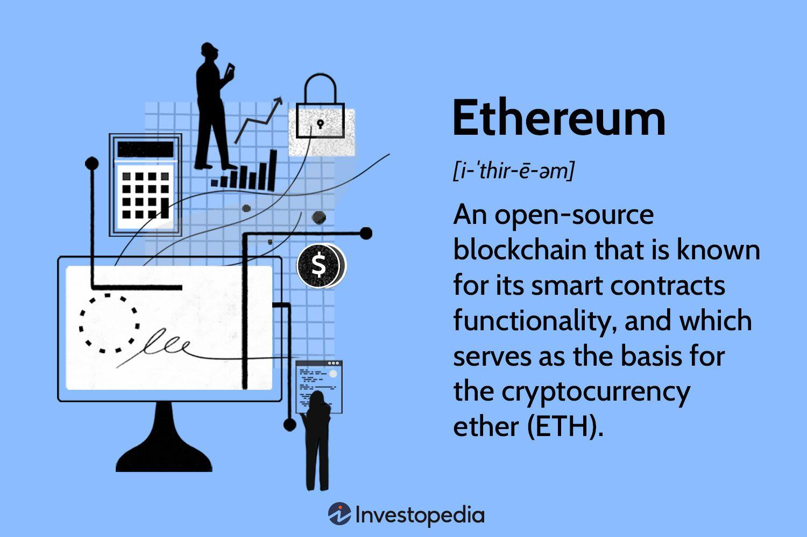

## Table of Contents

## What is Ethereum and who created it?

Ethereum is a type of digital money and platform that lets people create and use different kinds of apps and money on the internet. It's like a big computer that everyone can use and add to. People use Ethereum to do things like buy things, play games, and even make new kinds of digital money.

Ethereum was created by a guy named Vitalik Buterin. He was born in Russia and moved to Canada when he was young. Vitalik had the idea for Ethereum when he was just 19 years old. He thought it would be cool to have a platform where people could do more than just send money to each other. So, he worked with other smart people to build Ethereum, and it started working in 2015.

## How does Ethereum differ from Bitcoin?

Ethereum and Bitcoin are both types of digital money that you can use on the internet, but they are different in some important ways. Bitcoin is mainly used as a digital version of cash. People use it to buy things or send money to each other without needing a bank. Bitcoin's main goal is to be a safe and secure way to do this, and it does this job very well. It's like having digital coins that you can spend anywhere that accepts Bitcoin.

Ethereum, on the other hand, is not just digital money; it's more like a big computer that everyone can use. Besides having its own digital money called Ether, Ethereum lets people create and use special programs called smart contracts. These are like digital agreements that automatically do what they're supposed to do when certain things happen. This means you can use Ethereum to do more than just send money; you can build all sorts of apps and games on it. It's like having a digital playground where you can create and play.

So, while Bitcoin is mostly about being a good digital money, Ethereum is about being a platform where people can build and do all sorts of things. Both are important, but they serve different purposes on the internet.

## What is the Ethereum blockchain and how does it work?

The Ethereum blockchain is like a big digital notebook that keeps track of everything that happens on the Ethereum platform. It's made up of blocks, which are like pages in the notebook. Each block contains information about transactions, like who sent Ether to whom, and also about smart contracts, which are special programs that run on Ethereum. Every time someone does something on Ethereum, like sending money or running a smart contract, it gets written into a new block. These blocks are added to the blockchain one after the other, creating a long chain of information that everyone can see and check.

The way the Ethereum blockchain works is pretty cool. When someone wants to do something on Ethereum, like send Ether or run a smart contract, they send a request to the network. This request is then checked by special computers called nodes, which make sure it's okay. Once it's verified, the request is added to a block. But before a block can be added to the blockchain, it needs to be approved by the network. This is done by people called miners, who use their computers to solve hard math problems. When a miner solves the problem, they get to add the block to the blockchain and are rewarded with some Ether. This process keeps the blockchain safe and makes sure that everything that happens on Ethereum is recorded correctly and can't be changed later.

## What are smart contracts and how are they used on Ethereum?

Smart contracts are special programs that run on the Ethereum blockchain. They are like digital agreements that automatically do what they're supposed to do when certain conditions are met. For example, if you and your friend make a bet on who will win a game, you can use a smart contract to hold the money until the game is over. Once the game ends, the smart contract will automatically give the money to the winner without anyone needing to do anything else.

People use smart contracts on Ethereum for all sorts of things. They can be used for things like buying and selling digital art, managing shared money in a group, or even creating new types of digital money. Because smart contracts run on the Ethereum blockchain, everything they do is recorded and can't be changed later, which makes them safe and reliable. This means you can trust that a smart contract will do exactly what it's supposed to do, without needing a middleman like a bank or a lawyer.

## What is Ether (ETH) and what is its role in the Ethereum ecosystem?

Ether, often called ETH, is the digital money that powers the Ethereum platform. It's like the gas that keeps everything running smoothly. When people want to do something on Ethereum, like send money or run a smart contract, they need to pay a small amount of Ether to cover the costs. This payment is called a gas fee, and it helps keep the network safe and working well.

ETH is important because it's what makes it possible for people to use Ethereum. Without Ether, you wouldn't be able to send money, create smart contracts, or do any of the cool things that Ethereum allows. It's also used by miners, who are the people that help add new blocks to the Ethereum blockchain. They get paid in Ether for their work, which encourages them to keep the network running smoothly.

## How can someone acquire Ether?

One way to get Ether is by buying it from a [cryptocurrency](/wiki/cryptocurrency) exchange. These are websites where people can trade different types of digital money. You can use regular money, like dollars or euros, to buy Ether on these exchanges. You'll need to create an account, add money to it, and then you can trade that money for Ether. It's a bit like buying something online, but instead of getting a physical item, you get digital money.

Another way to get Ether is by [earning](/wiki/earning-announcement) it. Some people do this by helping to run the Ethereum network. They do this by becoming miners, which means they use their computers to solve hard math problems. When they solve these problems, they get to add new blocks to the Ethereum blockchain and are rewarded with Ether. It's like getting paid for doing important work that keeps the Ethereum network going.

## What are the different types of Ethereum wallets and how do they work?

There are different types of Ethereum wallets, and each one works a bit differently. One type is the software wallet, which you can use on your computer or phone. These wallets are like apps that let you store, send, and receive Ether. They are easy to use and usually have a simple interface that helps you manage your digital money. Some popular software wallets are MetaMask, which you can use as a browser extension, and Trust Wallet, which you can download on your phone. These wallets keep your Ether safe by using special codes called private keys, which only you should know.

Another type of wallet is the hardware wallet, which is like a small device that you can hold in your hand. These wallets are very secure because they keep your private keys offline, which means they are not connected to the internet where hackers might try to steal them. You can use a hardware wallet by plugging it into your computer and using it with a software wallet. Some well-known hardware wallets are Ledger and Trezor. They are a bit more expensive than software wallets, but they offer extra security for people who want to keep their Ether very safe.

The last type is the paper wallet, which is a simple but less common option. A paper wallet is just a piece of paper with your public and private keys printed on it. You can create one by using a special website that generates these keys for you. To use your Ether, you would need to enter these keys into a software wallet. Paper wallets are very secure because they are not connected to the internet, but they can be lost or damaged easily, so you have to be careful with them.

## What is gas in Ethereum and how does it affect transactions?

Gas in Ethereum is like the fuel that powers the network. Whenever you want to do something on Ethereum, like send Ether or run a smart contract, you need to pay a small amount of Ether as a fee. This fee is called gas, and it's what keeps the Ethereum network running smoothly. The more complicated the thing you want to do, the more gas it will use. Miners, who are the people that help add new blocks to the Ethereum blockchain, get paid in gas for their work. This encourages them to keep the network safe and working well.

Gas affects transactions because it determines how fast your transaction will be processed and how much it will cost. If you set a high gas price, your transaction will be processed faster because miners will want to work on it first to get the bigger reward. But if you set a low gas price, your transaction might take longer to be processed because miners might choose to work on other transactions that pay more. So, you have to find a balance between how quickly you want your transaction to happen and how much you're willing to pay for it.

## What are Ethereum Improvement Proposals (EIPs) and how do they influence the platform?

Ethereum Improvement Proposals, or EIPs, are like suggestions for making Ethereum better. They are ideas that anyone can come up with to improve how Ethereum works. These ideas can be about changing the rules of the network, adding new features, or fixing problems. Once an EIP is written, it goes through a process where people in the Ethereum community discuss it and decide if it's a good idea. If enough people agree, the EIP can be put into action, which means the Ethereum platform gets updated with the new idea.

EIPs influence the platform by helping it grow and stay up to date. They make sure that Ethereum keeps getting better and can do new things. For example, some EIPs have made transactions faster and cheaper, while others have added new ways for people to use Ethereum. By having a system where anyone can suggest improvements, Ethereum stays flexible and can adapt to what people need. This helps keep the platform strong and useful for everyone who uses it.

## What is Ethereum 2.0 and what changes does it bring to the network?

Ethereum 2.0 is a big update to the Ethereum platform that aims to make it faster, safer, and more able to handle lots of people using it at the same time. One of the main changes is switching from a system called Proof of Work, where miners use a lot of computer power to solve math problems, to a new system called Proof of Stake. In Proof of Stake, instead of using lots of energy, people can help run the network by locking up some of their Ether as a kind of promise that they'll do a good job. This makes the network more eco-friendly and easier for more people to join in.

Another big change is the introduction of something called sharding. Sharding is like breaking the Ethereum network into smaller pieces, called shards, so that it can process more transactions at the same time. This means that Ethereum 2.0 will be able to handle more people doing things on the network without slowing down. Together, these changes will make Ethereum a better platform for all the cool things people want to do with it, like using smart contracts, creating new apps, and sending money around the world.

## How does Ethereum support decentralized applications (dApps)?

Ethereum supports decentralized applications, or dApps, by providing a platform where these apps can run without needing a central authority like a company or a government to control them. DApps are like regular apps you use on your phone or computer, but they work on the Ethereum blockchain. This means that everything the dApp does is recorded on the blockchain, so it's safe and transparent. People can use dApps to do things like play games, trade digital art, or even manage shared money with friends. Because dApps run on Ethereum, they can use smart contracts to automatically do things when certain conditions are met, making them very useful and reliable.

The Ethereum blockchain is what makes dApps possible. It's like a big, shared computer that everyone can use and add to. When you use a dApp, you're actually interacting with the Ethereum network. You might need to pay a small amount of Ether, Ethereum's digital money, to cover the costs of running the dApp. This helps keep the network running smoothly and rewards the people who help maintain it. By using Ethereum, dApps can be more secure and open to everyone, which is why they are becoming more popular for all sorts of uses.

## What are the current challenges and future prospects for Ethereum?

Right now, Ethereum faces some challenges. One big problem is that it can get slow and expensive when a lot of people want to use it at the same time. This is because it uses a system called Proof of Work, which takes a lot of computer power and energy. Another challenge is keeping the network safe from hackers and making sure that everyone agrees on how to improve Ethereum. It's important for the Ethereum community to work together to solve these problems so that more people can use it easily.

The future looks bright for Ethereum, though. With the big update called Ethereum 2.0, the platform is switching to a new system called Proof of Stake, which will be faster, cheaper, and more eco-friendly. This update will also make Ethereum better at handling lots of users at once, thanks to something called sharding. As Ethereum keeps improving, more and more people might use it for all sorts of things, like buying and selling digital art, playing games, and even managing money with friends. The possibilities are exciting, and Ethereum could become an even bigger part of our digital world.

## References & Further Reading

[1]: Buterin, V. (2013). ["Ethereum Whitepaper."](https://ethereum.org/en/whitepaper/) Ethereum Foundation.

[2]: Narayanan, A., Bonneau, J., Felten, E., Felten, E., Miller, A., & Goldfeder, S. (2016). ["Bitcoin and Cryptocurrency Technologies."](https://press.princeton.edu/books/hardcover/9780691171692/bitcoin-and-cryptocurrency-technologies) Princeton University Press.

[3]: Szabo, N. (1997). ["Smart Contracts: Building Blocks for Digital Markets."](https://www.semanticscholar.org/paper/Smart-Contracts%3A-Building-Blocks-for-Digital-Szabo/9b6cd3fe0bf5455dd44ea31422d015b003b5568f) 

[4]: Wood, G. (2014). ["Ethereum: A Secure Decentralized Generalized Transaction Ledger."](https://ethereum.github.io/yellowpaper/paper.pdf) Ethereum Yellow Paper.

[5]: Lopez de Prado, M. (2018). ["Advances in Financial Machine Learning."](https://www.amazon.com/Advances-Financial-Machine-Learning-Marcos/dp/1119482089) Wiley.

[6]: Antonopoulos, A. M., & Wood, G. (2018). ["Mastering Ethereum: Building Smart Contracts and DApps."](https://www.amazon.com/Mastering-Ethereum-Building-Smart-Contracts/dp/1491971940) O'Reilly Media.

[7]: Chan, E. P. (2009). ["Quantitative Trading: How to Build Your Own Algorithmic Trading Business."](https://github.com/ftvision/quant_trading_echan_book) Wiley.

[8]: Jansen, S. (2020). ["Machine Learning for Algorithmic Trading."](https://github.com/stefan-jansen/machine-learning-for-trading) Packt Publishing.

[9]: Schär, F., Berentsen, A. (2020). ["Bitcoin, Blockchain, and Cryptoassets: A Comprehensive Introduction."](https://mitpress.mit.edu/9780262539166/bitcoin-blockchain-and-cryptoassets/) MIT Press.