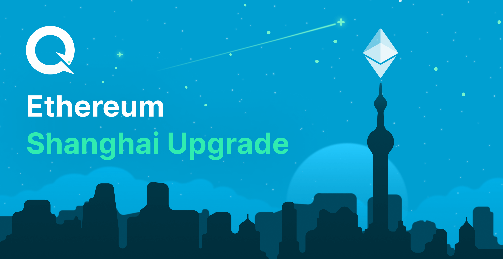

## Table of Contents

## What is the Ethereum Shanghai Upgrade?

The Ethereum Shanghai Upgrade is an important update to the Ethereum blockchain. It's the next big step after the Merge, which changed Ethereum from a proof-of-work system to a proof-of-stake system. The Shanghai Upgrade will make it easier for people to take out their staked Ethereum, or ETH, from the network. This is important because before the upgrade, people couldn't easily get their ETH back after staking it.

The upgrade also includes other improvements to make Ethereum work better and faster. These changes will help developers build new apps and tools on Ethereum more easily. Overall, the Shanghai Upgrade is a big deal because it will make Ethereum more user-friendly and efficient, which could attract more people to use and invest in the network.

## When is the Ethereum Shanghai Upgrade scheduled to occur?

The Ethereum Shanghai Upgrade is planned to happen in March 2023. This date is important because it's when people who have staked their ETH will finally be able to withdraw it easily.

This upgrade is a big step for Ethereum. It will make the network better and faster, which is good for everyone who uses it. People are excited about it because it will make Ethereum easier to use and more appealing to new users.

## What are the main goals of the Ethereum Shanghai Upgrade?

The main goal of the Ethereum Shanghai Upgrade is to let people take out their staked Ethereum, or ETH, easily. Before this upgrade, if you staked your ETH, you couldn't get it back right away. This made some people worried about locking up their money. With the Shanghai Upgrade, people will feel more comfortable staking their ETH because they can get it back whenever they need to.

Another important goal is to make Ethereum work better and faster. The upgrade includes changes that will help the network run more smoothly. This is good for developers who build apps and tools on Ethereum because it will be easier for them to create new things. When Ethereum works better, more people will want to use it, which can make the whole network more popular and valuable.

## How does the Shanghai Upgrade improve Ethereum's scalability?

The Shanghai Upgrade helps make Ethereum more scalable by introducing changes that make the network run more smoothly. One big way it does this is by allowing people to withdraw their staked ETH easily. This can encourage more people to stake their ETH, which helps the network process transactions faster and handle more activity. When more people stake their ETH, it means more validators are working to keep the network running smoothly, which is good for scalability.

Another way the Shanghai Upgrade improves scalability is by including other technical improvements that make Ethereum work better overall. These improvements help the network handle more transactions at once and reduce delays. By making Ethereum more efficient, the upgrade makes it easier for the network to grow and support more users and applications. This means Ethereum can keep up with increasing demand and continue to be a useful platform for developers and users alike.

## What is the role of Ethereum Improvement Proposals (EIPs) in the Shanghai Upgrade?

Ethereum Improvement Proposals, or EIPs, are like suggestions for making Ethereum better. They are important for the Shanghai Upgrade because they help decide what changes should be made. For the Shanghai Upgrade, EIPs are used to make sure that the new features and improvements work well and are good for everyone who uses Ethereum. They help make the process of upgrading the network more organized and clear.

Some of the EIPs included in the Shanghai Upgrade focus on letting people take out their staked ETH easily. This is a big deal because it makes staking more attractive to people. Other EIPs work on making the network faster and more efficient. By using EIPs, the people who work on Ethereum can make sure that all these changes are thought out carefully and will help Ethereum grow and improve.

## How will the Shanghai Upgrade affect Ethereum's transaction fees?

The Shanghai Upgrade is expected to help lower Ethereum's transaction fees over time. It does this by making the network run more smoothly and efficiently. When the network works better, it can handle more transactions at once, which means less competition for space on the blockchain. This can lead to lower fees because people won't have to pay as much to get their transactions processed quickly.

However, the immediate effect on transaction fees might not be very noticeable. The main goal of the Shanghai Upgrade is to let people take out their staked ETH easily and make the network more efficient overall. While these changes can help with scalability and efficiency, it might take some time before we see a big drop in fees. As more people start using Ethereum because it's easier to stake and the network runs better, the fees could go down in the long run.

## What are the key EIPs included in the Shanghai Upgrade?

The Shanghai Upgrade includes several key Ethereum Improvement Proposals (EIPs) that are important for making Ethereum better. One of the main EIPs is EIP-4895, which is all about letting people take out their staked ETH easily. Before this EIP, if you staked your ETH, you couldn't get it back right away. This made some people worried about locking up their money. With EIP-4895, people will feel more comfortable staking their ETH because they can get it back whenever they need to.

Another important EIP is EIP-3651, which helps make the network more efficient. This EIP works on improving how Ethereum handles transactions, making it faster and smoother. By making these changes, the network can handle more activity without getting slowed down. This is good for everyone who uses Ethereum because it means the network can keep up with more users and more transactions.

## How does the Shanghai Upgrade enhance Ethereum's security?

The Shanghai Upgrade makes Ethereum more secure by encouraging more people to stake their ETH. When more people stake their ETH, it means there are more validators working to keep the network safe. Validators help make sure that all the transactions on Ethereum are correct and that no one is trying to cheat the system. With more validators, it's harder for anyone to attack the network because they would need to control a lot of them to do any harm.

Another way the Shanghai Upgrade helps with security is by making the network more efficient. When Ethereum runs smoothly, it's less likely to have problems that could be used by attackers. The upgrade includes changes that make the network faster and better at handling transactions. This means fewer chances for security issues to pop up, which is good for everyone who uses Ethereum. Overall, these improvements help make Ethereum a safer place for people to use and trust.

## What impact will the Shanghai Upgrade have on Ethereum staking and withdrawals?

The Shanghai Upgrade will make it easier for people to take out their staked Ethereum, or ETH. Before this upgrade, if you staked your ETH, you couldn't get it back right away. This made some people worried about locking up their money. With the Shanghai Upgrade, people will feel more comfortable staking their ETH because they can get it back whenever they need to. This is a big deal because it will encourage more people to stake their ETH, which helps the network run better.

The upgrade also makes staking more attractive by making the network more efficient. When more people stake their ETH, it means there are more validators working to keep the network safe and running smoothly. This is good for everyone who uses Ethereum because it makes the network more secure and able to handle more transactions. Overall, the Shanghai Upgrade will make staking easier and more appealing, which can help Ethereum grow and improve.

## How can developers prepare their applications for the Shanghai Upgrade?

Developers can prepare their applications for the Shanghai Upgrade by staying updated on the changes that are coming. They should read about the Ethereum Improvement Proposals (EIPs) like EIP-4895 and EIP-3651, which are part of the upgrade. These EIPs will make it easier for people to take out their staked ETH and make the network more efficient. By understanding these changes, developers can make sure their apps will work well with the new version of Ethereum.

It's also a good idea for developers to test their applications on testnets before the upgrade happens. Testnets are like practice versions of Ethereum where developers can try out their apps to see if they work right. By testing on a testnet, developers can find and fix any problems before the real upgrade happens. This way, when the Shanghai Upgrade goes live, their apps will be ready and work smoothly with the new features and improvements.

## What are the potential risks and challenges associated with the Shanghai Upgrade?

The Shanghai Upgrade, while promising many benefits, also comes with some risks and challenges. One big risk is that something might go wrong during the upgrade process. Even though the people working on Ethereum test everything carefully, there's always a chance that a mistake could cause problems on the network. This could lead to delays or even temporary issues with transactions and other activities on Ethereum.

Another challenge is that the upgrade might not work as well as people hope. For example, even though it's supposed to make staking and withdrawals easier, there could be unexpected issues that make it harder for people to get their ETH back. Also, if the upgrade doesn't make the network as efficient as expected, it might not lower transaction fees as much as people want. This could make some users unhappy and less likely to use Ethereum.

Overall, the Shanghai Upgrade is a big step forward for Ethereum, but it's important to be ready for any problems that might come up. The people working on Ethereum are doing their best to make sure everything goes smoothly, but it's always good to be prepared for surprises. By understanding these risks and challenges, users and developers can be ready for whatever happens and help make the upgrade a success.

## How does the Shanghai Upgrade fit into Ethereum's long-term roadmap?

The Shanghai Upgrade is an important part of Ethereum's long-term plan to make the network better. It comes after the Merge, which changed Ethereum from a proof-of-work system to a proof-of-stake system. The Shanghai Upgrade focuses on making it easier for people to take out their staked ETH and making the network more efficient. This is a big step because it helps more people feel comfortable using Ethereum and encourages them to stake their ETH, which makes the network stronger and more secure.

In the bigger picture, the Shanghai Upgrade is just one part of Ethereum's journey to become faster, cheaper, and easier to use. After Shanghai, there will be more upgrades like the Surge, which will work on making Ethereum even more scalable. All these upgrades together are meant to help Ethereum grow and become a better platform for developers to build apps and for people to use. By making these changes step by step, Ethereum can keep improving and stay at the forefront of blockchain technology.

## What are the implications for algorithmic trading?

Algorithmic trading in [cryptocurrency](/wiki/cryptocurrency) markets is significantly influenced by factors such as processing speed and transaction cost, which are key areas targeted by the Ethereum Shanghai Upgrade. The improvements made by this upgrade can notably impact the strategies and profitability of traders who rely on algorithms to make rapid trading decisions.

Lower transaction fees are among the primary changes brought about by the Shanghai Upgrade. For algorithmic traders who often execute numerous trades in a short time, a reduction in fees can result in substantial cost savings, thereby increasing profitability. The formula for calculating profit per trade can be expressed as:

$$
\text{Profit} = (\text{Sell Price} - \text{Buy Price} - \text{Transaction Fees}) \times \text{Volume}
$$

With lower transaction fees, the deduction from the profit is minimized, allowing traders to retain more of their earnings.

Increased transaction speed is another critical enhancement expected from the upgrade. Faster transactions reduce latency, enabling traders to respond more swiftly to market changes. This can be particularly advantageous in a volatile market environment where prices can fluctuate rapidly. Algorithmic trading systems, which are programmed to capitalize on such price movements, can execute trades more efficiently, improving the chances of capturing favorable price points. A simplified Python-based representation of an algorithm adjusting to improved speeds might look like this:

```python
def optimized_trade_logic(current_price, historical_prices, transaction_costs):
    # Analyze historical prices to identify trends
    trend = analyze_trends(historical_prices)

    if trend == 'upward':
        # Execute buy order if the trend suggests an upward trajectory
        execute_trade('buy', current_price, transaction_costs)
    elif trend == 'downward':
        # Execute sell order if the trend suggests a downward trajectory
        execute_trade('sell', current_price, transaction_costs)

def analyze_trends(prices):
    # Basic trend analysis logic (e.g., moving average)
    moving_average = sum(prices[-5:]) / 5
    return 'upward' if prices[-1] > moving_average else 'downward'
```
The upgrade also introduces a more dynamic market environment, which might necessitate the recalibration of existing trading algorithms. Given the anticipated changes, traders need to carefully evaluate and adjust their algorithms to ensure alignment with the new conditions. This could involve [backtesting](/wiki/backtesting) strategies under the new parameters to validate performance and make necessary optimizations.

In conclusion, the Ethereum Shanghai Upgrade presents algorithmic traders with opportunities to refine their strategies for enhanced performance. By adapting to the improved transaction speeds and reduced costs, traders can optimize their trade execution to maximize profits effectively. However, this also demands thorough recalibration and testing of algorithms to navigate the evolving market landscape successfully.

## References & Further Reading

[1]: Buterin, V. (2014). ["A Next-Generation Smart Contract and Decentralized Application Platform."](https://ethereum.org/content/whitepaper/whitepaper-pdf/Ethereum_Whitepaper_-_Buterin_2014.pdf) Ethereum Whitepaper.

[2]: Wood, G. (2014). ["Ethereum: A Secure Decentralised Generalised Transaction Ledger."](https://ethereum.github.io/yellowpaper/paper.pdf) Ethereum Yellow Paper.

[3]: Dreyer, A. (2022). ["Ethereum 2.0: Changes, Impact, and the Future."](https://www.markets.com/education-centre/discover-ethereum-2/) Coinbase Learn.

[4]: Antonopoulos, A. M., & Wood, G. (2018). ["Mastering Ethereum: Building Smart Contracts and DApps"](https://www.amazon.com/Mastering-Ethereum-Building-Smart-Contracts/dp/1491971940) O'Reilly Media.

[5]: Vigna, P., & Casey, M. J. (2015). ["The Age of Cryptocurrency: How Bitcoin and Digital Money are Challenging the Global Economic Order."](https://www.amazon.com/Age-Cryptocurrency-Blockchain-Challenging-Economic/dp/1250081556) St. Martin's Press.

[6]: Narayanan, A., Bonneau, J., Felten, E., Miller, A., & Goldfeder, S. (2016). ["Bitcoin and Cryptocurrency Technologies: A Comprehensive Introduction."](https://press.princeton.edu/books/hardcover/9780691171692/bitcoin-and-cryptocurrency-technologies) Princeton University Press.