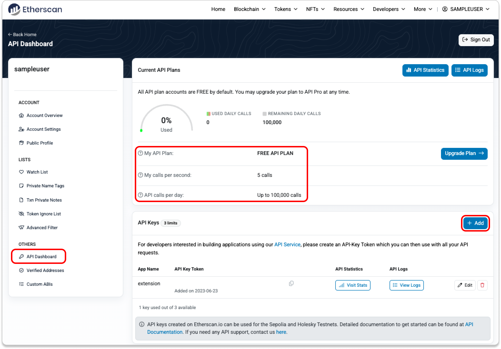

Blockchain technology has revolutionized many sectors, with financial markets being one of its most notable areas of influence. The decentralized nature of blockchains offers unparalleled transparency and security, making blockchain data crucial for algorithmic trading. Algorithmic trading, which relies heavily on data-driven decisions, benefits significantly from blockchain's ability to provide precise and real-time data.

Etherscan is a well-established blockchain explorer specifically for the Ethereum network. It serves as a vital tool for traders and developers by offering detailed information regarding transactions, smart contracts, and wallet addresses on Ethereum. Etherscan enhances its utility through an API that grants programmatic access to Ethereum blockchain data. This access is critical for algorithmic trading as it allows for automated retrieval and analysis of transactional data, token transfers, and contract actions, which can shape trading strategies and decisions.



Algorithmic trading in cryptocurrency markets has been gaining momentum due to its ability to process large volumes of data and execute trades with minimal human intervention. This approach capitalizes on the speed, accuracy, and emotion-free decision-making that algorithms offer, often outperforming traditional trading methods. 

The purpose of this article is to explore how Etherscan’s API can be effectively integrated into algorithmic trading strategies. It will examine the features of the API, its potential to access rich blockchain data, and how it supports enhanced trading strategies. Additionally, the article will address the benefits, challenges, and future considerations of using Etherscan API within this fast-evolving trading landscape.

## Table of Contents

## What is Etherscan API?

Etherscan is a prominent blockchain explorer specifically designed for the Ethereum network. It provides a suite of tools and services that allow users to navigate through the Ethereum blockchain's vast amount of data. Etherscan serves as a critical resource for developers, traders, and the general public by offering transparency and access to on-chain information, thereby facilitating a deeper understanding of the Ethereum network’s activity.

The Etherscan API is an essential component of Etherscan's offerings, enabling automated access to Ethereum blockchain data. The API provides a variety of functionalities that users can leverage to retrieve detailed information about Ethereum transactions, blocks, contracts, accounts, and much more. Some key features of the Etherscan API include retrieving transaction history, accessing token balances, and querying smart contract details. The API supports both GET and POST requests, making it versatile for different integration needs.

One of the primary benefits of using the Etherscan API is the ability to gain accurate and real-time insights into the Ethereum blockchain. This is particularly valuable for algorithmic traders who rely on precise and timely data to inform their trading strategies. By utilizing the Etherscan API, traders can automate the extraction of data necessary for analyzing market trends, detecting anomalies, and [backtesting](/wiki/backtesting) trading algorithms.

Developers and traders leverage the Etherscan API to gain a comprehensive view of on-chain activities. For example, by using Python, developers can write scripts that query the API to fetch recent transaction details or monitor the activities of specific Ethereum addresses. Here is a basic example in Python for how one might use the Etherscan API to fetch the balance of a given Ethereum address:

```python
import requests

def get_ether_balance(address, api_key):
    url = f"https://api.etherscan.io/api?module=account&action=balance&address={address}&tag=latest&apikey={api_key}"
    response = requests.get(url)
    data = response.json()
    return int(data['result']) / 10**18  # Convert wei to ether

# Example usage
api_key = 'your_api_key_here'
address = 'an_ethereum_address_here'
balance = get_ether_balance(address, api_key)
print(f"The balance of the address is: {balance} Ether")
```

The accuracy of on-chain data provided by Etherscan is crucial for constructing effective trading strategies. Accurate data helps traders identify market patterns, spot transactional anomalies, and develop predictive models. In the fast-paced [cryptocurrency](/wiki/cryptocurrency) markets, where split-second decisions can have significant financial implications, the reliability of such data cannot be overstated. Consequently, the Etherscan API serves as a robust tool for traders seeking to optimize their [algorithmic trading](/wiki/algorithmic-trading) strategies on the Ethereum blockchain.

## Understanding Algorithmic Trading

Algorithmic trading refers to the use of computer programs to execute financial trades based on predefined criteria and algorithms. It leverages complex mathematical models and advanced computational techniques to make trading decisions with speed and precision that surpasses human capabilities. These algorithms can assess market data in real-time to identify profitable trading opportunities, execute trades at optimal prices, manage risk, and perform countless transactions across various exchanges simultaneously.

In cryptocurrency markets, several algorithms and strategies are popular due to the digital and volatile nature of the assets. Notable strategies include:

1. **Market Making**: This involves placing both buy and sell limit orders to capture the bid-ask spread. Algorithms constantly update these orders as market prices fluctuate.

2. **Arbitrage**: This strategy exploits price differences of the same asset across different exchanges. The algorithm identifies discrepancies and executes trades to capitalize on the profit margin.

3. **Trend Following**: Here, the algorithm identifies and follows the direction of market trends, buying during uptrends and selling during downtrends. Techniques such as moving averages and momentum indicators are commonly utilized.

4. **Mean Reversion**: Based on the theory that asset prices will revert to their historical mean, these algorithms focus on identifying overbought or oversold conditions and executing trades accordingly.

5. **Sentiment Analysis**: This strategy involves analyzing social media, news, and other text data to gauge market sentiment and predict price movements.

The foundation of algorithmic trading lies in data and automation. The accuracy and timeliness of data are critical, as the efficacy of trading algorithms depends on their ability to process vast amounts of market information swiftly and accurately. Automation ensures that trades are executed at optimal times without the delays associated with human intervention.

One of the primary advantages of algorithmic trading is its ability to execute trades at high speeds and large volumes, thus minimizing price slippage. Additionally, algorithmic strategies can operate continuously, free from the emotional and psychological biases that often influence human traders. This objectivity, coupled with the ability to continuously backtest and refine trading strategies using historical data, provides a significant edge in maximizing returns and mitigating risks.

Overall, algorithmic trading transforms how cryptocurrency markets are navigated, combining speed, efficiency, and precision, leading to improved profitability and market dynamics.

## Integrating Etherscan API in Algorithmic Trading

Integrating the Etherscan API into algorithmic trading systems requires several key steps, starting with the setup of API access and evolving into crafting strategies based on Ethereum blockchain data. The Etherscan API serves as an essential tool for traders and developers seeking to leverage blockchain data for informed trading decisions.

### Steps to Integrate Etherscan API

1. **Obtain API Key:**
   To use Etherscan's services, register for an account on the Etherscan website and generate an API key. This key provides the necessary access to Etherscan’s robust data set.

2. **API Connection:**
   Establish a connection to the Etherscan API using your programming language of choice. In Python, this might involve using a library like `requests` to send HTTP GET requests.

    ```python
    import requests

    API_KEY = 'YOUR_ETHERSCAN_API_KEY'
    url = f'https://api.etherscan.io/api?module=account&action=balance&address=YOUR_WALLET_ADDRESS&tag=latest&apikey={API_KEY}'
    response = requests.get(url)
    data = response.json()
    ```

3. **Data Retrieval:**
   Utilize API endpoints to access specific data. For example, endpoints can provide information on account balances, transaction details, and gas fee histories, which are crucial for developing trading strategies.

4. **Data Processing:**
   Once data is retrieved, it needs to be parsed and analyzed. This might involve converting raw JSON data into a format that fits your trading algorithm's models.

5. **Embed and Automate:**
   Integrate the processed data into your existing trading algorithms. Automation scripts can be designed to periodically fetch data at set intervals for real-time trading decision-making.

### Examples of Data Retrieved Relevant to Trading

The Etherscan API enables retrieval of diverse data types, such as:

- **Token Balances:** Check balance and value trends of specific tokens in a wallet to determine asset allocation.
- **Transaction History:** Access historical transaction data to analyze past trends and performance, aiding in predictive models.
- **Gas Prices:** Monitor gas fees over time to optimize transaction costs for high-frequency trading strategies.

### Use Cases for Ethereum Blockchain Data

1. **Volatility Analysis:**
   Traders can monitor transaction volumes and active addresses to assess market [volatility](/wiki/volatility-trading-strategies), which is essential for volatility-based trading strategies.

2. **Market Sentiment:**
   By analyzing large token transfers and significant wallet activities, traders can infer market sentiment and adjust their positions accordingly.

3. **Arbitrage Opportunities:**
   Differences in transaction times and costs across exchanges can be identified using transaction data, enabling timely [arbitrage](/wiki/arbitrage) trades.

### Enhancing Trading Strategies with Etherscan APIs

1. **Real-Time Monitoring:**
   Utilize APIs to ensure your trading algorithms operate with the most current data, significantly influencing trade timing and strategy adjustments.

2. **Historical Analysis:**
   API access to historical data enables backtesting. Algorithms can be refined and optimized by simulating past market conditions.

3. **Risk Assessment:**
   Analyze transaction anomalies and address interactions to detect unusual patterns that may indicate potential security threats, allowing proactive risk management.

By thoroughly integrating the Etherscan API into their algorithmic trading systems, traders can achieve improved insights and efficiency. The access to accurate and detailed blockchain data serves as a competitive advantage when crafting and executing advanced trading strategies.

## Benefits of Using Etherscan API in Algorithmic Trading

Using the Etherscan API in algorithmic trading offers numerous advantages, primarily driven by the API's ability to provide detailed and real-time blockchain data from the Ethereum network. Here's how these benefits manifest:

### Improved Decision-Making Through Comprehensive Blockchain Insights

Access to comprehensive blockchain insights enables traders to make more informed decisions. Etherscan's API provides a wealth of information, such as transaction details, token transfers, and smart contract interactions, which are crucial for understanding market dynamics. By leveraging these insights, traders can develop strategies that take into account on-chain activity, leading to more robust decision-making processes. Such detailed data allows for the identification of trends and patterns not apparent through standard market analysis alone.

### Real-Time Data Access Leading to Timely Execution of Trades

The Etherscan API delivers real-time data, crucial for executing trades at the most opportune times. In algorithmic trading, timing is critical. Having immediate access to the latest blockchain data means trading algorithms can respond swiftly to market changes. Python scripts can be used to automate this process, ensuring trades are executed promptly. For example, a simple Python implementation to fetch the latest block number could look like this:

```python
import requests

def get_latest_block(api_key):
    url = f"https://api.etherscan.io/api?module=proxy&action=eth_blockNumber&apikey={api_key}"
    response = requests.get(url).json()
    return int(response['result'], 16)

# Replace 'YOUR_API_KEY' with your actual Etherscan API key
latest_block = get_latest_block('YOUR_API_KEY')
print(f"The latest Ethereum block number is: {latest_block}")
```

### Backtesting Strategies with Historical Data Obtained from Etherscan

Backtesting is an essential component of developing successful trading algorithms. Through Etherscan, traders gain access to vast amounts of historical data, including past transactions, price movements, and more. This data can be used to simulate trading strategies under various historical conditions to evaluate their potential effectiveness. By analyzing past performance, traders can refine their algorithms for better future results and adjust their strategies to improve profitability.

### Mitigating Risks by Analyzing Transaction Anomalies and Patterns

Risk management is a critical aspect of trading, and the Etherscan API assists in this by providing transaction-level data that can be used to analyze anomalies and detect patterns that might indicate irregular market behavior. For instance, sudden large transfers of tokens or unusual spikes in gas fees can signal potential market manipulation or upcoming significant market moves. By incorporating this data analysis into trading algorithms, risks can be better managed, allowing traders to adjust strategies accordingly to protect their investments.

In summary, integrating the Etherscan API into algorithmic trading frameworks not only enhances decision-making and execution but also bolsters the ability to backtest strategies and manage risks effectively. These benefits collectively contribute to more sophisticated and adaptive trading strategies.

## Challenges and Considerations

Integrating blockchain data with trading algorithms presents various challenges, each demanding careful consideration to ensure effective and reliable trading strategies. Understanding the limitations of application programming interfaces (APIs), particularly the Etherscan API, is crucial in this context. One significant constraint is the rate limit imposed by Etherscan, which restricts the number of requests a user can make within a specific timeframe. Etherscan's free tier allows for up to five requests per second, which may not suffice for high-frequency trading operations requiring frequent and rapid API calls. Developers may need to consider upgrading to paid tiers for increased request capacity or implementing intelligent scheduling techniques to optimize API usage without exceeding limits.

Ensuring data accuracy and reliability is another prominent challenge. The decentralized nature of blockchain enables transparency, yet it also requires rigorous verification mechanisms to validate data integrity. Any discrepancies or inaccuracies in blockchain data may lead to erroneous trading decisions, potentially resulting in significant financial losses. To mitigate such risks, developers often employ redundancy checks and cross-verify data from multiple blockchain nodes or aggregators. Additionally, integrating error-handling routines within the algorithm can help detect and respond to aberrant data, thereby enhancing overall system robustness.

Legal and regulatory considerations play a pivotal role when using blockchain data for trading. Varying regulations across jurisdictions can impact the legality and compliance of utilizing specific types of data or executing certain trading strategies. For instance, privacy laws like the General Data Protection Regulation (GDPR) in the European Union impose stringent requirements on data handling and sharing, even when dealing with pseudonymous blockchain data. Consequently, traders and developers must remain informed about legal obligations and ensure their trading activities adhere to relevant regulatory frameworks. This may involve consulting legal experts or employing compliance officers to navigate complex legal landscapes.

In essence, while the integration of blockchain data into trading algorithms offers immense potential for enhanced trading strategies, it requires a comprehensive understanding of API limitations, a commitment to data accuracy, and adherence to legal standards to effectively harness this powerful tool.

## Conclusion

The integration of the Etherscan API in algorithmic trading presents a comprehensive array of benefits, especially for those navigating the dynamic cryptocurrency markets. By providing access to real-time and accurate on-chain data, traders are better equipped to make informed decisions. This empowers algorithms with a depth of insights that would be challenging to replicate through manual analysis. The ability to backtest strategies using historical data obtained from Etherscan further aids in refining and optimizing trading strategies, allowing the examination of potential outcomes based on past trends and transactions.

The synergy between blockchain data and trading algorithms enriches the scope of algorithmic trading, enhancing its accuracy and responsiveness. Blockchain, with its decentralized and transparent nature, augments the integrity and reliability of data inputs used in trading algorithms. This integration advocates for a more data-driven approach, reducing emotional bias and increasing consistency in trade execution through automated systems.

Looking to the future, blockchain analytics are poised to become increasingly pivotal in formulating trading strategies. As the ecosystem continues to mature, the demand for sophisticated analytical tools is expected to grow, driven by the need for greater accuracy and efficiency in trading activities. The continuous evolution of blockchain technology, coupled with enhanced analytical capabilities, will likely lead to the development of more advanced trading algorithms capable of parsing complex data sets to identify profitable trading opportunities.

Thus, both traders and developers are strongly encouraged to explore the potential of the Etherscan API. By tapping into this resource, they can unlock new dimensions of strategic insights, paving the way for innovation and success in algorithmic trading. With its robust data provisions, the Etherscan API serves as a vital tool for those aiming to harness the full potential of blockchain data, fostering a more informed, agile, and competitive trading environment.

## References & Further Reading

[1]: ["Ethereum: A Secure Decentralised Generalised Transaction Ledger"](https://www.semanticscholar.org/paper/ETHEREUM%3A-A-SECURE-DECENTRALISED-GENERALISED-LEDGER/da082d8dcb56ade3c632428bfccb88ded0493214) by Gavin Wood

[2]: ["Algorithmic Trading: Winning Strategies and Their Rationale"](https://www.wiley.com/en-us/Algorithmic+Trading%3A+Winning+Strategies+and+Their+Rationale-p-9781118460146) by Ernie Chan

[3]: Narayanan, A., Bonneau, J., Felten, E., Miller, A., & Goldfeder, S. (2016). ["Bitcoin and Cryptocurrency Technologies: A Comprehensive Introduction"](https://press.princeton.edu/books/hardcover/9780691171692/bitcoin-and-cryptocurrency-technologies)

[4]: Antonopoulos, A. M., & Wood, G. (2018). ["Mastering Ethereum: Building Smart Contracts and DApps"](https://www.amazon.com/Mastering-Ethereum-Building-Smart-Contracts/dp/1491971940)

[5]: Gomber, P., Arndt, B., Lutat, M., & Uhle, T. (2011). ["High-Frequency Trading"](https://papers.ssrn.com/sol3/papers.cfm?abstract_id=1858626) in Business and Information Systems Engineering, 3(2), 59-69.

[6]: Kosinski, R., & Strycharz, J. (2021). ["Algorithmic Trading and AI in Finance"](https://www.researchgate.net/publication/378548435_Algorithmic_Trading_and_AI_A_Review_of_Strategies_and_Market_Impact)

[7]: ["Etherscan Developer API Documentation"](https://docs.etherscan.io/) by Etherscan

[8]: Nakamoto, S. (2008). ["Bitcoin: A Peer-to-Peer Electronic Cash System"](https://nakamotoinstitute.org/library/bitcoin/)

[9]: Radcliffe, C., & Myers, D. (2018). ["Smart Contracts: Building Blocks for Digital Markets"](https://www.semanticscholar.org/paper/Smart-Contracts%3A-Building-Blocks-for-Digital-Szabo/9b6cd3fe0bf5455dd44ea31422d015b003b5568f) in IEEE COMPUTER.

[10]: "Open Source Trading and High-Frequency Trading" by Haim Bodek, Justin Schack, & Rob Walker (Financial Times Press, 2013)