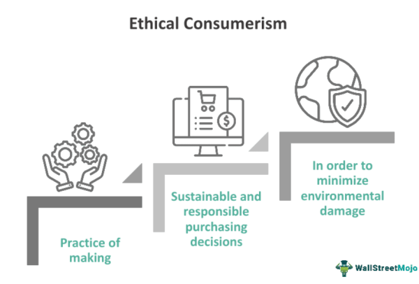

The concept of ethical investment has gained prominence as investors look to align their financial goals with personal values. Ethical investment, also known as socially responsible investing (SRI), is an investment strategy that incorporates environmental, social, and governance (ESG) criteria to generate both financial return and positive societal impact [1]. This approach reflects a growing awareness of the implications of investment decisions not only on individual portfolios but also on the larger society and environment. With increasing attention to issues such as climate change and corporate social responsibility, ethical investing has become central in shaping the future of global finance.

The rise of algorithmic trading has introduced new dimensions to these ethical considerations. Algorithmic trading, or algo trading, refers to the use of computer algorithms to automatically execute trades based on predetermined criteria. It is characterized by high speed and efficiency, significantly transforming modern financial markets [2]. However, this advanced technology also raises concerns around fairness, transparency, and ethical responsibility. The reliance on algorithms can potentially lead to market manipulation, lack of accountability, and the exacerbation of systemic risks.

This article explores the intersection of investing ethics and algorithmic trading, highlighting the complexities and responsibilities that accompany these technologies. As automated trading continues to dominate financial markets, the need to consider ethical principles in trading strategies becomes even more crucial. Investors and financial institutions must navigate this evolving landscape by aligning their algorithmic strategies with ethical standards. This process involves understanding the ethical principles that guide investments, the impact of algorithmic trading on market practices, and the ways investors can ensure their methodologies adhere to ethical norms.

Ultimately, we aim to provide a comprehensive overview of ethical investment within the context of algorithmic trading. By addressing these topics, the article seeks to enhance the discourse around the ethical dimensions of financial innovation, offering insights into maintaining integrity and trust in the increasingly complex world of algorithmic trading.

---

[1] Curtis, R. (2020). Socially Responsible Investing and the Impact on Financial Markets. Journal of Business Ethics, 162(3), 577-593.

[2] Aldridge, I., & Krawciw, S. (2017). Real-time Risk: What Investors Should Know About Fintech, High-Frequency Trading, and Flash Crashes. Wiley.

## Table of Contents

## Understanding Ethical Investment

Ethical investment, also known as socially responsible investing (SRI), is an investment strategy that seeks to generate both financial return and social or environmental benefits. This approach to investing incorporates ethical guidelines, considering factors such as environmental sustainability, social impact, and corporate governance. Investors who pursue ethical investments apply moral principles to their financial decisions, often prioritizing sustainable and socially responsible practices over solely profit-driven motives.

The concept of ethical investment can be traced back to various religious and cultural traditions that advocate for moral and ethical stewardship of resources. Although the criteria for what constitutes an ethical investment can be subjective, common focuses include avoiding or divesting from industries that are perceived as harmful, such as tobacco, gambling, and fossil fuels. The aim is to encourage corporate behaviors that are aligned with broader societal values, potentially influencing companies to adopt more responsible practices.

Investors engaging in ethical investment must establish clear criteria to evaluate potential investments. This entails analyzing a company's performance not only from a financial perspective but also considering its environmental, social, and governance ([ESG](/wiki/esg-investing)) factors. Environmental criteria might assess how a company minimizes its ecological footprint, focusing on waste management, resource conservation, and environmental innovation. Social criteria evaluate how a company manages relationships with employees, suppliers, customers, and communities, potentially considering diversity, human rights, and labor practices. Governance criteria review a company's leadership, audits, and shareholder rights, aiming to ensure transparency and alignment with stakeholder interests.

Investors face the challenge of navigating complex scenarios when applying ethical standards to real-world investments. Different stakeholders may weigh ethical factors differently, leading to varied interpretations of what constitutes an ethical investment. Moreover, the dynamic nature of markets requires investors to remain vigilant and adaptable, reassessing their criteria as societal values evolve.

In practical terms, ethical investment has evolved into a significant segment of the investment industry, with dedicated funds and indices designed to track companies meeting specific ethical criteria. These include the MSCI KLD 400 Social Index and the FTSE4Good Index Series, which aim to provide benchmarks for socially responsible investors. The ongoing development of new sustainable financial products and innovations demonstrates the increasing relevance of ethical considerations in investment decision-making.

## The Role of Algorithmic Trading

Algorithmic trading employs sophisticated mathematical models and automated systems that enable the high-speed execution of trades. By utilizing computational algorithms, trading strategies can capitalize on market opportunities with precision and swiftness that surpass human capabilities. These algorithms process large volumes of data, analyze patterns, and execute trades within milliseconds, a feat only achievable through automated systems.

This technology significantly enhances the efficiency and accuracy of trade execution. With the ability to monitor diverse markets simultaneously, [algorithmic trading](/wiki/algorithmic-trading) can optimize investment strategies, reducing transaction costs and mitigating the risk of human error. The automation intrinsic to algorithmic trading allows for the continuous adjustment of strategies, ensuring that they remain aligned with market dynamics.

However, the prominence of algorithmic trading raises concerns about fairness, transparency, and the potential for market manipulation. The opacity of algorithmic trading systems, often regarded as proprietary information, can obscure the decision-making processes within financial markets. As a result, questions arise regarding how these algorithms may influence market prices and volumes, potentially leading to situations where markets are swayed by the actions of a few large algorithmic traders.

Moreover, algorithmic trading's rapid execution capabilities have, at times, contributed to market [volatility](/wiki/volatility-trading-strategies). Events such as the "Flash Crash" of May 6, 2010, illustrate how algorithms can amplify market disruptions. On this day, the Dow Jones Industrial Average suffered a sudden drop of approximately 1,000 points, leading to widespread panic before quickly recovering. Investigations found that the actions of algorithmic traders played a role in this extreme volatility.

Despite these challenges, algorithmic trading has cemented its status as a dominant force in financial markets. A significant portion of equity trading volumes can now be attributed to algorithms, underscoring their integral role in shaping modern market behaviors. As technology continues to advance, algorithmic trading is likely to further transform investment management and execution, necessitating ongoing dialogue about its ethical implications and the regulatory frameworks needed to ensure fair and transparent markets.

## Ethical Issues in Algorithmic Trading

The integration of algorithmic trading in financial markets has brought forth ethical concerns due to its inherent complexity and rapid execution capabilities. One of the primary ethical issues is the potential for market manipulation. Trading algorithms, especially those designed for high-frequency trading ([HFT](/wiki/high-frequency-trading-strategies)), can execute thousands of orders per second, which may be used to exploit market inefficiencies or manipulate asset prices. For instance, techniques like "spoofing" involve placing large orders with the intent to cancel before execution, thereby artificially influencing market prices.

Another significant ethical challenge is the lack of transparency associated with algorithmic systems. These algorithms are often proprietary, making it difficult for regulators and market participants to understand their mechanics fully. This opacity can lead to unfair market practices, where certain participants have a disproportionate advantage over others due to access to sophisticated algorithms. The issue of accountability is also pertinent, as complex algorithms can operate autonomously, making it challenging to determine responsibility when things go awry.

Unintended biases and ethical risks are further concerns in algorithmic trading. Algorithms are only as good as the data and assumptions on which they are built. If the input data is flawed or biased, the outcomes can perpetuate or exacerbate those biases. Algorithms may inadvertently prioritize strategies that are not ethically sound or socially responsible if these biases are not identified and corrected during development.

Historical incidents such as the Flash Crash of May 6, 2010, underscore the ethical risks of algorithmic trading. During this event, the Dow Jones Industrial Average plummeted nearly 1,000 points within minutes, only to recover most of the losses by the close of trading. Investigations revealed that trading algorithms, operating at high speeds, contributed to the crash's severity by amplifying rapid sell-offs without human intervention. Such events highlight the necessity for robust checks and balances to mitigate the ethical pitfalls associated with algorithmic systems.

To address these concerns, regulators and market participants must emphasize the development of ethical guidelines and frameworks that ensure transparency, accountability, and fairness in algorithmic trading practices.

## Bridging Ethics and Algorithmic Trading

Investors and firms are increasingly recognizing the necessity of incorporating ethical frameworks in the development of trading algorithms. This approach is essential to ensure that financial markets remain fair and transparent, while also reinforcing public trust. Accountability and transparency form the core of these ethical frameworks, demanding rigorous regulation and oversight.

Stringent regulation is necessary to address the opacity often associated with algorithmic trading systems. The complexity and proprietary nature of these systems can obscure accountability, making it difficult to trace decisions back to their source. To mitigate this, regulatory bodies need to establish clear guidelines and enforce compliance, ensuring that trading algorithms operate within ethical boundaries. This may include setting limits on high-frequency trading activities, monitoring the impact of trading strategies on market stability, and requiring firms to disclose the criteria used in their algorithmic strategies.

Transparency is crucial in promoting ethical algorithmic trading. This can be achieved by mandating detailed documentation and open disclosure of the algorithms' decision-making processes. Such transparency enables stakeholders, including regulators and investors, to understand and evaluate the ethical implications of algorithmic trades. Furthermore, transparency helps in identifying any biases or unintended consequences that might result from the use of specific algorithms.

Ethical training and the development of guidelines for traders and developers are essential in aligning trading strategies with ethical standards. Training programs should emphasize the importance of ethical considerations in algorithm development, covering topics such as bias detection, data integrity, and the social responsibilities of financial institutions. Additionally, creating a culture of ethical responsibility within firms can lead to the formulation of guidelines that encourage socially responsible algorithmic trading.

Incorporating ethical frameworks in algorithmic trading is not just a regulatory obligation but also a strategic advantage. Firms that adhere to ethical trading practices can differentiate themselves in the marketplace, attracting clients who prioritize sustainability and corporate responsibility. Ultimately, by embedding ethics into their algorithmic trading systems, investors and firms contribute to a more transparent and accountable financial ecosystem.

## Practical Steps for Ethical Compliance

Establishing clear ethical standards for algorithmic strategies is crucial for ensuring that algorithmic trading aligns with responsible investing principles. To implement these standards effectively, several practical steps can be taken:

1. **Real-time Monitoring and Oversight Mechanisms**: Use advanced real-time monitoring tools to oversee algorithmic trading activities. These tools enable continuous observation and instant detection of any deviations from established ethical guidelines. Technologies such as machine learning can identify patterns indicative of unethical behavior or market manipulation. For instance, anomaly detection algorithms can be employed to flag irregular trading patterns that may suggest a breach in ethical practices.

2. **Regular Updates and Audits**: It is essential to periodically update and audit trading algorithms to account for evolving market conditions and ethical considerations. This involves a comprehensive review of the algorithms' decision-making processes and data inputs. Audits should include both internal evaluations and third-party assessments to maintain objectivity. Regular updates ensure that algorithms are not only compliant with current ethical standards but also adaptable to changes in regulatory environments and societal expectations.

The integration of both real-time monitoring and regular audits forms a robust framework for maintaining ethical compliance in algorithmic trading. By adhering to these practices, investors can mitigate potential ethical risks and contribute to a more transparent and accountable financial market system.

## Conclusion

As investment practices evolve, maintaining ethical standards in algorithmic trading is essential to uphold market integrity. The integration of ethics within this sophisticated field not only enhances trust but also ensures a fairer and more equitable financial ecosystem. Ethical algorithmic trading requires investors and developers to critically assess their tools and strategies to mitigate risks associated with automation, such as market manipulation and unintended biases.

Investors must actively engage in ethical evaluations, balancing innovation with responsibility. This involves a proactive approach where stakeholders continuously scrutinize the potential impacts of their trading algorithms. By embedding ethical considerations into the core of algorithmic design and implementation, investors and firms can anticipate and address social, environmental, and governance issues before they become problematic.

Moreover, emphasizing ethics in financial markets contributes to a sustainable and trusted investment ecosystem. This effort requires collective action from policymakers, financial institutions, and technology developers to establish and adhere to ethical guidelines and frameworks. Stringent regulations and oversight mechanisms are necessary to ensure that market participants adhere to these standards, fostering transparency and accountability.

In conclusion, while algorithmic trading presents unique challenges, aligning it with ethical principles is not only achievable but imperative for long-term market stability. By prioritizing ethical integrity, stakeholders can drive meaningful change, promoting a financial system that is both innovative and responsible. This collective commitment will help cultivate an environment where trust is paramount, and ethical considerations guide the evolution of investment strategies.

## References & Further Reading

[1]: Curtis, R. (2020). "Socially Responsible Investing and the Impact on Financial Markets." Journal of Business Ethics, 162(3), 577-593.

[2]: Aldridge, I., & Krawciw, S. (2017). "Real-time Risk: What Investors Should Know About Fintech, High-Frequency Trading, and Flash Crashes." Wiley.

[3]: Fabozzi, F. J., Focardi, S. M., & Jonas, C. A. (2016). ["Investment Management: A Science to Teach or an Art to Learn?"](https://www.semanticscholar.org/paper/Quantitative-Equity-Investing%3A-Techniques-and-Fabozzi-Focardi/1c49a2a53919f7e65cb96f16691b8ff726fd3cd7) The CFA Institute Research Foundation.

[4]: Zopounidis, C., & Doumpos, M. (2012). ["Multicriteria Decision Aid in Financial Decision Making: Methodologies and Literature Review."](https://www.semanticscholar.org/paper/Multi-criteria-Decision-Aid-in-Financial-and-Review-Zopounidis/ee6e3913d417fe650a6bf0a92b02a9837de7414c) Soft Computing, 16(7), 1307-1320.

[5]: Marcos Lopez de Prado (2018). ["Advances in Financial Machine Learning."](https://www.amazon.com/Advances-Financial-Machine-Learning-Marcos/dp/1119482089) Wiley.