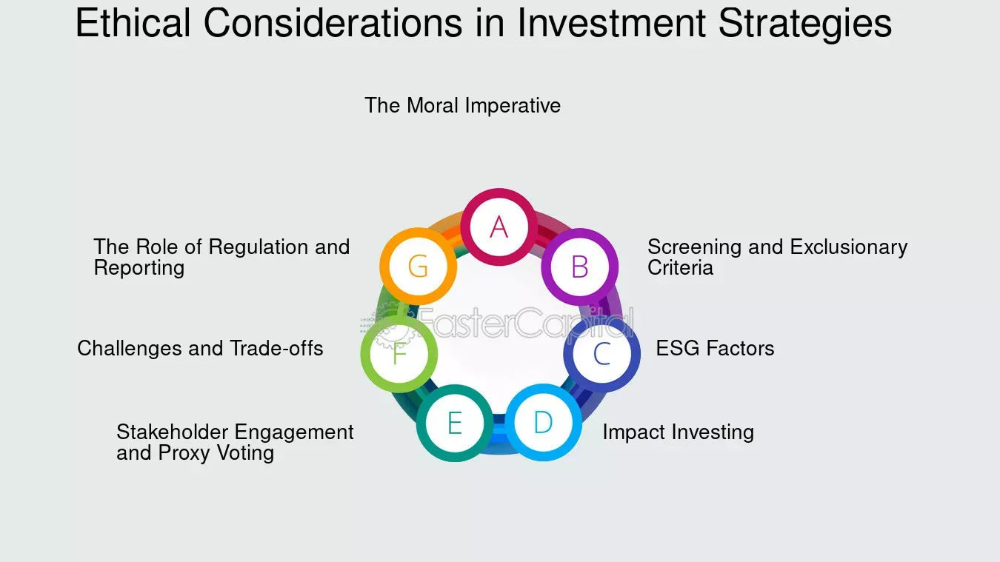

## Table of Contents

## What are ethical investments and why are they important?

Ethical investments are when people put their money into companies or projects that do good things for the world. These investments focus on things like protecting the environment, treating workers fairly, and supporting human rights. Instead of just looking at how much money they can make, people who choose ethical investments care about making a positive impact on society and the planet.

Ethical investments are important because they help guide money towards making the world a better place. When more people invest ethically, it encourages companies to act responsibly and think about their impact on the environment and society. This can lead to less pollution, better working conditions, and more support for important causes. By choosing ethical investments, people can use their money to support their values and help create a more sustainable and fair world for everyone.

## How can ethical considerations impact investment decisions?

Ethical considerations can change how people decide to invest their money. When people think about ethics, they look at things like how a company treats its workers, if it's good for the environment, and if it respects human rights. If a company does not meet these ethical standards, people might choose not to invest in it, even if it could make them a lot of money. This means they might miss out on some profits, but they feel better knowing their money supports good causes.

By focusing on ethics, investors can help push companies to be better. When many people choose to invest only in ethical companies, it sends a message that doing the right thing is important. Companies might then try to improve their practices to attract more investment. This can lead to real changes, like cleaner factories, fairer pay, and safer working conditions. So, ethical considerations not only guide where people put their money but can also make a big difference in the world.

## What are some common ethical issues faced by investors?

Investors often face ethical issues like whether a company is harming the environment. For example, some companies might pollute rivers or contribute to climate change. Investors have to decide if they want to put their money into these companies, even if they could make a lot of money. They might choose to avoid investing in companies that harm the environment because they want to protect the planet.

Another common ethical issue is how companies treat their workers. Some companies might pay low wages or have unsafe working conditions. Investors need to think about if they want to support these companies. They might decide to invest only in companies that treat their workers well, even if it means they might make less money. This way, they can help make sure workers are treated fairly.

A third issue is human rights. Some companies might be involved in countries where human rights are not respected. Investors have to decide if they want to invest in these companies. They might choose to avoid them to make sure they are not supporting human rights abuses. By considering these ethical issues, investors can use their money to help make the world a better place.

## Can you explain the difference between ESG (Environmental, Social, Governance) criteria and traditional investment criteria?

[ESG](/wiki/esg-investing) criteria and traditional investment criteria are two different ways to decide where to put your money. Traditional investment criteria mainly focus on how much money a company can make. Investors look at things like profits, how fast the company is growing, and how much risk there is. They want to know if the company will give them a good return on their investment. This way of investing doesn't usually think about how the company affects the environment or treats its workers.

On the other hand, ESG criteria take a broader look at a company. ESG stands for Environmental, Social, and Governance. Environmental factors look at how a company impacts the planet, like if it pollutes or uses a lot of energy. Social factors check how the company treats its workers, customers, and the community. Governance looks at how the company is run, like if it's honest and fair. Investors using ESG criteria care about making money, but they also want to make sure their investments help the world in a positive way. This means they might choose companies that are good for the environment, treat people well, and are run responsibly, even if it means they might make a bit less money.

## How do ethical funds perform compared to conventional funds?

Ethical funds and conventional funds can have different performance results. Some studies show that ethical funds can do just as well or even better than conventional funds. This is because companies that follow good environmental, social, and governance practices might be better managed and more sustainable in the long run. But, other studies find that ethical funds might not always perform as well as conventional funds. This can happen because ethical funds might miss out on some investment opportunities that don't meet their ethical standards.

It's hard to say for sure which type of fund will perform better because it can depend on many things, like the time period you're looking at and the specific companies in the fund. Sometimes, ethical funds might do better during times when people care a lot about the environment or social issues. But during other times, conventional funds might do better if they can invest in companies that are making a lot of money, even if those companies aren't ethical. So, it's important for investors to look at both the ethical impact and the potential returns when choosing where to put their money.

## What are the challenges of integrating ethical considerations into investment strategies?

Integrating ethical considerations into investment strategies can be tricky. One big challenge is finding the right information. It's hard to know if a company is really ethical because they might not always tell the truth about their practices. Investors need to do a lot of research to make sure they are putting their money into companies that match their values. This can take a lot of time and effort.

Another challenge is that ethical investments might not always make as much money as other investments. Sometimes, companies that are good for the environment or treat their workers well might not be as profitable. This means investors might have to choose between making more money and doing what they think is right. It can be hard to balance these two things, especially if they need the money for important things like saving for retirement.

Lastly, ethical standards can change over time and be different for different people. What one person thinks is ethical might not be the same for someone else. This can make it hard to create investment strategies that everyone agrees on. Investors have to keep updating their strategies to match changing ethical standards and their own beliefs, which adds another layer of complexity to their decisions.

## How can investors assess the ethical impact of their investments?

Investors can assess the ethical impact of their investments by looking at how companies affect the environment, treat their workers, and handle their business. They can start by checking if a company has any certifications or awards for being eco-friendly or socially responsible. Websites and reports from organizations like the Sustainability Accounting Standards Board (SASB) or the Global Reporting Initiative (GRI) can provide detailed information about a company's practices. Investors can also use tools like ESG ratings from agencies such as MSCI or Sustainalytics, which rate companies based on their environmental, social, and governance performance. By using these resources, investors can get a clear picture of how ethical a company is.

Another way to assess the ethical impact is by talking directly to the companies. Investors can attend shareholder meetings, ask questions about the company's ethical practices, and review their responses. They can also look at the company's policies on things like diversity, labor rights, and environmental protection. Sometimes, investors join forces with others to push for changes in a company's behavior, a process known as shareholder activism. By staying informed and actively engaging with companies, investors can better understand the ethical impact of their investments and make choices that align with their values.

## What role do shareholder activism and corporate governance play in ethical investing?

Shareholder activism and corporate governance are important parts of ethical investing. Shareholder activism happens when investors use their power as shareholders to push companies to do better things. They might ask companies to change how they treat the environment or their workers. By voting at shareholder meetings or talking to the company's leaders, investors can help make sure companies follow good ethical practices. This way, they can use their money to make the world a better place.

Corporate governance is about how a company is run and managed. Good corporate governance means the company is honest, fair, and thinks about more than just making money. Investors who care about ethics look for companies with strong governance because these companies are more likely to do the right thing. When companies have good governance, it helps make sure they are ethical and responsible. This makes it easier for investors to trust that their money is being used in a way that matches their values.

## How do global regulations affect ethical investment practices?

Global regulations can make a big difference in ethical investment practices. Different countries have rules about what companies can and can't do. These rules might say that companies need to take care of the environment or treat their workers well. When countries have strong rules, it helps investors know which companies are ethical. This makes it easier for them to choose companies that match their values. For example, if a country has strict rules about pollution, investors might feel more comfortable putting their money into companies in that country because they know those companies have to follow good environmental practices.

Sometimes, global regulations can also make things harder for ethical investors. If rules are different in different places, it can be confusing to figure out which companies are really ethical. A company might follow the rules in one country but not in another. This can make it hard for investors to trust that their money is being used ethically everywhere. But, when countries work together to create similar rules, it helps make ethical investing easier and more reliable. Overall, global regulations play a big role in shaping how investors can make ethical choices.

## What advanced tools and metrics are available for measuring the ethical performance of investments?

Investors can use advanced tools and metrics to measure the ethical performance of their investments. One popular tool is ESG ratings, which look at a company's environmental, social, and governance practices. Companies like MSCI and Sustainalytics give these ratings by analyzing things like how much a company pollutes, how it treats its workers, and if its leaders are honest. Another tool is the Sustainability Accounting Standards Board (SASB) standards, which help investors understand how a company's practices affect its long-term value. These tools make it easier for investors to see which companies are doing good things and which ones are not.

There are also more specific metrics that investors can use. For example, the Carbon Disclosure Project (CDP) measures a company's impact on the environment, especially how much carbon it produces. The Global Reporting Initiative (GRI) provides a framework for companies to report on their sustainability practices, which helps investors compare different companies. Additionally, some investors use impact metrics, which look at how much a company helps solve social or environmental problems. These advanced tools and metrics help investors make more informed choices about where to put their money, ensuring it aligns with their ethical values.

## How can investors balance ethical considerations with financial returns?

Balancing ethical considerations with financial returns can be tricky for investors. They want to make money, but they also want to make sure their investments are doing good things for the world. One way to do this is by choosing companies that are both profitable and ethical. These companies might have strong environmental practices, treat their workers well, and have good governance. By investing in these companies, investors can feel good about their choices and still make money. Sometimes, ethical companies can even do better in the long run because they are more sustainable and attract more customers who care about these issues.

Another way to balance ethics and returns is by using a mix of investments. Investors can put some of their money into ethical funds, which focus on companies that meet certain ethical standards, and some into conventional funds, which might offer higher returns. This way, they can support ethical causes while still getting the financial growth they need. It's important for investors to keep an eye on both their ethical impact and their financial performance, making adjustments as needed to find the right balance. By doing this, they can use their money to make a positive difference in the world without sacrificing their financial goals.

## What future trends are expected in the field of ethical investing?

In the future, ethical investing is expected to become even more popular. More and more people are starting to care about how their money affects the world. They want to invest in companies that are good for the environment, treat their workers well, and follow fair rules. Because of this, there will likely be more ethical investment options available. Companies might also start to change how they do things to attract these investors. They might try harder to be eco-friendly and socially responsible because they know it can help them get more money from people who care about ethics.

Another trend we might see is the use of better tools and technology to help with ethical investing. Right now, investors use things like ESG ratings to see how ethical a company is. In the future, these tools will probably get even better. They might use [artificial intelligence](/wiki/ai-artificial-intelligence) to look at a lot more information and give more accurate ratings. This will make it easier for investors to find companies that match their values. Also, as more people around the world start to care about ethical investing, global rules might become more similar, making it easier for investors to know which companies are really doing good things.

## References & Further Reading

[1]: Curtis, R. (2020). "Socially Responsible Investing and the Impact on Financial Markets." Journal of Business Ethics, 162(3), 577-593.

[2]: Aldridge, I., & Krawciw, S. (2017). "Real-time Risk: What Investors Should Know About Fintech, High-Frequency Trading, and Flash Crashes." Wiley.

[3]: Fabozzi, F. J., Focardi, S. M., & Jonas, C. A. (2016). ["Investment Management: A Science to Teach or an Art to Learn?"](https://www.semanticscholar.org/paper/Quantitative-Equity-Investing%3A-Techniques-and-Fabozzi-Focardi/1c49a2a53919f7e65cb96f16691b8ff726fd3cd7) The CFA Institute Research Foundation.

[4]: Zopounidis, C., & Doumpos, M. (2012). ["Multicriteria Decision Aid in Financial Decision Making: Methodologies and Literature Review."](https://www.semanticscholar.org/paper/Multi-criteria-Decision-Aid-in-Financial-and-Review-Zopounidis/ee6e3913d417fe650a6bf0a92b02a9837de7414c) Soft Computing, 16(7), 1307-1320.

[5]: Marcos Lopez de Prado (2018). ["Advances in Financial Machine Learning."](https://www.amazon.com/Advances-Financial-Machine-Learning-Marcos/dp/1119482089) Wiley.