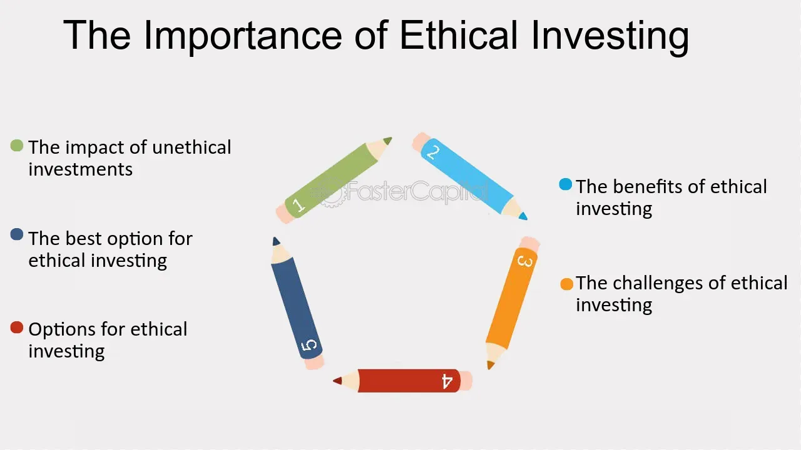

## Table of Contents

## What are controversial stocks?

Controversial stocks are shares of companies that are involved in activities or industries that some people think are harmful or unethical. These can include companies in the tobacco, gambling, or weapons industries. People might avoid buying these stocks because they don't want to support these activities. But, some investors might buy them because they can make a lot of money, even if they don't agree with what the company does.

There can be a lot of debate about these stocks. Some people believe that investing in them can help change the company from the inside. Others think that buying the stocks just makes the problem worse. It's a personal choice, and what one person thinks is wrong, another might see as a good investment. This makes controversial stocks a hot topic in the world of investing.

## Why might investors be interested in controversial stocks?

Investors might be interested in controversial stocks because they can make a lot of money. These stocks often come from companies in industries like tobacco, gambling, or weapons, which can be very profitable. Even though some people think these businesses are bad, they still make money. So, investors who want to grow their money fast might choose to buy these stocks, even if they don't agree with what the company does.

Another reason is that some investors believe they can help change the company for the better. By buying the stocks, they might get a say in how the company is run. They can vote on things that could make the company more ethical or less harmful. This way, they hope to make money and also make the company a better place. It's a way to try to do good while still making a profit.

## What are the common ethical concerns associated with investing in controversial stocks?

When people invest in controversial stocks, they often worry about doing something that might hurt others or the planet. These stocks are usually from companies in businesses like tobacco, gambling, or weapons. People might feel bad about making money from these because they think these businesses cause harm. For example, tobacco companies sell products that can make people very sick. So, some investors choose not to buy these stocks because they want to avoid supporting harmful activities.

Another concern is that investing in these stocks might make the problems worse. If more people buy the stocks, the companies get more money to keep doing what they're doing. Some people believe that this makes them part of the problem. They worry that their money is helping these companies stay in business and keep causing harm. This is why many investors look for other ways to invest that align better with their values and don't contribute to harm.

## How can investing in controversial stocks impact an investor's reputation?

When people invest in controversial stocks, it can change how others see them. If someone finds out that an investor is making money from companies that do bad things, like selling tobacco or weapons, they might think less of that person. People might say the investor cares more about money than doing what's right. This can hurt the investor's reputation, especially if they work in a job where being ethical is important.

On the other hand, some investors might not care about their reputation in this way. They might think that making money is the most important thing, no matter what the company does. But even if they don't mind, other people might still judge them for it. This can affect their relationships with friends, family, or business partners who don't agree with their choices. So, investing in controversial stocks can have a big impact on how others see an investor.

## What are some examples of industries often considered controversial?

Some industries that people often think are controversial are tobacco, gambling, and weapons. Tobacco companies make cigarettes and other products that can make people very sick. Many people believe these products are bad for health, so they think the companies are doing harm. Gambling companies run casinos and online betting sites. Some people say gambling can lead to addiction and money problems, which makes it a controversial business. Weapons companies make guns and other things used in wars. A lot of people worry that these companies help make the world more dangerous.

Another industry that can be controversial is fossil fuels, like oil and coal. These companies are big because we need energy, but they also cause a lot of pollution. Pollution is bad for the planet and can make climate change worse. Some people think these companies should change to cleaner energy, but they keep making money from oil and coal. Also, the adult entertainment industry is often seen as controversial. It makes movies and websites with adult content. Many people think this industry can be harmful and disrespectful to people, especially women.

## What role do ESG (Environmental, Social, and Governance) criteria play in evaluating controversial stocks?

[ESG](/wiki/esg-investing) criteria help people decide if a company is doing good things or bad things. ESG stands for Environmental, Social, and Governance. When people look at controversial stocks, they use these criteria to see if the company is hurting the environment, treating people badly, or not being run in a fair way. For example, a tobacco company might get a low score on the environmental part because it makes products that are bad for people's health. On the social part, a weapons company might get a low score because it makes things that can hurt people. And on the governance part, a company might get a low score if it doesn't treat its workers well or if it's not honest about what it does.

Using ESG criteria can help investors avoid companies that do things they think are wrong. If an investor cares about the planet and people, they might choose not to buy stocks in a company that gets low ESG scores. This way, they don't support businesses that cause harm. But some investors might still buy these stocks if they think they can make a lot of money or if they believe they can help change the company for the better. So, ESG criteria give people more information to make choices that fit with what they believe is right.

## How do different ethical investment strategies approach controversial stocks?

Different ethical investment strategies handle controversial stocks in their own ways. Some investors follow a strategy called negative screening, where they avoid buying stocks from companies they think are bad. For example, they might not buy stocks from tobacco or weapons companies because they believe these businesses hurt people. This way, they keep their money away from things they think are wrong. Other investors use positive screening, where they look for companies that do good things, like helping the environment or treating workers well. They might still buy some controversial stocks if the company is trying to change and do better.

Another strategy is called engagement or active ownership. Investors who use this approach buy stocks in controversial companies because they want to help make them better. They might vote at shareholder meetings or talk to the company's leaders to push for changes that make the company more ethical. This way, they hope to make money and also make the company less harmful. Some investors also use impact investing, where they put money into companies that are trying to solve big problems, like climate change or poverty. They might avoid controversial stocks completely or invest in them if the company is working on solutions to these issues.

## What are the potential financial risks of investing in controversial stocks?

Investing in controversial stocks can be risky because these companies might face a lot of problems. People might not want to buy their products because they think they are bad. This can make the company lose money. Also, governments might make new rules that make it harder for these companies to do business. For example, they might put high taxes on tobacco or limit how gambling companies can advertise. These new rules can hurt the company's profits and make its stock price go down.

Another risk is that controversial stocks can be more up and down than other stocks. People's feelings about these companies can change quickly. If a lot of people start thinking a company is bad, they might sell their stocks all at once. This can make the stock price drop a lot in a short time. Also, if a company gets bad news, like a big lawsuit or a scandal, its stock price can fall fast. So, while controversial stocks can make a lot of money, they can also lose a lot, which makes them risky to invest in.

## How can investors balance potential returns with ethical considerations?

Investors can balance potential returns with ethical considerations by using strategies like negative screening and positive screening. Negative screening means not buying stocks from companies that do things the investor thinks are wrong, like selling tobacco or weapons. This way, they can avoid supporting businesses they believe are harmful, even if it means missing out on some profits. Positive screening, on the other hand, involves looking for companies that do good things, like helping the environment or treating workers well. Investors might still buy some controversial stocks if the company is trying to improve and do better, but they focus on companies that match their values.

Another way to balance returns and ethics is through engagement or active ownership. Some investors buy stocks in controversial companies because they want to help make them better. They might vote at shareholder meetings or talk to the company's leaders to push for changes that make the company more ethical. This way, they can still make money while trying to make the company less harmful. It's a way to do good and make a profit at the same time. By using these strategies, investors can find a middle ground that lets them grow their money without going against their beliefs.

## What are the regulatory considerations for investing in controversial stocks in different countries?

Different countries have different rules about investing in controversial stocks. Some countries have strict laws that make it hard for companies in controversial industries to do business. For example, some places have high taxes on tobacco products or tight rules on how gambling companies can advertise. These rules can make it risky to invest in these stocks because the companies might lose money if they can't sell as much or if they have to pay more in taxes. Investors need to know these rules before they buy stocks because the laws can change and affect how much money they make.

In other countries, the rules might be more relaxed, which can make investing in controversial stocks less risky. But even in these places, there can still be problems. Sometimes, a big lawsuit or a new law can come out of nowhere and hurt a company's profits. Also, some countries have rules that make companies tell investors about risks, like if they are doing something that might be seen as bad. This helps investors make better choices, but they still need to be careful and keep up with any changes in the law that might affect their investments.

## How do shareholder activism and engagement influence the management of controversial companies?

Shareholder activism and engagement can help change how controversial companies are run. When investors buy stocks in these companies, they can use their power as shareholders to push for changes. They might vote at meetings to make the company do things differently, like being kinder to the environment or treating workers better. Sometimes, they talk directly to the company's leaders to explain why changes are important. This can make the company listen and start doing things in a way that is more ethical and less harmful.

These actions can make a big difference. For example, if enough shareholders agree that a tobacco company should stop selling certain products, the company might listen and change its business. This can help the company avoid bad publicity and maybe even make more money in the long run by doing the right thing. Shareholder activism shows that investors don't just want to make money; they also want companies to be good citizens. By working together, they can help controversial companies become better and more responsible.

## What advanced analytical tools can investors use to assess the ethical impact of their investments in controversial stocks?

Investors can use advanced tools like ESG (Environmental, Social, and Governance) ratings to understand how ethical a company is. These ratings give scores based on how a company treats the environment, its workers, and how it is run. Websites and apps like MSCI ESG Research and Sustainalytics provide these ratings. They look at things like if a company pollutes a lot, if it treats its workers well, or if its leaders are honest. By using these tools, investors can see if a controversial company is trying to do better or if it's still doing harmful things.

Another tool investors can use is impact analysis software, like those offered by companies like Trucost or RepRisk. These tools help investors see the real-world effects of a company's actions. For example, they can show how much a company adds to climate change or how it affects local communities. By looking at this data, investors can decide if they want to keep their money in a company that might be doing bad things. These tools make it easier for investors to make choices that fit with their values while still thinking about making money.

## References & Further Reading

[1]: Benartzi, S., & Thaler, R. H. (1995). ["Myopic Loss Aversion and the Equity Premium Puzzle."](https://www.nber.org/papers/w4369) The Quarterly Journal of Economics, 110(1), 73–92.

[2]: Halpern, M. (2013). ["The Ethics of Algorithmic Trading."](https://www.researchgate.net/publication/309322060_The_Ethics_of_Algorithms_Mapping_the_Debate) Ethics Resource Center.

[3]: Tapscott, D., & Tapscott, A. (2016). ["Blockchain Revolution: How the Technology Behind Bitcoin Is Changing Money, Business, and the World."](https://dl.acm.org/doi/10.5555/3051781) Penguin.

[4]: Kagermann, H., Wahlster, W., & Helbig, J. (Eds.). (2013). ["Recommendations for Implementing the Strategic Initiative INDUSTRIE 4.0"](https://en.acatech.de/publication/recommendations-for-implementing-the-strategic-initiative-industrie-4-0-final-report-of-the-industrie-4-0-working-group/) Acatech – National Academy of Science and Engineering.

[5]: Stoyanovich, J., Abiteboul, S., & Miklau, G. (2020). ["Data, Responsibly: Fairness, Risk, and Transparency in Data Analysis."](http://abiteboul.com/PRESENTATION/16.DataResponsibly.pdf) Communications of the ACM, 63(10), 34-37.