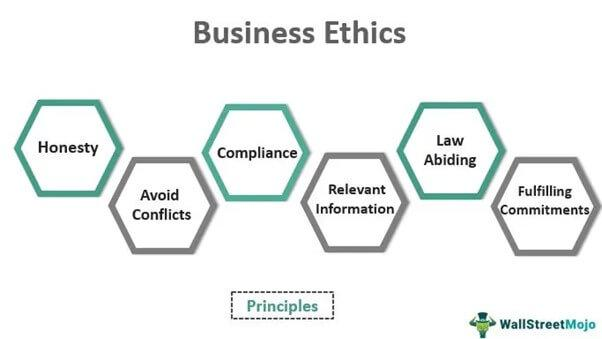

## Table of Contents

## What is the role of a broker in financial markets?

A broker in financial markets acts as a middleman between buyers and sellers. They help people buy and sell stocks, bonds, and other financial products. Brokers make it easier for people to invest their money by providing access to the stock market and other investment opportunities. They also give advice and help clients make smart investment choices based on their goals and how much risk they are willing to take.

Brokers earn money by charging fees or commissions for their services. These fees can be a flat rate or a percentage of the total amount of the transaction. Some brokers work for big companies, while others are independent. They use their knowledge and tools to help clients make the best possible investment decisions. By working with a broker, investors can feel more confident and supported in the often complex world of financial markets.

## Why are ethical guidelines important for brokers?

Ethical guidelines are important for brokers because they help ensure that brokers act honestly and fairly. When brokers follow ethical rules, they build trust with their clients. This trust is very important because clients need to feel confident that their broker is looking out for their best interests, not just trying to make money for themselves. Without ethical guidelines, brokers might be tempted to make decisions that benefit them more than their clients, which could lead to big problems and loss of trust.

These guidelines also help keep the financial markets stable and fair. If brokers follow ethical rules, it helps prevent things like fraud and manipulation, which can harm the whole market. When everyone knows that brokers are held to high ethical standards, it makes the market a safer place for everyone to invest. This is good for the economy because it encourages more people to invest, knowing that the system is fair and well-regulated.

## What are the basic principles of ethics that brokers should follow?

Brokers should always be honest and fair. This means they need to tell the truth about investments and not hide any important information from their clients. They should also treat all clients the same way, without favoring one over another. This helps build trust and makes sure everyone gets a fair chance.

Another important principle is to put the client's interests first. Brokers should always think about what is best for their clients, not just what will make them more money. This means giving good advice and not pushing clients into risky investments just to earn more fees. By doing this, brokers can help their clients reach their financial goals safely.

Lastly, brokers should follow the rules and laws that govern their work. This includes not doing anything illegal or dishonest, like insider trading or lying on documents. Following these rules helps keep the financial markets fair and safe for everyone. When brokers stick to these basic principles, they help create a trustworthy and reliable financial system.

## How can brokers maintain transparency with their clients?

Brokers can maintain transparency with their clients by always sharing clear and complete information about investments. This means telling clients about all the risks, costs, and possible rewards before they invest. Brokers should also explain any fees they charge and how they make money from the client's investments. If something changes, like a new risk or a change in fees, the broker should tell their client right away.

Another way brokers can be transparent is by keeping good records and being open to questions. They should keep track of all their dealings with clients and be ready to show these records if asked. If a client has a question or wants to know more about something, the broker should answer honestly and fully. By doing these things, brokers can make sure their clients always know what's going on with their money.

## What are the common ethical dilemmas faced by brokers?

Brokers often face ethical dilemmas when deciding between what's best for their clients and what's best for themselves. For example, a broker might be tempted to push a client into buying a certain stock because it will earn them a big commission, even if that stock is not the best choice for the client. This conflict of interest can make it hard for brokers to always put their clients' needs first. They need to be careful and always think about what is right for their clients, not just what will make them more money.

Another common ethical dilemma is dealing with insider information. Sometimes, brokers might learn about big changes in a company before the news is public. Using this information to buy or sell stocks before everyone else knows is called insider trading, and it's illegal. Brokers need to be very careful not to use this kind of information and to make sure they are always following the law. It's important for brokers to stay honest and fair, even when it's hard, to keep the trust of their clients and the integrity of the market.

## How should brokers handle conflicts of interest?

Brokers should handle conflicts of interest by always putting their clients' needs first. If a broker finds themselves in a situation where they could make more money by suggesting a certain investment, but that investment might not be the best choice for the client, they need to choose what's best for the client. This means being honest and telling the client about any conflicts that might affect their advice. By doing this, brokers can make sure they are acting in a way that is fair and trustworthy.

Sometimes, the best way to handle a conflict of interest is to avoid it completely. If a broker knows that a certain investment could cause a conflict, they might choose not to recommend it at all. This helps keep things simple and clear for the client. When brokers are open about any possible conflicts and work hard to avoid them, they help build a strong, trusting relationship with their clients. This is important for making sure everyone feels confident and safe in the financial markets.

## What are the regulatory requirements for ethical conduct in brokerage?

Regulatory bodies set rules that brokers must follow to make sure they act ethically. These rules are important to keep the financial markets fair and safe for everyone. In the United States, for example, the Financial Industry Regulatory Authority (FINRA) and the Securities and Exchange Commission (SEC) have rules that brokers must follow. These rules say that brokers must always tell the truth, not use insider information, and put their clients' interests first. If brokers break these rules, they can face big fines or even lose their license to work in the industry.

Brokers also need to follow rules about how they handle their clients' money and investments. They must keep good records and be able to show these records if asked. This helps make sure that brokers are not doing anything wrong with their clients' money. If a client has a problem with their broker, they can file a complaint with the regulatory body, which will look into the issue and make sure the broker is following the rules. By following these regulations, brokers help keep the financial markets honest and trustworthy.

## How can brokers ensure they are providing fair and unbiased advice to clients?

Brokers can ensure they are giving fair and unbiased advice by always putting their clients' needs first. This means they should recommend investments that are best for the client, not just the ones that will make the broker more money. Brokers should also be honest about any conflicts of interest. If a broker might gain something from a certain investment, they should tell the client about it. By being open and honest, brokers can help their clients trust that the advice they are getting is fair and not influenced by the broker's own interests.

Another way brokers can provide unbiased advice is by staying well-informed and up-to-date on all the investment options available. This means doing a lot of research and understanding the risks and rewards of different investments. When brokers have a good understanding of the market, they can give better advice that is based on facts, not just on what might earn them a bigger commission. By following these practices, brokers can make sure they are always giving their clients the best and most unbiased advice possible.

## What are the consequences of unethical behavior for brokers?

When brokers act unethically, they can face serious consequences. They might get fined a lot of money by regulatory bodies like the SEC or FINRA. These fines can be big enough to hurt the broker's finances a lot. Sometimes, brokers can even lose their license to work in the industry. This means they can't be a broker anymore, which can end their career. If a broker does something really bad, like insider trading, they might even go to jail. This shows how important it is for brokers to follow the rules and act ethically.

Unethical behavior can also damage a broker's reputation. If clients find out that a broker has been dishonest or hasn't put their interests first, they will lose trust in the broker. This can lead to clients leaving and taking their business elsewhere. A bad reputation can spread quickly in the industry, making it hard for the broker to find new clients or even get a job at another firm. In the end, acting unethically can ruin a broker's career and make it very hard for them to succeed in the financial world.

## How can brokers implement a robust ethical training program for their staff?

Brokers can implement a strong ethical training program by starting with regular training sessions for all their staff. These sessions should teach everyone about the importance of being honest and fair. The training should cover the rules and laws that brokers need to follow, like not using insider information and always putting clients first. It's also important to use real-life examples and case studies to help staff understand how these rules work in everyday situations. By making these sessions a regular part of the job, brokers can make sure everyone stays up-to-date and knows how to act ethically.

Another key part of a good ethical training program is to have a clear code of conduct that everyone can see and understand. This code should explain what is expected of all staff and what will happen if they break the rules. Brokers should also set up a way for staff to ask questions or report any ethical issues they see. This could be a special person or a hotline that staff can use if they need help or want to talk about something they think is wrong. By making it easy for staff to speak up and get help, brokers can create a culture where everyone feels responsible for acting ethically and keeping the company honest.

## What advanced strategies can brokers use to foster a culture of ethics within their organization?

Brokers can foster a culture of ethics by leading by example. When the leaders in a brokerage firm act honestly and fairly, it sets a good example for everyone else. Leaders should talk openly about the importance of ethics and make sure everyone knows that doing the right thing is a big part of the job. They can also reward staff who show strong ethical behavior. This could be through bonuses, public praise, or other ways to show that the company values honesty and fairness. By making ethics a part of everyday work, leaders can help create a workplace where everyone feels proud to do the right thing.

Another way to build a culture of ethics is by having regular check-ins and discussions about ethical issues. Brokers can set up meetings where staff can talk about any ethical challenges they face and learn from each other. These discussions can help everyone understand different points of view and make better decisions. It's also important to keep learning and growing. Brokers can bring in experts to give talks or workshops on ethics, or they can send staff to special training programs. By always working on improving their ethical understanding, brokers can make sure their organization stays strong and trustworthy.

## How can brokers stay updated with evolving ethical standards and regulations in the industry?

Brokers can stay updated with evolving ethical standards and regulations by regularly checking the websites of regulatory bodies like the SEC and FINRA. These organizations often post new rules and updates that brokers need to know about. Brokers can also sign up for newsletters or alerts from these bodies, which will send them emails about any changes in the rules. By staying in touch with these sources, brokers can make sure they always know the latest information and can follow the rules properly.

Another way brokers can stay updated is by joining professional groups and attending industry events. These groups often have meetings and conferences where they talk about new ethical standards and regulations. Brokers can learn a lot by listening to experts and talking with other brokers about how to handle new rules. They can also take continuing education courses, which are special classes that teach brokers about the latest changes in the industry. By doing these things, brokers can keep their knowledge fresh and make sure they are always acting ethically and following the law.

## References & Further Reading

[1]: Bergstra, J., Bardenet, R., Bengio, Y., & Kégl, B. (2011). ["Algorithms for Hyper-Parameter Optimization."](https://papers.nips.cc/paper/4443-algorithms-for-hyper-parameter-optimization) Advances in Neural Information Processing Systems 24.

[2]: ["Advances in Financial Machine Learning"](https://www.amazon.com/Advances-Financial-Machine-Learning-Marcos/dp/1119482089) by Marcos Lopez de Prado

[3]: ["Evidence-Based Technical Analysis: Applying the Scientific Method and Statistical Inference to Trading Signals"](https://www.amazon.com/Evidence-Based-Technical-Analysis-Scientific-Statistical/dp/0470008741) by David Aronson

[4]: ["Machine Learning for Algorithmic Trading"](https://github.com/stefan-jansen/machine-learning-for-trading) by Stefan Jansen

[5]: ["Quantitative Trading: How to Build Your Own Algorithmic Trading Business"](https://www.amazon.com/Quantitative-Trading-Build-Algorithmic-Business/dp/1119800064) by Ernest P. Chan