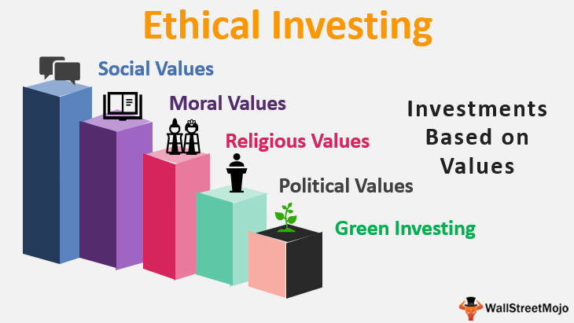

## Table of Contents

## What is ethical investing?

Ethical investing is when people choose to put their money into companies that do good things for the world. Instead of just looking at how much money a company can make, ethical investors also think about how the company treats people, animals, and the environment. For example, they might avoid companies that pollute a lot or treat their workers badly.

There are different ways to do ethical investing. Some people use something called ESG, which stands for Environmental, Social, and Governance. This means they look at how a company affects the environment, how it treats its employees and the community, and how it is run. Others might follow certain themes, like investing only in renewable energy or fair trade products. The main idea is to make sure that the money you invest helps make the world a better place.

## Why is ethical investing important?

Ethical investing is important because it helps make the world a better place. When people choose to invest in companies that do good things, like protecting the environment or treating workers fairly, they are using their money to support positive changes. This can lead to more companies trying to do good things, because they know that ethical investors will support them.

It also helps people feel good about where their money is going. Instead of just focusing on making more money, ethical investors can see that their investments are making a difference. This can be really important for people who want to live their values, not just in how they spend their money, but also in how they invest it. By choosing ethical investing, people can help build a better future for everyone.

## What are the basic principles of ethical investing?

The basic principles of ethical investing are all about making sure your money goes to companies that do good things. It means looking at how a company treats the environment, its workers, and the community. Ethical investors want to support businesses that are kind to the planet, like those that use renewable energy or recycle waste. They also care about companies that treat their employees well, pay them fairly, and make sure they work in safe places.

Another important principle is avoiding companies that do harm. Ethical investors stay away from businesses that pollute a lot, use child labor, or make products that are bad for people's health, like tobacco. Instead, they look for companies that follow good rules and treat everyone fairly. This is often called [ESG](/wiki/esg-investing), which stands for Environmental, Social, and Governance. By following these principles, ethical investors help make the world a better place while also trying to grow their money.

## How can someone start with ethical investing?

To start with ethical investing, first, decide what matters most to you. Do you care about the environment, fair treatment of workers, or something else? Once you know your values, look for companies or funds that match them. You can use online tools and websites that rate companies on their ethical practices. These tools can help you see which companies do good things for the planet and people.

After you've found some companies or funds that fit your values, think about how much risk you're okay with and how long you want to invest your money. Ethical investing can be done through different types of investments, like stocks, bonds, or mutual funds. You might want to talk to a financial advisor who knows about ethical investing. They can help you make a plan that matches your goals and values.

Remember, ethical investing is about making a positive difference while also growing your money. It might take some time to learn about the companies you're investing in, but it's worth it. By choosing to invest ethically, you're helping to build a better world for everyone.

## What are common ethical investment criteria?

Common ethical investment criteria focus on three main areas: the environment, social issues, and how a company is run. For the environment, ethical investors look for companies that protect the planet. This means they might invest in businesses that use renewable energy, reduce waste, or work to lower pollution. They avoid companies that harm the environment, like those that use a lot of fossil fuels or cut down forests.

For social issues, ethical investors care about how companies treat people. They want to support businesses that pay workers fairly, have safe workplaces, and do not use child labor. They also look for companies that help their communities, like those that give back through charity or support local projects. Ethical investors stay away from companies that do things like make weapons, sell tobacco, or produce alcohol, because these can harm people's health or safety.

The last area is how a company is run, or its governance. Ethical investors want to see companies that are honest and fair. This means the company should have good leaders who make decisions openly and treat everyone equally. They also look for companies that follow the law and have clear rules about how they do business. By focusing on these criteria, ethical investors can make sure their money goes to companies that do good things for the world.

## How do ethical funds differ from traditional funds?

Ethical funds and traditional funds are different in what they care about. Traditional funds mainly look at how much money a company can make. They want to pick companies that will grow and make their investors rich. But ethical funds look at more than just money. They also care about how companies treat the environment, people, and if they follow good rules. This means ethical funds pick companies that do good things for the world, not just ones that make a lot of money.

For example, an ethical fund might not invest in a company that pollutes a lot, even if that company makes a lot of money. They might choose a company that uses clean energy instead, even if it makes less profit. This can mean that ethical funds might not grow as fast as traditional funds, but they help make the world a better place. People who invest in ethical funds want to feel good about where their money goes, knowing it supports good causes.

## What are the challenges faced in ethical investing?

One of the big challenges in ethical investing is finding the right information. It can be hard to know if a company is really doing good things or just saying they are. Sometimes, companies might seem ethical but aren't as good as they look. This means ethical investors have to do a lot of research to make sure their money is going to the right places. It can take a lot of time and effort to check all the facts and figures.

Another challenge is that ethical funds might not make as much money as traditional funds. Because ethical investors avoid companies that might be harmful, they might miss out on some big profits. This can be tough for people who want to grow their money quickly. They have to decide if they are okay with possibly making less money in order to support good causes. It's a balance between doing what's right and making financial gains.

Lastly, ethical investing can be more complicated. There are so many different things to think about, like the environment, how companies treat people, and if they follow good rules. It's not always clear which companies are the best choices. Plus, what one person thinks is ethical might be different from what someone else thinks. This means ethical investors need to be clear about their own values and find funds that match them. It's not always easy, but it's important for making a positive difference.

## How can investors measure the impact of their ethical investments?

Investors can measure the impact of their ethical investments by looking at reports and data from the companies they invest in. These reports often show how the company is doing with things like reducing pollution, using renewable energy, or helping the community. Some companies even have special reports just for ethical investors, called sustainability reports. These reports tell you about the good things the company is doing and how it's making a difference. By reading these reports, investors can see if their money is really helping to make the world better.

Another way to measure impact is by using tools and ratings from groups that focus on ethical investing. These groups look at companies and give them scores based on how well they do in areas like the environment, social issues, and how they are run. Investors can use these scores to see if the companies they invest in are doing good things. Sometimes, these groups also have special tools that track the impact of your investments over time. This helps investors see if their ethical choices are making a real difference in the world.

## What role do ESG (Environmental, Social, Governance) factors play in ethical investing?

ESG factors are really important in ethical investing. They help investors pick companies that do good things for the environment, treat people well, and run their business in a fair way. The "E" stands for environmental, so investors look at how companies protect the planet. They want to see if the company uses clean energy, reduces waste, and tries to lower pollution. The "S" is for social, which means investors care about how the company treats its workers and the community. They check if the company pays fair wages, has safe workplaces, and helps the people around them. The "G" stands for governance, which is about how the company is run. Investors want to see if the company follows good rules, is honest, and treats everyone equally.

By focusing on ESG factors, ethical investors can make sure their money goes to companies that match their values. This helps them feel good about where their money is going, knowing it's making a positive difference. But it can also be a bit tricky. Sometimes, it's hard to find all the information you need about a company's ESG performance. And, companies that do well in ESG might not always make as much money as others. So, investors have to balance doing good with making money. But overall, using ESG factors helps ethical investors support companies that are trying to make the world a better place.

## How have regulatory frameworks influenced ethical investing practices?

Regulatory frameworks have helped ethical investing grow by making rules that companies have to follow. These rules make companies share more information about how they affect the environment, treat people, and run their business. This helps ethical investors pick companies that match their values. For example, some countries now require companies to report on things like their carbon emissions or how they treat their workers. This makes it easier for investors to see which companies are doing good things and which ones are not.

But, these rules can also make things more complicated. Different countries have different rules, so it can be hard for investors to understand everything. Also, some companies might try to make their reports look better than they really are. This means ethical investors have to be careful and do a lot of research to make sure the information they get is true. Even with these challenges, regulatory frameworks are important because they push companies to be more open and honest about their ethical practices.

## What are advanced strategies for optimizing ethical investment portfolios?

To optimize an ethical investment portfolio, investors can use a strategy called impact investing. This means [picking](/wiki/asset-class-picking) companies that not only match your values but also have a clear plan to make a positive difference in the world. For example, you might invest in a company that builds affordable housing or one that works on clean water projects. By focusing on these kinds of companies, you can see real changes happening because of your investments. It's also a good idea to keep an eye on how these companies are doing and adjust your investments if they start doing things that don't match your values anymore.

Another advanced strategy is to use a mix of different ethical investments. This is called diversification. By spreading your money across different types of ethical investments, like stocks, bonds, and funds, you can lower your risk and still support good causes. You might invest in a green energy fund, a company that focuses on fair trade, and some bonds from a company that helps the community. This way, if one type of investment doesn't do well, the others might help balance it out. It's also smart to keep learning about new ethical investment options and adjust your portfolio as you find better opportunities to make a positive impact.

## How does ethical investing contribute to sustainable development goals?

Ethical investing helps reach the Sustainable Development Goals (SDGs) by putting money into companies that work on things like ending poverty, protecting the planet, and making sure everyone has good health and education. When investors choose companies that focus on these goals, they give those companies more money to do their good work. For example, if someone invests in a company that builds clean water systems in poor areas, that helps with the goal of clean water and sanitation. By supporting these kinds of companies, ethical investors help make the world a better place for everyone.

Another way ethical investing helps is by pushing companies to do better. When companies know that investors care about things like the environment and fair treatment of workers, they are more likely to try to meet these standards. This means more companies might start using renewable energy, treating their workers better, or helping their communities. All of these actions help move us closer to the SDGs. By choosing where to put their money carefully, ethical investors can help make sure that businesses are working towards a better future for everyone.

## References & Further Reading

[1]: Gopinath, D. (2020). ["Sustainable Investing: Revolutions in Theory and Practice."](https://www.taylorfrancis.com/books/edit/10.4324/9781315558837/sustainable-investing-cary-krosinsky-sophie-purdom) Cambridge University Press.

[2]: Fabozzi, F. J., Ma, K. C., & Oliphant, B. J. (2015). ["Handbook of Green Finance: Energy Security and Sustainable Development."](https://www.semanticscholar.org/paper/Sin-Stocks-Revisited%3A-Resolving-the-Sin-Stock-Blitz-Fabozzi/3a5a2cb5f63b3d38c5cf5e028d633d4674abc4c2) Springer.

[3]: CFA Institute. (2019). ["ESG Integration in the Americas: Markets, Practices, and Data."](https://www.cfainstitute.org/sites/default/files/-/media/documents/survey/esg-integration-in-the-americas.pdf) CFA Institute Report.

[4]: Choudhry, M. (2007). ["The Bond and Money Markets: Strategy, Trading, Analysis."](https://www.sciencedirect.com/book/9780750646772/the-bond-and-money-markets) Butterworth-Heinemann.

[5]: Renneboog, L., Ter Horst, J., & Zhang, C. (2008). ["Socially Responsible Investments: Institutional Aspects, Performance, and Investor Behavior."](https://www.sciencedirect.com/science/article/abs/pii/S0378426607004220) Journal of Banking & Finance, 32(9), 1723-1742.

[6]: International Energy Agency. (2020). ["World Energy Outlook 2020."](https://www.iea.org/reports/world-energy-outlook-2020) International Energy Agency.