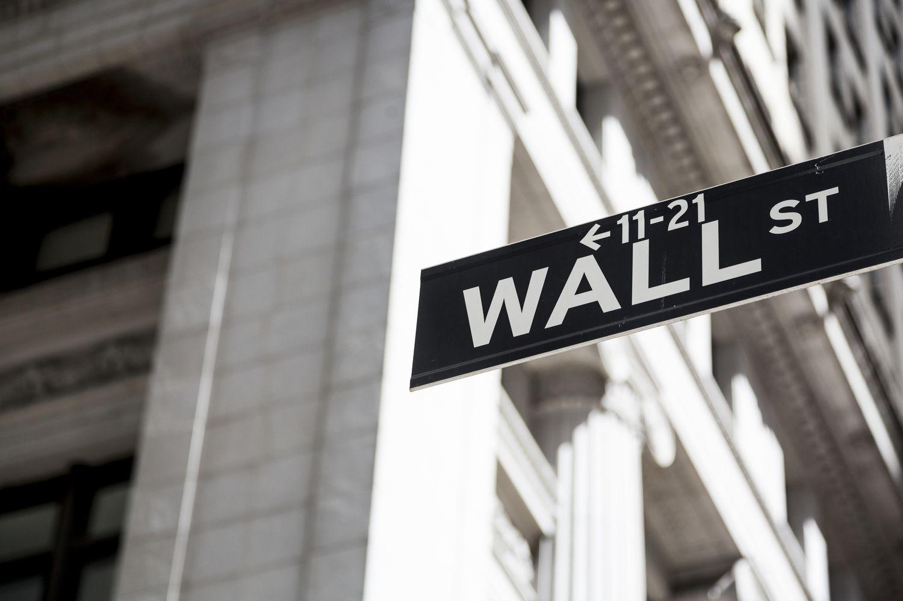

In financial services, upholding ethical boundaries is essential for preventing conflicts of interest. At the core of these ethical practices is the concept of an 'ethical wall,' once referred to as a 'Chinese Wall.' This barrier is essential in sectors such as investment banking and algorithmic trading, where the risks associated with insider information are significant. An ethical wall serves to separate various parts of a financial institution to ensure that sensitive information does not cross from one segment to another, thereby preventing opportunities for insider trading and unfair market advantages. 

The importance of ethical walls in financial regulations cannot be overstated, especially in investment banking and algorithmic trading. In investment banking, these walls ensure that proprietary information from advisory units is not improperly used by trading units within the same institution. Meanwhile, in algorithmic trading, strict controls are necessary to maintain the confidentiality of market-sensitive data and trading algorithms.

The historical context and evolution of ethical walls reveal their integral role in maintaining financial integrity. Their effectiveness hinges on the robust implementation of these controls, supported by both regulatory frameworks and technological advancements. This article aims to shed light on the history, implementation, and effectiveness of ethical walls, providing a comprehensive overview of their role in sustaining ethical conduct across financial sectors.

## Table of Contents

## The History of Ethical Walls

Ethical walls in the financial sector came into focus after the 1929 stock market crash, which revealed significant pitfalls in the financial system, particularly concerning conflicts of interest and insider trading. In response, the Glass-Steagall Act was enacted in 1933 as a regulatory measure to separate commercial and investment banking activities. The primary purpose of this separation was to protect depositor's funds from the high risks associated with investment banking by preventing banks from engaging in activities that could lead to conflicts of interest. The Glass-Steagall Act laid the groundwork for developing mechanisms, later known as ethical walls, intended to ensure that sensitive, non-public information obtained by one part of a financial institution does not improperly influence or benefit another part of the same institution.

Over time, financial markets and institutions evolved, and so did the regulations governing them. The Gramm-Leach-Bliley Act (GLBA) of 1999 marked a significant shift in the regulatory landscape. This Act repealed parts of the Glass-Steagall Act, primarily the sections that enforced the separation between commercial and investment banking. The GLBA allowed for the creation of financial conglomerates, enabling banks, securities firms, and insurance companies to merge and offer a broader range of services under one corporate umbrella. While this integration allowed for a more diversified range of services and potential economies of scale, it also necessitated stronger and more sophisticated ethical walls to prevent the misuse of insider information within these multifaceted organizations.

Despite changes in regulations and the structural evolution of financial institutions, the primary objective of ethical walls has remained constant: to prevent the misuse of insider information. Ethical walls are designed to prevent information flow between departments that could lead to conflicts of interest, thereby maintaining the integrity of financial operations. The need to continually uphold these principles, even as the regulatory and business landscapes change, highlights the ongoing importance of ethical walls in safeguarding the financial system.

## Regulatory Framework Governing Ethical Walls

Regulatory bodies such as the Securities and Exchange Commission (SEC) are instrumental in enforcing ethical walls within financial institutions. The primary goal of these regulations is to curb insider trading and protect sensitive information from unauthorized access. The establishment and maintenance of ethical walls are mandated by various regulations, which include the Insider Trading and Securities Fraud Enforcement Act and the Sarbanes-Oxley Act.

The Insider Trading and Securities Fraud Enforcement Act of 1988 is vital in combating illegal trading activities. It provides the SEC with enhanced enforcement tools and increased penalties for entities engaging in unlawful insider trading. The Act underlines the importance of maintaining a strict division between different business units to prevent the exchange of insider information that could influence trading activities.

The Sarbanes-Oxley Act of 2002 further strengthens the regulatory environment by mandating stringent corporate governance standards. This Act necessitates transparent and ethical management practices, thereby supporting the implementation of ethical walls. Organizations are required to ensure that business units operating with potentially conflicting interests are adequately segregated, thereby minimizing the risk of information breaches.

The role of compliance officers is critical in adhering to these regulations. They are responsible for the implementation and oversight of ethical wall policies within their institutions. Compliance officers must ensure that employees are trained to recognize and act according to these regulatory requirements. Additionally, they are tasked with monitoring and auditing internal processes to identify and address any potential breaches.

Overall, regulatory frameworks governing ethical walls serve to uphold financial integrity. By enforcing strict separation of business units and emphasizing the importance of ethical practices, these regulations ensure that financial institutions operate in compliance with legal and ethical standards. This regulatory diligence ultimately fosters trust and confidence in the financial markets.

## The Role of Ethical Walls in Investment Banking

Investment banks implement ethical walls to maintain clear separation between different business functions, notably trading and advisory services. By establishing these barriers, banks aim to prevent conflicts of interest and ensure the protection of sensitive client data. The separation entails organizational measures that legally and physically isolate departments handling confidential information from those that could potentially exploit it for profit.

These ethical walls serve as a mechanism to protect proprietary and client information from being used inappropriately, thereby fostering trust between the bank and its clients. For instance, the research department, which handles sensitive market analyses and client information, is kept independent from the sales and trading teams that could exploit such information for trading advantage. This separation is vital to protect investor interests and maintain market integrity.

To reinforce the importance of ethical walls, investment banks often conduct training programs for their employees. These programs are designed to educate staff on the principles and protocols related to the implementation of ethical walls. Employees learn about relevant regulations, the importance of confidentiality, and the specific procedures that must be followed to ensure compliance with these ethical guidelines. Regular training sessions help in keeping the staff updated about any changes in regulatory requirements and reinforce the culture of ethical behavior within the organization.

Despite these protocols, investment banks face numerous challenges in maintaining robust ethical walls. Real-world issues such as inadvertent sharing of information through informal communication channels or the integration of digital technologies necessitate ongoing vigilance. The dynamic nature of financial markets, coupled with rapid technological advancements, requires continuous reassessment and modification of ethical wall mechanisms. Banks must address these challenges by evolving their operational strategies and employing technological solutions, such as advanced encryption and access control systems, to uphold the integrity of their ethical boundaries.

In conclusion, ethical walls in investment banking are crucial for safeguarding sensitive client information, mitigating conflicts of interest, and ensuring compliance with regulatory standards. Through employee training and technological enhancements, banks strive to uphold these ethical standards, although real-world challenges necessitate continuous diligence and adaptation.

## Algorithmic Trading and Ethical Walls

Algorithmic trading has transformed financial markets, enabling high-speed transaction execution that outpaces human capabilities. However, the integration of algorithms introduces unique challenges for maintaining ethical boundaries, essential for preserving market integrity. Ensuring a robust ethical framework involves segregating trading algorithms from sensitive market information to prevent unintentional insider trading and conflicts of interest.

To uphold ethical standards, it is critical to implement stringent separations between trading algorithms and any market-sensitive information. This separation prevents the misuse of proprietary data and ensures that decisions made by algorithms rely solely on legally obtained market data. This is crucial in preventing unethical advantages that could arise from accessing confidential information, ultimately maintaining fairness and transparency in market operations.

Technological solutions play a significant role in establishing and reinforcing these ethical boundaries. Advanced data encryption techniques ensure that sensitive information remains inaccessible to unauthorized users. Encryption algorithms, such as AES (Advanced Encryption Standard), provide a robust framework for securing data transmissions between different systems within a trading firm. Moreover, access control mechanisms restrict the flow of information to and from trading algorithms. By using role-based access control (RBAC), organizations can define and enforce policies ensuring that only authorized personnel have access to specific data sets or systems.

Another technological advancement aiding the enforcement of ethical walls in [algorithmic trading](/wiki/algorithmic-trading) is the adoption of [machine learning](/wiki/machine-learning) models for real-time monitoring and anomaly detection. These models can scrutinize trading patterns and flag unusual activities that may indicate a breach in ethical practices. Implementing [artificial intelligence](/wiki/ai-artificial-intelligence) (AI) for monitoring not only enhances the detection of potential violations but also improves the response time to any ethical issues that arise, thereby safeguarding market confidence.

Ensuring ethical practices within algorithmic trading is key to enhancing market confidence and transparency. Confidence is bolstered when market participants trust that trading institutions adhere to ethical norms, minimizing risks associated with information misuse. Transparency, achieved through clear ethical guidelines and consistent enforcement, fortifies the reputation of financial markets, fostering an environment of fairness and integrity.

In conclusion, maintaining ethical walls in algorithmic trading is paramount to promoting a transparent and trustworthy market environment. Effective segregation of information, complemented by advanced technological solutions such as encryption and AI monitoring, is essential in upholding these standards, thereby enhancing overall market confidence.

## Technological Solutions for Maintaining Ethical Walls

Technology has become essential in the modern financial landscape, offering robust solutions for maintaining ethical walls within financial institutions. Multi-[factor](/wiki/factor-investing) authentication (MFA) is a fundamental tool in this domain, requiring users to provide multiple forms of identification before accessing sensitive data. This method significantly reduces the risk of unauthorized access by ensuring that even if one factor is compromised, unauthorized users cannot gain entry to restricted areas.

Access control systems further bolster these efforts by defining and managing which individuals have permission to access certain information or systems. Role-based access control (RBAC) is commonly used, where permissions are linked to roles rather than individual users, simplifying management and ensuring that sensitive data is only accessible to personnel with legitimate needs. This structured approach to permission management enhances operational integrity by minimizing potential access violations.

Artificial Intelligence (AI) solutions have revolutionized real-time monitoring, offering an advanced layer of security to detect and prevent potential breaches. Machine learning algorithms analyze vast amounts of data to identify unusual patterns or anomalies that might indicate security threats. For instance, a sudden spike in user access requests or attempts to access data at unusual times might trigger alerts for closer scrutiny. AI systems continuously evolve by learning from new data, thereby improving their accuracy and reducing false positives over time.

These technological advancements surpass traditional methods in safeguarding against ethical violations by providing layers of security that can adapt to evolving threats. As financial institutions increasingly rely on complex digital infrastructures, these tools are indispensable in preserving the confidentiality and integrity of sensitive information while minimizing the risk of ethical breaches. Utilizing such technology not only ensures compliance with regulatory frameworks but also reinforces public confidence in the ethical standards of financial operations.

## Case Studies Highlighting Ethical Wall Breaches

Ethical wall breaches in financial institutions highlight vulnerabilities that can compromise the intended protection against conflicts of interest and insider trading. A notable case is the Rajat Gupta incident, which underscores the weaknesses in existing ethical barriers. Gupta, a former director at Goldman Sachs, was found guilty of insider trading for disclosing confidential information to [hedge fund](/wiki/hedge-fund-trading-strategies) manager Raj Rajaratnam. This breach demonstrated the inadequacy of ethical walls to prevent the unauthorized flow of sensitive information between business units within and outside the firm.

The Gupta case revealed several systemic issues, including the failure of compliance mechanisms to detect and prevent information leakage. Despite the presence of organizational protocols designed to segregate information, the lack of rigorous enforcement and monitoring allowed Gupta to bypass these controls. This incident emphasizes the need for continuous updates and enhancements to ethical wall structures, ensuring they evolve in response to new challenges and tactics used to circumvent them.

Moreover, the Gupta case also highlighted the critical role of individual responsibility and integrity within organizations. Personal conduct can significantly influence the effectiveness of ethical barriers, and the absence of a robust culture of compliance can undermine structural efforts to maintain information security.

Lessons learned from such breaches stress the importance of both regulatory and organizational adherence to ethical walls. Regulatory bodies must impose stringent guidelines and perform regular audits to ensure compliance. Organizations, on the other hand, need to foster an ethical culture that prioritizes transparency and accountability. This involves regular training for employees on the significance of ethical walls and the consequences of breaches, as well as implementing technological solutions for better monitoring and enforcement.

Ultimately, the effectiveness of ethical walls depends on a combination of robust regulatory frameworks, organizational commitment to ethical practices, and the integration of advanced technological systems to monitor and prevent potential infractions. Such comprehensive measures are crucial for maintaining the integrity of financial operations and safeguarding market confidence.

## Ethical Considerations and Cultural Sensitivity

The term "Chinese Wall" in the context of financial services historically referred to an information barrier designed to prevent the exchange of material, non-public information between departments within a firm. However, this terminology has sparked considerable debate over cultural sensitivity. Critics argue that the term carries a notion of cultural stereotype, potentially offensive to Chinese culture, and suggests inscrutability or impenetrability, which is problematic in increasingly globalized financial markets. As a result, the industry has shifted towards using more culturally neutral terms like "ethical wall" or "information barrier."

The importance of sensitive terminology is accentuated by the diverse nature of the modern financial industry. In an interconnected world, financial institutions operate across multiple regions and cultures. Language that respects cultural differences is paramount in fostering an inclusive environment, reinforcing the responsibility of the finance sector to uphold universal ethical standards. This involves recognizing and discarding outdated terminology that may perpetuate stereotypes or misunderstandings.

Adopting culturally neutral terms not only addresses sensitivity concerns but also promotes a universal understanding of ethical practices in global finance. The shift towards using "ethical wall" aligns the discourse with broader principles of equality and respect, eliminating potential barriers to collaboration and trust among international financial entities. Cultural sensitivity in terminology reflects an institution's commitment to ethical conduct, reinforcing the principles it aims to protect, such as impartiality, transparency, and integrity.

As financial markets continue to evolve and expand globally, the adoption of inclusive language not only exemplifies respect for cultural diversity but also strengthens the industry's collective ethical framework. By embracing terminology that is both accurate and sensitive, financial institutions demonstrate leadership in setting high ethical standards and in fostering environments that respect the cultural nuances of all stakeholders involved.

## Conclusion

Ethical walls continue to serve as a fundamental component in ensuring the integrity of financial markets by preventing insider trading and mitigating conflicts of interest. These barriers are essential for maintaining the separation of information flows between different departments within financial institutions, thereby protecting sensitive information and ensuring fair market practices.

Despite persistent challenges, regulatory advancements and technological innovations have consistently enhanced the effectiveness of ethical walls. Regulatory bodies such as the Securities and Exchange Commission (SEC) and legislation like the Sarbanes-Oxley Act provide a framework for enforcing these barriers, requiring firms to establish and maintain rigorous protocols to prevent information leakage. Additionally, technological solutions, including the adoption of advanced data encryption methods, multi-factor authentication, and artificial intelligence for real-time monitoring, significantly bolster these efforts by providing robust defenses against potential breaches.

For financial institutions, prioritizing transparent and ethical practices is not merely a regulatory obligation but a strategic necessity to maintain trust and credibility in the market. By reinforcing ethical walls with continual updates and adaptations to new challenges, such as those presented by algorithmic trading, institutions can promote a culture of integrity and accountability. This approach not only safeguards the interests of clients and stakeholders but also supports the overall stability and transparency of financial systems globally.

## References & Further Reading

[1]: ["The Glass-Steagall Act and its Impact on the Financial System."](https://en.wikipedia.org/wiki/Glass%E2%80%93Steagall_Legislation) Federal Reserve History

[2]: Sherman, A. J. (1999). ["The Gramm-Leach-Bliley Act."](https://www.investopedia.com/terms/g/glba.asp) The Annual Review of Banking Law, 18, 350-353.

[3]: ["Insider Trading and Securities Fraud Enforcement Act of 1988."](https://www.congress.gov/bill/100th-congress/house-bill/5133) U.S. Congress

[4]: ["The Sarbanes-Oxley Act: A Review"](https://www.csoonline.com/article/570121/the-sarbanes-oxley-act-explained-definition-purpose-and-provisions.html) by Journal of Accountancy

[5]: Li, Y., & Xu, Y. (2004). ["An Overview of Chinese Walls and Information Barriers in Financial Institutions."](https://www.sciencedirect.com/science/article/pii/S0360319924052996) Journal of Financial Regulation and Compliance

[6]: ["Quantitative Finance for Physicists: An Introduction"](https://www.sciencedirect.com/book/9780120884643/quantitative-finance-for-physicists) by Anatoly B. Lichtenberg

[7]: Aizenman, J., & Jinjarak, Y. (2009). ["Globalisation and Developing Countries – A Shrinking Tax Base?"](https://www.nber.org/papers/w11933) National Bureau of Economic Research

[8]: ["Multi-Factor Authentication: Best Practices."](https://mojoauth.com/blog/multi-factor-authentication-best-practices/) National Institute of Standards and Technology

[9]: Schinasi, G. J. (2006). ["Safeguarding Financial Stability: Theory and Practice."](https://www.imf.org/External/Pubs/NFT/2005/SFS/eng/sfs.pdf) International Monetary Fund

[10]: ["Understanding the SEC's Role in Financial Markets and Regulatory Oversight."](https://www.investopedia.com/articles/investing/112914/understanding-sec.asp) U.S. Securities and Exchange Commission