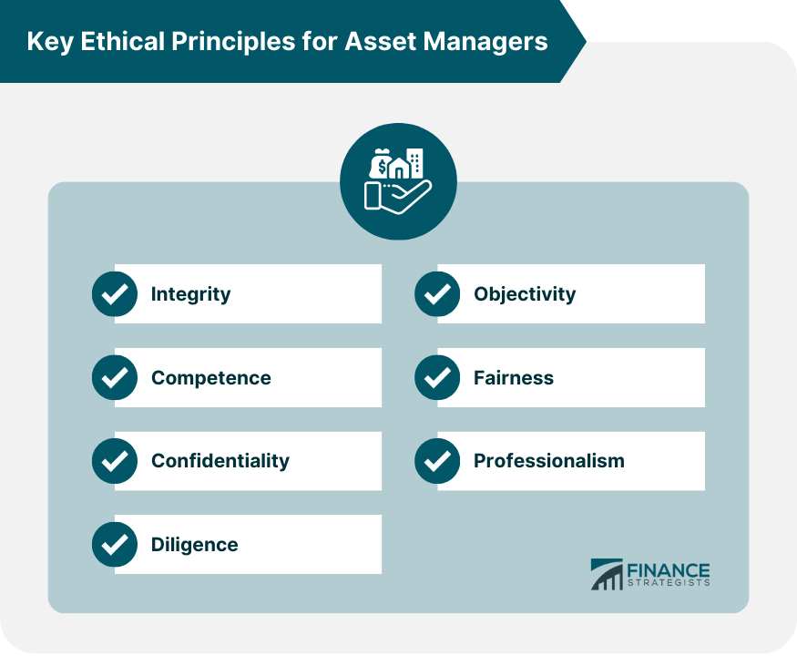

## Table of Contents

## What is ethics in the context of asset management?

Ethics in asset management refers to the moral principles and values that guide the behavior and decisions of professionals who manage investments. It involves acting with integrity, fairness, and transparency when handling other people's money. Ethical asset managers always put their clients' interests first, avoid conflicts of interest, and follow the rules and regulations set by governing bodies.

Being ethical in asset management is crucial because it builds trust and confidence among investors. When people know that their money is being managed honestly and responsibly, they are more likely to invest and stay invested. Ethical practices also help maintain the reputation of the asset management industry, making it more attractive to potential clients and ensuring its long-term success.

## Why is risk management important in asset management?

Risk management is important in asset management because it helps protect the money that people have invested. When you manage assets, there are always things that can go wrong, like the value of investments going down or unexpected events happening. By managing risks, asset managers can see these problems coming and take steps to avoid them or make them less harmful. This means they can keep the investments safer and help investors lose less money when bad things happen.

Another reason risk management is important is that it helps asset managers make better choices about where to put the money. When they understand the risks, they can pick investments that match what the investor wants, whether that's growing their money quickly or keeping it safe. This way, investors can feel more confident that their money is being handled carefully and wisely. Good risk management also means that asset managers can explain to investors why they made certain choices, which builds trust and keeps everyone on the same page.

## What are the basic principles of compliance in asset management?

Compliance in asset management means following the rules and laws that apply to managing investments. It's important because it helps keep everything fair and honest. The basic principles of compliance include knowing and following all the rules set by government agencies, like the SEC in the United States. Asset managers must also have clear policies and procedures in place to make sure everyone in their company follows these rules. They need to train their employees regularly so everyone understands what they should and shouldn't do.

Another key principle is keeping good records. This means writing down all the important details about investments and decisions, so if anyone asks, the asset manager can show they did everything correctly. Compliance also involves checking their own work regularly, which is called monitoring and auditing. This helps catch any mistakes or problems early. Finally, if something goes wrong, asset managers need to report it quickly and fix it. By following these principles, asset managers can make sure they are doing their job the right way and keeping their clients' trust.

## How can ethical practices enhance the reputation of an asset management firm?

Ethical practices can really help an asset management firm build a good reputation. When a firm always does the right thing, people start to trust them more. Clients feel safe knowing their money is being handled honestly and fairly. This trust makes clients want to keep their money with the firm and even tell their friends about it. Over time, more and more people hear about the firm's good reputation, which can bring in new clients and help the firm grow.

Being ethical also shows that the firm cares about more than just making money. It shows they care about doing things the right way, even when no one is watching. This can make the firm stand out from others that might cut corners or take risks that aren't good for clients. When people see a firm sticking to high ethical standards, they respect it more. This respect can lead to a strong, positive reputation that lasts a long time and helps the firm do well in the long run.

## What are common ethical dilemmas faced by asset managers?

Asset managers often face ethical dilemmas when their personal interests clash with what's best for their clients. For example, they might get a chance to invest in a company where they or their family have a stake. If they do this, it could make them more money personally, but it might not be the best choice for their clients. They need to decide if they should put their clients first, even if it means missing out on personal gain. This can be hard because the pressure to make money for themselves can be strong.

Another common dilemma is when asset managers have inside information about a company that could affect its stock price. Using this information to buy or sell stocks before it becomes public is illegal and unfair. But if they know something big is about to happen, it can be tempting to use that knowledge to make a quick profit. Choosing to follow the rules and not use inside information, even when it could make them a lot of money, is a tough ethical choice. It's important for asset managers to always do what's right and fair, even when no one is watching.

## How does regulatory compliance affect asset management strategies?

Regulatory compliance can change how asset managers make their plans. When there are strict rules, asset managers need to be very careful about where they put their clients' money. They have to make sure every investment follows the rules, which might mean they can't invest in certain things that could be risky or not allowed. This can limit their choices and make them focus more on safer investments that fit within the rules. It also means they need to spend time and money to keep up with all the regulations and make sure they are doing everything right.

Even though it can make things harder, following the rules can also help asset managers build trust with their clients. When people know that their money is being managed in a way that follows all the laws, they feel more confident. This trust can help the asset management firm grow and attract more clients. So, while regulatory compliance might limit some strategies, it also plays a big role in keeping the firm's reputation strong and making sure they can keep working in the long run.

## What are the consequences of non-compliance in asset management?

If asset managers don't follow the rules, they can get into big trouble. They might have to pay big fines, which means they lose a lot of money. Sometimes, they can even go to jail if they break the law on purpose. The government and other groups that watch over them can also take away their license to manage money, which means they can't work anymore. This can hurt their business a lot because they can't do what they do best.

Not following the rules can also make people stop trusting them. When clients find out that an asset manager didn't do things the right way, they might take their money out and find someone else to manage it. This can make the asset manager lose clients and make less money. It can also make it hard for them to get new clients because no one wants to work with someone who doesn't follow the rules. In the end, not being compliant can ruin the asset manager's reputation and their whole business.

## How can asset managers integrate ethical considerations into their risk management frameworks?

Asset managers can integrate ethical considerations into their risk management frameworks by making sure they always think about what is right and fair when they are deciding where to invest money. This means they need to look at more than just how much money they can make. They should also think about if the investment is good for the world and if it treats people and the environment well. For example, they might choose to avoid investing in companies that harm the environment or treat their workers badly, even if those companies could make a lot of money. By doing this, they can lower the risk of getting into trouble for not being ethical and also build trust with their clients who care about these things.

To make this work, asset managers need to have clear rules and plans about how to include ethical thinking in their risk management. They should train their team to understand these rules and make sure everyone knows what to do. They can also use special tools and reports to keep an eye on how their investments are doing in terms of ethics. This way, they can spot any problems early and fix them before they get worse. By always keeping ethics in mind, asset managers can make sure they are doing the right thing and also help their business stay strong and respected.

## What role does corporate governance play in ensuring ethical asset management?

Corporate governance is super important for making sure that asset management stays ethical. It's all about the rules and ways a company is run to make sure everyone does the right thing. Good corporate governance means having a board of directors who watch over the company and make sure it follows the law and treats people fairly. They set the tone at the top, showing everyone in the company that being ethical matters. This helps keep the asset managers honest and focused on doing what's best for their clients, not just making money for themselves.

When a company has strong corporate governance, it's easier to spot and stop any unethical behavior before it gets out of hand. The board can set up rules and checks to make sure asset managers aren't doing anything wrong, like using inside information or putting their own interests first. They can also make sure the company is open about what it's doing, so clients and the public can see that everything is being done the right way. This builds trust and helps the company keep a good reputation, which is really important for success in asset management.

## How can advanced data analytics be used to monitor and ensure ethical compliance in asset management?

Advanced data analytics can help asset managers keep an eye on things and make sure they are following the rules. By using special computer programs, they can look at a lot of information quickly and find any signs that something might not be right. For example, if someone is trading stocks in a way that looks suspicious, the analytics can spot it and warn the managers. This helps them catch any problems early and fix them before they get worse. It also means they can show their clients and the people who watch over them that they are doing everything they can to be honest and fair.

Using data analytics also makes it easier to check if the company is following its own rules about being ethical. The programs can keep track of all the investments and make sure they match what the company says it will do. If there's a rule about not investing in companies that harm the environment, the analytics can check all the investments to make sure they follow that rule. This helps the company stick to its promises and build trust with everyone who cares about doing things the right way. By using advanced data analytics, asset managers can make sure they are always on the right track and keeping their clients' trust.

## What are the best practices for developing an ethical culture within an asset management organization?

To build an ethical culture in an asset management organization, it's important to start from the top. Leaders need to show that they care about doing the right thing. They can do this by setting clear rules and making sure everyone knows what is expected of them. It's also helpful to have regular training sessions where employees learn about ethics and why it matters. This way, everyone understands that being honest and fair is a big part of their job. When leaders act ethically and talk about it often, it sends a strong message to the whole team.

Another key part of creating an ethical culture is to make sure there are good ways for people to speak up if they see something wrong. This means having a safe way for employees to report any problems without being scared of getting in trouble. It's also important to check regularly how things are going and fix any issues quickly. By rewarding people who do the right thing and showing that the company takes ethics seriously, the organization can build a culture where everyone feels proud to work in a place that values doing what's right.

## How do global standards and varying regulatory environments impact ethical asset management practices?

Global standards and different rules in different countries can make it tricky for asset managers to keep things ethical. When a company works in many places, they have to follow lots of different rules. Some places might have very strict rules about what you can and can't do, while other places might be more relaxed. This can make it hard for asset managers to know what's right and wrong everywhere they work. They have to be careful and make sure they understand all the rules in each country to keep their practices ethical and fair.

Even though it's tough, global standards can help. Groups like the CFA Institute set rules that are meant to be followed everywhere. These rules help asset managers know what's expected of them, no matter where they are. By following these global standards, asset managers can make sure they are doing the right thing and treating everyone fairly. It also helps build trust with clients who know that the company is trying to be ethical, no matter where they are working.

## References & Further Reading

[1]: CFA Institute. ["Code of Ethics and Standards of Professional Conduct."](https://www.cfainstitute.org/standards/professionals/code-ethics-standards) 

[2]: U.S. Securities and Exchange Commission (SEC). ["Division of Investment Management: Information for Newly-Registered Investment Advisers."](https://www.sec.gov/files/litigation/admin/2025/34-102088.pdf)

[3]: Lopez de Prado, M. (2018). ["Advances in Financial Machine Learning."](https://www.amazon.com/Advances-Financial-Machine-Learning-Marcos/dp/1119482089) Wiley.

[4]: Jansen, S. (2020). ["Machine Learning for Algorithmic Trading."](https://github.com/stefan-jansen/machine-learning-for-trading) 

[5]: Chan, E. (2009). ["Quantitative Trading: How to Build Your Own Algorithmic Trading Business."](https://github.com/ftvision/quant_trading_echan_book) Wiley.

[6]: DeGroot, M. H., & Schervish, M. J. (2012). ["Probability and Statistics."](https://www.pearson.com/en-us/subject-catalog/p/probability-and-statistics-classic-version/P200000006163/9780137981694) Addison-Wesley.

[7]: Engle, R. F., Ferstenberg, R., & Russell, J. R. (2012). ["Measuring and Modeling Execution Cost and Risk."](https://papers.ssrn.com/sol3/papers.cfm?abstract_id=1293666) National Bureau of Economic Research.