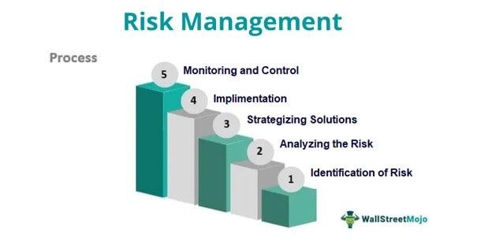

Risk management, ethics, compliance, and algorithmic trading are pivotal components in modern asset management, serving as the foundational cornerstones for safeguarding investments, ensuring adherence to regulatory standards, and maintaining ethical trading practices. The integration of these crucial elements has become increasingly significant since the 2008 financial crisis, which highlighted the vulnerabilities within financial systems due to inadequate oversight and risk management practices. Consequently, these components have not only become integral to sound asset management but also vital to the promotion and establishment of robust financial systems that are resilient to market disruptions.

Risk management involves the identification, assessment, and mitigation of potential losses within investment portfolios, helping to preserve capital and ensure market stability. Meanwhile, ethical considerations are essential in fostering trust and transparency in the management of investors' funds, compelling asset managers to prioritize clients' interests and maintain ethical standards. Compliance with legal frameworks reinforces operational integrity, mandating adherence to regulations set forth by bodies such as the CFA Institute and the U.S. Securities and Exchange Commission (SEC). 



Algorithmic trading, which utilizes computer programs to execute trades with precision and speed, has transformed the landscape of asset management by reducing human error and increasing efficiency. However, it also presents challenges, such as potential system failures and market manipulations, illustrating the need for robust risk management and ethical oversight within this domain.

This article explores these intertwined domains, emphasizing their shared importance in ensuring the stability, integrity, and ethical standards of modern financial markets. Their collective importance is not only in the past lessons learned but also in shaping the future of asset management, where continuous adaptation to technological advancements and evolving regulations is crucial.

## Table of Contents

## The Importance of Risk Management in Asset Management

Risk management in asset management plays a critical role in safeguarding investment portfolios by identifying, assessing, and prioritizing risks, thereby minimizing potential negative impacts. The 2008 financial crisis underscored the necessity of robust risk management, altering its perception from a mere administrative task to a crucial aspect of ensuring investor confidence and maintaining market stability.

The cornerstone of effective risk management strategies is diversification. By allocating investments across various asset classes, sectors, and geographies, managers can mitigate the risks associated with specific securities or market downturns. Diversification reduces the portfolio's overall risk profile without significantly hampering potential returns, adhering to the principles of modern portfolio theory.

Establishing risk limits is another key strategy. By setting predetermined thresholds for acceptable levels of risk, such as maximum drawdown limits or value-at-risk (VaR) constraints, asset managers can maintain discipline in navigating market fluctuations. These limits act as guardrails, preventing excessive exposure and potential losses.

Advanced monitoring tools also contribute significantly to risk management. Today's technology offers a range of tools that allow real-time analysis and reporting of portfolio performance and risk metrics. These tools enable asset managers to swiftly identify emerging risks and adapt strategies accordingly.

Stress testing is paramount for assessing how portfolios might react to extreme market conditions. By simulating various adverse scenarios, such as economic recessions or geopolitical events, managers can evaluate the resilience of their portfolios. Python libraries like `pandas` and `numpy` are often used for conducting these simulations, allowing for detailed statistical analysis and visualization.

Dynamic position sizing can further enhance portfolio resilience against market [volatility](/wiki/volatility-trading-strategies). By adjusting the size of investments based on the current risk environment, managers can reduce exposure during high volatility periods and take advantage of more stable conditions. This tactical approach aligns investment size with risk tolerance and prevailing market dynamics.

In conclusion, risk management is now integral to asset management, driven by lessons from past financial crises and the continuous evolution of markets. Implementing diversified portfolios, adhering to risk limits, harnessing technology for advanced monitoring, conducting stress tests, and adopting dynamic position sizing are essential to achieving resilient and stable investment outcomes.

## Ethics in Asset Management

Ethics in asset management focus on the essential responsibility of managing investors' funds with integrity and transparency. This ethical obligation ensures that client interests are always prioritized. Asset managers must adhere to established ethical guidelines and maintain transparency to foster long-term trust with clients. Key components of managing investments ethically include avoiding conflicts of interest and prioritizing fiduciary responsibilities, which require acting in the best interest of the clients at all times.

To mitigate conflicts of interest, asset managers often implement policies that clearly separate personal interests from professional duties. For instance, an asset manager might avoid investing in companies where they hold personal stakes or have family connections, thus maintaining objectivity and impartiality in their investment decisions.

Maintaining ethical standards also involves regular audits and compliance checks against industry guidelines. Periodic audits serve as an essential tool in enhancing trust and accountability within financial practices. These audits, typically conducted by third-party organizations, ensure that asset managers comply with ethical norms and regulations, and identify areas for improvement in transparency and client interactions.

Several organizations provide ethical guidelines and certifications to uphold the highest standards in asset management. For example, the Chartered Financial Analyst (CFA) Institute offers a Code of Ethics and Standards of Professional Conduct that asset managers are encouraged to follow. These guidelines stress the importance of competence, diligence, and integrity, providing a structured framework for professionals to manage assets ethically.

Moreover, ethical asset management requires clear communication with clients about investment strategies, risks, and potential returns. Ensuring transparency in these communications helps clients make informed decisions and fosters stronger, more trustworthy relationships with asset managers.

In summarizing ethical practices in asset management, it's crucial that the interests of the clients remain paramount. Through adherence to ethical guidelines, clear communication, and regular audits, asset managers can significantly enhance trust and accountability, thereby ensuring that the financial goals of their clients are met with integrity and transparency.

## Compliance and Legal Frameworks

Strict compliance with legal and regulatory frameworks ensures the integrity and stability of asset management operations. Regulatory adherence is critical in preventing market abuses and safeguarding investor interests. Organizations such as the CFA Institute and regulatory bodies like the U.S. Securities and Exchange Commission (SEC) play a pivotal role in setting and enforcing these standards. The CFA Institute provides a code of ethics and standards of professional conduct, which serve as a benchmark for asset managers to uphold professionalism and ethical practices.

One integral component of compliance is the implementation of third-party verification processes. These ensure that operations and statements made by asset managers are independently reviewed, which reduces the risk of fraudulent activity and enhances transparency. Accurate record-keeping is another essential practice, requiring that comprehensive and precise documentation of all transactions and decisions be maintained. This is vital not only for operational transparency but also for facilitating audits and investigations if necessary.

Resources must be adequately allocated to support compliance activities. This includes investing in compliance infrastructure such as technology systems that monitor transactions and communications, as well as employing skilled compliance officers who can interpret and apply regulatory requirements effectively. Recent legislative developments, such as the Dodd-Frank Act and the European Union's Markets in Financial Instruments Directive II (MiFID II), have intensified the focus on regulatory compliance. These frameworks impose stringent requirements on reporting, trading, and transparency, directly affecting asset managers by placing greater accountability on their operations. 

Consequently, asset managers must navigate increasingly complex legal landscapes by continually updating their compliance strategies and ensuring that they are adequately prepared to meet evolving regulatory demands. Failure to comply with these requirements can result in significant penalties, legal sanctions, and reputational damage, emphasizing the importance of compliance in maintaining the stability and integrity of financial markets.

## Algorithmic Trading: Benefits and Challenges

Algorithmic trading employs sophisticated computer programs to execute trades, which enhances the speed and efficiency of transactions while minimizing human error. This method relies on pre-defined instructions or algorithms to monitor market conditions and execute trades when certain criteria are met. As such, it has become an integral part of modern financial markets, accounting for a significant portion of trading [volume](/wiki/volume-trading-strategy) across global exchanges.

Despite the advantages of [algorithmic trading](/wiki/algorithmic-trading), it is not without its challenges. One primary concern is the risk of system failures, which can lead to significant financial losses. Algorithms can malfunction due to coding errors, unexpected market conditions, or technical glitches in the trading infrastructure. For instance, the Flash Crash of May 6, 2010, an event marked by a rapid and severe drop in U.S. stock indices, was partly attributed to the uncontrolled operation of trading algorithms.

Moreover, algorithmic trading introduces the risk of market manipulation. High-frequency trading ([HFT](/wiki/high-frequency-trading-strategies)), a subset of algorithmic trading, has been criticized for practices like "quote stuffing" and "spoofing," where the illusion of market activity is created to influence prices. These practices can lead to a lack of transparency and fairness in the markets.

To mitigate these risks, effective risk controls are paramount in algorithmic trading systems. Pre-trade risk checks help in assessing the potential impact of trades before they are executed, ensuring that they adhere to regulatory constraints and risk limits. Post-trade surveillance is crucial for monitoring trades after execution to detect and address any irregularities or breaches of compliance.

Implementing robust system safeguards is another vital aspect of managing risks in algorithmic trading. These safeguards may include redundant systems to ensure continuity in the event of a failure, regular testing and optimization of algorithms, and stringent access controls to prevent unauthorized modifications.

Model risk management is essential to ensure that algorithms operate as intended and comply with regulatory requirements. This involves a rigorous process of developing, testing, validating, and monitoring models used in trading strategies. By ensuring that models are accurate and reliable, firms can protect themselves against the financial and reputational risks associated with algorithmic trading.

In summary, while algorithmic trading offers numerous benefits in terms of efficiency and reduced human error, it also poses significant challenges that must be carefully managed. Through proactive risk management strategies, including risk checks, surveillance, system safeguards, and model validation, traders can harness the advantages of algorithmic trading while mitigating its potential downsides.

## Integrating Risk Management with Algo Trading

Integrating risk management with algorithmic trading is crucial for reducing operational risks and enhancing the performance of trading strategies. This integration involves a systematic approach where risk management strategies are embedded within algorithmic frameworks to protect against potential market vulnerabilities. One of the foundational steps in this integration is [backtesting](/wiki/backtesting). By simulating algorithm performance on historical data, traders can identify strengths and weaknesses, allowing for the refinement of strategies before they are deployed in real-world markets. Backtesting assesses how algorithms would have performed under different market conditions, helping to mitigate potential risks by learning from past patterns and behaviors.

Another critical aspect is real-time monitoring, which provides immediate insights into trading activities. Real-time data feeds and analytics tools enable traders to track algorithm performance continuously and make necessary adjustments when unexpected market conditions arise. Machine learning further enhances this process by enabling systems to learn from historical and live data, allowing for the detection of emerging threats and opportunities in real time. Machine learning models can be trained to recognize patterns that precede market shifts, providing traders with actionable insights to proactively manage risks.

For example, the use of anomaly detection algorithms can identify unusual patterns in trading data that may indicate market manipulations or errors in algorithm logic. Here's a basic example in Python, showcasing how one might start to implement an anomaly detection solution using [machine learning](/wiki/machine-learning):

```python
import numpy as np
from sklearn.ensemble import IsolationForest

# Example historical trading data
trading_data = np.array([
    [210, 0.95],
    [220, 1.05],
    [190, 0.85],
    # ... (more data points) ...
])

# Initialize Isolation Forest for anomaly detection
clf = IsolationForest(contamination=0.1)
clf.fit(trading_data)

# Predict anomalies in new incoming data
new_data = np.array([[250, 1.2], [180, 0.8]])
anomalies = clf.predict(new_data)

print("Anomalies Detected:", anomalies)
```

This code snippet uses an Isolation Forest, a machine learning algorithm for anomaly detection, to identify potential anomalies in trading data, which could indicate risks that need to be managed.

Incorporating machine learning into algorithmic trading not only enhances the ability to detect risks but also dynamically adapts trading strategies based on the evolving market landscape. By combining robust risk management practices with sophisticated algorithmic trading technologies, asset managers can create resilient trading systems that are better equipped to handle market volatility and unforeseen events.

## Future Trends and Innovations

Advancements in [artificial intelligence](/wiki/ai-artificial-intelligence) (AI) and machine learning are fundamentally transforming risk management and algorithmic trading methodologies. By leveraging AI, asset managers can enhance predictive analytics, enabling more precise forecasting of market trends and potential risk factors. Machine learning algorithms, in particular, can analyze vast datasets at a speed and accuracy unmatched by human analysis, identifying complex patterns and correlations that inform trading strategies and risk management decisions.

Blockchain technology also holds significant promise for the future of asset management, particularly in post-trade processes. The decentralization and immutability of blockchain ensure that trade records are transparent and secure, reducing the likelihood of fraud and allowing for more efficient reconciliation processes. This transparency is crucial not only for regulatory compliance but also for enhancing trust among market participants.

As regulations evolve, there is a growing emphasis on ethical compliance and sustainable trading practices. The integration of Environmental, Social, and Governance ([ESG](/wiki/esg-investing)) factors into trading strategies is expected to become more prevalent, driven by investor demand and regulatory pressures. This shift towards sustainable trading involves incorporating ESG criteria into algorithmic models, ensuring that trading decisions align with broader societal goals.

Overall, these technological and regulatory developments necessitate continuous adaptation by asset managers. The integration of AI and blockchain with traditional trading frameworks represents a significant shift in asset management, promising enhanced efficiency, security, and compliance. As these trends continue to develop, staying ahead of innovations and embedding ethical considerations will be critical for maintaining competitiveness and market confidence.

## Conclusion

Risk management, ethics, compliance, and algorithmic trading play a crucial role in forming a solid foundation for effective asset management. These elements, while distinct, are intricately linked and together ensure that investments are managed efficiently and responsibly. Risk management strategies, including diversification and stress testing, are indispensable for maintaining portfolio resilience in volatile markets. Ethics focus on transparency and prioritizing client interests, fostering trust and accountability. Compliance with evolving legal frameworks is essential to uphold the integrity of asset management operations. Algorithmic trading, with its potential for efficiency, is balanced by the necessity for robust risk controls to prevent system failures and market malpractice.

Technological advancements and evolving regulatory landscapes continue to pose new challenges and opportunities. Innovations like artificial intelligence and blockchain are reshaping methodologies, enhancing transparency, accuracy, and security in trading and record-keeping. These technologies, along with adaptive risk management practices, prepare asset managers to meet the demands of a rapidly changing environment. By adhering diligently to these interconnected principles, asset managers are well-positioned to bolster market confidence, achieve sustainable growth, and contribute to a stable financial ecosystem.

## References & Further Reading

[1]: CFA Institute. ["Code of Ethics and Standards of Professional Conduct."](https://www.cfainstitute.org/standards/professionals/code-ethics-standards) 

[2]: U.S. Securities and Exchange Commission (SEC). ["Division of Investment Management: Information for Newly-Registered Investment Advisers."](https://www.sec.gov/files/litigation/admin/2025/34-102088.pdf)

[3]: Lopez de Prado, M. (2018). ["Advances in Financial Machine Learning."](https://www.amazon.com/Advances-Financial-Machine-Learning-Marcos/dp/1119482089) Wiley.

[4]: Jansen, S. (2020). ["Machine Learning for Algorithmic Trading."](https://github.com/stefan-jansen/machine-learning-for-trading) 

[5]: Chan, E. (2009). ["Quantitative Trading: How to Build Your Own Algorithmic Trading Business."](https://github.com/ftvision/quant_trading_echan_book) Wiley.

[6]: DeGroot, M. H., & Schervish, M. J. (2012). ["Probability and Statistics."](https://www.pearson.com/en-us/subject-catalog/p/probability-and-statistics-classic-version/P200000006163/9780137981694) Addison-Wesley.

[7]: Engle, R. F., Ferstenberg, R., & Russell, J. R. (2012). ["Measuring and Modeling Execution Cost and Risk."](https://papers.ssrn.com/sol3/papers.cfm?abstract_id=1293666) National Bureau of Economic Research.