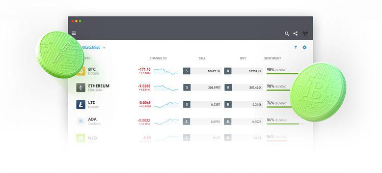

## Table of Contents

## What is eToro and how does it work?

eToro is a social trading and investing platform that allows people to buy and sell stocks, cryptocurrencies, and other financial assets. It's designed to be user-friendly, so even if you're new to investing, you can start trading easily. One special feature of eToro is that it lets you copy the trades of experienced investors. This means you can automatically follow what successful traders are doing without having to make all the decisions yourself.

When you sign up for eToro, you create an account and deposit money into it. Then, you can browse different assets like stocks, cryptocurrencies, or commodities and decide what to invest in. If you choose to use the copy trading feature, you can select a trader whose performance you like and start copying their trades. eToro charges fees for certain actions, like when you buy or sell assets, so it's important to understand these costs before you start trading. Overall, eToro aims to make investing more accessible and social, helping people learn from each other and grow their money.

## How can I open an account on eToro?

To open an account on eToro, first go to their website or download the eToro app on your phone. Once you're there, click on the "Join Now" or "Sign Up" button. You'll need to enter some basic information like your name, email address, and create a password. Make sure to use a strong password to keep your account safe. After you submit your details, you'll get an email to verify your account. Click on the link in the email to confirm your email address.

Next, you'll need to complete your profile by adding more information like your date of birth, address, and phone number. eToro needs this to meet legal requirements and to make sure your account is secure. You might also need to upload a copy of your ID, like a driver's license or passport, to verify your identity. Once everything is filled out and verified, you can deposit money into your account using a bank transfer, credit card, or other payment methods. After your deposit is confirmed, you're ready to start trading on eToro!

## What are the fees associated with using eToro?

When using eToro, you will come across different fees depending on what you're doing on the platform. There's a fee for trading, which is usually a percentage of the amount you're trading. For stocks and ETFs, eToro charges a flat fee of $0 for opening a trade, but there's a 0.15% conversion fee if you're using a currency other than USD. For cryptocurrencies, there's a spread fee, which is the difference between the buying and selling price, and it can change based on market conditions. If you withdraw money from eToro, there's a withdrawal fee of $5 per withdrawal.

There are also fees for certain features like copy trading. If you decide to copy another trader, you'll pay a 1% fee on the amount you're copying. And if you're a successful trader that others copy, you can earn up to 2% of the profits made by those who copy you. It's important to understand these fees because they can affect how much money you make or lose when trading on eToro. Always check the latest fee schedule on the eToro website to stay updated.

## Can I use eToro on mobile devices?

Yes, you can use eToro on mobile devices. They have an app that you can download from the Apple App Store or Google Play Store. The app works a lot like the website, so you can do all the same things like buying and selling stocks or copying other traders. It's made to be easy to use on your phone or tablet.

The eToro app lets you keep an eye on your investments no matter where you are. You can get notifications about what's happening in the market or with the traders you're following. This way, you can make quick decisions and manage your money on the go.

## What types of assets can I trade on eToro?

On eToro, you can trade many different types of assets. This includes stocks from big companies all over the world. You can buy shares in companies like Apple, Amazon, or Tesla. eToro also lets you trade in exchange-traded funds (ETFs), which are collections of stocks that you can buy as one investment. Another type of asset you can trade is commodities, like gold and oil, which are physical goods that you can invest in.

In addition to stocks, ETFs, and commodities, eToro offers trading in cryptocurrencies. You can buy popular digital currencies like Bitcoin, Ethereum, and many others. This is a good way to get into the world of digital money. eToro also allows you to trade in currency pairs, which means you can bet on how one country's money will do against another's. This can be a bit more complicated, but eToro makes it easy to get started. Overall, eToro gives you a lot of options to invest in different kinds of assets.

## How does eToro's CopyTrader feature work?

eToro's CopyTrader feature lets you copy what successful traders are doing without having to make all the decisions yourself. When you use CopyTrader, you can pick a trader you like and automatically do the same trades they do. This means if they buy a stock, you buy it too, and if they sell, you sell. You decide how much money you want to copy them with, and eToro does the rest. It's a good way to learn from experienced traders and maybe make money without having to know everything about trading yourself.

To start using CopyTrader, you look through a list of traders on eToro. You can see how well they've done in the past and what they're trading now. When you find someone you want to copy, you click on them and choose how much money you want to use. There's a 1% fee for copying a trader, but if you're the one being copied and your copiers make money, you can earn up to 2% of their profits. It's a simple way to invest and learn at the same time.

## What are the benefits of using eToro's social trading platform?

Using eToro's social trading platform has a lot of benefits. One big plus is that you can learn from other traders. You can see what successful people are doing and even copy their trades with the CopyTrader feature. This means you don't need to be an expert to start investing. You can watch what others do, learn from them, and maybe make money too. It's like having a bunch of teachers showing you how to invest.

Another benefit is that it's easy to use. eToro's platform is made to be simple, so even if you're new to trading, you can get started quickly. You can trade many different things like stocks, cryptocurrencies, and more, all in one place. Plus, you can talk to other traders, share ideas, and get tips. This makes investing feel less lonely and more like being part of a community.

## How does eToro ensure the security of user funds and data?

eToro takes the security of your money and information very seriously. They use strong encryption to keep your data safe when you're using their website or app. This means that your personal details and money are protected from hackers. eToro also follows strict rules set by financial regulators to make sure they're doing everything right. They keep most of your money in separate bank accounts, which means your funds are not mixed with eToro's own money. This makes it safer if something goes wrong with the company.

Another way eToro keeps things secure is by making sure only you can access your account. They use two-[factor](/wiki/factor-investing) authentication, which means you need to enter a special code sent to your phone whenever you log in. This adds an extra layer of protection. eToro also checks your identity carefully when you sign up to stop fraud. They watch for any strange activity on your account and will let you know if they see anything unusual. All these steps help make sure your money and data stay safe on eToro.

## What are the withdrawal processes and times on eToro?

When you want to take money out of your eToro account, you need to go to the "Withdraw Funds" section on their website or app. You'll see how much money you can take out. You can choose to send the money to your bank account or another payment method you've used before. There's a $5 fee every time you withdraw money, so keep that in mind. After you ask for a withdrawal, eToro checks it to make sure everything is okay. This is to keep your money safe and stop any fraud.

Once eToro approves your withdrawal, it usually takes 1 to 3 business days for the money to get to your bank account. But sometimes it can take a bit longer, depending on your bank and where you live. eToro will send you an email to let you know when your money is on its way. If you have any problems or questions, you can always get in touch with eToro's customer support team for help.

## How does eToro's customer support perform?

eToro's customer support is pretty good at helping people with their questions and problems. You can reach them through email, live chat, or by phone. They have a help center on their website with lots of information and answers to common questions. This can be useful if you want to find a quick solution without waiting for someone to help you.

When you need to talk to someone, eToro's support team tries to answer quickly. But sometimes, it might take a little longer, especially if a lot of people are asking for help at the same time. Overall, most people find that eToro's support is helpful and friendly, making it easier to use the platform and solve any issues that come up.

## What advanced trading tools does eToro offer to experienced traders?

eToro offers several advanced trading tools that can help experienced traders take their strategies to the next level. One of these tools is the ability to set stop-loss and take-profit orders. This means you can decide ahead of time when to sell an asset to either limit your losses or lock in your profits. Another useful tool is the charting and analysis feature, which gives you detailed graphs and data about different assets. You can use these charts to look at past performance and make better guesses about what might happen next in the market.

In addition to these, eToro has a feature called "ProCharts" that gives you even more advanced charting options. This can be really helpful if you like to do a lot of technical analysis. You can also use eToro's risk management tools, like setting leverage, which lets you borrow money to trade with more than you have in your account. This can make your trades bigger, but it's also riskier, so it's important to use it carefully. Overall, these tools give experienced traders more control and options to fine-tune their trading strategies.

## How does eToro's regulatory compliance affect users in different countries?

eToro's regulatory compliance means it follows rules set by different countries to make sure it's doing things the right way. This can affect users in different countries because eToro might offer different services or have different rules depending on where you live. For example, in some places, eToro might let you trade cryptocurrencies, but in others, it might not because of local laws. Also, the fees and how you can deposit or withdraw money might be different from one country to another.

Because eToro wants to follow these rules, it might ask users in some countries for more information to make sure they're following local laws. This can mean you need to give more details about yourself or go through extra steps to verify who you are. Even though it might take a bit more time, it's important because it helps keep your money and data safe. So, if you're thinking about using eToro, it's good to check what the rules are in your country to know what you can and can't do on the platform.

## References & Further Reading

[1]: Bergstra, J., Bardenet, R., Bengio, Y., & Kégl, B. (2011). ["Algorithms for Hyper-Parameter Optimization."](https://papers.nips.cc/paper/4443-algorithms-for-hyper-parameter-optimization) Advances in Neural Information Processing Systems 24.

[2]: ["Advances in Financial Machine Learning"](https://resources.caih.jhu.edu/textbooks/Resources/_pdfs/Advances_In_Financial_Machine_Learning.pdf) by Marcos Lopez de Prado

[3]: ["Evidence-Based Technical Analysis: Applying the Scientific Method and Statistical Inference to Trading Signals"](https://www.amazon.com/Evidence-Based-Technical-Analysis-Scientific-Statistical/dp/0470008741) by David Aronson

[4]: ["Machine Learning for Algorithmic Trading"](https://github.com/stefan-jansen/machine-learning-for-trading) by Stefan Jansen

[5]: ["Quantitative Trading: How to Build Your Own Algorithmic Trading Business"](https://books.google.com/books/about/Quantitative_Trading.html?id=j70yEAAAQBAJ) by Ernest P. Chan