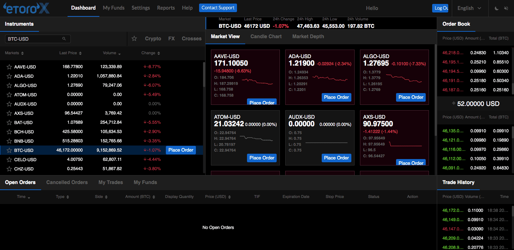

## Table of Contents

## What is eToro and how does it facilitate cryptocurrency trading?

eToro is a platform where people can buy and sell different types of investments, including cryptocurrencies like Bitcoin and Ethereum. It's designed to be easy to use, so even if you're new to trading, you can start investing. eToro lets you trade cryptocurrencies directly with other users on their platform, which means you can buy and sell at any time, not just during certain hours like with some other investments.

One cool feature of eToro is something called "social trading." This means you can see what other people are doing with their investments and even copy their trades if you want. It's like following experienced traders and learning from them. This can be really helpful if you're not sure what to do or want to see how others are making money with cryptocurrencies.

## How can beginners start trading cryptocurrencies on eToro?

To start trading cryptocurrencies on eToro, beginners first need to create an account on the eToro website or app. It's easy to sign up; you just need to provide some basic information and go through a quick verification process. Once your account is set up, you'll need to add money to it. You can do this by linking your bank account or using a credit/debit card. After you've added funds, you're ready to start trading.

When you're ready to trade, go to the eToro platform and look for the cryptocurrencies you're interested in, like Bitcoin or Ethereum. You can search for them or browse through the list. Once you've found the [cryptocurrency](/wiki/cryptocurrency) you want, you can decide how much you want to buy. eToro makes it simple: just enter the amount you want to spend, and the platform will show you how much of the cryptocurrency you'll get. After you've made your purchase, you can keep an eye on your investment and decide when to sell, depending on how the market is doing.

## What are the fees associated with trading cryptocurrencies on eToro?

When you trade cryptocurrencies on eToro, there are a few fees you need to know about. First, there's a spread fee, which is the difference between the buy and sell price of a cryptocurrency. This fee is included in the price you see on the platform, so you don't have to pay it separately. The spread can change depending on how the market is doing, but it's usually around 1% for popular cryptocurrencies like Bitcoin and Ethereum.

Another fee to keep in mind is the withdrawal fee. If you want to take your money out of eToro, you'll have to pay a small fee for that. This fee can change, but it's usually around $5 or $30, depending on where you live. There are no fees for depositing money into your eToro account, which is good news. Also, if you keep your cryptocurrencies on eToro for a long time without trading, you won't have to pay any extra fees for that.

## What types of cryptocurrencies are available on eToro?

eToro offers a wide range of cryptocurrencies for you to trade. Some of the most popular ones you'll find on the platform are Bitcoin, Ethereum, and Litecoin. These are often called the big names in the crypto world. Besides these, eToro also has other cryptocurrencies like Ripple (XRP), Cardano (ADA), and Stellar (XLM). This means you have plenty of options to choose from depending on what you're interested in.

In addition to these well-known cryptocurrencies, eToro also includes newer and less common ones. You can find coins like Chainlink (LINK), Tezos (XTZ), and even some smaller projects like IOTA (MIOTA). This variety allows you to explore different parts of the crypto market. Whether you're looking to invest in established cryptocurrencies or want to try something new, eToro has a good selection to help you get started.

## How does eToro's CopyTrader feature work for crypto trading?

eToro's CopyTrader feature lets you copy what other people are doing with their cryptocurrency trades. If you see someone who is doing well and you like their strategy, you can choose to copy their trades automatically. All you need to do is pick a trader you want to follow, decide how much money you want to use, and then eToro will do the rest. It will make the same trades as the person you're copying, so you can benefit from their experience and success without having to figure out everything yourself.

This feature is really helpful for beginners because it takes away a lot of the guesswork in trading cryptocurrencies. You can learn by watching what experienced traders do, and at the same time, you might make money too. Just remember that while CopyTrader can be a great tool, it's important to keep an eye on your investments and understand that there are risks involved. The person you're copying might have good days and bad days, so always be ready to adjust your strategy if needed.

## What are the security measures eToro uses to protect user assets and data?

eToro takes security very seriously to keep your money and information safe. They use strong encryption to protect your data when you're using their website or app. This means that your personal information and your trading activities are kept private and secure. eToro also follows strict rules and gets checked regularly to make sure they're doing everything right. They keep most of the cryptocurrencies in special secure storage that's separate from the internet, which makes it much harder for hackers to get to your money.

Another important thing eToro does is use two-[factor](/wiki/factor-investing) authentication (2FA). This adds an extra step when you log in, making it harder for anyone else to get into your account. You'll need to enter a code sent to your phone or generated by an app, which means even if someone knows your password, they still can't get in without that code. eToro also has a team that watches for anything suspicious all the time, so they can stop problems before they get big. All these measures work together to keep your assets and data safe on eToro.

## How does eToro's platform compare to other cryptocurrency exchanges in terms of user experience?

eToro's platform is known for being easy to use, especially for people who are new to trading cryptocurrencies. When you log in, you see a simple layout that makes it easy to find what you need. You can quickly search for different cryptocurrencies and see all the important information about them, like their price and how they've been doing recently. eToro also has a social part where you can see what other people are doing and even copy their trades, which makes it feel more like a community. This can be really helpful if you're not sure what to do or want to learn from others.

Compared to other cryptocurrency exchanges, eToro stands out because it focuses a lot on making things simple and friendly. Some other exchanges might have more advanced features, but they can be harder to use, especially if you're just starting out. For example, exchanges like Binance or Coinbase might offer more types of cryptocurrencies and trading options, but their platforms can be a bit more complicated. eToro, on the other hand, tries to keep things straightforward and user-friendly, which can be a big plus if you're looking for an easy way to get into crypto trading.

## What are the advanced trading tools available on eToro for experienced traders?

eToro offers some advanced tools for experienced traders who want to do more than just buy and sell cryptocurrencies. One of these tools is called the Trading Academy, where you can learn about different trading strategies and get tips from experts. eToro also has a feature called ProCharts, which gives you detailed charts and graphs to help you analyze the market better. You can use these charts to look at past prices and try to predict what might happen next, which can be really helpful if you're making a lot of trades.

Another useful tool for experienced traders is the ability to set up stop-loss and take-profit orders. A stop-loss order helps you limit your losses by automatically selling your cryptocurrency if its price drops to a certain level. A take-profit order does the opposite; it sells your cryptocurrency when it reaches a price you're happy with, so you can lock in your profits. These tools can help you manage your trades more carefully and make smarter decisions. Plus, eToro's platform lets you trade with leverage, which means you can borrow money to make bigger trades, but remember that this can also increase your risk.

## How can users withdraw their cryptocurrency from eToro?

To withdraw your cryptocurrency from eToro, you first need to convert it into a currency that eToro allows you to withdraw, like US dollars or euros. eToro doesn't let you directly send out cryptocurrencies to other wallets. So, go to your portfolio, choose the cryptocurrency you want to withdraw, and sell it for the currency you want. Once you've done that, you can request a withdrawal.

After selling your cryptocurrency, go to the 'Withdraw Funds' section on eToro. Choose the amount you want to withdraw and the method, like bank transfer. Remember, there's a withdrawal fee, which can be around $5 or $30 depending on where you live. Once you've filled in all the details and confirmed, eToro will process your withdrawal. It might take a few days for the money to show up in your bank account.

## What are the regulatory compliances that eToro adheres to regarding cryptocurrency trading?

eToro makes sure to follow the rules set by different countries where it operates. It is regulated by the Financial Conduct Authority (FCA) in the UK, the Cyprus Securities and Exchange Commission (CySEC), and the Australian Securities and Investments Commission (ASIC). These organizations check that eToro is doing things the right way and keeping people's money safe. eToro also follows rules about knowing who their customers are and making sure they don't help with any shady activities, like money laundering.

In the United States, eToro USA LLC is registered with the Financial Crimes Enforcement Network (FinCEN) as a Money Services Business, which means they have to follow strict rules about reporting and keeping records. This helps make sure that everything is done honestly and safely. By following these regulations, eToro shows that it cares about being a trustworthy place for people to trade cryptocurrencies.

## How does eToro's staking feature work and which cryptocurrencies can be staked?

eToro's staking feature lets you earn extra cryptocurrency by holding onto certain coins in your account. It's like getting interest on your money, but with crypto. When you stake your cryptocurrency, you help keep the network running and secure, and in return, you get rewards. To start staking, you just need to have some of the supported cryptocurrencies in your eToro wallet, and eToro will automatically stake them for you. You don't have to do anything extra, which makes it easy.

The cryptocurrencies you can stake on eToro include popular ones like Cardano (ADA), Tron (TRX), and Ethereum (ETH). These coins are part of what's called a proof-of-stake system, where staking helps the network work better. The rewards you earn depend on how much of the cryptocurrency you have staked and how long you keep it staked. eToro takes care of all the technical stuff, so you can just sit back and watch your rewards grow over time.

## What are the future developments planned by eToro for its cryptocurrency services in 2024?

eToro is always working on making its cryptocurrency services better. In 2024, they plan to add more cryptocurrencies to their platform. This means you'll have even more choices when you want to buy or sell crypto. They also want to make their platform easier to use, so even if you're new to trading, you can feel more comfortable trying it out. eToro is thinking about adding new tools that can help you understand the market better and make smarter decisions about your trades.

Another big thing eToro is working on is improving their mobile app. They want to make it faster and easier to use on your phone, so you can trade cryptocurrencies anytime, anywhere. They're also looking into new ways to help you learn more about crypto, like adding more educational content and maybe even some fun ways to learn. All these changes are meant to make eToro a better place for everyone who wants to get into cryptocurrency trading.

## References & Further Reading

[1]: Bergstra, J., Bardenet, R., Bengio, Y., & Kégl, B. (2011). ["Algorithms for Hyper-Parameter Optimization."](https://papers.nips.cc/paper/4443-algorithms-for-hyper-parameter-optimization) Advances in Neural Information Processing Systems 24.

[2]: ["Advances in Financial Machine Learning"](https://www.amazon.com/Advances-Financial-Machine-Learning-Marcos/dp/1119482089) by Marcos Lopez de Prado

[3]: ["Evidence-Based Technical Analysis: Applying the Scientific Method and Statistical Inference to Trading Signals"](https://www.amazon.com/Evidence-Based-Technical-Analysis-Scientific-Statistical/dp/0470008741) by David Aronson

[4]: ["Machine Learning for Algorithmic Trading"](https://github.com/stefan-jansen/machine-learning-for-trading) by Stefan Jansen

[5]: ["Quantitative Trading: How to Build Your Own Algorithmic Trading Business"](https://www.amazon.com/Quantitative-Trading-Build-Algorithmic-Business/dp/1119800064) by Ernest P. Chan

[6]: Goodfellow, I., Bengio, Y., & Courville, A. (2016). ["Deep Learning."](https://www.deeplearningbook.org/) MIT Press.