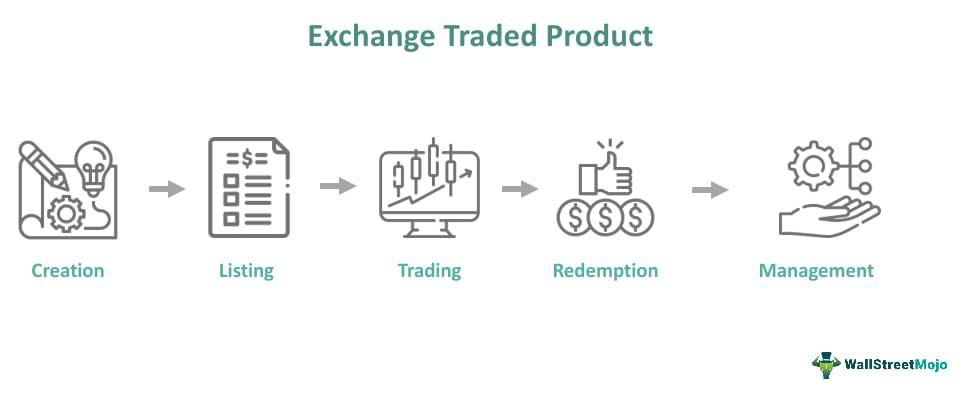

Warren Buffett's investment strategy is renowned for its focus on companies with durable competitive advantages, often referred to as economic moats. An economic moat enables a company to maintain a strong market position and protect its profits from competitors, ensuring sustained success. This strategic edge can be derived from various factors, including brand recognition, cost advantages, patents, and high switching costs. Buffett believes that companies with such defensive barriers are better equipped to generate sustained returns, making them attractive investment opportunities.

In the modern investing landscape, exchange-traded products (ETPs) have emerged as a viable tool for applying Buffett’s moat strategy on a larger scale. ETPs provide diversification and liquidity while allowing investors to focus on acquiring stakes in firms identified with strong competitive moats. This offers a simplified approach for individuals aiming to replicate the principles of value investing championed by Buffett.



Moreover, with the rapid advancements in financial technology, the use of algorithmic trading has gained significant momentum. Algorithmic trading involves using complex algorithms to execute trades based on pre-set criteria, enhancing the efficiency and speed of trading processes. The integration of algorithmic trading approaches with traditional value investing principles represents a compelling convergence of old and new methodologies.

As we navigate the intricacies of investing, it is essential to consider how Buffett’s time-tested strategies can be adapted to fit into the technological advancements that shape modern trading paradigms. This article will explore how the application of economic moat strategies within ETPs can be enhanced through the use of algorithmic trading, offering a harmonious blend of traditional investment wisdom with cutting-edge technology.

## Table of Contents

## Understanding Buffet's Moat Strategy

Warren Buffett's investment philosophy is intricately tied to identifying companies that possess strong, enduring competitive advantages, widely known as economic moats. An economic moat acts as a barrier protecting a company from the competitive forces that could erode its market share and profitability. These competitive advantages stem from several distinct sources.

Firstly, brand recognition is a powerful moat. A strong brand can engender customer loyalty and justify premium pricing. Companies such as Apple serve as exemplars of this moat. Apple's brand is synonymous with innovation and quality, creating a devoted customer base that enhances its ability to introduce new products with immediate demand.

Cost advantages are another critical source of economic moats. Companies that can operate more efficiently than competitors due to economies of scale, superior technology, or access to unique resources can maintain lower costs. This enables them to offer competitive pricing and sustain profitability even when facing price wars.

Patents and proprietary technology form a formidable moat by legally protecting a company's innovations, thereby preventing competitors from offering similar products. This exclusivity can secure high margins and market leadership, particularly in industries that rely heavily on research and development.

High switching costs also contribute to a company's moat. When it is costly or inconvenient for customers to switch products or services, they are more likely to remain with their current provider. This customer retention enhances a company's stability and future earnings predictability, which is attractive to long-term investors.

Buffett's strategy is predicated on the belief that companies with robust economic moats are better equipped not merely to survive, but to thrive amid competitive pressures. By ensuring a company can maintain its competitive edge, investors like Buffett aim to achieve sustained returns over the long term. The resilience offered by these moats implies that even in adverse market conditions, these companies have the strategic advantage to safeguard their profitability and potentially capture more market share.

## ETPs That Reflect Buffett’s Moat Investment Strategy

Exchange-Traded Products (ETPs), such as the VanEck Vectors Morningstar Wide Moat [ETF](/wiki/etf-trading-strategies), provide investors with an opportunity to align their portfolios with Warren Buffett's moat investment strategy. These ETPs focus on companies identified by Morningstar as having strong and durable competitive advantages, akin to Buffett’s favored investments in firms with economic moats. 

The VanEck Vectors Morningstar Wide Moat ETF specifically invests in companies that exhibit these sustainable competitive advantages. Each quarter, its portfolio is refreshed based on Morningstar's equity analysis, which evaluates a company's moat strength and fair value estimate. This systematic approach ensures that the ETF reflects only those companies that, according to rigorous analysis, are likely to sustain their competitive edge over the long term.

Investors benefit from such ETPs by gaining diversification across a range of companies with entrenched market positions. Diversification is a fundamental principle of investing, reducing risk by spreading exposure across different assets. The strategy used by the VanEck ETF aims to mimic Buffett's approach by selecting firms that are not only competitively advantaged but also attractively priced compared to their intrinsic value. This value-oriented investment approach strives to deliver superior risk-adjusted returns by targeting companies that are expected to maintain a robust market position over time.

By investing in ETPs like the VanEck Vectors Morningstar Wide Moat ETF, investors can tap into Buffett’s moat investment strategy without the need to independently analyze each potential investment. These products offer a convenient and efficient route to incorporate the principles of moat investing into a portfolio, benefiting from the combined expertise of financial analysts and the structural advantages of ETPs.

## Algorithmic Trading and Moat Investing

Algorithmic trading employs computer programs to execute trades based on predetermined criteria, allowing for rapid transaction speeds and efficient decision-making. In the context of moat investing, this approach can significantly enhance the capability to identify and capitalize on investment opportunities in companies with strong economic moats.

The process begins with the identification of moat stocks, which are companies that have enduring competitive advantages. This identification can be achieved through data analysis, leveraging algorithms to sift through vast amounts of financial, market, and operational data to pinpoint entities with sustainable competitive edges, such as cost leadership, brand power, or regulatory licenses.

Once potential moat stocks are identified, algorithmic strategies can be crafted to automate the trading process. Here's a simplified conceptual Python script that might form the backbone of such an algorithmic strategy:

```python
import pandas as pd
import numpy as np

# Load financial data
# This example assumes 'df' is a DataFrame containing stock data with columns 'Ticker', 'MoatScore', 'Price', etc.

# Define criteria for moat companies
moat_threshold = 8.0  # Arbitrary score determining a significant moat
price_threshold = 100.0  # Example price threshold for considering a stock

# Identify moat stocks
moat_stocks = df[(df['MoatScore'] >= moat_threshold) & (df['Price'] <= price_threshold)]

# Trading strategy: simple buy and hold
def execute_trades(moat_stocks):
    for index, stock in moat_stocks.iterrows():
        print(f"Buying {stock['Ticker']} at {stock['Price']}")

execute_trades(moat_stocks)
```

This example presupposes the presence of a scoring mechanism that assigns a 'MoatScore' to each stock. The script filters stocks that meet the criteria of a high MoatScore and acceptable price levels, then executes buy trades accordingly.

Algorithmic trading enhances moat investing by leveraging speed and precision in executing trades. It allows investors to quickly respond to market conditions that align with their strategy, ensuring optimal entry and [exit](/wiki/exit-strategy) points. This integration also facilitates continuous monitoring and adjustment of portfolios to sustain alignment with the evolving financial landscape.

Moreover, [machine learning](/wiki/machine-learning) can be incorporated to further refine strategies by continually learning from market data and outcomes, offering predictive insights and recommendations for future trades. This dynamic capability ensures that investment strategies remain robust and adaptive, which is crucial in maintaining competitive advantages in volatile markets.

## Case Study: ETPs Integrating Moat Strategies with Algos

Several exchange-traded products (ETPs) have emerged that incorporate Warren Buffett's well-known economic moat strategy with [algorithmic trading](/wiki/algorithmic-trading), looking to optimize investment performance by leveraging market automation and data-driven insights. The VanEck Vectors Morningstar Global Wide Moat ETF exemplifies this approach by strategically selecting stocks that exhibit strong competitive advantages, or "moats," as identified by Morningstar's proprietary research.

Integrating algorithmic strategies within these ETPs offers the potential to adapt swiftly to fluctuating market conditions, a significant advantage in today's fast-paced trading environments. Algorithmic trading utilizes computer algorithms to execute trades based on predetermined criteria, often involving complex quantitative analysis and [factor](/wiki/factor-investing)-based investing. By systematically analyzing financial data, algorithms can identify trends and signals that might be missed by traditional analysis, thereby potentially enhancing decision-making efficiency and execution speed.

The implementation of algorithmic trading in moat-focused ETPs is rooted in factor-based investing. This approach combines fundamental investment principles underpinning economic moats with quantitative models that evaluate multiple financial metrics and performance indicators. These metrics might include price-to-earnings ratios, return on equity, and historical [volatility](/wiki/volatility-trading-strategies), among others, which are integrated into comprehensive algorithms to assess a stock's potential.

For example, an algorithm might be designed to prioritize stocks within the ETF portfolio that not only meet moat criteria but also demonstrate favorable [momentum](/wiki/momentum) and low market volatility. A simple Python snippet for filtering such stocks could look like this:

```python
import pandas as pd

# Sample DataFrame containing stock data
data = {
    'Stock': ['StockA', 'StockB', 'StockC'],
    'MoatScore': [85, 90, 78],
    'Momentum': [0.08, 0.12, 0.04],
    'Volatility': [0.20, 0.15, 0.25]
}

df = pd.DataFrame(data)

# Define criteria for selecting stocks
moat_threshold = 80
momentum_threshold = 0.05
volatility_threshold = 0.18

# Filter stocks based on criteria
selected_stocks = df[(df['MoatScore'] > moat_threshold) &
                     (df['Momentum'] > momentum_threshold) &
                     (df['Volatility'] < volatility_threshold)]

print(selected_stocks)
```

In practice, these algorithms can be significantly more complex, incorporating machine learning techniques to continuously refine and enhance the model's predictive accuracy. These advancements allow investors to capitalize on opportunities that align with Buffett's investment ethos while adapting to the technological landscapes that define modern trading. As such, ETPs like the VanEck Vectors Morningstar Global Wide Moat ETF represent a sophisticated blend of traditional value investing and cutting-edge financial technology.

## Conclusion

Buffett’s economic moat strategy remains a cornerstone of successful long-term investing, capturing the essence of sustainable competitive advantage in a constantly evolving market landscape. By focusing on companies with durable economic moats, investors aim to secure steady returns over time, as these businesses are better positioned to fend off competition and maintain profitability.

The integration of algorithmic trading into this traditional investment strategy marks a significant advancement. Algorithmic trading leverages computational power to process vast amounts of data quickly, identifying trading opportunities based on pre-set criteria. For moat-focused strategies, algorithms can enhance efficiency by precisely analyzing financial data, historical trends, and market signals, thereby optimizing entry and exit points for investments.

As technology continues to evolve, the fusion of Buffett’s timeless investment principles with advanced trading technologies presents a compelling avenue for investors. This blend allows for a data-driven approach that not only respects the fundamentals of value investing but also capitalizes on the speed and accuracy that modern algorithms provide. This synergy between investment wisdom and technological innovation suggests a promising pathway for maximizing returns in future markets, providing a robust framework to navigate market complexities while adhering to the core tenets of economic moats.

## References & Further Reading

[1]: ["A Few Lessons for Investors and Managers from Warren Buffett"](https://www.amazon.com/Lessons-Investors-Managers-Warren-Buffett/dp/1578647452) by Peter Bevelin

[2]: ["The Little Book That Builds Wealth: The Knockout Formula for Finding Great Investments"](https://www.amazon.com/Little-Book-That-Builds-Wealth/dp/047022651X) by Pat Dorsey

[3]: Damodaran, A. (2002). ["Investment Valuation: Tools and Techniques for Determining the Value of Any Asset."](https://archive.org/details/investmentvaluat0000damo_n6k9) Wiley Finance.

[4]: ["Algorithmic Trading: Winning Strategies and Their Rationale"](https://www.wiley.com/en-us/Algorithmic+Trading%3A+Winning+Strategies+and+Their+Rationale-p-9781118746912) by Ernest P. Chan

[5]: ["Rich Dad's Guide to Investing: What the Rich Invest in, That the Poor and the Middle Class Do Not!"](https://www.amazon.com/Rich-Dads-Guide-Investing-Invest-ebook/dp/B01DRWRZ64) by Robert T. Kiyosaki