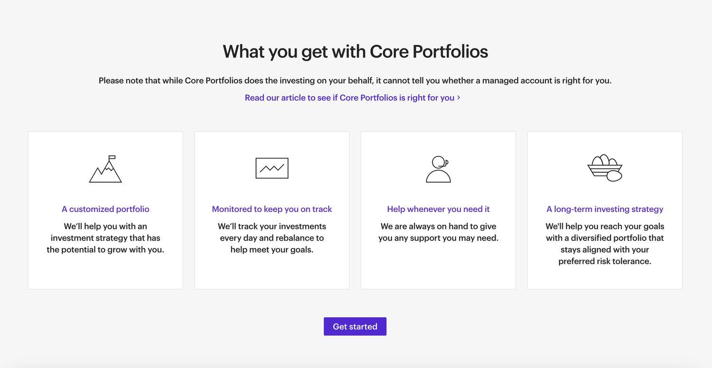

## Table of Contents

## What is E*TRADE Core Portfolios?

E*TRADE Core Portfolios is a robo-advisor service offered by E*TRADE, a well-known financial services company. It helps people invest their money without needing to pick individual stocks or bonds. Instead, E*TRADE Core Portfolios uses computer algorithms to create and manage a diversified investment portfolio based on the investor's goals, risk tolerance, and time horizon. This makes it easier for people who may not have the time or expertise to manage their investments on their own.

The service is designed to be user-friendly and accessible. To get started, you just need to answer a few questions about your financial situation and investment goals. E*TRADE then builds a personalized portfolio for you, which might include a mix of stocks, bonds, and other assets. The robo-advisor continuously monitors and automatically rebalances your portfolio to keep it aligned with your goals. This means you don't have to worry about making adjustments yourself, which can be a big relief for many investors.

## How does E*TRADE Core Portfolios work?

E*TRADE Core Portfolios is a service that helps you invest your money without having to choose individual stocks or bonds. All you need to do is answer some questions about your money goals and how much risk you're okay with. After that, E*TRADE uses a computer program to make a special plan for you. This plan is like a basket that holds different types of investments, like stocks and bonds, to help grow your money over time.

Once your basket is set up, E*TRADE keeps an eye on it all the time. If the mix of investments starts to change, the computer program will fix it to make sure it stays in line with your goals. This means you don't have to do anything extra; the program does all the work for you. It's like having a helper that makes sure your money is always working hard to meet your goals.

## What are the minimum investment requirements for E*TRADE Core Portfolios?

To start using E*TRADE Core Portfolios, you need to have at least $500. This is the minimum amount of money you need to open an account and let the robo-advisor service manage your investments. This amount is not too high, so it's good for people who are just starting to invest or don't have a lot of money to put in at once.

Once you have your account set up with the initial $500, you can add more money whenever you want. There's no minimum for additional investments, so you can keep growing your portfolio bit by bit. This makes it easy to keep investing over time, no matter how much money you have to add.

## What types of investment options are available in E*TRADE Core Portfolios?

E*TRADE Core Portfolios offers a mix of different investments to help your money grow. These investments include stocks, which are pieces of companies, and bonds, which are like loans to companies or governments. The robo-advisor picks a blend of these based on how much risk you're okay with and what you want to achieve with your money. This mix might also include other types of investments like real estate investment trusts (REITs), which are companies that own and manage properties, and exchange-traded funds (ETFs), which are baskets of different investments that you can buy and sell like stocks.

The service also offers the option to include socially responsible investments (SRI) if you care about where your money goes. These are investments that focus on companies that do good things for the environment or society. So, E*TRADE Core Portfolios can be set up to match your values while still aiming to grow your money. Depending on your goals, the robo-advisor will keep adjusting your mix of investments to make sure it's always working hard for you.

## How is the portfolio in E*TRADE Core Portfolios managed?

E*TRADE Core Portfolios uses a computer program to manage your investments. This program looks at your goals and how much risk you're okay with, then picks a mix of stocks, bonds, and other investments for you. It's like having a smart helper that knows how to balance your money to help it grow. The program keeps an eye on your investments all the time and makes changes if needed, so you don't have to do anything extra.

The robo-advisor also makes sure your money stays spread out in a good way. If one type of investment starts to do better or worse than expected, the program will adjust things to keep your plan on track. This means your portfolio stays in line with what you want, without you needing to check on it all the time. It's a simple way to invest and let the computer do the hard work for you.

## What are the fees associated with E*TRADE Core Portfolios?

E*TRADE Core Portfolios charges a yearly fee of 0.30% of the money you have in your account. This fee is taken out every three months, which means you pay 0.075% every quarter. So, if you have $10,000 in your account, you'll pay $30 a year or $7.50 every three months. This fee covers the cost of the robo-advisor managing your investments and making sure they stay in line with your goals.

There are no other fees for using E*TRADE Core Portfolios, like fees for buying or selling investments. However, the investments themselves, like ETFs, might have their own small fees, called expense ratios. These are usually very low and are already included in the performance of the investments, so you don't have to worry about them much.

## How does E*TRADE Core Portfolios compare to other robo-advisors?

E*TRADE Core Portfolios is a robo-advisor that helps you invest your money without having to pick individual stocks or bonds. It has a yearly fee of 0.30%, which is pretty good compared to some other robo-advisors. For example, Betterment charges 0.25% for its digital plan, while Wealthfront charges 0.25% too. So, E*TRADE's fee is a bit higher, but it's still in the same ballpark. Another thing to think about is the minimum amount you need to start. E*TRADE Core Portfolios needs $500 to get going, which is lower than Wealthfront's $500 but higher than Betterment's $0 for its digital plan.

When it comes to what you can invest in, E*TRADE Core Portfolios offers a mix of stocks, bonds, ETFs, and even socially responsible investments if you care about where your money goes. This is similar to what other robo-advisors offer, but E*TRADE also gives you the option to talk to a real person if you need help, which some people like. On the other hand, Betterment and Wealthfront also have good customer support and offer tax-loss harvesting, which can help you save money on taxes. E*TRADE doesn't offer this feature, so if you're looking to save on taxes, those might be better choices. Overall, E*TRADE Core Portfolios is a solid option, especially if you want a low minimum to start and the chance to talk to someone if you need to.

## What are the tax strategies used by E*TRADE Core Portfolios?

E*TRADE Core Portfolios helps you with your taxes by using a method called tax-efficient investing. This means they try to put your money into investments that won't make you pay as much in taxes. For example, they might choose investments that grow without you having to pay taxes on them until you take the money out, like certain types of bonds or ETFs. This can help you keep more of your money over time.

However, E*TRADE Core Portfolios does not offer tax-loss harvesting, which is a strategy some other robo-advisors use. Tax-loss harvesting means selling investments that have lost value to help lower your taxes. Without this, you might not get as many tax benefits as you could with other services. But E*TRADE still works hard to pick investments that are good for your taxes in other ways, making it easier for you to grow your money without worrying too much about taxes.

## How can I monitor and adjust my investments in E*TRADE Core Portfolios?

You can keep an eye on your investments in E*TRADE Core Portfolios easily through their website or app. Just log in, and you'll see how your money is doing. You can check the overall value of your account, see how much it's grown, and look at the different investments in your portfolio. If you want more details, you can click on each investment to see how it's doing and learn more about it. It's simple to use, so you don't need to be a money expert to understand it.

If you want to change things in your portfolio, you can do that too. You can add more money whenever you want, and there's no minimum for extra investments. If you feel like your goals or how much risk you're okay with has changed, you can answer some questions again, and E*TRADE will adjust your investments to fit your new plan. It's all about making sure your money works hard for you, and you can do it all without needing to call anyone or go to an office.

## What kind of customer support does E*TRADE Core Portfolios offer?

E*TRADE Core Portfolios offers good customer support to help you with your investments. You can get help through their website or app by using the chat feature. If you need to talk to someone, you can call their customer service line, and they have people ready to answer your questions during business hours. They also have a lot of helpful articles and guides on their site, so you can learn more about investing on your own.

If you need more personal help, E*TRADE has financial consultants you can talk to. These are real people who can give you advice about your money and investments. You can set up a time to talk with them if you want more detailed help or if you're not sure about something. This way, you can feel confident that you have support whenever you need it.

## What are the historical performance metrics of E*TRADE Core Portfolios?

E*TRADE Core Portfolios has done pretty well over time, but how well it does depends on what kind of investments you pick and how the market is doing. If you look at the past few years, the portfolios that have more stocks usually do better when the stock market is going up. But, they can also lose more money if the market goes down. On the other hand, portfolios with more bonds are usually safer and don't go up or down as much, but they might not grow as fast when the market is doing well.

For example, if you look at the last five years, a portfolio with a lot of stocks might have grown by around 10% each year on average. But, in a year when the stock market went down a lot, like in 2022, that same portfolio might have lost money. A portfolio with more bonds might have grown slower, maybe around 4% a year on average, but it would have lost less money in a bad year. Remember, past performance doesn't tell you what will happen in the future, but it can give you an idea of how different mixes of investments might do over time.

## How does E*TRADE Core Portfolios integrate with other E*TRADE services?

E*TRADE Core Portfolios works well with other E*TRADE services to help you manage your money better. If you already have an E*TRADE account, you can easily use Core Portfolios without needing to open a new account. This makes it simple to move money between your different E*TRADE accounts, like from your savings to your investment portfolio. You can also see all your E*TRADE accounts in one place, so it's easier to keep track of everything.

If you need help or want to learn more about investing, you can use E*TRADE's other services like their educational resources and customer support. For example, you can read articles and guides on their website to understand more about how to invest. If you have questions, you can talk to E*TRADE's financial consultants who can give you advice that fits with your Core Portfolios plan. This way, you get a full package of tools and support to help you reach your money goals.

## References & Further Reading

[1]: ["Advances in Financial Machine Learning"](https://www.amazon.com/Advances-Financial-Machine-Learning-Marcos/dp/1119482089) by Marcos Lopez de Prado

[2]: Lo, Andrew W. (2010). ["Hedge Funds: An Analytic Perspective"](https://www.jstor.org/stable/j.ctt7rq28). Princeton University Press.

[3]: ["Quantitative Trading: How to Build Your Own Algorithmic Trading Business"](https://www.amazon.com/Quantitative-Trading-Build-Algorithmic-Business/dp/1119800064) by Ernest P. Chan 

[4]: Markowitz, H. (1952). ["Portfolio Selection"](https://onlinelibrary.wiley.com/doi/abs/10.1111/j.1540-6261.1952.tb01525.x). The Journal of Finance, 7(1), 77-91.

[5]: Fernholz, R. (1999). ["Portfolio Rebalancing"](https://www.jpmcc-gcard.com/wp-content/uploads/2016/12/Spring-Scholar-Portfolio-Rebalancing-and-Commodities-110716.pdf). Financial Analysts Journal, 55(5), 69-77.

[6]: ["Machine Learning for Algorithmic Trading: Beginner's Guide to Convolutional-Recurrent Networks, Reinforcement Learning, GANs, and More..."](https://www.amazon.com/Machine-Learning-Algorithmic-Trading-Convolutional-Recurrent/dp/9948602609) by Stefan Jansen

[7]: Statman, M. (2000). ["Socially Responsible Mutual Funds."](https://www.researchgate.net/publication/240311517_Socially_Responsible_Mutual_Funds) Financial Analysts Journal, 56(3), 30-39.