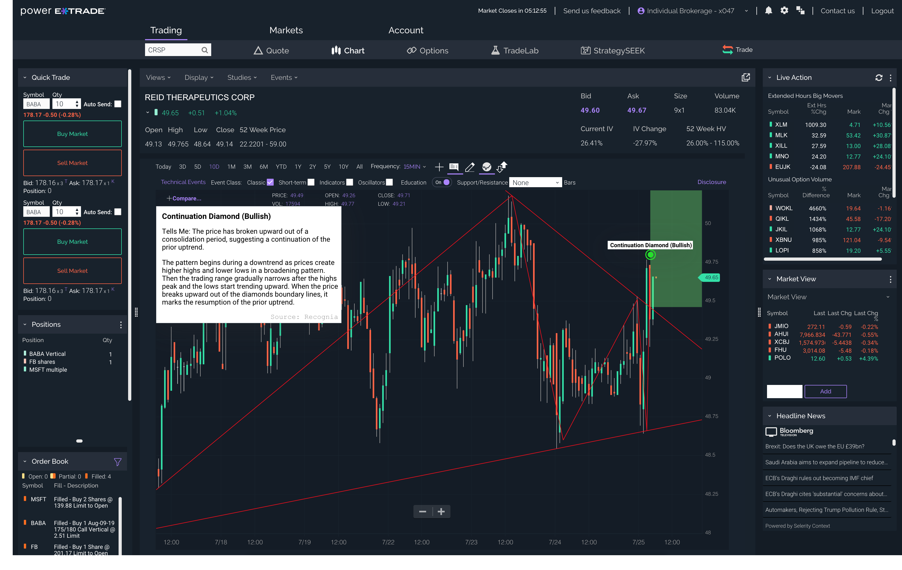

## Table of Contents

## What is E*TRADE and what services does it offer?

E*TRADE is a company that helps people buy and sell stocks, bonds, and other investments online. It started in 1982 and has grown to become a popular choice for people who want to manage their own investments easily from their computers or smartphones. E*TRADE makes it simple for anyone to start investing, even if they don't have a lot of money or experience.

The services offered by E*TRADE include trading stocks, options, mutual funds, and exchange-traded funds (ETFs). They also offer retirement accounts like IRAs and tools to help plan for the future. E*TRADE has educational resources to teach people about investing, and they have customer support available to help answer questions. This makes it easier for people to feel confident in managing their money.

## How can someone open an account with E*TRADE?

To open an account with E*TRADE, you first need to visit their website or use their mobile app. Once you're there, look for the option to open a new account. You'll need to choose the type of account you want, like a brokerage account for trading stocks or an IRA for retirement savings. After selecting your account type, you'll need to fill out an application form with your personal information, such as your name, address, and Social Security number.

After submitting your application, E*TRADE will review your information to make sure everything is correct. This process usually doesn't take long, and once your account is approved, you'll need to fund it. You can do this by transferring money from your bank account or by mailing a check. Once your account has money in it, you're ready to start trading and investing with E*TRADE. They have lots of tools and resources to help you along the way.

## What are the different types of accounts available on E*TRADE?

E*TRADE offers several types of accounts to meet different needs. The main type is a brokerage account, which lets you buy and sell stocks, options, mutual funds, and ETFs. This is a good choice if you want to start investing and trading on your own. They also have retirement accounts like Traditional IRAs and Roth IRAs. These are special accounts that help you save for retirement with tax benefits. 

Another type of account is the E*TRADE Managed Portfolios. This is for people who want help managing their investments. E*TRADE professionals will choose and manage your investments for you. There are also custodial accounts, which are for saving and investing money for kids. These accounts let adults manage the money until the child is old enough to take over. Each type of account has its own rules and benefits, so you can pick the one that fits your goals best.

## What are the fees associated with using E*TRADE?

E*TRADE has some fees, but they try to keep them low so more people can use their services. For trading stocks and ETFs, E*TRADE doesn't charge a commission, which means you don't have to pay extra money just to buy or sell these investments. But, if you want to trade options, you'll have to pay $0.65 for each contract. Also, if you need to use a broker to help you with your trades, that will cost you $25.

There are other fees to know about too. If you want to take money out of your account, like from an IRA, you might have to pay a fee. For example, closing an IRA account costs $25. If you want to transfer your account to another company, that's $75. And if you don't trade often, you might have to pay a fee to keep your account open. It's a good idea to check E*TRADE's website for the most up-to-date list of fees, so you know what to expect.

## How does E*TRADE's trading platform work?

E*TRADE's trading platform is a tool that helps you buy and sell investments like stocks and options from your computer or phone. When you log into your E*TRADE account, you'll see a dashboard that shows your money and investments. From there, you can search for the stocks or options you want to trade. The platform has charts and tools that help you understand how the prices are moving and make smart choices. Once you decide what to buy or sell, you just enter how many shares you want and hit a button to place your order.

The platform is designed to be easy to use, even if you're new to investing. It has a practice mode called "paper trading" where you can try out trading without using real money. This helps you learn without risking your savings. E*TRADE also offers lots of information and guides right on the platform to teach you about investing. If you need help, you can call or chat with customer support. This makes it easier for everyone to start investing and managing their money on their own.

## What investment options are available through E*TRADE?

E*TRADE offers a wide range of investment options to help people grow their money. You can buy and sell stocks, which are shares in companies. If you think a company will do well, you can buy its stock and maybe make money if the price goes up. E*TRADE also lets you trade options, which are contracts that give you the right to buy or sell a stock at a certain price. Options can be a bit tricky but can also offer big rewards. You can also invest in mutual funds, which are collections of stocks and bonds managed by professionals, and exchange-traded funds (ETFs), which are like mutual funds but trade like stocks.

For people saving for retirement, E*TRADE offers Individual Retirement Accounts (IRAs). There are Traditional IRAs, where you might get a tax break now, and Roth IRAs, where you pay taxes now but can take the money out tax-free later. If you want help with your investments, E*TRADE has Managed Portfolios. This means their experts will pick and manage your investments for you, which can be a good choice if you're not sure how to invest on your own. All these options help you find the right way to invest your money, no matter what your goals are.

## How can users manage their portfolios on E*TRADE?

Users can manage their portfolios on E*TRADE by logging into their account on the website or using the mobile app. Once logged in, they can see all their investments in one place. They can check how their stocks, options, mutual funds, and ETFs are doing. If they want to buy or sell something, they just search for it, decide how many shares they want, and place an order. E*TRADE's platform shows charts and tools that help users understand how their investments are performing and make smart choices about what to do next.

E*TRADE also has features to help users keep their portfolios organized. They can set up alerts to notify them when their investments reach certain prices. Users can also use the "watchlist" feature to keep an eye on stocks they are interested in but haven't bought yet. For those who want more help, E*TRADE offers educational resources and customer support. This makes it easier for everyone to manage their money and feel confident in their investment decisions.

## What educational resources does E*TRADE provide for investors?

E*TRADE offers a lot of educational resources to help people learn about investing. They have articles and guides that explain how to buy and sell stocks, options, and other investments. These are written in simple language so everyone can understand them. E*TRADE also has videos that show you step-by-step how to use their trading platform and make smart investment choices. If you're new to investing, these resources can help you feel more confident about managing your money.

For people who want to learn even more, E*TRADE has webinars and online courses. These cover more advanced topics like how to create a balanced portfolio and understand market trends. They also have a practice mode called "paper trading" where you can try out trading without using real money. This is a great way to learn without risking your savings. All these resources make it easier for anyone to start investing and grow their knowledge over time.

## How does E*TRADE's mobile app enhance trading on the go?

E*TRADE's mobile app makes it easy for people to trade on the go. You can check your investments anytime, anywhere, right from your phone. The app shows you all your stocks, options, and funds in one place. If you see a good chance to buy or sell, you can do it quickly with just a few taps. The app is designed to be simple to use, so even if you're new to investing, you can still manage your money easily while you're out and about.

The app also has tools and charts to help you understand how your investments are doing. You can set up alerts to notify you when prices hit certain levels, so you don't miss out on important changes. Plus, the app gives you access to E*TRADE's educational resources, like articles and videos, right on your phone. This means you can keep learning about investing even when you're not at home. With the E*TRADE mobile app, you have everything you need to manage your investments and stay informed, no matter where you are.

## What are the advanced trading tools offered by E*TRADE?

E*TRADE offers advanced trading tools that help experienced investors make smart choices. One important tool is the "OptionsHouse" platform, which is great for trading options. It has a lot of features like advanced charting, risk analysis, and the ability to create custom strategies. This helps traders see how their options might perform and make better decisions. E*TRADE also has a tool called "Power E*TRADE," which is for people who trade a lot. It has fast trading, streaming quotes, and a lot of data to help you understand the market better.

Another useful tool is the "Strategy Scanner," which helps you find new trading ideas. It looks at different options strategies and shows you which ones might work well based on what you want to do. E*TRADE also lets you use "conditional orders," which means you can set up trades that happen only if certain things happen in the market. This can help you manage risk and take advantage of opportunities. All these tools make it easier for experienced traders to manage their investments and try to make more money.

## How does E*TRADE compare to other online brokerage platforms?

E*TRADE is a popular choice for online investing and offers many of the same services as other big platforms like Charles Schwab, Fidelity, and TD Ameritrade. It's known for its easy-to-use website and mobile app, which make it simple for anyone to start buying and selling stocks, options, and other investments. E*TRADE doesn't charge a commission for trading stocks and ETFs, which is great for people who want to save money on fees. It also has a lot of educational resources and tools like "Power E*TRADE" and "OptionsHouse" for more experienced traders. 

Compared to other platforms, E*TRADE's customer support is very good, and they offer a practice mode called "paper trading" where you can learn to invest without using real money. However, some other platforms might have more types of investments to choose from or lower fees for certain services. For example, Robinhood is known for its very low fees and simple design, but it doesn't offer as many advanced tools or educational resources as E*TRADE. Overall, E*TRADE is a strong choice for both new and experienced investors who want a balance of easy-to-use tools, educational resources, and advanced trading options.

## What security measures does E*TRADE implement to protect user data and investments?

E*TRADE takes security very seriously to keep your data and investments safe. They use strong encryption to protect your information when you log in and trade. This means your personal details and money are kept private and secure. E*TRADE also has systems in place to watch for any strange activity on your account. If they see something that doesn't look right, they can stop it and let you know, so you can take action quickly. They also make sure their website and app are safe to use by regularly checking for any problems.

Another way E*TRADE keeps your account safe is by offering two-[factor](/wiki/factor-investing) authentication. This means you need more than just a password to log in. You might need to enter a special code sent to your phone, which makes it much harder for someone else to get into your account. E*TRADE also has insurance to protect your money if something goes wrong. They are part of the Securities Investor Protection Corporation (SIPC), which can help cover your investments up to certain limits if the company faces financial trouble. All these measures help make sure your money and information stay safe with E*TRADE.

## References & Further Reading

[1]: Bergstra, J., Bardenet, R., Bengio, Y., & Kégl, B. (2011). ["Algorithms for Hyper-Parameter Optimization."](https://dl.acm.org/doi/10.5555/2986459.2986743) Advances in Neural Information Processing Systems 24.

[2]: ["Advances in Financial Machine Learning"](https://www.amazon.com/Advances-Financial-Machine-Learning-Marcos/dp/1119482089) by Marcos Lopez de Prado

[3]: ["Evidence-Based Technical Analysis: Applying the Scientific Method and Statistical Inference to Trading Signals"](https://www.amazon.com/Evidence-Based-Technical-Analysis-Scientific-Statistical/dp/0470008741) by David Aronson

[4]: ["Machine Learning for Algorithmic Trading"](https://github.com/stefan-jansen/machine-learning-for-trading) by Stefan Jansen

[5]: ["Quantitative Trading: How to Build Your Own Algorithmic Trading Business"](https://www.amazon.com/Quantitative-Trading-Build-Algorithmic-Business/dp/1119800064) by Ernest P. Chan