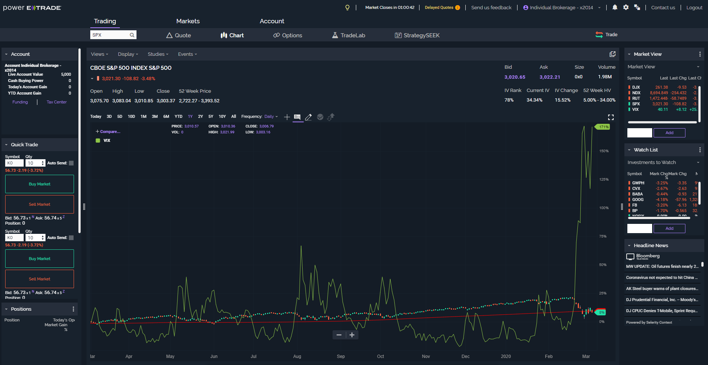

## Table of Contents

## What is E*TRADE and what services does it offer in 2024?

E*TRADE is a popular online brokerage firm that helps people buy and sell stocks, bonds, and other investments easily from their computers or phones. It started in 1982 and has grown a lot since then. In 2024, E*TRADE is still a big name in the investing world, owned by Morgan Stanley, and it's known for being user-friendly and having lots of tools to help people make smart investment choices.

In 2024, E*TRADE offers a bunch of services to help people with their money. You can trade stocks, options, mutual funds, and ETFs without paying a commission, which means you don't have to pay extra fees for buying or selling. They also have retirement accounts like IRAs, and they offer banking services like checking and savings accounts. Plus, E*TRADE has educational resources and tools like stock screeners and research reports to help you learn about investing and make better decisions.

## How can a beginner start investing with E*TRADE in 2024?

To start investing with E*TRADE in 2024 as a beginner, the first thing you need to do is open an account. You can do this by going to the E*TRADE website or using their mobile app. Just fill out some basic information like your name, address, and Social Security number. Once your account is set up, you'll need to add money to it. You can do this by transferring money from your bank account or depositing a check. E*TRADE makes this process easy and secure, so you don't have to worry about it being complicated.

After your account is funded, you can start investing. E*TRADE has a lot of tools to help beginners. They have educational resources like articles, videos, and webinars that can teach you the basics of investing. You can also use their stock screeners and research reports to find good investment options. When you're ready to buy, just choose what you want to invest in, like stocks or ETFs, enter how much you want to spend, and hit the buy button. E*TRADE doesn't charge any commissions for trading stocks, options, or ETFs, so you can start investing without worrying about extra fees.

## What are the account types available at E*TRADE for different investor needs in 2024?

E*TRADE offers different types of accounts to meet the needs of different investors in 2024. For people just starting out, they have a regular brokerage account where you can buy and sell stocks, ETFs, and other investments. This account is good for anyone who wants to start investing without any special tax benefits. If you're saving for retirement, E*TRADE also offers Individual Retirement Accounts (IRAs), like Traditional IRAs and Roth IRAs. These accounts give you tax benefits that can help your money grow over time.

For more advanced investors or those with specific needs, E*TRADE has other account types too. They offer a Managed Portfolios account where professionals manage your investments for you, which is great if you want to invest but don't want to pick your own stocks. There are also accounts for businesses, like a Small Business Retirement account, which can help companies set up retirement plans for their employees. No matter what your investing goals are, E*TRADE has an account that can help you reach them.

## What are the fees and commissions associated with E*TRADE accounts in 2024?

In 2024, E*TRADE doesn't charge any commissions for trading stocks, ETFs, and options. This means you can buy and sell these investments without paying extra fees, which is great for people who are just starting out or don't want to spend a lot on trading. However, there might be some other fees you should know about. For example, if you want to trade mutual funds, some of them might have a transaction fee, but E*TRADE also offers a lot of no-transaction-fee mutual funds. Options contracts have a small fee of $0.65 per contract, but this is pretty standard in the industry.

There are also some account fees to keep in mind. If you have a retirement account like an IRA, there might be a yearly fee, but E*TRADE often waives this if you meet certain conditions, like keeping a minimum balance. If you need to transfer your account to another broker, there's a fee for that too, which is usually around $75. And if you want paper statements or trade confirmations mailed to you, there could be a small fee for those as well. Overall, E*TRADE tries to keep fees low, especially for everyday trading, but it's good to check the details for any specific account or service you're interested in.

## How does E*TRADE's mobile app enhance trading and investment management in 2024?

In 2024, E*TRADE's mobile app makes trading and managing investments really easy and convenient. You can do everything you need right from your phone, like buying and selling stocks, ETFs, and options. The app has a simple design that's easy to use, even if you're new to investing. It also has cool features like real-time quotes and charts, so you can see how your investments are doing at any time. Plus, you can set up alerts to let you know when a stock reaches a certain price, so you never miss a chance to buy or sell.

The app also helps you keep track of your investments and make smart decisions. You can see all your accounts in one place and check your balances and performance easily. E*TRADE's app has tools like a stock screener and research reports, which help you find good investments and learn more about the market. There's also a feature called Power E*TRADE, which gives you more advanced trading tools if you want to dive deeper into your investments. Overall, the mobile app makes managing your money simple and helps you become a better investor.

## What educational resources does E*TRADE provide to help users learn about investing in 2024?

In 2024, E*TRADE offers a lot of educational resources to help people learn about investing. They have a whole section on their website and app called "Education" where you can find articles, videos, and webinars. These resources cover all sorts of topics, from the basics of how to start investing to more advanced stuff like options trading. They even have guides on different types of investments, like stocks, ETFs, and mutual funds, so you can understand what you're getting into.

They also have a cool feature called "E*TRADE 360," which gives you a complete view of your investments and helps you learn how to manage them better. Plus, E*TRADE often holds live events and workshops where experts talk about the market and answer questions. This way, you can learn from people who know a lot about investing and get advice that's up to date. All these resources are designed to make investing less scary and more fun, so you can feel confident about managing your money.

## How does E*TRADE's customer support function in 2024, and what support channels are available?

In 2024, E*TRADE's customer support is there to help you with any questions or problems you have about your investments. They have a team of people who know a lot about investing and can help you out. You can reach them in different ways, like calling them on the phone, sending them an email, or chatting with them live on their website or app. They try to answer quickly and make sure you get the help you need. If you need help right away, you can call their 24/7 support line, which is great if you're worried about something at night or over the weekend.

E*TRADE also has a lot of information on their website that can help you without having to talk to someone. They have FAQs and guides that answer common questions about accounts, trading, and investing. This can be really helpful if you just need a quick answer or want to learn more on your own. But if you do need to talk to someone, their support team is friendly and ready to help, no matter if you're new to investing or have been doing it for a while.

## What advanced trading tools does E*TRADE offer to experienced investors in 2024?

In 2024, E*TRADE offers a bunch of advanced trading tools that can help experienced investors make smart moves with their money. One of the coolest tools is called Power E*TRADE, which is a platform designed for people who want more control over their trades. It has things like customizable charts, real-time data, and advanced order types that let you trade in more detailed ways. You can also use risk and reward probability calculators to see how likely your trades are to work out, which can help you make better decisions.

Another great tool is the OptionsHouse feature, which is all about trading options. It gives you advanced options analytics, so you can see how different options might perform based on things like stock prices and time. There's also a tool called SnapTicket, which makes it easy to place trades quickly without leaving the chart you're looking at. Plus, E*TRADE has a feature called Live Action, where you can see what other traders are doing in real-time, which can give you new ideas or help you understand market trends better. All these tools together make it easier for experienced investors to trade smarter and stay ahead of the game.

## How does E*TRADE's robo-advisor service work, and what are its benefits in 2024?

In 2024, E*TRADE's robo-advisor service, called Core Portfolios, helps people invest their money easily without having to pick stocks themselves. You just answer some questions about your goals and how much risk you're okay with, and then the robo-advisor creates a personalized investment plan for you. It uses computer programs to manage your money, automatically buying and selling investments to keep your portfolio in line with your goals. It's really simple to use and doesn't cost a lot, which makes it great for people who want to invest but don't want to spend a lot of time or money on it.

The benefits of using E*TRADE's robo-advisor in 2024 are pretty clear. First, it saves you time because you don't have to spend hours researching stocks or worrying about when to buy or sell. The robo-advisor does all that for you. Second, it's cheaper than hiring a human financial advisor, which can cost a lot more. Plus, it's easy to set up and manage, so even if you're new to investing, you can start growing your money without feeling overwhelmed. Overall, E*TRADE's robo-advisor makes investing simpler and more affordable for everyone.

## What are the security measures implemented by E*TRADE to protect user accounts in 2024?

In 2024, E*TRADE takes a lot of steps to keep your account safe. They use something called two-[factor](/wiki/factor-investing) authentication, which means you need more than just a password to log in. You might get a code sent to your phone or have to use a special app. This makes it a lot harder for someone else to get into your account. They also use encryption to protect your information when you're trading or checking your account online. Encryption is like a secret code that keeps your data safe from hackers.

E*TRADE also keeps an eye out for anything weird happening with your account. If they see something that doesn't look right, like someone trying to log in from a new place, they might ask you to confirm it's really you. They also have a team that works all the time to make sure their systems are safe and to fix any problems quickly. This way, you can feel good about your money being safe with E*TRADE.

## How does E*TRADE's performance compare to other major online brokerages in 2024?

In 2024, E*TRADE holds its own pretty well when you compare it to other big online brokerages like Fidelity, Charles Schwab, and Robinhood. E*TRADE is known for its easy-to-use platform and lots of tools that help both new and experienced investors. They don't charge any commissions for trading stocks, ETFs, and options, which is the same as what many other brokerages do. But E*TRADE stands out with its strong educational resources and advanced trading tools like Power E*TRADE, which can be really helpful if you want to dive deeper into investing.

Compared to others, E*TRADE's customer support is also really good. They have a 24/7 support line, which not all brokerages offer, and their team is quick to help with any questions or problems. While Robinhood might be more popular with younger investors because of its simple app, E*TRADE offers more features and better support. Fidelity and Charles Schwab might have a bit more in terms of investment options and research, but E*TRADE's balance of user-friendliness, cost, and tools makes it a solid choice for many people looking to invest in 2024.

## What future developments or innovations can we expect from E*TRADE in the coming years?

In the coming years, E*TRADE is likely to keep improving its technology to make investing even easier and more fun. They might add new features to their mobile app, like better ways to see how your investments are doing or new tools to help you pick the best stocks. They could also use more [artificial intelligence](/wiki/ai-artificial-intelligence) to give you personalized advice based on what you like and how you invest. This could make it simpler for you to grow your money without having to do a lot of work yourself.

Another thing E*TRADE might do is work on making their platform work better with other financial apps and services. This could mean you can see all your money in one place, even if it's spread across different banks or investment accounts. They might also focus more on teaching people about investing, maybe with new kinds of videos or games that make learning fun. Overall, E*TRADE will probably keep finding new ways to help people invest smarter and feel more confident about their money.

## References & Further Reading

[1]: ["Advances in Financial Machine Learning"](https://www.amazon.com/Advances-Financial-Machine-Learning-Marcos/dp/1119482089) by Marcos Lopez de Prado

[2]: ["Machine Learning for Algorithmic Trading"](https://github.com/PacktPublishing/Machine-Learning-for-Algorithmic-Trading-Second-Edition) by Stefan Jansen

[3]: ["Quantitative Trading: How to Build Your Own Algorithmic Trading Business"](https://books.google.com/books/about/Quantitative_Trading.html?id=j70yEAAAQBAJ) by Ernest P. Chan

[4]: ["Evidence-Based Technical Analysis: Applying the Scientific Method and Statistical Inference to Trading Signals"](https://www.amazon.com/Evidence-Based-Technical-Analysis-Scientific-Statistical/dp/0470008741) by David Aronson