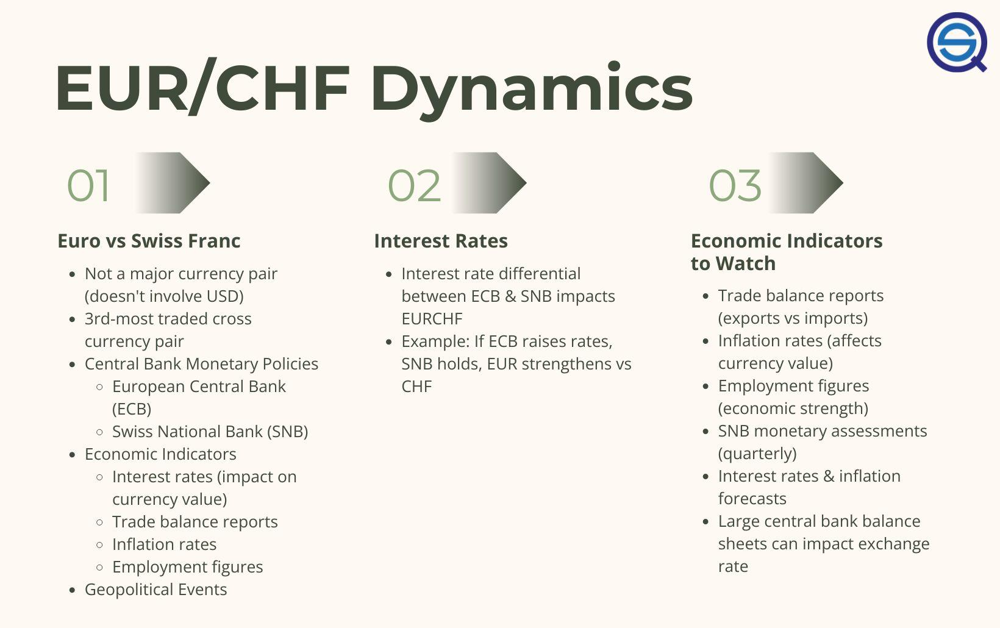

## Table of Contents

## What is the EUR/CHF exchange rate?

The EUR/CHF exchange rate tells you how many Swiss Francs (CHF) you get for one Euro (EUR). This rate changes every day because of things like how strong each country's economy is, what people think will happen in the future, and what the banks and governments do. Right now, you can check the exact rate on financial websites or through a currency converter app on your phone.

For example, if the exchange rate is 0.95, it means you get 0.95 Swiss Francs for every Euro. This number can go up or down. If it goes up, your Euros will buy more Swiss Francs, which is good if you're going to Switzerland. If it goes down, your Euros will buy fewer Swiss Francs, which might make your trip more expensive. Always check the rate before you travel or do any money exchange.

## Why is the EUR/CHF exchange rate important?

The EUR/CHF exchange rate is important because it tells you how much Swiss money you get for your Euros. This is useful if you're traveling to Switzerland or doing business with people there. If the rate is high, you get more Swiss Francs for your Euros, which means your money goes further in Switzerland. If the rate is low, you get fewer Swiss Francs, and your money won't go as far. Knowing the rate helps you plan how much money you need for your trip or business deals.

The exchange rate also affects the economy of both the Eurozone and Switzerland. If the Euro is strong against the Swiss Franc, it can make Swiss goods cheaper for people in the Eurozone, which might help Swiss businesses sell more. But it can also make things from the Eurozone more expensive for people in Switzerland. The rate can change because of things like interest rates, how well the economy is doing, or even big news events. So, watching the EUR/CHF rate can give you clues about what might happen in the future for both economies.

## How is the EUR/CHF exchange rate determined?

The EUR/CHF exchange rate is determined by the forces of supply and demand in the foreign exchange market. When more people want to buy Euros with Swiss Francs, the value of the Euro goes up, making the exchange rate higher. On the other hand, if more people want to buy Swiss Francs with Euros, the value of the Swiss Franc goes up, and the exchange rate goes down. This buying and selling happens all the time, influenced by traders, banks, and even regular people who need to exchange money for travel or business.

Economic factors also play a big role in setting the EUR/CHF rate. If the economy in the Eurozone is doing well, with low unemployment and strong growth, people might want more Euros, pushing the rate up. Similarly, if Switzerland's economy is strong, people might want more Swiss Francs, which can lower the exchange rate. Interest rates set by the European Central Bank and the Swiss National Bank can affect this too. If one country raises its interest rates, it can attract more foreign investment, increasing demand for its currency and affecting the exchange rate. Governments and central banks can also step in to influence the rate if they think it's too high or too low.

## What are the main factors influencing the EUR/CHF exchange rate?

The EUR/CHF exchange rate is mainly influenced by how much people want to buy Euros or Swiss Francs. When more people want Euros, the value of the Euro goes up, and the exchange rate with the Swiss Franc goes up too. If more people want Swiss Francs, then the Swiss Franc's value goes up, and the exchange rate goes down. This buying and selling happens all the time in the foreign exchange market, where traders, banks, and even regular people exchange money for travel or business.

Economic conditions in the Eurozone and Switzerland also affect the exchange rate. If the Eurozone's economy is doing well, with low unemployment and strong growth, people might want more Euros, which can push the exchange rate up. The same goes for Switzerland; if its economy is strong, people might want more Swiss Francs, which can lower the exchange rate. Interest rates set by the European Central Bank and the Swiss National Bank play a big role too. If one country raises its interest rates, it can attract more foreign investment, increasing demand for its currency and affecting the exchange rate.

## How does the Swiss National Bank affect the EUR/CHF exchange rate?

The Swiss National Bank (SNB) can affect the EUR/CHF exchange rate by changing how much money is available in the market. If the SNB thinks the Swiss Franc is too strong and making it hard for Swiss businesses to sell things, they might buy Euros with Swiss Francs. This increases the demand for Euros and makes the Swiss Franc less valuable, which can make the EUR/CHF exchange rate go up. On the other hand, if they think the Swiss Franc is too weak, they might sell Euros to buy back Swiss Francs, making the Swiss Franc stronger and the EUR/CHF exchange rate go down.

The SNB also sets interest rates, which can influence how much people want to hold Swiss Francs. If the SNB raises interest rates, it can attract more foreign investors looking for better returns on their money. This increased demand for Swiss Francs can make the Swiss Franc stronger and lower the EUR/CHF exchange rate. By using these tools, the SNB tries to keep the exchange rate at a level that helps the Swiss economy without causing too much change too quickly.

## What is the impact of European Central Bank policies on the EUR/CHF exchange rate?

The European Central Bank (ECB) can change the EUR/CHF exchange rate by deciding how much money is out there and what interest rates are. If the ECB thinks the Euro is too weak and wants it to be stronger, they might raise interest rates. When interest rates go up, more people from other countries want to invest in Euros because they can earn more money. This makes the demand for Euros go up, which can make the EUR/CHF exchange rate go up too. On the other hand, if the ECB wants the Euro to be weaker, they might lower interest rates, making the Euro less attractive to investors, and the exchange rate could go down.

The ECB also uses something called quantitative easing, which is when they buy bonds and other financial stuff to put more money into the economy. If they do this a lot, it can make the Euro weaker because there's more money around. This can make the EUR/CHF exchange rate go down. The ECB looks at what's happening in the economy and tries to keep things balanced so that the Euro is neither too strong nor too weak. By doing this, they help make sure that businesses in the Eurozone can sell their stuff and that prices don't go up too fast.

## How have historical events shaped the EUR/CHF exchange rate?

Historical events have played a big role in shaping the EUR/CHF exchange rate. One major event was the 2011 Swiss Franc ceiling, when the Swiss National Bank (SNB) decided to set a minimum exchange rate of 1.20 Swiss Francs per Euro. They did this because the Swiss Franc was getting too strong, making Swiss products expensive for people in the Eurozone. This ceiling lasted until January 2015, when the SNB suddenly removed it, causing the Swiss Franc to jump in value and the EUR/CHF rate to drop sharply. This event, known as "Swiss Franc Shock," showed how much central banks can affect exchange rates.

Another important historical event was the global financial crisis in 2008. During this time, people got scared and started looking for safe places to put their money. The Swiss Franc is seen as a safe currency, so more people wanted it, which made it stronger and the EUR/CHF rate go down. The European debt crisis that followed also affected the rate. Countries in the Eurozone, like Greece and Italy, had big money problems, which made the Euro weaker. As a result, the EUR/CHF rate kept going down as people moved their money to the safer Swiss Franc.

Overall, these events show how the EUR/CHF rate is not just about what's happening right now but also about big things that happened in the past. Wars, economic crises, and decisions by central banks can all make the rate go up or down over time. Understanding these historical events helps us see why the rate is where it is today and what might happen next.

## What technical analysis tools are used to predict EUR/CHF movements?

Technical analysis tools help people guess where the EUR/CHF exchange rate might go next by looking at past price movements and patterns. One popular tool is the moving average, which smooths out price data over time to show trends. For example, a 50-day moving average shows the average price of the EUR/CHF over the last 50 days. If the current price is above this average, it might mean the rate is going up. If it's below, it might mean the rate is going down. Another tool is the Relative Strength Index (RSI), which measures how fast prices are changing to see if the EUR/CHF is overbought or oversold. An RSI above 70 might mean the rate is too high and could go down soon, while below 30 might mean it's too low and could go up.

Chart patterns are also used in technical analysis. For example, a "head and shoulders" pattern can signal that the EUR/CHF rate might start going down after going up for a while. If you see this pattern, you might want to sell Euros before the rate drops. Another pattern is the "double top," which also suggests a possible drop in the rate. On the other hand, a "double bottom" pattern might mean the rate could start going up. These patterns help traders make decisions by showing possible future movements based on what happened before. By using these tools together, people can make better guesses about where the EUR/CHF rate might be headed next.

## How does the EUR/CHF exchange rate impact trade between the Eurozone and Switzerland?

The EUR/CHF exchange rate affects how much it costs to buy things between the Eurozone and Switzerland. When the Euro is strong against the Swiss Franc, it means Eurozone countries can buy Swiss products cheaper. This is good for people in the Eurozone because their money goes further in Switzerland. But it's not so good for Swiss businesses because they get less money for their products when they sell them to the Eurozone. On the other hand, if the Swiss Franc is strong, Swiss people can buy things from the Eurozone for less, but it makes their own products more expensive for people in the Eurozone.

This exchange rate also affects how much businesses in both places want to trade with each other. If the Euro is weak, Swiss companies might not want to sell as much to the Eurozone because they won't make as much money. But Eurozone companies might want to sell more to Switzerland because they can charge more in Swiss Francs. The opposite happens when the Euro is strong. So, the EUR/CHF rate can change how much trade happens between these two places, making it important for businesses to keep an eye on it.

## What are the implications of the EUR/CHF exchange rate for investors?

The EUR/CHF exchange rate is important for investors because it can affect how much money they make or lose. If an investor from the Eurozone puts money into Swiss stocks or bonds, a stronger Euro against the Swiss Franc means they can buy more Swiss Francs with their Euros. This can make their investment more valuable when they convert it back to Euros. But if the Euro gets weaker, their investment might not be worth as much when they change it back. So, investors need to watch the exchange rate to decide when to buy or sell Swiss assets.

Investors also use the EUR/CHF rate to figure out where to put their money for the best return. If they think the Euro will get stronger, they might invest more in Swiss assets because they can buy them cheaper now and sell them for more Euros later. On the other hand, if they think the Swiss Franc will get stronger, they might hold off on investing in Switzerland or even sell what they have to buy assets in the Eurozone. By keeping an eye on the exchange rate and using tools like technical analysis, investors can make smarter choices about where to put their money to make the most profit.

## How do geopolitical tensions affect the EUR/CHF exchange rate?

Geopolitical tensions can make the EUR/CHF exchange rate go up and down. When there's trouble or uncertainty in the world, people often want to put their money in safe places. The Swiss Franc is seen as a safe currency, so when there are geopolitical problems, more people want to buy Swiss Francs. This makes the Swiss Franc stronger and the EUR/CHF exchange rate go down because it takes fewer Swiss Francs to buy one Euro.

These tensions can also affect the Euro. If the problems are happening in Europe, like with Brexit or issues in the Middle East, it can make the Euro weaker because people get worried about the Eurozone's economy. A weaker Euro means the EUR/CHF rate goes up because it takes more Swiss Francs to buy one Euro. So, big events in the world can change how much people want Euros or Swiss Francs, which moves the exchange rate.

## What advanced econometric models are used to forecast the EUR/CHF exchange rate?

Advanced econometric models help people guess where the EUR/CHF exchange rate might go next. One common model is the Vector Autoregression (VAR) model. This model looks at how different things like interest rates, inflation, and economic growth in both the Eurozone and Switzerland affect each other and the exchange rate. By studying past data, the VAR model can show how changes in one thing might lead to changes in another, helping to predict future movements in the EUR/CHF rate. Another model is the Autoregressive Integrated Moving Average (ARIMA) model, which focuses on the past behavior of the exchange rate itself to make forecasts. ARIMA models are good at spotting patterns and trends in the data, which can be useful for predicting short-term changes in the EUR/CHF rate.

Another useful tool is the GARCH (Generalized Autoregressive Conditional Heteroskedasticity) model, which looks at how the [volatility](/wiki/volatility-trading-strategies) or ups and downs of the exchange rate can change over time. This is important because the EUR/CHF rate can be calm for a while and then suddenly move a lot, and GARCH models help predict these changes in volatility. Finally, there are more complex models like the Dynamic Stochastic General Equilibrium (DSGE) models, which try to understand the whole economy and how different parts of it work together. These models can be harder to use but give a big picture view of what might happen to the EUR/CHF rate based on many different economic factors. By using these advanced models, people can make better guesses about where the EUR/CHF rate might be headed.

## References & Further Reading

[1]: Bergstra, J., Bardenet, R., Bengio, Y., & Kégl, B. (2011). ["Algorithms for Hyper-Parameter Optimization."](https://dl.acm.org/doi/10.5555/2986459.2986743) Advances in Neural Information Processing Systems 24.

[2]: ["Advances in Financial Machine Learning"](https://www.amazon.com/Advances-Financial-Machine-Learning-Marcos/dp/1119482089) by Marcos Lopez de Prado

[3]: ["Evidence-Based Technical Analysis: Applying the Scientific Method and Statistical Inference to Trading Signals"](https://www.amazon.com/Evidence-Based-Technical-Analysis-Scientific-Statistical/dp/0470008741) by David Aronson

[4]: ["Machine Learning for Algorithmic Trading"](https://github.com/PacktPublishing/Machine-Learning-for-Algorithmic-Trading-Second-Edition) by Stefan Jansen

[5]: ["Quantitative Trading: How to Build Your Own Algorithmic Trading Business"](https://books.google.com/books/about/Quantitative_Trading.html?id=j70yEAAAQBAJ) by Ernest P. Chan