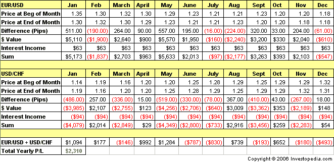

The EUR/CHF currency pair represents the euro, the official currency of the eurozone, and the Swiss franc, the official currency of Switzerland. It is widely traded on global financial markets and is considered a significant indicator of economic stability in Europe. The exchange rate between these two currencies can provide insights into the broader economic and financial landscape, given Switzerland's traditional status as a financial hub and the eurozone's expansive economic influence.

Exchange rates play a critical role in global finance as they affect international trade, investment flows, and economic policy-making. Fluctuations in exchange rates can impact import and export prices, influence inflation and interest rates, and affect the overall economic growth of countries. Consequently, understanding and forecasting exchange rate movements is vital for investors, corporations, and policymakers.



Algorithmic trading, which involves using computer algorithms to execute trades at high speeds and volumes, is increasingly influential in the forex market. This form of trading helps in automating and optimizing trading decisions, thus enabling traders to exploit market inefficiencies more effectively. In the context of forex, algorithmic trading strategies can assist traders in managing the complexities of currency trading, such as the EUR/CHF pair, by analyzing vast amounts of data and executing trades with minimal human intervention.

The purpose of this article is to explore how algorithmic trading strategies apply to the EUR/CHF currency pair. The interconnectedness of exchange rates and algorithmic trading necessitates a comprehensive understanding of both to capitalize on trading opportunities. This article will begin with an understanding of the EUR/CHF currency pair, considering both historical and contemporary economic factors. Following this, we will delve into the key determinants of the EUR/CHF exchange rate, namely, monetary policies, geopolitical events, and market sentiments. Next, an introduction to algorithmic trading will set the stage for discussing specific strategies and challenges involved in trading the EUR/CHF pair. Finally, we will consider the future of algorithmic trading within this context, addressing emerging technologies and potential market shifts. By the end of the article, readers will have a structured understanding of the EUR/CHF exchange rate and how algorithmic trading strategies are both shaped by and shape currency market dynamics.

## Table of Contents

## Understanding the EUR/CHF Currency Pair

The EUR/CHF currency pair represents the exchange rate between the Euro (EUR) and the Swiss Franc (CHF). This pair is a significant part of the forex market due to both currencies' strong influence on global finance. The Euro, introduced in 1999, is the official currency of the eurozone, which comprises 19 of the 27 European Union member states. It was established to facilitate economic integration and stability among European countries. The Swiss Franc, on the other hand, is the currency of Switzerland, a country known for its financial stability, neutrality, and significant banking industry. Historically, the Swiss Franc has been perceived as a "safe-haven" currency, often appreciating during times of global economic uncertainty.

Several economic factors influence the EUR/CHF exchange rates. These include the monetary policies of the European Central Bank (ECB) and the Swiss National Bank (SNB). The ECB's policy decisions, such as setting interest rates or quantitative easing measures, can affect the Euro's value, impacting the EUR/CHF rate. Similarly, the SNB's policy actions, especially during periods of inflation or deflation, directly influence the Swiss Franc's strength.

Key events and policies have also impacted this currency pair. Notably, the financial crisis of 2008 and the subsequent Eurozone sovereign debt crisis heightened market [volatility](/wiki/volatility-trading-strategies) and risk perceptions, affecting the EUR/CHF dynamics. Additionally, in January 2015, the SNB unexpectedly removed the minimum exchange rate of 1.20 Swiss Francs per Euro, causing a significant and immediate appreciation of the Franc against the Euro—an event often referred to as the "Swiss Franc Shock."

The EUR/CHF pair holds considerable importance in the [forex](/wiki/forex-system) market due to its [liquidity](/wiki/liquidity-risk-premium) and the pivotal role of Europe and Switzerland in international trade and finance. Traders often use this pair to hedge against risks associated with the Eurozone or to speculate based on economic divergences between the Eurozone and Switzerland.

As of recent trends and market analysis, the EUR/CHF exchange rate has been influenced by several factors, including the economic recovery efforts post-COVID-19, differing inflationary pressures between the Eurozone and Switzerland, and geopolitical tensions that impact international finance. The ongoing monetary policy divergence between the ECB, which often focuses on stimulating economic growth in the Eurozone, and the SNB, which maintains a stable and low inflation environment in Switzerland, continues to be a major determinant in the EUR/CHF exchange rate movements. Understanding these dynamics is crucial for traders and investors, considering the implications for risk management and strategic positioning in the forex market.

## Factors Affecting the EUR/CHF Exchange Rate

The EUR/CHF exchange rate is influenced by a variety of factors, with monetary policies playing a crucial role. The European Central Bank (ECB) and the Swiss National Bank (SNB) are the primary institutions governing these policies, and their decisions can significantly affect the exchange rate dynamics.

**Monetary Policies of the ECB and SNB**

The ECB controls the monetary policy of the Eurozone and aims to maintain price stability, primarily through [interest rate](/wiki/interest-rate-trading-strategies) adjustments and monetary interventions. A policy shift by the ECB, such as a change in interest rates or quantitative easing measures, can lead to fluctuations in the EUR/CHF exchange rate. Conversely, the SNB focuses on ensuring price stability while considering the impact of its monetary policy on economic conditions. The SNB intervenes in forex markets to counteract excessive appreciation of the Swiss Franc, frequently resulting in noticeable movements in the EUR/CHF pair.

**Geopolitical Events and Their Impact**

Geopolitical events, including political instability in the Eurozone or Switzerland, can trigger volatility in the EUR/CHF exchange rate. For instance, uncertainty due to Brexit negotiations or crises in the Eurozone economies can lead to risk-averse behavior among investors, impacting the Swiss Franc, often perceived as a safe-haven currency.

**Economic Indicators: GDP, Inflation, Employment Data, etc.**

Economic indicators such as Gross Domestic Product (GDP), inflation rates, and employment data offer insights into the health of the Eurozone and Swiss economies. Higher GDP and employment rates suggest economic growth, potentially strengthening the Euro, whereas high inflation might lead to price adjustments by the ECB, affecting the exchange rate. The Swiss economic indicators, on the other hand, often point towards stability, influencing investor confidence in the Swiss Franc.

**Market Sentiment and Investor Behavior**

Market sentiment, shaped by investor perceptions of future economic conditions, plays a critical role in determining exchange rate fluctuations. For the EUR/CHF pair, market sentiment can shift rapidly due to global economic news, impacting investor behavior. Investors often seek refuge in the stability of the Swiss Franc during economic uncertainties, thus affecting the exchange rate.

**Seasonal Trends and Their Potential Effects**

Seasonal trends also bear some influence over the EUR/CHF exchange rate. Factors such as trade balances, tourism seasons, and fiscal year-end financial activities can introduce predictable patterns in currency demand and supply. Traders often account for these seasonal effects when strategizing their forex operations involving the Euro and Swiss Franc.

In conclusion, understanding these factors provides valuable insights for traders and economists when predicting or responding to movements in the EUR/CHF exchange rate. Regular monitoring of monetary policies, geopolitical events, economic indicators, and seasonal trends is paramount for those engaging in forex trading of this currency pair.

 to Algorithmic Trading

Algorithmic trading refers to the use of computer algorithms to automate trading decisions and execute orders in financial markets. It involves using complex mathematical models and pre-defined rules to identify trading opportunities, execute trades at optimal prices, and manage portfolios. The process is designed to minimize human intervention, thus reducing the possibility of emotional biases and errors associated with manual trading.

One of the primary benefits of [algorithmic trading](/wiki/algorithmic-trading) in the forex market is its ability to process vast amounts of data at high speeds, which is essential given the 24-hour nature of forex trading. Algorithms can analyze market conditions, back-test strategies, and execute trades within milliseconds. This speed and efficiency can lead to better price execution and lower transaction costs. Additionally, algorithms help in maintaining discipline by adhering to the set rules and limits defined by the trading strategy.

There are various types of algorithmic trading strategies employed in the forex market. Mean reversion strategies focus on the idea that asset prices will revert to their historical averages over time. Trend-following strategies attempt to capitalize on sustained price movements in one direction, while [arbitrage](/wiki/arbitrage) strategies exploit price discrepancies between different markets or instruments. High-frequency trading ([HFT](/wiki/high-frequency-trading-strategies)), a subset of algorithmic trading, involves executing a high number of trades in fractions of a second to capture small price changes.

Technological advancements have significantly enhanced the capabilities of algorithmic trading. Improvements in processing power and data storage, along with the development of sophisticated algorithms, have made it possible to analyze and respond to real-time data swiftly. Machine learning and [artificial intelligence](/wiki/ai-artificial-intelligence) are increasingly being integrated into algorithmic trading systems, allowing these systems to adapt and improve over time based on market conditions.

Popular tools and platforms used for algorithmic trading include MetaTrader, NinjaTrader, and TradingView, which provide traders with powerful tools for developing and testing trading strategies. Programming languages such as Python, C++, and Java are commonly utilized to construct and implement algorithms. For instance, the following Python snippet demonstrates a basic moving average crossover strategy:

```python
import pandas as pd
import numpy as np
import matplotlib.pyplot as plt

# Load historical price data
data = pd.read_csv('forex_data.csv')
data['SMA50'] = data['Close'].rolling(window=50).mean()
data['SMA200'] = data['Close'].rolling(window=200).mean()

# Signal Generation
data['Signal'] = np.where(data['SMA50'] > data['SMA200'], 1, 0)
data['Position'] = data['Signal'].diff()

# Plotting
plt.figure(figsize=(12, 6))
plt.plot(data['Close'], label='Close Price')
plt.plot(data['SMA50'], label='50-Day SMA', alpha=0.7)
plt.plot(data['SMA200'], label='200-Day SMA', alpha=0.7)
plt.title('Moving Average Crossover Strategy')
plt.legend(loc='best')
plt.show()
```

This example demonstrates how to implement a basic strategy where a buy signal is generated when the 50-day simple moving average (SMA) crosses above the 200-day SMA, and a sell signal is triggered when it crosses below. Such strategies can be enhanced with additional indicators and adapted to various market conditions.

Algorithmic trading continues to evolve, supported by rapid technological advancements and increasing data availability, offering a strategic edge to traders in the competitive forex market.

## Algorithmic Trading Strategies for the EUR/CHF Pair

Algorithmic trading involves the use of automated and pre-programmed methods to execute trades based on various factors, including price movements, timing, and [volume](/wiki/volume-trading-strategy). For the EUR/CHF currency pair, these algorithms can be tailored to identify profitable trading opportunities and execute strategies efficiently.

### Identifying Profitable Trading Opportunities in EUR/CHF through Algorithms

Algorithmic trading strategies designed for the EUR/CHF pair leverage comprehensive data analyses to determine potential trading signals. These strategies are typically quantitative in nature, relying on statistical models and historical data to predict future price movements. Algorithms examine historical prices, trading volumes, and economic indicators to forecast potential currency pair movements, thus enabling traders to implement informed strategies.

### Mean Reversion and Trend-Following Strategies

Mean reversion strategies are based on the assumption that prices and returns eventually move back towards their historical mean or average. For the EUR/CHF, mean reversion algorithms analyze historical price data to identify when the currency pair price has deviated significantly from its historical average. These opportunities suggest a potential correction back to the mean. Python libraries like pandas or numpy can be used to calculate moving averages and standard deviations, essential components in mean reversion algorithms. Below is a simple example of how a mean reversion strategy can be coded using Python:

```python
import pandas as pd

# Assume df is a DataFrame containing EUR/CHF historical data with a 'Close' column
df['Mean'] = df['Close'].rolling(window=20).mean()
df['StdDev'] = df['Close'].rolling(window=20).std()
df['Upper'] = df['Mean'] + (df['StdDev'] * 2)
df['Lower'] = df['Mean'] - (df['StdDev'] * 2)

# Signal to buy
df['Buy_Signal'] = (df['Close'] < df['Lower']).astype(int)

# Signal to sell
df['Sell_Signal'] = (df['Close'] > df['Upper']).astype(int)
```

Trend-following strategies, on the other hand, capitalize on the [momentum](/wiki/momentum) of the market by buying an asset when the price is trending upwards and selling when it is trending downwards. Traders use indicators such as moving averages, MACD (Moving Average Convergence Divergence), and momentum oscillators to develop trend-following algorithms. 

### High-Frequency Trading (HFT) and Its Role

High-frequency trading (HFT) employs algorithms to execute a large number of orders at extremely high speeds. In the context of EUR/CHF, HFT strategies exploit small price inefficiencies and aim to profit from rapid price changes. These strategies require significant technological infrastructure, such as advanced hardware and low latency networks, to ensure that trades are executed rapidly. While HFT can offer substantial profits, it also poses risks due to market volatility and requires careful management to ensure compliance with regulations.

### Arbitrage Opportunities within the Context of EUR/CHF

Arbitrage strategies seek to profit from price discrepancies across different markets or instruments. In the context of the EUR/CHF pair, arbitrage opportunities arise when different forex platforms quote slightly different prices for the same currency pair. Algorithms can be programmed to detect such discrepancies and execute offsetting trades to lock in profits. Statistical arbitrage is a more advanced form that involves convergence strategies and often relies on complex models and [machine learning](/wiki/machine-learning) techniques to identify and exploit inefficiencies.

### Risk Management Strategies in Algorithmic Trading

Effective risk management is crucial to algorithmic trading. Algorithms should incorporate stop-losses, take-profits, and other risk management techniques to minimize potential losses. Position sizing, diversification, and establishing clear entry and [exit](/wiki/exit-strategy) points are essential strategies. Additionally, [backtesting](/wiki/backtesting) algorithms on historical data can help validate their effectiveness and refine strategies to improve future performance.

In conclusion, algorithmic trading provides a structured approach to trading the EUR/CHF currency pair, offering the potential for substantial rewards. However, it requires careful consideration of market conditions, robust risk management practices, and adherence to regulatory standards to mitigate risks effectively.

## Challenges in Algo Trading the EUR/CHF Pair

Algorithmic trading in the EUR/CHF currency pair presents several challenges that traders must consider carefully. Below, we analyze key challenges and offer insight into managing these hurdles effectively.

### Market Volatility and Its Implications
Market volatility refers to the frequency and magnitude of price movements within a currency pair. In the context of EUR/CHF, volatility can be influenced by numerous factors, including economic announcements, geopolitical events, and central bank policies. High volatility can lead to both opportunities and risks. For algorithmic traders, volatility necessitates robust risk management strategies to avoid substantial losses. Algorithms must be capable of adapting to rapid price changes, employing techniques such as sensitivity analysis and scenario planning to anticipate potential market scenarios.

### Regulatory Challenges and Compliance Issues
The forex market is subject to various regulations, which vary by jurisdiction. In the case of EUR/CHF, regulation in both the European Union and Switzerland must be considered. Traders must ensure compliance with rules set by bodies such as the European Securities and Markets Authority (ESMA) and the Swiss Financial Market Supervisory Authority (FINMA). Regulatory challenges include the need for transparency, reporting requirements, and restrictions on certain trading activities. Compliance is crucial to avoid penalties and maintain the integrity of trading operations.

### Technological Limitations and the Need for Robust Infrastructure
Algorithmic trading relies heavily on technology, requiring robust infrastructure to handle high-frequency trades efficiently. Limitations in computational power, data processing speed, and server reliability can hinder trading performance. Traders should invest in advanced trading platforms that offer low-latency execution and high-speed data feeds. Additionally, the use of cloud computing and artificial intelligence can enhance the processing capabilities and reliability of trading systems.

### Strategies to Mitigate Risks Associated with Algo Trading
To mitigate the risks inherent in algorithmic trading, traders can employ several strategies:
- **Diversification**: Reducing risk by trading across multiple currency pairs or incorporating different asset classes.
- **Stop-Loss Orders**: Automatically exiting a trade when a predetermined loss threshold is reached.
- **Regular Backtesting**: Continuously testing trading algorithms against historical data to ensure effectiveness under various market conditions.
- **Dynamic Adjustments**: Modifying algorithm parameters in response to changing market conditions.

### Case Studies of Failed Trades and Lessons Learned
Examining past failures provides valuable insights into the pitfalls of algorithmic trading. One notable example is the 2015 Swiss Franc shock, where the Swiss National Bank unpegged the CHF from the Euro, leading to extreme market movements. Many algorithms, not programmed to handle such unprecedented events, incurred significant losses. This event highlights the importance of incorporating fail-safes and stress-testing algorithms against a range of scenarios, including improbable ones. Additionally, ensuring proper liquidity management and exit strategies can prevent catastrophic failures during black swan events.

By thoroughly understanding these challenges and employing effective mitigation strategies, traders can enhance their algorithmic trading approaches within the EUR/CHF pair, increasing their chances of success in this dynamic market environment.

## Future of Algorithmic Trading in the EUR/CHF Market

The future of algorithmic trading in the EUR/CHF market is poised for dynamic transformations, marked by emerging trends and technological advancements. One of the most significant drivers is the increased integration of artificial intelligence (AI) and machine learning (ML) technologies into trading algorithms. These technologies enhance the ability to analyze vast datasets and detect patterns that may not be visible through traditional analysis methods, offering new insights into market behavior and improving forecasting accuracy.

Potential regulatory changes across Europe and Switzerland could impact the algorithmic trading landscape significantly. Regulators are increasingly scrutinizing algorithmic trading systems to ensure they comply with market stability and fairness standards. Future regulations may introduce more comprehensive transparency requirements and stricter risk management protocols for algorithmic trading strategies. Traders will need to adapt their systems to comply with these evolving regulations while maintaining competitive performance.

For individual and institutional traders, the ongoing development of sophisticated algorithmic trading tools presents lucrative opportunities. Advancements in cloud computing and financial software have democratized access to high-performance computing resources, enabling small-scale traders to deploy complex algorithms with minimal overhead costs. Institutional traders, on the other hand, continue to benefit from customized solutions and infrastructure that support high-frequency trading and other advanced strategies.

The future dynamics of the EUR/CHF market, influenced by these technological and regulatory changes, suggest a more data-driven and automated trading environment. Successful traders will likely be those who can blend algorithmic efficiency with deep market understanding, leveraging AI and ML to adapt swiftly to market shifts. As technology continues to evolve, so too will the strategies employed in algorithmic trading, potentially leading to more refined and efficient approaches that capitalize on market inefficiencies with ever-greater precision.

## Conclusion

The relationship between the EUR/CHF currency pair and algorithmic trading highlights significant themes in trading and financial technology. Throughout this article, key insights into the dynamics of the EUR/CHF pair and the role of algorithmic strategies were explored.

First, understanding the EUR/CHF relationship is crucial for traders. This currency pair is influenced by various economic and geopolitical factors, including monetary policies from the European Central Bank and the Swiss National Bank, as well as broader economic indicators such as GDP and inflation rates. The strong stability and reliability of the Swiss economy, combined with the weight of the Eurozone's economic policies, create unique opportunities and challenges for traders aiming to optimize returns in the forex market.

Algorithmic trading has fundamentally transformed the forex market, offering increased efficiency and precision in executing trades. Algorithms can quickly process vast amounts of data, analyze trends, and execute trades at speeds unachievable by human traders. This technological advancement allows traders to identify profitable opportunities and manage risks effectively in real-time. The use of strategies such as mean reversion, trend-following, and arbitrage opportunities are particularly relevant in navigating the volatility and liquidity characteristics of the EUR/CHF pair.

Looking ahead, the long-term outlook for the EUR/CHF and algorithmic trading strategies appears promising. As technological advancements accelerate, particularly in artificial intelligence and machine learning, traders and institutions alike will likely continue to leverage these tools to enhance decision-making processes and gain a competitive edge. Moreover, potential regulatory changes could impact market dynamics, making continuous adaptation and compliance essential.

Finally, the landscape of algorithmic trading encourages ongoing research and education to keep pace with rapidly evolving technologies and strategies. For traders, staying informed about market changes, technological innovations, and regulatory updates is vital in maintaining a competitive advantage and ensuring that trading strategies remain robust and effective.

## References & Further Reading

[1]: Bergstra, J., Bardenet, R., Bengio, Y., & Kégl, B. (2011). ["Algorithms for Hyper-Parameter Optimization."](https://dl.acm.org/doi/10.5555/2986459.2986743) Advances in Neural Information Processing Systems 24.

[2]: ["Advances in Financial Machine Learning"](https://www.amazon.com/Advances-Financial-Machine-Learning-Marcos/dp/1119482089) by Marcos Lopez de Prado

[3]: ["Evidence-Based Technical Analysis: Applying the Scientific Method and Statistical Inference to Trading Signals"](https://www.amazon.com/Evidence-Based-Technical-Analysis-Scientific-Statistical/dp/0470008741) by David Aronson

[4]: ["Machine Learning for Algorithmic Trading"](https://github.com/PacktPublishing/Machine-Learning-for-Algorithmic-Trading-Second-Edition) by Stefan Jansen

[5]: ["Quantitative Trading: How to Build Your Own Algorithmic Trading Business"](https://books.google.com/books/about/Quantitative_Trading.html?id=j70yEAAAQBAJ) by Ernest P. Chan