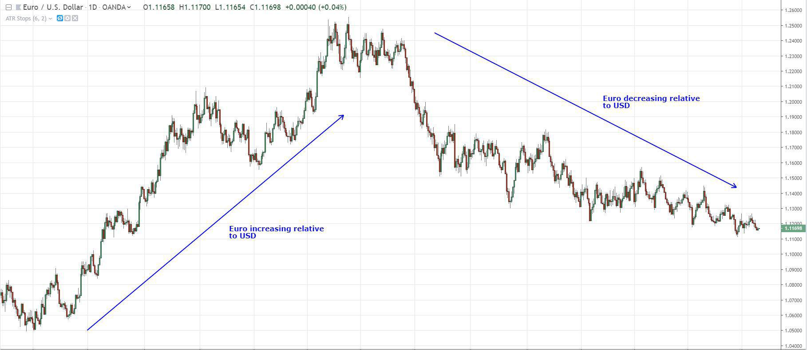

The EUR/USD currency pair stands as one of the most actively traded pairs within the forex market, representing a vital component in global financial activities. Comprised of the Euro, the official currency of the Eurozone, and the US Dollar, one of the world's leading reserve currencies, this pair reflects a significant portion of daily foreign exchange transactions. Its prominence is attributed to the economic stature of both Europe and the United States, making it a barometer for economic health, international trade, and geopolitical stability.

Algorithmic trading, defined as the use of computer algorithms for executing trades at speeds and frequencies beyond human capabilities, has garnered increasing attention across forex markets. The rise of algorithmic trading can be attributed to advancements in technology, such as computing power, data availability, and connectivity, which enable traders to execute complex strategies efficiently. In forex, where precision and timing are crucial, algorithmic trading presents clear advantages in terms of speed, accuracy, and the ability to capitalize on small market inefficiencies.



The EUR/USD currency pair, given its high liquidity and volatility, presents an attractive opportunity for algorithmic trading strategies. Traders leverage algorithms to process large volumes of market data, identify trends or patterns, and execute trades without human intervention. This automated approach can help manage risks associated with currency trading and enhance profitability in a market that operates 24/5.

As the introduction of algorithmic strategies revolutionizes trading in forex markets, understanding their application to the EUR/USD pair becomes essential for investors seeking to optimize their trading performance. The following sections will explore various algorithmic trading strategies tailored to the EUR/USD pair, assessing their impact and effectiveness in evolving market conditions.

## Table of Contents

## Understanding the EUR/USD Currency Pair

The EUR/USD currency pair is a fundamental component of global financial markets, representing the exchange rate between the Euro (EUR) and the United States Dollar (USD). As the most traded currency pair in the foreign exchange (forex) market, EUR/USD owes its prominence to the economic clout of the Eurozone and the United States. The Euro is the official currency of the European Union, used by 19 of the 27 EU member countries, while the US Dollar is the currency of the United States and serves as the world's principal reserve currency.

Several factors influence the value of the Euro and the US Dollar, impacting the EUR/USD exchange rate. Economic indicators such as Gross Domestic Product (GDP), unemployment rates, and inflation figures play vital roles in determining currency values. For instance, a strong GDP growth rate in the Eurozone could lead to an appreciation of the Euro. Similarly, central bank policies, from institutions like the European Central Bank (ECB) and the Federal Reserve (Fed), influence interest rates and monetary policy, impacting currency values. Higher interest rates usually attract foreign capital, causing currency appreciation, while lower rates can have the opposite effect.

Supply and demand dynamics are crucial in determining the EUR/USD exchange rate. When demand for the Euro increases, perhaps due to stronger economic outlooks or political stability in the Eurozone, its value rises relative to the Dollar. Conversely, an increase in demand for the Dollar might result from investors seeking a safe-haven currency during periods of global uncertainty, leading to a depreciation of the Euro.

Historically, the Euro was introduced in 1999 as an accounting currency before physical banknotes and coins were circulated in 2002, replacing national currencies like the Deutsche Mark and the French Franc. Its introduction was a significant milestone in economic integration within Europe, aiming to facilitate trade and economic stability across the continent. The Euro dramatically impacted the [forex](/wiki/forex-system) market by consolidating what were individual European currencies into a single currency, enhancing [liquidity](/wiki/liquidity-risk-premium) and trading [volume](/wiki/volume-trading-strategy) in the EUR/USD pair.

The significance of the Euro extends beyond Europe, as it is the second-most significant reserve currency after the US Dollar. This status bolsters its importance in the forex market, as central banks worldwide hold reserves in Euros, reflecting trust and reliance on the Eurozone's economic stability. Consequently, developments in the Eurozone and the United States, along with geopolitical events, can rapidly influence the EUR/USD exchange rate, making it an essential focus for traders and investors globally.

## Role of Algorithmic Trading in Forex Markets

Algorithmic trading, often referred to as automated trading, utilizes computer programs to execute trading decisions at speeds and frequencies that are impossible for human traders. This method has become integral to modern financial markets due to its ability to process large volumes of data and execute trades rapidly. Algorithmic trading's prominence in these markets is a result of technological advancements, which have significantly enhanced its efficiency and functionality.

### Technological Advancements Enabling Algorithmic Trading

The proliferation of high-speed internet, improved computational capabilities, and sophisticated software platforms are pivotal technological advancements that have catalyzed the rise of [algorithmic trading](/wiki/algorithmic-trading). The development of complex algorithms that can analyze vast datasets in real time has enabled traders to identify trends and execute trades with precision.

For instance, the advent of high-frequency trading ([HFT](/wiki/high-frequency-trading-strategies)) relies heavily on advanced algorithmic systems to [carry](/wiki/carry-trading) out numerous transactions in fractions of a second, capitalizing on tiny market movements. This capability is supported by technologies such as [machine learning](/wiki/machine-learning), which can enhance the predictive accuracy of trading strategies, and cloud computing, which offers scalable resources to process large volumes of data efficiently.

### Enhancing Efficiency and Reducing Human Error

One of the main benefits of algorithmic trading is its ability to enhance operational efficiency. Algorithms can monitor multiple markets and financial instruments simultaneously, executing trades based on predefined criteria without the need for human intervention. This eradicates delays associated with manual decision-making and order placement, thus optimizing the execution process.

Moreover, algorithmic trading minimizes human error by adhering strictly to the rules encoded within the algorithms. Human emotions, which can lead to irrational trading decisions, are eliminated, resulting in more consistent strategy execution. This rigidity ensures that trades are executed based solely on data-driven insights and predefined market conditions.

### Adaptation to Rapid Market Changes

Algorithmic trading systems are adept at responding to rapid market changes. Complex algorithms can be programmed to adjust trading strategies dynamically, accommodating shifts in market conditions almost instantaneously. This adaptability is particularly beneficial in volatile markets, where rapid changes can have significant impacts on trading outcomes.

### Advantages in High Liquidity Markets

Forex markets, known for their high liquidity, present ideal conditions for algorithmic trading. The high volume of transactions ensures that currencies can be bought and sold without causing significant price changes, which is crucial for executing large trades efficiently. Algorithms can exploit this liquidity by executing trades at the optimal price levels without incurring slippage.

Furthermore, the 24-hour nature of forex markets allows algorithms to operate continuously, capitalizing on opportunities that arise outside traditional trading hours. This around-the-clock functionality ensures that trading strategies are consistently applied, maximizing potential returns.

In summary, algorithmic trading has revolutionized modern financial markets, particularly in high liquidity environments like forex. Technological advancements have empowered traders to execute strategies with unprecedented speed and accuracy, reducing human error and adapting to market changes effectively. These capabilities make algorithmic trading an essential component of contemporary forex market operations.

## Developing EUR/USD Trading Algorithms

Developing trading algorithms for the EUR/USD currency pair requires a comprehensive approach that considers various technical, fundamental, and market-specific factors. Here are key points to consider:

1. **Backtesting Using Historical EUR/USD Data**

Backtesting is a critical step in algorithmic trading as it helps evaluate the viability of a trading strategy by testing it on historical data. The EUR/USD pair, with its rich historical data, allows traders to simulate potential performance across various market conditions. It is essential to ensure that the data used is of high quality and spans different timeframes to capture varying market dynamics. Furthermore, implementing realistic transaction costs and slippage models in [backtesting](/wiki/backtesting) can yield more accurate projections.

```python
import pandas as pd
import numpy as np
import matplotlib.pyplot as plt
from backtesting import Backtest, Strategy

# Assume 'data' is a DataFrame with columns 'Date', 'Open', 'High', 'Low', 'Close'
data = pd.read_csv('eur_usd_data.csv', parse_dates=True, index_col=[0])

class EURUSDStrategy(Strategy):
    def init(self):
        self.sma50 = self.I(pd.Series.rolling, self.data.Close, window=50).mean()
        self.sma200 = self.I(pd.Series.rolling, self.data.Close, window=200).mean()

    def next(self):
        if self.sma50 > self.sma200:
            self.buy()
        elif self.sma50 < self.sma200:
            self.sell()

bt = Backtest(data, EURUSDStrategy, cash=10000, commission=.002)
stats = bt.run()
bt.plot()
```

2. **Tools and Strategies in Algorithmic Trading**

Several tools and techniques are fundamental in developing trading algorithms for the EUR/USD pair:

   - **Moving Averages**: These help smooth out price data, providing clearer signals in trending markets. For instance, implementing strategies using simple moving averages (SMA) or exponential moving averages (EMA) can help identify entry and exit points.

   - **Fibonacci Retracement**: This technique is used to identify potential support and resistance levels based on the Fibonacci sequence, helping traders predict future price movements.

   - **Technical Indicators**: Indicators such as the Relative Strength Index (RSI), Moving Average Convergence Divergence (MACD), and Bollinger Bands provide insights into market momentum, trends, and volatility. These indicators can be tailored to specific trading strategies.

3. **Integrating Fundamental Analysis**

Integrating [fundamental analysis](/wiki/fundamental-analysis) enhances algorithmic strategies by incorporating economic indicators, fiscal policies, and geopolitical events into decision-making processes. The EUR/USD pair is heavily influenced by factors such as:

   - **Monetary Policy**: Announcements and policy decisions by the European Central Bank (ECB) and the Federal Reserve (Fed) affect currency valuations. Algorithms can be programmed to respond to such events in real-time.

   - **Economic Indicators**: Gross domestic product (GDP) data, unemployment rates, and consumer price indices (CPI) are crucial to predicting currency movements. By quantifying these factors, traders can incorporate them into algorithms for better accuracy.

In summary, developing an effective EUR/USD trading algorithm entails a careful balance of technical analysis, historical data backtesting, and fundamental factors. By leveraging tools like moving averages and integrating real-time economic data, traders can build robust models that adapt to changing market conditions.

## Popular Algorithmic Strategies for EUR/USD

Algorithmic trading strategies have revolutionized the way forex markets are approached, particularly with the heavily traded EUR/USD currency pair. Among the numerous strategies employed, mean reversion, [trend following](/wiki/trend-following), and [pair trading](/wiki/pair-trading) stand out due to their distinct approaches and effectiveness in varying market conditions.

**Mean Reversion** is predicated on the statistical concept that asset prices and returns eventually return to their long-term mean or average level. In the context of the EUR/USD pair, this strategy involves identifying instances where the exchange rate deviates significantly from its historical average and betting on a reversion. Mean reversion can be particularly effective in range-bound markets where the EUR/USD fluctuates between support and resistance levels. An example of an automated system might implement Bollinger Bands to identify overbought or oversold conditions, allowing the trader to take positions accordingly. The success of this strategy depends on meticulous timing and an understanding of typical volatility ranges.

**Trend Following** focuses on capitalizing on momentum by identifying and following prevailing market trends. This strategy is based on the belief that the EUR/USD, like other currency pairs, will continue moving in its current direction for some time. Traders using this strategy seek to enter the market at the inception of a trend and exit as it shows signs of reversal. Trend following is often facilitated by indicators such as moving averages or the Average Directional Index (ADX) to ascertain the strength and direction of a trend. This approach proves beneficial during trending markets but can lead to losses in sideways or choppy markets.

**Pair Trading** involves taking positions in two related currency pairs, one long and one short, to profit from relative movements. When applied to EUR/USD, it might involve another correlated pair like GBP/USD. The main advantage of pair trading is the hedging effect, as it is relatively market-neutral. However, it requires careful statistical analysis to identify two pairs that move in correlation. The effectiveness hinges on the assumption that any divergence from their historical correlation will revert, allowing a trader to capitalize on this convergence.

In practical applications, automated trading systems might combine elements of these strategies to suit different market conditions for the EUR/USD pair. A sophisticated system could employ elements of machine learning to adapt strategy parameters in real-time, enhancing the efficacy of the trading model.

For example, a Python-based algorithm might use libraries like NumPy and Pandas for data manipulation, alongside technical analysis libraries like TA-Lib to implement and backtest strategies. Here is a simplified code snippet illustrating the implementation of a moving average cross-over strategy:

```python
import pandas as pd
import numpy as np

# Define moving average strategy
def moving_average_strategy(data, short_window=40, long_window=100):
    signals = pd.DataFrame(index=data.index)
    signals['Signal'] = 0.0

    # Short and long moving averages
    signals['Short_MAvg'] = data['Close'].rolling(window=short_window, min_periods=1).mean()
    signals['Long_MAvg'] = data['Close'].rolling(window=long_window, min_periods=1).mean()

    # Generate signals
    signals['Signal'][short_window:] = np.where(signals['Short_MAvg'][short_window:] 
                                               > signals['Long_MAvg'][short_window:], 1.0, 0.0)   
    signals['Positions'] = signals['Signal'].diff()

    return signals

# Example usage with historical data
data = pd.read_csv('EUR_USD_Historical_Data.csv', parse_dates=True, index_col='Date')
signals = moving_average_strategy(data)
```

This script analyzes historical EUR/USD data to generate buy and sell signals based on moving average crossovers, a fundamental concept in trend-following strategies. The effectiveness of such a strategy is contingent on market conditions; it thrives in trending environments but could falter during periods of low [volatility](/wiki/volatility-trading-strategies) or consolidation.

In summary, each algorithmic strategy for the EUR/USD pair offers unique advantages and challenges, and their effectiveness is highly dependent on market conditions. Combining these strategies with adaptive systems and rigorous backtesting can significantly enhance their profitability.

## Risk Management for EUR/USD Algorithmic Trading

In the highly dynamic and unpredictable environment of forex trading, effective risk management stands as a cornerstone of successful algorithmic trading strategies, particularly for the EUR/USD currency pair. Given the significant liquidity and volatility of the EUR/USD, managing risk is essential to protect against potential losses while capitalizing on profitable opportunities.

A critical aspect of risk management in algorithmic trading involves techniques such as position sizing and stop-loss orders. Position sizing refers to determining the amount of capital to allocate to a trade. Proper position sizing helps in minimizing the potential impact of any single losing trade on the overall portfolio. One common method for position sizing is the Kelly Criterion, which can be expressed mathematically as:

$$
f^* = \frac{bp - q}{b}
$$

where $f^*$ is the fraction of the capital to invest, $b$ is the odds received on the wager (in decimal form), $p$ is the probability of winning, and $q$ is the probability of losing, with $q = 1 - p$.

Stop-loss orders are another indispensable tool, allowing traders to limit potential losses by predefining a price level at which positions are automatically closed. By setting a stop-loss order, traders can ensure that their losses are capped if the market moves unfavorably.

Managing leverage and accounting for volatility are equally crucial in forex trading. Leverage enables traders to control larger positions than their initial capital might allow. However, it also amplifies both gains and losses. An excessive use of leverage can lead to significant losses, particularly in a volatile market such as EUR/USD. It is advisable for traders to use modest leverage ratios, ensuring that their risk exposure aligns with their risk tolerance and capital base.

Volatility remains a vital [factor](/wiki/factor-investing) to consider, as sudden fluctuations in currency prices can significantly impact trading positions. To account for this, traders often utilize volatility indicators, such as the Average True Range (ATR), to adjust their trading strategies dynamically. Python code for calculating ATR might look like this:

```python
import pandas as pd

def calculate_atr(data, period=14):
    data['H-L'] = data['High'] - data['Low']
    data['H-PC'] = abs(data['High'] - data['Close'].shift(1))
    data['L-PC'] = abs(data['Low'] - data['Close'].shift(1))
    true_range = data[['H-L', 'H-PC', 'L-PC']].max(axis=1)
    atr = true_range.rolling(window=period).mean()
    return atr
```

Best practices for setting algorithmic parameters to minimize risk include regular updates of strategy parameters and thorough testing before deployment. Traders should conduct extensive backtesting using historical data to ensure the robustness of their algorithms. It is also beneficial to implement real-time monitoring systems to detect any unusual trading patterns quickly.

Overall, risk management in algorithmic trading of the EUR/USD is about meticulously controlling potential downsides while positioning oneself to capitalize on the market's inherent opportunities. Through disciplined application of techniques like position sizing, stop-loss orders, appropriate leverage, and volatility assessment, traders can enhance the resilience of their trading strategies.

## Future Trends in EUR/USD Algorithmic Trading

Algorithmic trading continues to evolve, driven by advancements in technology and shifts in regulatory landscapes. These developments hold significant implications for the EUR/USD market, one of the most liquid forex pairs globally. The integration of Artificial Intelligence (AI) and Machine Learning (ML) into algorithmic trading models is a key trend transforming the forex landscape. AI and ML have the potential to vastly improve trading efficiency by analyzing vast datasets at high speed, identifying patterns, and making predictive decisions. Machine learning models can adjust to new data and improve their predictions over time without explicit programming. For example, supervised learning algorithms can be trained on historical EUR/USD price data to predict future currency movements. 

The incorporation of AI and ML into algorithmic trading systems can be illustrated with a simple Python model using libraries such as scikit-learn. Below is an example code snippet showing how a linear regression model might be used to predict EUR/USD movements:

```python
import pandas as pd
from sklearn.model_selection import train_test_split
from sklearn.linear_model import LinearRegression
from sklearn.metrics import mean_squared_error

# Load historical EUR/USD data
data = pd.read_csv('eur_usd_data.csv')
features = data[['Open', 'High', 'Low', 'Volume']]  # Sample features
target = data['Close']

# Split data into training and test sets
X_train, X_test, y_train, y_test = train_test_split(features, target, test_size=0.2, random_state=42)

# Initialize and train a linear regression model
model = LinearRegression()
model.fit(X_train, y_train)

# Make predictions
predictions = model.predict(X_test)
mse = mean_squared_error(y_test, predictions)
print(f'Mean Squared Error: {mse}')
```

Technological innovations such as blockchain are also poised to influence forex trading. Blockchain technology offers a decentralized ledger system that can enhance the transparency and security of forex transactions. It assures all participants of the validity and integrity of trades, thereby reducing the risk of fraud and enhancing trust among market players. While blockchain's initial impact on forex was limited, ongoing developments could facilitate faster and more secure trading, potentially transforming the operational framework of currency trading platforms.

Regulatory changes represent another critical area of impact on algorithmic trading strategies within forex markets. Regulatory bodies worldwide are progressively adapting rules to monitor and manage the use of algorithmic trading to ensure market fairness and stability. For example, regulations focusing on the latency of trading systems, transaction transparency, and financial stability could compel realignment of existing strategies or even the creation of new ones. Additionally, impending regulations around data privacy might affect how trading algorithms access and process data, necessitating compliance-oriented modifications.

As these trends continue to develop, algorithms trading EUR/USD will likely become more sophisticated, adaptable, and secure, provided ongoing innovations are harnessed while adhering to regulatory requirements. This synergy of technological advances and regulatory awareness will shape the future of automated trading in forex markets.

## Conclusion

The EUR/USD currency pair holds a pivotal position in global trading, serving as a key indicator of economic health and market sentiment between Europe and the United States. As one of the most traded forex pairs, its liquidity and volatility present vast opportunities for traders and investors. Algorithmic trading plays a crucial role in optimizing trading strategies for the EUR/USD pair. By utilizing advanced algorithms, traders can process large volumes of market data with speed and precision, identifying trends and executing trades more efficiently than manual methods allow. This not only enhances the potential for profitability but also reduces the likelihood of human error in trading decisions.

Ongoing education and innovation in algorithmic trading techniques are essential for market participants seeking to maintain a competitive edge. As technological advancements continue to transform the forex landscape, traders must remain informed about new tools, strategies, and analytical methods that can be employed in shaping robust trading algorithms. The integration of machine learning and [artificial intelligence](/wiki/ai-artificial-intelligence) further pushes the boundaries of algorithmic trading, offering insights that were previously inaccessible.

The foreign exchange market is evolving rapidly, driven by technological breakthroughs and shifts in regulatory frameworks. This evolution presents both challenges and opportunities for traders. As these developments unfold, market participants must adapt, continuously refining their approaches to leverage the full potential of algorithmic trading in this dynamic environment. Embracing these changes will be key to successfully navigating the future of the forex markets, where the EUR/USD pair will undoubtedly remain a central figure.

## FAQs on EUR/USD Algorithmic Trading

### FAQs on EUR/USD Algorithmic Trading

**What is Forex and Algorithmic Trading?**

Forex, or foreign exchange, involves the trading of currency pairs, with the EUR/USD being one of the leading pairs due to its high liquidity and volatility. Algorithmic trading refers to the process wherein computer algorithms manage and execute trades at high speed and volume, utilizing defined instructions to react to market changes swiftly.

**What Are Some Tips for Beginners Interested in EUR/USD Trading?**

1. **Start with a Demo Account**: Beginners should use a demo trading account to practice strategies without financial risk.
2. **Educate Yourself**: Understanding economic indicators, central bank policies, and geopolitical events that affect the EUR/USD is crucial. 
3. **Risk Management**: Employ tools such as stop-loss and take-profit orders to manage potential losses.
4. **Begin with Simple Strategies**: Consider starting with straightforward strategies such as moving averages and pivot points before exploring complex algorithms.

**What Are the Legal and Ethical Considerations in Algorithmic Trading?**

Algorithmic trading must comply with trading regulations enforced by financial authorities like the Securities and Exchange Commission (SEC) in the United States and the European Securities and Markets Authority (ESMA) in Europe. It is crucial to avoid market manipulation practices, such as spoofing or layering, that can result in severe penalties and reputational damage. Ethically, traders should ensure that algorithms operate transparently and do not exploit market inefficiencies unjustly.

**What Are Some Key Forex Trading Terms and Concepts?**

1. **Pip**: The smallest price move in the exchange rate of a currency pair. For most pairs, it represents the fourth decimal place (0.0001).
2. **Leverage**: Allows traders to control a large position with a minimal amount of capital. It magnifies both potential profits and losses.
3. **Spread**: The difference between the bid and the ask price, representing the cost of a trade.
4. **Liquidity**: A measure of how quickly and easily a currency pair can be traded without causing a significant impact on its price.
5. **Volatility**: Refers to the rate of change in the price of a currency pair, indicating the level of risk associated.

**How Does Algorithmic Trading Differ in Crypto Markets Compared to Forex?**

While both markets employ algorithmic trading, the crypto market is relatively newer, often characterized by higher volatility and lesser stability compared to forex. Algorithmic trading in crypto may require adaptations to handle different market mechanics, such as 24/7 trading hours and varying liquidity. Concepts such as blockchain technology and decentralized exchanges further distinguish algorithmic strategies in the crypto markets.

These points provide a foundational understanding of algorithmic trading in the EUR/USD currency pair, emphasizing practical considerations for both novice and experienced traders while addressing legal, ethical, and terminological aspects crucial to navigating the forex trading landscape.

## References & Further Reading

[1]: Bergstra, J., Bardenet, R., Bengio, Y., & Kégl, B. (2011). ["Algorithms for Hyper-Parameter Optimization."](https://proceedings.neurips.cc/paper/2011/file/86e8f7ab32cfd12577bc2619bc635690-Paper.pdf) Advances in Neural Information Processing Systems 24.

[2]: ["Advances in Financial Machine Learning"](https://www.amazon.com/Advances-Financial-Machine-Learning-Marcos/dp/1119482089) by Marcos Lopez de Prado

[3]: ["Evidence-Based Technical Analysis: Applying the Scientific Method and Statistical Inference to Trading Signals"](https://www.amazon.com/Evidence-Based-Technical-Analysis-Scientific-Statistical/dp/0470008741) by David Aronson

[4]: ["Machine Learning for Algorithmic Trading"](https://github.com/PacktPublishing/Machine-Learning-for-Algorithmic-Trading-Second-Edition) by Stefan Jansen

[5]: ["Quantitative Trading: How to Build Your Own Algorithmic Trading Business"](https://books.google.com/books/about/Quantitative_Trading.html?id=j70yEAAAQBAJ) by Ernest P. Chan