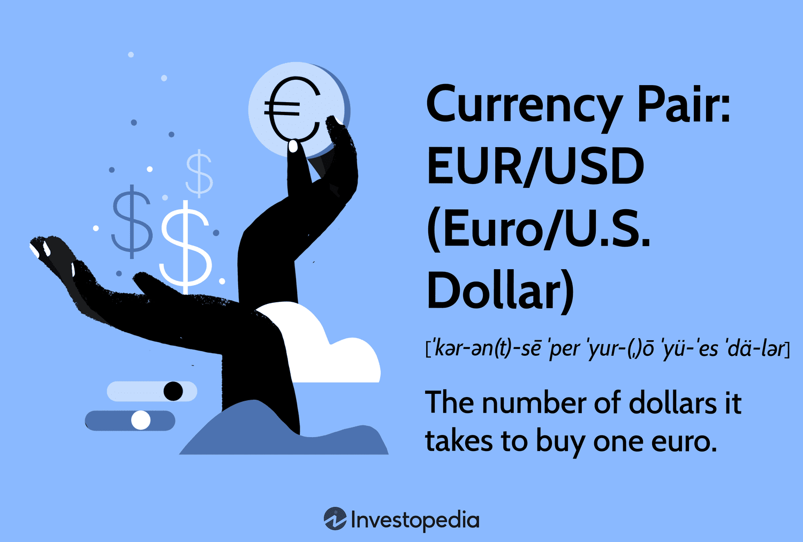

## Table of Contents

## What is the EUR/USD currency pair?

The EUR/USD currency pair is the abbreviation for the euro and the US dollar. It shows how many US dollars you need to buy one euro. This pair is the most traded currency pair in the world. People, banks, and companies trade it a lot because the euro and the US dollar are used in many countries.

The value of the EUR/USD pair changes all the time. It goes up when the euro gets stronger and the US dollar gets weaker. It goes down when the euro gets weaker and the US dollar gets stronger. Many things can make the value change, like news about the economy, interest rates, and what people think will happen in the future. Traders watch this pair closely to make decisions about buying and selling.

## Why is the EUR/USD considered the most traded currency pair?

The EUR/USD is considered the most traded currency pair because it involves the two largest economies in the world: the United States and the Eurozone. The US dollar is the world's primary reserve currency, and many countries hold it as part of their foreign exchange reserves. On the other hand, the euro is used by 19 European countries, making it a major currency in international trade. Because these two currencies are so widely used, a lot of people, businesses, and governments need to exchange them regularly.

Another reason the EUR/USD is the most traded pair is that it is very liquid. This means there are always a lot of buyers and sellers in the market, so it's easy to buy or sell this pair at any time. The high [liquidity](/wiki/liquidity-risk-premium) also means that the price doesn't change too much suddenly, which makes it safer for traders. Because of these factors, many people prefer to trade EUR/USD over other currency pairs, which is why it has the highest trading [volume](/wiki/volume-trading-strategy) in the foreign exchange market.

## How did the EUR/USD come into existence?

The EUR/USD came into existence when the euro was created. Before the euro, each country in Europe had its own money. In 1999, some European countries decided to use one shared currency, the euro, to make trading easier. The euro started as just numbers on computers, but in 2002, euro coins and notes were made. This is when people could start using the euro in shops and for buying things.

When the euro started, it needed to be compared to other currencies. The US dollar was already a big currency that many people used. So, the EUR/USD pair was created to show how many US dollars you need to buy one euro. This pair became very important because it helped people, businesses, and countries trade between Europe and the United States. Since then, the EUR/USD has been the most traded currency pair in the world.

## What are the key historical events that have impacted the EUR/USD rate?

Many big events have changed how many US dollars you need to buy one euro. One important event was the global financial crisis in 2008. During this time, many banks and companies had big problems, and people were worried about the economy. The US dollar got stronger because people thought it was safer, so the EUR/USD rate went down. Another event was the European debt crisis that started around 2010. Some countries in Europe, like Greece, had a lot of debt and needed help. This made people worry about the euro, so the EUR/USD rate went down again.

More recently, things like Brexit and decisions by central banks have also affected the EUR/USD rate. In 2016, the UK voted to leave the European Union, which caused a lot of uncertainty. The euro got weaker because people were worried about what would happen to Europe, so the EUR/USD rate went down. Also, when central banks change interest rates, it can change the value of currencies. For example, if the US Federal Reserve raises interest rates, the US dollar might get stronger, making the EUR/USD rate go down. These events show how many different things can change the value of the EUR/USD pair.

## What are the major economic factors influencing the EUR/USD exchange rate?

The EUR/USD exchange rate is influenced by many economic factors. One big factor is the difference in interest rates set by the European Central Bank (ECB) and the US Federal Reserve. If the US raises its interest rates, it can make the US dollar stronger because investors want to put their money where they can earn more interest. This makes the EUR/USD rate go down. On the other hand, if the ECB raises interest rates, the euro can get stronger, making the EUR/USD rate go up. Another important factor is inflation. If inflation is higher in the Eurozone than in the US, the euro might lose value, and the EUR/USD rate could go down.

Another key factor is the economic performance of the US and the Eurozone. If the US economy is doing well, with more jobs and higher growth, the US dollar might get stronger, pushing the EUR/USD rate down. If the Eurozone economy is doing better, the euro could get stronger, making the EUR/USD rate go up. Trade balances also play a role. If the US is exporting more than it's importing, it can make the US dollar stronger. If the Eurozone is exporting more, it can make the euro stronger. All these factors together help decide how many US dollars you need to buy one euro.

## How does the European Central Bank (ECB) affect the EUR/USD rate?

The European Central Bank (ECB) affects the EUR/USD rate mainly by changing interest rates and using other tools to control the economy. When the ECB raises interest rates, it makes borrowing money in the Eurozone more expensive. This can make the euro stronger because people and businesses might want to keep their money in euros to earn more interest. If the euro gets stronger, the EUR/USD rate goes up because you need more US dollars to buy one euro. On the other hand, if the ECB lowers interest rates, it can make the euro weaker, causing the EUR/USD rate to go down.

The ECB also uses other methods, like buying or selling bonds, to influence the economy and the value of the euro. If the ECB buys a lot of bonds, it puts more money into the economy, which can make the euro weaker. A weaker euro can make the EUR/USD rate go down. If the ECB decides to sell bonds, it can take money out of the economy, making the euro stronger and the EUR/USD rate go up. These actions by the ECB are important because they help control how much the euro is worth compared to the US dollar.

## What role does the Federal Reserve play in the EUR/USD exchange rate?

The Federal Reserve, which is the central bank of the United States, affects the EUR/USD exchange rate by changing interest rates and using other tools to control the economy. When the Federal Reserve raises interest rates, it makes borrowing money in the US more expensive. This can make the US dollar stronger because people and businesses might want to keep their money in dollars to earn more interest. If the US dollar gets stronger, the EUR/USD rate goes down because you need fewer US dollars to buy one euro. On the other hand, if the Federal Reserve lowers interest rates, it can make the US dollar weaker, causing the EUR/USD rate to go up.

The Federal Reserve also uses other methods, like buying or selling bonds, to influence the economy and the value of the US dollar. If the Federal Reserve buys a lot of bonds, it puts more money into the economy, which can make the US dollar weaker. A weaker US dollar can make the EUR/USD rate go up. If the Federal Reserve decides to sell bonds, it can take money out of the economy, making the US dollar stronger and the EUR/USD rate go down. These actions by the Federal Reserve are important because they help control how much the US dollar is worth compared to the euro.

## How can traders use technical analysis to predict EUR/USD movements?

Traders use technical analysis to look at past prices and patterns on charts to guess where the EUR/USD rate might go next. They look at things like support and resistance levels, which are like floors and ceilings for the price. If the price hits a support level and bounces back up, it might mean the price will keep going up. If it hits a resistance level and goes back down, it might mean the price will keep going down. Traders also use moving averages, which are lines on the chart that show the average price over time. If the price goes above the moving average, it might mean the price will keep going up. If it goes below, it might mean the price will keep going down.

Another way traders use technical analysis is by looking at chart patterns like triangles, head and shoulders, and double tops or bottoms. These patterns can show when the price might change direction. For example, if a trader sees a head and shoulders pattern, it might mean the price is going to go down soon. Traders also use indicators like the Relative Strength Index (RSI) and the Moving Average Convergence Divergence (MACD). The RSI helps traders see if a currency is overbought or oversold, which can mean the price might change soon. The MACD helps traders see the strength and direction of a trend. By using these tools, traders can make better guesses about where the EUR/USD rate might go next.

## What are common trading strategies for the EUR/USD pair?

One common trading strategy for the EUR/USD pair is called [trend following](/wiki/trend-following). Traders who use this strategy look at the charts to see if the price is going up or down over time. If they see the price is going up, they might buy the EUR/USD, hoping it will keep going up so they can sell it later for more money. If they see the price is going down, they might sell the EUR/USD, hoping it will keep going down so they can buy it back later for less money. Traders use tools like moving averages to help them see the trend. If the price is above the moving average, it might mean the trend is up, and if it's below, it might mean the trend is down.

Another strategy is called range trading. This is used when the EUR/USD price is moving between two levels, like a floor and a ceiling. Traders buy the EUR/USD when the price hits the floor, hoping it will go back up to the ceiling. They sell the EUR/USD when the price hits the ceiling, hoping it will go back down to the floor. To do this, traders look for support and resistance levels on the chart. Support is like a floor where the price might stop going down, and resistance is like a ceiling where the price might stop going up. By buying at support and selling at resistance, traders can make money as the price moves back and forth.

A third strategy is called [breakout](/wiki/breakout-trading) trading. This is used when the EUR/USD price breaks out of a range or a pattern. Traders watch for the price to break above resistance or below support. If the price breaks above resistance, traders might buy the EUR/USD, thinking it will keep going up. If the price breaks below support, traders might sell the EUR/USD, thinking it will keep going down. To do this, traders use tools like chart patterns and indicators to see when a breakout might happen. By trading breakouts, traders can catch big moves in the EUR/USD rate.

## How does geopolitical risk affect the EUR/USD exchange rate?

Geopolitical risk can make the EUR/USD exchange rate go up and down a lot. When there are big problems or conflicts in the world, people might get scared and want to move their money to a safer place. The US dollar is often seen as a safe place to keep money, so when there's geopolitical risk, people might sell their euros and buy US dollars. This makes the US dollar stronger and the EUR/USD rate go down. For example, if there's a war or a big political problem in Europe, people might worry about the euro and want to move their money to the US dollar.

But it's not always the same. Sometimes, geopolitical risk can affect the US dollar too. If there's a big problem in the US, like a political crisis or a big argument with another country, people might worry about the US dollar and want to move their money to the euro. This can make the euro stronger and the EUR/USD rate go up. So, geopolitical risk can change the EUR/USD rate in different ways, depending on where the problem is happening and how people think it will affect the economy.

## What are the differences between trading EUR/USD in the spot market versus the futures market?

When you trade EUR/USD in the spot market, you are buying or selling the currency right away. The price you see is the price you get, and the trade happens almost instantly. This market is open 24 hours a day from Monday to Friday, so you can trade whenever you want during those times. The spot market is good for people who want to use the currency right away or who want to make quick trades based on what they see happening in the market.

In the futures market, you are agreeing to buy or sell the EUR/USD at a certain price on a specific date in the future. This means you don't get the currency right away, but you have a contract that says you will get it later. The futures market is good for people who want to protect themselves from big changes in the price of the currency. It's also open for a set time each day and has set times when the contracts end. Trading in the futures market can be more complicated, but it can help you plan for the future and manage risk better.

## How have algorithmic trading and high-frequency trading influenced the EUR/USD market?

Algorithmic trading and high-frequency trading have changed the EUR/USD market a lot. These kinds of trading use computers to buy and sell the EUR/USD very quickly. They can look at a lot of information and make decisions in just a few seconds. This makes the market move faster and can make the price change more often. Because of this, it can be harder for regular traders to keep up with all the quick changes in the market.

But these types of trading also make the EUR/USD market more liquid. This means there are always a lot of people buying and selling, so it's easier to trade the EUR/USD whenever you want. It also helps keep the price from changing too much suddenly, which can make the market safer. Even though it can be hard to keep up with the fast changes, the EUR/USD market has become more efficient and easier to trade because of algorithmic and high-frequency trading.

## What are the strategies for Risk Management in EUR/USD Algorithmic Trading?

In the highly dynamic and unpredictable environment of [forex](/wiki/forex-system) trading, effective risk management stands as a cornerstone of successful [algorithmic trading](/wiki/algorithmic-trading) strategies, particularly for the EUR/USD currency pair. Given the significant liquidity and [volatility](/wiki/volatility-trading-strategies) of the EUR/USD, managing risk is essential to protect against potential losses while capitalizing on profitable opportunities.

A critical aspect of risk management in algorithmic trading involves techniques such as position sizing and stop-loss orders. Position sizing refers to determining the amount of capital to allocate to a trade. Proper position sizing helps in minimizing the potential impact of any single losing trade on the overall portfolio. One common method for position sizing is the Kelly Criterion, which can be expressed mathematically as:

$$
f^* = \frac{bp - q}{b}
$$

where $f^*$ is the fraction of the capital to invest, $b$ is the odds received on the wager (in decimal form), $p$ is the probability of winning, and $q$ is the probability of losing, with $q = 1 - p$.

Stop-loss orders are another indispensable tool, allowing traders to limit potential losses by predefining a price level at which positions are automatically closed. By setting a stop-loss order, traders can ensure that their losses are capped if the market moves unfavorably.

Managing leverage and accounting for volatility are equally crucial in forex trading. Leverage enables traders to control larger positions than their initial capital might allow. However, it also amplifies both gains and losses. An excessive use of leverage can lead to significant losses, particularly in a volatile market such as EUR/USD. It is advisable for traders to use modest leverage ratios, ensuring that their risk exposure aligns with their risk tolerance and capital base.

Volatility remains a vital [factor](/wiki/factor-investing) to consider, as sudden fluctuations in currency prices can significantly impact trading positions. To account for this, traders often utilize volatility indicators, such as the Average True Range (ATR), to adjust their trading strategies dynamically. Python code for calculating ATR might look like this:

```python
import pandas as pd

def calculate_atr(data, period=14):
    data['H-L'] = data['High'] - data['Low']
    data['H-PC'] = abs(data['High'] - data['Close'].shift(1))
    data['L-PC'] = abs(data['Low'] - data['Close'].shift(1))
    true_range = data[['H-L', 'H-PC', 'L-PC']].max(axis=1)
    atr = true_range.rolling(window=period).mean()
    return atr
```

Best practices for setting algorithmic parameters to minimize risk include regular updates of strategy parameters and thorough testing before deployment. Traders should conduct extensive [backtesting](/wiki/backtesting) using historical data to ensure the robustness of their algorithms. It is also beneficial to implement real-time monitoring systems to detect any unusual trading patterns quickly.

Overall, risk management in algorithmic trading of the EUR/USD is about meticulously controlling potential downsides while positioning oneself to capitalize on the market's inherent opportunities. Through disciplined application of techniques like position sizing, stop-loss orders, appropriate leverage, and volatility assessment, traders can enhance the resilience of their trading strategies.

## References & Further Reading

[1]: Bergstra, J., Bardenet, R., Bengio, Y., & Kégl, B. (2011). ["Algorithms for Hyper-Parameter Optimization."](https://proceedings.neurips.cc/paper/2011/file/86e8f7ab32cfd12577bc2619bc635690-Paper.pdf) Advances in Neural Information Processing Systems 24.

[2]: ["Advances in Financial Machine Learning"](https://www.amazon.com/Advances-Financial-Machine-Learning-Marcos/dp/1119482089) by Marcos Lopez de Prado

[3]: ["Evidence-Based Technical Analysis: Applying the Scientific Method and Statistical Inference to Trading Signals"](https://www.amazon.com/Evidence-Based-Technical-Analysis-Scientific-Statistical/dp/0470008741) by David Aronson

[4]: ["Machine Learning for Algorithmic Trading"](https://github.com/PacktPublishing/Machine-Learning-for-Algorithmic-Trading-Second-Edition) by Stefan Jansen

[5]: ["Quantitative Trading: How to Build Your Own Algorithmic Trading Business"](https://books.google.com/books/about/Quantitative_Trading.html?id=j70yEAAAQBAJ) by Ernest P. Chan