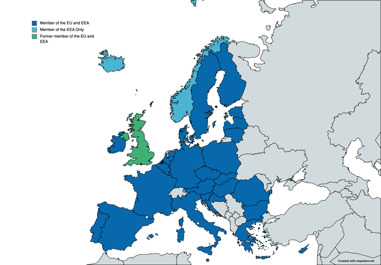

The Eurasian Economic Union (EAEU) represents a formidable strategic endeavor with the primary objective of enhancing economic collaboration among its member countries. Initially established by Belarus, Kazakhstan, and Russia, the union has expanded to include Armenia and Kyrgyzstan. This integration aims to enable the free movement of goods, services, labor, and capital across member states, fostering a unified economic landscape.

This article examines the various dimensions of economic integration within the EAEU and how these advancements bear implications for algorithmic trading within the union. As financial markets increasingly adopt technology-driven solutions, understanding the impact of such integration on algorithmic trading becomes imperative. Algorithmic trading leverages computational algorithms to execute trades at speeds and frequencies unimaginable to human traders. Consequently, it has profound implications for market efficiency, liquidity, and the overall financial ecosystem across the EAEU member states.

Traders and policymakers stand to gain crucial insights from scrutinizing these dynamics, as they offer potential avenues for increased market participation and economic growth. The EAEU's strategic initiative not only seeks to bolster the economic stature of its individual members but also to position the union as a significant influent entity in global economic frameworks. Thus, examining the EAEU's progression towards economic cohesion, alongside the evolution of algorithmic trading, provides a comprehensive understanding of the future trajectory of trade and commerce within and beyond the union.

## Table of Contents

## Understanding the Eurasian Economic Union (EAEU)

The Eurasian Economic Union (EAEU) is an international economic union that connects several key countries from Central Asia and Eastern Europe, establishing a significant regional bloc aimed at economic cooperation and integration. Initially founded by Belarus, Kazakhstan, and Russia through the signing of the Treaty on the Eurasian Economic Union on May 29, 2014, the union officially began operations on January 1, 2015. Subsequently, Armenia and Kyrgyzstan joined, expanding the union's reach and influence in the region.

One of the core objectives of the EAEU is to facilitate the free movement of goods, services, labor, and capital among its member states. This open market is similar to the structure championed by the European Union, and it aims to reduce both trade barriers and regulatory restrictions within the participating countries. By improving labor mobility, reducing capital movement restrictions, and enabling seamless cross-border trade, the EAEU serves as a dynamic platform for economic collaboration.

In order to support these initiatives, the EAEU has established several key institutions, including the Eurasian Economic Commission, which is responsible for overseeing the implementation of agreed policies and ensuring compliance with the union's objectives. The legal framework of the EAEU emphasizes harmonization of standards and regulations across various economic sectors such as energy, transportation, and agriculture, which helps streamline trade activities and reduce administrative burdens on businesses operating within the union.

Moreover, the collective strategic positioning of EAEU member states, with substantial natural and human resources, presents significant potential for economic growth and development. The union encompasses a combined population of approximately 183 million people and boasts large reserves of energy resources, contributing to its competitive advantage in the global market.

Overall, the EAEU stands as a pivotal economic entity expected to influence surrounding geopolitical and trade dynamics through its policies and integration efforts. As such, businesses and policymakers alike are monitoring its development closely to understand the broader impacts on regional and global economics.

## Economic Integration within the EAEU

Economic integration within the Eurasian Economic Union (EAEU) is a strategic objective designed to boost the economic performance and competitiveness of its member states. Established to harmonize economic processes and ensure a seamless flow of goods, services, labor, and capital, the EAEU emphasizes the establishment of common policies across various critical sectors, prominently including energy and agriculture.

In the energy sector, the EAEU promotes cooperation among member states to optimize the use of regional resources, facilitate mutually beneficial projects, and ensure energy security. This collaborative approach enhances energy efficiency and reduces dependency on external energy sources, thereby strengthening the energy infrastructure of the member countries. For instance, the EAEU facilitates the integration of electricity markets among its members, aiming to create a common energy market that enhances competitiveness and resilience.

Agricultural integration is another critical aspect, as the union aims to boost agricultural productivity through shared standards and policies. The unified agricultural market within the EAEU allows for the adoption of technology-driven farming practices and improvements in food safety and quality standards, leading to increased agricultural output and improved food security across the union.

Economic integration within the EAEU also entails the harmonization of economic regulations and standards, which plays a vital role in simplifying trade processes and reducing transaction costs. By aligning regulatory frameworks, the EAEU enhances transparency and predictability for businesses, thereby attracting investment and fostering a conducive environment for economic growth. The standardization of customs procedures and technical regulations is instrumental in facilitating trade and ensuring that products meet common quality and safety benchmarks across the union.

The implications of economic integration extend to the convergence of monetary and fiscal policies, which further supports economic stability and growth within the union. This includes efforts to coordinate macroeconomic policy frameworks and address challenges such as inflation and currency [volatility](/wiki/volatility-trading-strategies) collaboratively. By pursuing these harmonized approaches, the EAEU aims to mitigate economic disparities among its members, leading to a balanced and sustainable economic development trajectory.

Overall, economic integration within the EAEU is pivotal for creating a robust economic bloc that can effectively compete in the global market. Through the adoption of common policies and standards, the union not only enhances internal cohesion but also positions itself as an attractive region for international trade and investment, contributing to the global economic landscape.

## Algorithmic Trading in the EAEU Economies

Algorithmic trading, the use of computer algorithms to automate decision-making in financial markets, has become increasingly prevalent in the economies of the Eurasian Economic Union (EAEU). This trend is largely driven by advancements in technology and the development of sophisticated trading platforms. Within the EAEU, [algorithmic trading](/wiki/algorithmic-trading) is gaining traction due to several factors that make the region's financial markets particularly amenable to these automated strategies.

Firstly, the EAEU's unified market structure, which facilitates the free movement of goods, services, labor, and capital among member states, offers a fertile ground for algorithmic trading strategies. By harmonizing financial regulations and creating a more integrated economic environment, the EAEU allows for greater market accessibility and the efficient dissemination of information. This uniformity can enhance the performance of algorithms that rely on consistent data inputs and regulatory standards.

Moreover, the implementation of algorithmic trading in the EAEU has significant implications for market efficiency. By executing trades at high speeds and with minimal human intervention, algorithms can help reduce transaction costs, increase [liquidity](/wiki/liquidity-risk-premium), and narrow bid-ask spreads. These improvements contribute to a more efficient allocation of resources and the effective pricing of financial instruments across EAEU markets. 

The flow of capital within the EAEU is also influenced by the rise of algorithmic trading. These strategies enable investors to quickly enter and [exit](/wiki/exit-strategy) positions, providing a mechanism for capital to be reallocated rapidly in response to market developments. Additionally, the integration of algorithmic systems can facilitate cross-border investments by offering standardized and streamlined trading processes. This capability enhances the attractiveness of EAEU markets to international investors who seek to diversify their portfolios by participating in emerging markets with sophisticated trading infrastructures.

In conclusion, the growing adoption of algorithmic trading within the EAEU showcases the transformative impact of technology on financial markets. By leveraging the union's unified market structure, algorithmic trading not only promotes enhanced market efficiency but also contributes to the seamless flow of capital, both internally and from global sources. As technology continues to evolve, the role of algorithmic trading in the EAEU is poised to expand further, solidifying the region's position in the global financial landscape.

## Impact on Global Trading

The Eurasian Economic Union (EAEU) aims to establish itself as a formidable economic bloc, influencing global trading patterns through its collective economic strength and strategic initiatives. Algorithmic trading, a growing trend within EAEU's financial markets, has the potential to significantly enhance market dynamics, making these markets more appealing to international investors. This form of trading leverages complex algorithms and high-speed computational power to execute large orders at optimized prices, ultimately increasing market efficiency and liquidity. By streamlining transactions and reducing manual intervention, algorithmic trading can lead to tighter bid-ask spreads, decreased transaction costs, and improved market resilience.

The EAEU's unified market structure, which facilitates the free movement of goods, services, labor, and capital among member states, provides an optimal environment for these advanced trading strategies. As algorithmic trading becomes more prevalent, the EAEU stands to benefit from a more vibrant and interconnected financial ecosystem. This, in turn, attracts global investors seeking robust and efficient market opportunities, thus enhancing capital flow within and beyond the union's borders.

Furthermore, the policies implemented by the EAEU may serve as a template for other regions pursuing economic integration. By standardizing regulatory frameworks and promoting economic synergy, the EAEU sets benchmarks that other economic unions might adopt to streamline cross-border trading activities. As the EAEU progresses in its integration efforts, its ability to influence global trading patterns will likely grow, reinforcing its position as a pivotal player in the global economic landscape.

## Challenges and Opportunities

The Eurasian Economic Union (EAEU) offers significant opportunities for economic growth and cooperation among its member states, but it also faces a set of formidable challenges. One of the primary challenges is the regulatory complexities inherent to economic and financial integration. The EAEU encompasses diverse legal and regulatory frameworks, which can hinder the seamless implementation of unified policies and the creation of a cohesive economic environment. Harmonizing these regulations is essential to improving the predictability and efficiency of cross-border economic activities within the union.

Algorithmic trading, a rapidly evolving area within the EAEU's financial markets, represents both opportunities and challenges. The increased use of algorithmic trading can enhance liquidity and market efficiency, but it also brings new risks that necessitate effective governance and oversight. The development of robust regulatory frameworks to oversee algorithmic trading activities is critical to mitigate risks such as market volatility, systemic risks, and the potential for market manipulation. This calls for regulatory bodies within the EAEU to collaborate closely in developing consistent and transparent trading regulations that safeguard market stability.

Furthermore, achieving a balance between cooperative economic policies and respecting the individual interests of member states proves to be a critical challenge for the EAEU. Each member state has its own economic priorities and political agendas, which may not always align with the collective goals of the union. For instance, member states may have divergent approaches to fiscal policies, capital movement regulations, or trade policies, which can hinder deeper integration. This necessitates careful negotiation and diplomacy to ensure that the benefits of economic integration are equitably distributed and accommodate the unique needs of each member.

In summary, while the EAEU holds promise for enhanced economic cooperation and growth, it must navigate complex regulatory landscapes and manage the intricacies introduced by algorithmic trading. Moreover, fostering a cooperative spirit among its diverse member states remains an essential ongoing process to ensure the union's long-term success and stability.

## Conclusion

The EAEU's efforts toward economic integration and the adoption of algorithmic trading represent pivotal advancements in its strategy to become a formidable entity in global trade. By enabling member states to collaborate on regulatory frameworks and embrace technological innovation, the EAEU has created a fertile ground for enhanced market efficiency and competitiveness. The combination of policy harmonization with cutting-edge trading technologies has the potential to streamline cross-border transactions and improve the allocation of resources, thereby increasing the union's appeal to international investors.

Understanding the dynamics between economic policies and technological advancements such as algorithmic trading is crucial for stakeholders aiming to navigate this constantly evolving landscape. Algorithmic trading, characterized by the use of computer algorithms to manage trading decisions and execute orders, can significantly enhance liquidity and reduce transaction costs in the EAEU markets. This interplay between policy-driven economic integration and technology-driven market practices is a cornerstone of the EAEU's strategy, with the potential to redefine how capital markets function within its jurisdiction.

Looking ahead, the trajectory of these developments is likely to exert substantial influence over global economic frameworks. As the EAEU continues to refine its integration mechanisms and embrace technological advancements, it may set precedents that other regions might follow. The union's approach to creating a cohesive economic space, while overcoming regulatory complexities, could serve as a model of economic integration for other blocs striving for similar objectives. As a result, future advancements in this area will not only impact the immediate member states but also have broader implications for international trade systems and economic policies worldwide.

## References & Further Reading

[1]: Vinokurov, E., & Libman, A. (2012). ["Eurasian Integration: Challenges of Transcontinental Regionalism."](https://link.springer.com/book/10.1057/9781137283351) Palgrave Macmillan.

[2]: Dragneva, R., & Wolczuk, K. (2012). ["Russia, the Eurasian Customs Union and the EU: Cooperation, Stagnation or Rivalry?"](https://papers.ssrn.com/sol3/papers.cfm?abstract_id=2125913) Chatham House Briefing Paper.

[3]: Zhang, M. Y., Hu, J., & Chao, Z. (2001). ["Algorithmic Trading: An Overview."](https://www.sciencedirect.com/science/article/pii/S092633732030429X) Springer.

[4]: Drezner, D. W. (2009). ["The Power and Peril of Algorithmic Trading."](http://www.danieldrezner.com/research/regimecomplexity.pdf) International Affairs.

[5]: Goryunov, E., & Andova, E. (2019). ["The Eurasian Economic Union and World Trade: Comparative Studies."](https://www.researchgate.net/publication/356896251_Eurasian_Economic_Union_in_the_European_Union's_footsteps_or_on_new_paths) Oslo Law Review.