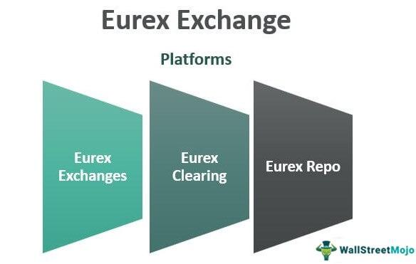

## Table of Contents

## What is the Eurex Clearing System?

The Eurex Clearing System is a part of Eurex Exchange, which is one of the largest futures and options markets in the world. It helps make sure that trades are safe and reliable. When people buy and sell things on the Eurex Exchange, the Eurex Clearing System steps in to make sure that both the buyer and the seller keep their promises. This means if someone agrees to buy something, they have to pay for it, and if someone agrees to sell something, they have to deliver it.

The Eurex Clearing System does this by acting as the middleman in every trade. It becomes the buyer to every seller and the seller to every buyer. This way, even if one person can't keep their promise, the system makes sure the other person still gets what they were supposed to get. This makes trading safer and helps people trust the market more.

## How does the Eurex Clearing System function as a central counterparty?

The Eurex Clearing System acts as a central counterparty by stepping into the middle of every trade made on the Eurex Exchange. When someone wants to buy a futures or options contract, and someone else wants to sell it, the Eurex Clearing System becomes the buyer to the seller and the seller to the buyer. This means that instead of the original buyer and seller dealing directly with each other, they both deal with the Eurex Clearing System. This setup helps make sure that if one person can't keep their end of the deal, the other person is still protected.

By acting as the central counterparty, the Eurex Clearing System manages the risk that comes with trading. It does this by requiring both buyers and sellers to put up a certain amount of money, called margin, before they can trade. This money acts like a safety net. If someone can't pay or deliver what they promised, the Eurex Clearing System can use this money to make sure the other person still gets what they were supposed to. This way, the system helps keep the market stable and trustworthy for everyone involved.

## What types of financial instruments can be cleared through Eurex?

Eurex Clearing System handles many different types of financial products that people can trade on the Eurex Exchange. These include futures and options on various things like stocks, stock indexes, interest rates, and even commodities like wheat or oil. Futures are agreements to buy or sell something at a set price in the future, while options give you the right, but not the obligation, to do the same.

Besides these, Eurex also clears trades for more complex financial products. These can include swaps, which are agreements to exchange cash flows over time, and repo transactions, where one party sells securities to another with an agreement to buy them back later. By clearing these different types of financial instruments, Eurex helps make trading safer and more reliable for everyone involved.

## Who can become a member of the Eurex Clearing System?

Anyone who wants to trade on the Eurex Exchange and needs the safety of a central counterparty can become a member of the Eurex Clearing System. This includes banks, financial institutions, and other companies that deal in futures, options, swaps, and other financial products. To join, they have to meet certain rules set by Eurex, like having enough money and following their trading rules.

Becoming a member means these organizations can use Eurex's services to clear their trades, making sure that their deals are safe and reliable. Members have to put up money, called margin, to cover any risks. This way, if something goes wrong with a trade, Eurex can use this money to fix it, keeping the market stable and trustworthy for everyone.

## What are the benefits of using the Eurex Clearing System for risk management?

Using the Eurex Clearing System helps manage risk by acting as a middleman in every trade. When you trade on the Eurex Exchange, the clearing system steps in to make sure that both the buyer and the seller keep their promises. If someone can't pay or deliver what they agreed to, the Eurex Clearing System uses the money that traders put up, called margin, to cover the loss. This way, it protects everyone involved in the trade and makes the market safer.

Another benefit is that the Eurex Clearing System keeps an eye on the market all the time. It watches how much risk there is in the trades happening and can ask for more margin if it thinks the risk is getting too high. This helps stop big problems before they start. By managing risk this way, the Eurex Clearing System helps keep the market stable and trustworthy, so people feel more confident when they trade.

## How does Eurex ensure the safety and stability of the financial markets?

Eurex helps keep the financial markets safe and stable by acting as a middleman in every trade. When someone buys or sells something on the Eurex Exchange, Eurex steps in to make sure that both the buyer and the seller keep their promises. If a buyer can't pay or a seller can't deliver what they agreed to, Eurex uses the money that traders put up, called margin, to cover the loss. This way, Eurex protects everyone involved in the trade and stops small problems from turning into big ones.

Eurex also watches the market all the time to make sure it stays stable. It checks how much risk is in the trades happening and can ask for more margin if it thinks the risk is getting too high. This helps stop big problems before they start. By managing risk this way, Eurex makes the market a safer place for everyone to trade, so people feel more confident when they buy and sell.

## What are the main differences between Eurex and other clearing systems?

Eurex is different from other clearing systems because it mainly focuses on futures and options trading. While other clearing systems might handle different kinds of financial products, Eurex is known for being a big player in the futures and options market. It also acts as a central counterparty, meaning it steps in between buyers and sellers to make sure trades are safe. This is similar to what other clearing systems do, but Eurex has a strong focus on the European market and works with a wide range of financial instruments like interest rates, stock indexes, and commodities.

Another way Eurex stands out is through its risk management practices. Eurex keeps a close watch on the market and can ask traders to put up more margin if the risk seems too high. This helps keep the market stable and prevents big problems from happening. While other clearing systems also manage risk, Eurex's specific approach and its strong position in the European market make it unique. By offering a safe and reliable place for trading, Eurex helps traders feel more confident when they buy and sell on its platform.

## How does the Eurex Clearing System handle default management?

When someone can't keep their promise to buy or sell something on the Eurex Exchange, it's called a default. The Eurex Clearing System has a plan to handle this. If a trader defaults, Eurex first uses the money that the trader put up, called margin, to cover the loss. If that's not enough, Eurex can use other money that it has set aside for emergencies. This helps make sure that the other person in the trade still gets what they were supposed to get.

Eurex also has rules to stop defaults from causing big problems. It keeps an eye on the market all the time and can ask traders to put up more margin if it thinks the risk is getting too high. If a default happens, Eurex can quickly close out the defaulting trader's positions to limit the damage. By doing all this, Eurex helps keep the market safe and stable for everyone.

## What technological innovations has Eurex implemented to improve its clearing services?

Eurex has been using new technology to make its clearing services better and faster. One big change is the use of a system called Prisma, which helps manage risk in a smarter way. Prisma looks at all the trades someone makes together, instead of one by one. This means Eurex can see the big picture and ask for the right amount of margin to cover any risks. This makes trading safer and helps traders save money on margins.

Another important technology Eurex uses is called F7. This system makes trading faster and more reliable. With F7, Eurex can handle more trades at the same time without slowing down. It also makes it easier for traders to see what's happening in the market and react quickly. By using these technologies, Eurex keeps its services up to date and helps traders feel more confident when they buy and sell.

## How does Eurex comply with international regulatory standards?

Eurex follows international rules to make sure it works in a fair and safe way. It listens to groups like the European Securities and Markets Authority (ESMA) and the German Federal Financial Supervisory Authority (BaFin). These groups set rules that Eurex has to follow, like how to handle money and keep trades safe. By following these rules, Eurex makes sure that people can trust the market and feel safe when they trade.

Eurex also keeps up with changes in the rules. If new laws come out, Eurex changes its ways to follow them. This means Eurex is always working to meet the latest standards, which helps keep the market strong and reliable. By doing this, Eurex not only follows the law but also helps make the whole financial world safer for everyone.

## What role does Eurex play in the global financial ecosystem?

Eurex is a big part of the global financial world because it helps people trade futures and options safely. It works like a middleman in every trade on the Eurex Exchange, making sure that if someone can't pay or deliver what they promised, the other person is still protected. This makes trading safer and helps people trust the market more. Eurex focuses a lot on the European market, but it also works with traders from all over the world, making it an important link in the global financial chain.

By using smart technology and keeping a close eye on the market, Eurex helps keep the financial world stable. It uses systems like Prisma to manage risk better and F7 to make trading faster and more reliable. Eurex also follows rules set by international groups to make sure it's doing things the right way. This helps everyone feel more confident when they trade, knowing that Eurex is working hard to keep the market safe and fair for everyone.

## What are the future developments and strategic plans for the Eurex Clearing System?

Eurex is always looking to improve and grow. One big plan is to keep making its technology better. Eurex wants to use new tools to make trading even faster and safer. For example, they might add more features to their Prisma system to manage risk even better. They also want to make sure their F7 system keeps working well so that traders can buy and sell quickly and easily. By doing this, Eurex hopes to stay ahead in the fast-changing world of finance.

Another important goal for Eurex is to expand what it offers. They want to add more types of financial products that people can trade. This could mean new kinds of futures and options, or even more complex things like swaps and repo transactions. By doing this, Eurex hopes to attract more traders from around the world. They also want to keep following international rules to make sure they're doing things the right way. This helps build trust and makes the market a safer place for everyone.

## References & Further Reading

[1]: [Eurex Clearing AG](https://www.eurex.com/ec-en/) - Official website for comprehensive information on Eurex Clearing's services and market role.

[2]: European Market Infrastructure Regulation (EMIR) - [Regulation (EU) No 648/2012](https://eur-lex.europa.eu/eli/reg/2012/648/oj/eng) on OTC derivatives, central counterparties, and trade repositories.

[3]: ["Advances in Financial Machine Learning"](https://www.amazon.com/Advances-Financial-Machine-Learning-Marcos/dp/1119482089) by Marcos Lopez de Prado - A book exploring the intersection of financial markets and machine learning techniques.

[4]: Deutsche Börse Group - [Press Releases](https://www.deutsche-boerse.com/dbg-en/media/news-stories/press-releases) for latest updates and insights into innovations and changes in Eurex Clearing AG.

[5]: ["Machine Learning for Algorithmic Trading"](https://github.com/stefan-jansen/machine-learning-for-trading) by Stefan Jansen - A guide to integrating machine learning into algorithmic trading strategies.

[6]: ["Quantitative Trading: How to Build Your Own Algorithmic Trading Business"](https://www.amazon.com/Quantitative-Trading-Build-Algorithmic-Business/dp/1119800064) by Ernest P. Chan - This book offers practical insights into starting a quantitative trading business.