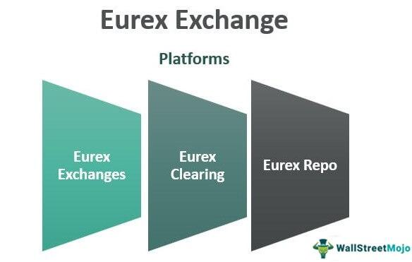

The European futures market plays a pivotal role in the global financial landscape, offering a diverse array of financial derivatives and opportunities for algorithmic trading. Prominent exchanges such as Eurex and Euronext are instrumental in facilitating the vibrant trading of futures and options across Europe. These exchanges provide platforms that support a wide range of financial instruments, making the futures market a crucial component of economic activity and investment strategy in the region.

This article aims to provide a comprehensive overview of the key aspects of futures markets on European exchanges. It will focus on the financial derivatives available and the impact of algorithmic trading on market dynamics. The discussion will cover the roles and influences of major exchanges, like Eurex and Euronext, which are known for their extensive range of trading options and robust technological infrastructure. Additionally, the article will address how algorithmic trading is increasingly reshaping the marketplace by enhancing liquidity and efficiency.

The ongoing evolution of financial technologies and regulatory frameworks in Europe ensures that the futures markets continue to adapt to changes in the global economic environment, offering both challenges and opportunities for market participants. This examination will not only highlight the available financial instruments but also shed light on the transformative potential of technological advancements in the marketplace.

## Table of Contents

## Overview of European Futures Markets

European futures markets offer diverse trading options, encompassing instruments such as interest rate derivatives and equity derivatives. These markets are essential components of the global financial system, providing various tools for hedging and speculation.

Key exchanges like Eurex and Euronext play crucial roles in enabling the trading of these financial derivatives. Eurex, headquartered in Germany, is one of the leading global derivatives exchanges, offering a wide range of contracts on equities, equity indices, interest rates, and more. Euronext, operating across several major European countries, serves not only as an exchange for equities but also facilitates the trading of derivatives, including those focused on financial and energy markets. These platforms provide traders and investors with robust environments to execute trades efficiently and with confidence.

The regulatory frameworks governing European futures markets ensure that these platforms operate with a high degree of transparency and efficiency. This regulatory oversight is primarily conducted by bodies such as the European Securities and Markets Authority (ESMA). Through comprehensive regulations, futures markets in Europe are structured to protect market participants and preserve the integrity of financial markets. Compliance with directives like the Markets in Financial Instruments Directive II (MiFID II) ensures that trading practices are standardized across the European Union, enhancing market stability and transparency.

In conclusion, the established infrastructure and comprehensive regulatory measures make European futures markets a dependable venue for investors looking to engage with derivatives. The range of instruments available and the robust nature of exchanges like Eurex and Euronext position these markets as integral components of the global trading ecosystem, providing valuable opportunities for both risk management and investment gain.

## Key Players in European Futures Trading

Eurex and Euronext stand at the forefront of futures trading within Europe, each playing pivotal roles in the continent's financial markets. Eurex, strategically based in Germany, has established itself as a leader in the derivatives market, offering an extensive range of products. Its portfolio is comprehensive, featuring equity index and [interest rate](/wiki/interest-rate-trading-strategies) futures, which are integral to the trading activities of institutional investors, hedge funds, and other market participants. As a part of the Deutsche Börse Group, Eurex benefits from robust infrastructure and significant market depth, facilitating high trading volumes and providing [liquidity](/wiki/liquidity-risk-premium) across numerous derivative contracts.

On the other hand, Euronext operates across multiple European countries, including notable financial hubs such as France, Belgium, and the Netherlands. This exchange has carved out a significant niche in energy and financial futures, catering to a diverse array of trading needs across energy commodities and financial assets. Euronext’s extensive geographical reach enables it to serve a broad base of traders and institutions, offering a diverse range of products that address both traditional and emerging market demands.

Both Eurex and Euronext have leveraged technological advancements to enhance trading efficiencies. They offer sophisticated trading platforms that accommodate algorithmic strategies and high-frequency trading ([HFT](/wiki/high-frequency-trading-strategies)), aligning with modern trading practices. Furthermore, both exchanges are significantly influenced by regulatory standards within the European Union, specifically those outlined by MiFID II, which governs aspects such as transparency, trading practices, and investor protection.

In summary, Eurex and Euronext exemplify the robust framework of European futures exchanges, providing a critical infrastructure that supports a wide array of derivative instruments. Their strategic operations and innovative approaches continue to shape the future of trading within Europe.

## Popular Financial Derivatives in Europe

Equity and interest rate derivatives hold a prominent place among the most traded financial instruments in European futures markets. These derivatives serve as essential tools for investors seeking to hedge against risk, gain exposure to market indices, or speculate on future price movements. Notably, products such as Exchange-Traded Funds (ETFs), options, and futures linked to major indices like the EURO STOXX 50 create numerous opportunities for participants in these markets.

Equity derivatives, specifically those tied to indices such as the EURO STOXX 50, allow investors to gain exposure to a broad segment of the European equity market. This index, comprising 50 of the largest and most liquid stocks in the Eurozone, serves as a benchmark for European equity performance. Options and futures based on this index enable investors to engage in various strategies, including hedging and speculation.

Interest rate derivatives, another cornerstone of the European futures landscape, cater to the needs of those looking to manage interest rate risk. These derivatives, including futures based on government bonds and interest rate swaps, are crucial in allowing institutions to stabilize cash flows and capitalize on rate movements.

In response to shifting investor priorities, European futures markets are increasingly accommodating [ESG](/wiki/esg-investing)-focused and digital asset derivatives. ESG (Environmental, Social, and Governance) derivatives align with the growing trend towards sustainable investing, offering products that meet ethical and sustainability criteria. As investors become more conscious of environmental and social factors in their investment decisions, the demand for these derivatives continues to rise.

Furthermore, the proliferation of digital asset derivatives is indicative of the transformation within financial markets driven by technological advancements. With increasing interest in cryptocurrencies and blockchain technologies, European futures exchanges are progressively listing futures and options on digital currencies, thereby broadening the scope of available trading instruments.

Overall, the array of derivatives available in European futures markets, from traditional equity and interest rate derivatives to emerging ESG and digital asset derivatives, reflects the diverse needs of modern investors and positions these markets as pivotal players in global finance.

## Algorithmic Trading in Futures Markets

Algorithmic trading has become a vital component of the European futures markets, significantly enhancing market liquidity and operational efficiency. The adoption of sophisticated algorithms enables traders and institutions to execute large volumes of trades at a speed and efficiency that human traders cannot match. By automating the trading process, [algorithmic trading](/wiki/algorithmic-trading) allows for the rapid adjustment of portfolios in response to market fluctuations.

High-frequency trading (HFT) is a specialized form of algorithmic trading characterized by high-speed order execution and frequently involves holding positions for very short periods. HFT strategies rely heavily on advanced technology infrastructure to execute trades within microseconds, taking advantage of small price discrepancies across various exchanges. In European futures markets, HFT constitutes a substantial portion of the trading [volume](/wiki/volume-trading-strategy), contributing to tighter bid-ask spreads and improved market depth.

The regulatory framework within the European Union, particularly the Markets in Financial Instruments Directive II (MiFID II), plays a pivotal role in overseeing and guiding algorithmic trading. MiFID II, implemented in January 2018, establishes stringent requirements for algorithmic trading practices to ensure fair and orderly markets. It mandates that firms employing algorithmic trading strategies are obliged to have adequate risk controls in place to prevent erroneous orders and potential market abuse. Furthermore, MiFID II requires comprehensive record-keeping and reporting of all trading orders, which enhances market transparency and investor protection.

The introduction of MiFID II has also necessitated the deployment of robust testing environments, known as trading venues, to simulate market conditions and assess algorithm performance under different scenarios. Such initiatives aim to preclude market disruptions and enhance the resilience of the trading infrastructure.

In summary, algorithmic trading, supported by regulatory measures such as MiFID II, continues to reshape the dynamics of the European futures markets. By bolstering liquidity and operational efficacy, it provides a competitive edge that aligns with the evolving needs of investors and regulators alike.

## Regulation and Compliance

Regulatory bodies play a vital role in ensuring that European futures markets operate within a robust compliance framework. The European Securities and Markets Authority (ESMA) is the principal regulatory authority overseeing these markets. ESMA's objectives include maintaining financial stability, protecting investors, and promoting orderly financial markets within the European Union (EU). By establishing a harmonized regulatory environment across member states, ESMA ensures that futures markets function transparently and efficiently.

One of the key regulatory frameworks governing European futures markets is the Markets in Financial Instruments Directive II (MiFID II). Implemented in 2018, MiFID II provides comprehensive rules and guidelines that cover various aspects of market structure and trading practices, including algorithmic and high-frequency trading. The directive mandates that trading platforms and market participants implement mechanisms to prevent disorderly trading and ensure fair and transparent market practices. This includes pre-trade and post-trade transparency requirements, position limits for commodity derivatives, and enhanced reporting obligations for trades.

MiFID II's operational transparency requirements are particularly relevant for algorithmic trading, a significant feature of the European futures markets. The directive requires firms engaging in algorithmic trading to establish and maintain effective systems and risk controls to prevent activities that could contribute to disorderly markets. These firms must also provide ESMA and national authorities with access to the source code of their trading algorithms, if requested.

The compliance framework under MiFID II is continuously updated to address new challenges and enhance market resilience. By regularly reviewing and amending regulatory measures, ESMA and other national authorities strive to protect investment integrity and adapt to emerging financial technologies and market practices. This proactive approach ensures that the regulatory landscape remains robust and responsive, safeguarding the interests of market participants and supporting the overall stability and functioning of the European futures markets.

## Benefits and Risks of Trading Futures in Europe

Futures trading in Europe presents both benefits and risks that are integral to its appeal and complexity. One of the primary advantages is high leverage, an essential feature of futures contracts. Leverage allows investors to control a large position with a comparatively small capital outlay. For example, if an investor posts a margin of 10%, they can control a position worth ten times the initial investment. This amplification can potentially lead to significant returns; however, it also introduces substantial risk, as losses are similarly magnified.

The structured nature of futures markets enhances risk management capabilities, a crucial benefit for investors. The standardization of contracts in terms of size, quality, and delivery date allows market participants to enter and [exit](/wiki/exit-strategy) positions with ease, fostering liquidity and price transparency. This standardization also facilitates hedging strategies, enabling businesses and investors to protect against price fluctuations in the underlying asset, whether it be commodities, interest rates, or equities.

Volatility within futures markets, driven by various factors such as economic indicators, financial reports, and geopolitical events, presents both opportunities and risks. Traders can exploit [volatility](/wiki/volatility-trading-strategies) to achieve substantial profits by anticipating price movements; however, the unpredictability can also lead to significant losses. Calculating metrics such as the Volatility Index (VIX) can assist traders in assessing market risk and deciding appropriate strategies.

Despite these opportunities, the speculative nature of futures markets often attracts high-stake risk-takers, potentially leading to financial distress if market conditions turn unfavorable. Effective risk management strategies, including setting stop-loss orders and maintaining adequate margin, are vital to mitigating these risks. Furthermore, understanding the regulatory environment and adhering to compliance standards is essential for minimizing operational risks associated with futures trading in Europe. 

Given these elements, participants in European futures markets must remain vigilant and informed, balancing the potential for high rewards with the inherent risks posed by leverage and market volatility.

## Future Trends and Innovations

European futures markets are evolving rapidly, driven by a confluence of emerging trends and technological advancements. One notable trend is the increasing focus on sustainable finance, reflected in the growing popularity of Environmental, Social, and Governance (ESG) derivatives. These financial instruments enable investors to align their portfolios with sustainability objectives, catering to a rising demand for responsible investing. By integrating ESG criteria into derivatives, European markets are addressing investor concerns about ethical and sustainable practices, fostering long-term accountability, and promoting investments in green projects [1].

Simultaneously, the rise of [cryptocurrency](/wiki/cryptocurrency) and digital asset futures is creating new trading opportunities and innovations in market structures. European exchanges are increasingly listing cryptocurrency derivatives, providing a platform for trading futures on digital assets. These products enable investors to hedge against the volatility of cryptocurrencies, offering both speculative and risk management opportunities. The development of such derivatives underscores the adaptability of European futures markets to new asset classes and investor demands.

Advanced technologies are also expected to play a transformative role in the future of European futures markets. Artificial Intelligence (AI) and blockchain are two key technologies driving this change. AI, particularly in the form of [machine learning](/wiki/machine-learning) algorithms, is enhancing trading strategies by analyzing large datasets to identify patterns and forecast market trends. This technology improves trading efficiency and decision-making, contributing to increased liquidity and reduced transaction costs.

Blockchain technology, known for its decentralized and secure nature, is anticipated to reshape trading systems by enabling transparent and tamper-proof transaction records. Smart contracts, executable on blockchain platforms, could automate trading processes, ensuring seamless and efficient contract execution. This level of automation could significantly reduce counterparty risk and operational inefficiencies, ultimately enhancing market trust and integrity.

In summary, the future of European futures markets is poised for significant innovation. The integration of ESG derivatives, the acceptance of digital asset futures, and the adoption of AI and blockchain technologies are set to redefine trading systems and strategies, ensuring the markets remain robust and responsive to evolving investor needs and global trends.

[1] "Sustainable Finance and ESG Derivatives," European Securities and Markets Authority (ESMA), [ESMA Report on Trends, Risks, and Vulnerabilities], https://www.esma.europa.eu/ (accessed 2023).

## Conclusion

European futures markets remain a dynamic and integral part of the global financial ecosystem. These markets are distinguished by their robust exchanges such as Eurex and Euronext, offering a comprehensive portfolio of derivatives that cater to diverse investment strategies. The broad spectrum of available financial instruments, including equity and interest rate derivatives, enhances the appeal of European futures markets by providing investors with the tools necessary for effective risk management and speculation.

The evolving regulatory landscapes, primarily guided by frameworks like MiFID II, ensure that these markets operate with transparency and integrity. This regulatory oversight not only fortifies investor confidence but also promotes market stability by setting rigorous standards for trading practices, including algorithmic and high-frequency trading activities.

Innovations and emerging trends are poised to further elevate the attractiveness of European futures markets. The increasing focus on sustainable finance and the introduction of ESG derivatives underscore a shift towards responsible investing. Meanwhile, the advent of cryptocurrency and digital asset futures reflects the market's adaptability to new asset classes, catering to the growing interest in digital finance.

Moreover, the integration of advanced technologies such as [artificial intelligence](/wiki/ai-artificial-intelligence) and blockchain is expected to transform trading systems and strategies, enhancing efficiency and security. These technological advancements may also lead to the development of new financial products and trading models, presenting fresh opportunities for market participants.

In summary, European futures markets offer vast opportunities for investors, underpinned by strong institutional frameworks and a commitment to innovation. As these markets continue to evolve, they are expected to maintain their pivotal role in the global financial landscape, driving growth and offering diverse investment opportunities.

## References & Further Reading

[1]: Meijerink, G., & Hendrikse, G. (2022). "Regulating Algorithmic Trading: Insights from a European Perspective." Journal of Financial Regulation and Compliance, 30(2), 133-147.

[2]: Hautsch, N. (2012). ["Econometrics of Financial High-Frequency Data."](https://link.springer.com/book/10.1007/978-3-642-21925-2) Springer.

[3]: Chlistalla, M. (2011). "High-Frequency Trading: Better than its Reputation?" Deutsche Bank Research. 

[4]: Lopez de Prado, M. (2018). ["Advances in Financial Machine Learning."](https://www.amazon.com/Advances-Financial-Machine-Learning-Marcos/dp/1119482089) John Wiley & Sons.

[5]: MacKenzie, D. (2018). "Material Signals: A Historical Sociology of High-Frequency Trading." American Journal of Sociology, 123(4), 1141-1179.

[6]: ESMA. (2023). ["Sustainable Finance and ESG Derivatives."](https://www.esma.europa.eu/esmas-activities/sustainable-finance) European Securities and Markets Authority.

[7]: Hull, J. C. (2017). ["Options, Futures, and Other Derivatives."](https://www.semanticscholar.org/paper/Options%2C-Futures%2C-and-Other-Derivatives-Hull/89bdee500c8623864fc9eb7a471546aa713acc44) 9th Edition, Pearson. 

[8]: BlackRock Investment Institute. (2018). "Sustainable Investing: A 'Why Not' Moment." BlackRock Report.

[9]: ESMA. (2020). ["MiFID II/MiFIR Review Report on Algorithmic Trading."](https://www.esma.europa.eu/sites/default/files/library/esma70-156-4572_mifid_ii_final_report_on_algorithmic_trading.pdf) European Securities and Markets Authority.

[10]: Chlistalla, M. (2011). "High-Frequency Trading: Better than its Reputation?" Deutsche Bank Research.