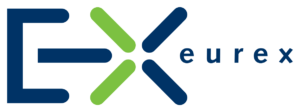

## Table of Contents

## What is the Eurex Exchange?

Eurex Exchange is a place where people and businesses can buy and sell financial products called derivatives. These derivatives include things like futures and options, which are contracts that help people manage risks or bet on the future price of something, like stocks or interest rates. Eurex is one of the biggest exchanges for these kinds of products in Europe, and it's owned by Deutsche Börse, a big company in Germany.

People use Eurex to trade these financial products because it's a safe and reliable place. The exchange makes sure that all trades are fair and that everyone follows the rules. This helps keep the market stable and trustworthy. Eurex also offers technology and services to help traders do their jobs better, like fast trading systems and data tools.

## Where is the Eurex Exchange located?

The Eurex Exchange is mainly located in Germany. Its main office is in Eschborn, which is a town near Frankfurt. Frankfurt is a big city known for its finance and business activities, so it makes sense for Eurex to be close to it.

Eurex also has other offices in different places around the world. This helps them serve customers in different countries better. But the main place where all the important work happens is in Eschborn, Germany.

## What types of financial products are traded on the Eurex Exchange?

Eurex Exchange is a place where people trade different kinds of financial products called derivatives. The main types of derivatives they trade are futures and options. Futures are contracts where people agree to buy or sell something at a set price on a future date. This can be things like stocks, interest rates, or even commodities like oil. Options are similar, but they give the buyer the right, but not the obligation, to buy or sell something at a set price before a certain date.

These financial products are used by people and businesses to manage risks or to make bets on what prices will do in the future. For example, a farmer might use futures to lock in a price for their crops before they are harvested. Or an investor might use options to protect their stock investments from going down in value. Eurex offers a wide variety of these products, covering many different markets and helping traders from all over the world.

## How does one become a member of the Eurex Exchange?

To become a member of the Eurex Exchange, you need to go through a few steps. First, you have to meet certain requirements set by Eurex. These include having enough money and experience in trading. You also need to fill out an application form and submit it to Eurex. They will review your application to make sure you meet all their rules.

Once your application is approved, you will need to pay a membership fee. After that, you can start trading on the exchange. Eurex offers different types of memberships depending on what you want to do. For example, some memberships let you trade for yourself, while others let you trade for other people or companies. It's important to choose the right type of membership for your needs.

## What are the trading hours of the Eurex Exchange?

The Eurex Exchange has different trading hours depending on what you want to trade. For most products like futures and options on stocks, indexes, and interest rates, the main trading hours are from 8:00 AM to 10:00 PM Central European Time (CET). This is when most of the trading happens and when the market is most active.

There are also some products that have extended trading hours. For example, some index futures can be traded almost around the clock, from 8:00 PM to 10:00 PM CET the next day. This means that traders can buy and sell these products at any time, even outside the normal trading hours.

## What is the role of Eurex Clearing in the Eurex Exchange?

Eurex Clearing is a very important part of the Eurex Exchange. It acts like a middleman between people who want to buy and sell financial products. When someone wants to trade, Eurex Clearing makes sure that the trade happens safely and that both sides follow the rules. This helps to make sure that everyone trusts the market and feels safe trading there.

Eurex Clearing also manages the risks that come with trading. It keeps track of how much money everyone has and makes sure they can pay for their trades. If someone can't pay, Eurex Clearing steps in to make sure the other side still gets their money. This is important because it keeps the market stable and prevents big problems from happening.

## How does the Eurex Exchange ensure market integrity and transparency?

The Eurex Exchange works hard to keep the market fair and open for everyone. They do this by making sure all trades are done in a clear way. Every trade is recorded and shown to everyone, so no one can hide what they are doing. This helps to stop people from cheating or doing things that are not allowed. Eurex also has rules that everyone must follow, and they watch the market closely to make sure no one breaks these rules.

Another way Eurex keeps the market honest is by using technology to check for any strange trading patterns. If they see something that looks wrong, they can stop it before it causes problems. They also have a team of people who make sure all the information about prices and trades is correct and easy to understand. This way, everyone can make good choices about buying and selling. By doing all these things, Eurex helps to keep the market safe and trustworthy for everyone who uses it.

## What are the technological platforms used by the Eurex Exchange?

The Eurex Exchange uses a main platform called T7 for trading. T7 is a very fast and reliable system that helps people buy and sell financial products quickly and easily. It can handle a lot of trades at the same time, which is important because the market can be very busy. T7 also has tools that help traders see what is happening in the market and make smart choices about their trades.

Another important platform is the Eurex Clearing system, which works with T7 to make sure all trades are safe and fair. This system keeps track of all the money involved in trading and makes sure everyone follows the rules. It also uses technology to check for any problems or strange activities in the market, helping to keep everything running smoothly. Together, T7 and the Eurex Clearing system make the Eurex Exchange a trusted place for trading.

## How does the Eurex Exchange handle risk management?

The Eurex Exchange takes care of risk management by using a system called Eurex Clearing. This system acts like a middle person between buyers and sellers, making sure that both sides follow the rules and can pay for their trades. If someone can't pay, Eurex Clearing steps in to make sure the other side still gets their money. This helps keep the market stable and safe for everyone.

Eurex also watches the market closely to spot any strange trading patterns that might cause problems. They use technology to check for these issues and can stop them before they get out of hand. By keeping an eye on everything and making sure everyone follows the rules, Eurex helps to manage risks and keep the market trustworthy.

## What are some of the major indices or benchmarks associated with the Eurex Exchange?

The Eurex Exchange is known for trading futures and options on several major indices and benchmarks. One of the most important is the DAX, which is the main stock market index in Germany. It shows how well the biggest companies in Germany are doing. Another key index is the EURO STOXX 50, which tracks the performance of the 50 largest companies in the Eurozone. These indices help traders and investors understand how the market is doing and make decisions about buying and selling.

Eurex also trades products based on other important benchmarks like the MSCI indices. These indices cover a wide range of markets around the world, helping traders get a global view of how different economies are performing. By offering futures and options on these well-known indices, Eurex makes it easier for people to manage their investments and protect against risks in the market.

## How has the Eurex Exchange evolved since its inception?

The Eurex Exchange started back in 1998 when two big German companies, Deutsche Terminbörse (DTB) and Schweizer Börse (SOFFEX), joined together. At first, it was all about trading futures and options on German government bonds and the DAX index. Over time, Eurex grew bigger and started offering more products. They added futures and options on other important indices like the EURO STOXX 50 and even started trading things like commodities and interest rates. This helped Eurex become one of the biggest and most important exchanges in Europe.

As technology got better, Eurex changed too. They introduced a new trading platform called T7 in 2013, which made trading faster and easier. Eurex also started focusing more on risk management and made their clearing system, Eurex Clearing, even stronger. This helped keep the market safe and trustworthy. Today, Eurex keeps growing by adding new products and improving their services, always trying to meet the needs of traders and investors around the world.

## What are the future strategic plans for the Eurex Exchange?

The Eurex Exchange is always looking to grow and improve. One of their big plans is to keep adding new products that people want to trade. This could mean more futures and options on different things like stocks, interest rates, and even new types of financial products. They want to make sure they have something for everyone, no matter where they are from or what they are interested in trading. By doing this, Eurex hopes to attract more traders and stay a leader in the market.

Another important part of their strategy is to keep using technology to make trading easier and safer. They are always working on their trading platform, T7, to make it faster and more reliable. They also want to keep improving their risk management tools, like Eurex Clearing, to make sure the market stays stable and trustworthy. By focusing on these areas, Eurex aims to keep up with changes in the world of finance and continue to be a place where people feel confident to trade.

## References & Further Reading

[1]: Meijerink, G., & Hendrikse, G. (2022). "Regulating Algorithmic Trading: Insights from a European Perspective." Journal of Financial Regulation and Compliance, 30(2), 133-147.

[2]: Hautsch, N. (2012). ["Econometrics of Financial High-Frequency Data."](https://link.springer.com/book/10.1007/978-3-642-21925-2) Springer.

[3]: Chlistalla, M. (2011). "High-Frequency Trading: Better than its Reputation?" Deutsche Bank Research. 

[4]: Lopez de Prado, M. (2018). ["Advances in Financial Machine Learning."](https://www.amazon.com/Advances-Financial-Machine-Learning-Marcos/dp/1119482089) John Wiley & Sons.

[5]: MacKenzie, D. (2018). "Material Signals: A Historical Sociology of High-Frequency Trading." American Journal of Sociology, 123(4), 1141-1179.

[6]: ESMA. (2023). ["Sustainable Finance and ESG Derivatives."](https://www.esma.europa.eu/esmas-activities/sustainable-finance) European Securities and Markets Authority.

[7]: Hull, J. C. (2017). ["Options, Futures, and Other Derivatives."](https://www.semanticscholar.org/paper/Options%2C-Futures%2C-and-Other-Derivatives-Hull/89bdee500c8623864fc9eb7a471546aa713acc44) 9th Edition, Pearson. 

[8]: BlackRock Investment Institute. (2018). "Sustainable Investing: A 'Why Not' Moment." BlackRock Report.

[9]: ESMA. (2020). ["MiFID II/MiFIR Review Report on Algorithmic Trading."](https://www.esma.europa.eu/sites/default/files/library/esma70-156-4572_mifid_ii_final_report_on_algorithmic_trading.pdf) European Securities and Markets Authority.

[10]: Chlistalla, M. (2011). "High-Frequency Trading: Better than its Reputation?" Deutsche Bank Research.