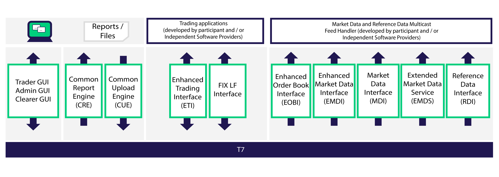

## Table of Contents

## What is Eurex?

Eurex is a company that helps people buy and sell things like stocks and bonds. It's like a big marketplace where people from all over the world can trade these items easily. Eurex makes sure that all the trades are done fairly and safely.

Eurex is also known for trading futures and options. These are special kinds of contracts that people use to bet on what might happen in the future with prices of things like wheat or oil. By using Eurex, people can try to make money by guessing if prices will go up or down.

## When was Eurex founded?

Eurex was founded in 1998. It started when two big companies, the German Deutsche Terminbörse (DTB) and the Swiss SOFFEX, decided to join together. They wanted to make a bigger and better place for people to trade futures and options.

Since then, Eurex has grown a lot. It has become one of the biggest places in the world for trading these kinds of contracts. People from many different countries use Eurex to buy and sell things, making it an important part of the global market.

## What types of products are traded on Eurex?

Eurex is a big marketplace where people trade different kinds of products. One main type of product they trade is futures. Futures are agreements to buy or sell something at a set price in the future. This could be things like wheat, oil, or even money from different countries. People use futures to guess if the price of these things will go up or down, and they can make money if they guess right.

Another type of product traded on Eurex is options. Options give people the right, but not the obligation, to buy or sell something at a certain price before a certain date. They are a bit like futures, but they give more flexibility. People use options to protect themselves from big price changes or to try to make money if they think the price will move in a certain way.

Eurex also trades other financial products like bonds and stocks. Bonds are like loans that people give to companies or governments, and stocks are pieces of ownership in a company. Trading these on Eurex helps people from all over the world to invest and manage their money more easily.

## Who are the main participants in Eurex?

The main participants in Eurex are traders and investors from all over the world. These people can be working for big banks, investment firms, or even trading on their own. They come to Eurex to buy and sell futures, options, bonds, and stocks. The traders and investors use Eurex because it's a safe and fair place to do their trading. They can trust that their trades will be done correctly and that they will be treated fairly.

Another important group of participants in Eurex are the clearing members. These are special companies that help make sure all the trades go smoothly. When someone buys or sells something on Eurex, the clearing members make sure that the money and the products change hands correctly. They also help manage any risks that might come up during trading. This makes Eurex a reliable place for everyone involved.

## How does trading on Eurex work?

Trading on Eurex is like going to a big market where you can buy and sell things like futures, options, bonds, and stocks. When you want to trade, you use a computer system that connects you to other traders from all around the world. You can see what prices people are offering to buy or sell at, and you can decide if you want to make a trade. If you agree on a price with someone else, the trade happens right away, and it's recorded by Eurex.

After you make a trade, Eurex's clearing members step in to make sure everything goes smoothly. They check that the money and the products change hands correctly. This means if you bought something, you get it, and if you sold something, you get the money. The clearing members also help manage any risks that might come up, so everyone feels safe trading on Eurex. This system makes sure that trading is fair and reliable for all participants.

## What is the history of Eurex's development?

Eurex started in 1998 when two big companies, the German Deutsche Terminbörse (DTB) and the Swiss SOFFEX, decided to join together. They wanted to make a bigger and better place for people to trade futures and options. Before Eurex, these two companies were already important in their own countries, but by coming together, they could reach more people and offer more products. This merger helped Eurex grow quickly and become a leader in the world of trading.

Since it began, Eurex has grown a lot. It has become one of the biggest places in the world for trading futures and options. Eurex kept adding new products and services to meet the needs of traders and investors from all over the world. They made sure their trading system was fast and reliable, which helped more people trust and use Eurex. Today, Eurex is still growing and changing to keep up with what people need in the global market.

## What are the key technological features of Eurex's trading platform?

Eurex's trading platform is known for being fast and reliable. It uses advanced technology to make sure that trades happen quickly and correctly. Traders can see what prices people are offering to buy or sell at in real-time, which helps them make quick decisions. The platform is also designed to handle a lot of trades at the same time without slowing down, which is important because many people from around the world use Eurex every day.

Another key feature of Eurex's platform is its strong security. It uses special systems to keep all the trading information safe and to make sure that no one can cheat or mess with the trades. This makes traders feel confident that their trades are protected. Eurex also has a system that helps manage any risks that might come up during trading, which adds another layer of safety for everyone involved.

## How has Eurex evolved its trading technology over the years?

Eurex has changed a lot over the years to make trading easier and safer for everyone. When it started in 1998, Eurex used computers to help people trade faster than before. As more people started using Eurex, they made their system even better. They added new ways for traders to see prices and make trades quickly. Eurex also worked on making sure their platform could handle lots of trades at the same time without any problems. This was important because Eurex wanted to be a place where people from all over the world could trade without waiting.

Over time, Eurex focused a lot on keeping the trading platform safe. They added special security systems to protect all the trading information and to stop anyone from cheating. Eurex also made their system smarter at managing risks, which means they could help traders avoid big problems. By always improving their technology, Eurex made sure that people could trust their platform and keep coming back to trade. This helped Eurex grow and become one of the biggest places for trading futures and options in the world.

## What are the benefits of using Eurex for trading?

Using Eurex for trading has many benefits. One big advantage is that it's a safe and fair place to trade. Eurex uses special systems to protect all the trading information and make sure no one can cheat. This means that traders can trust that their trades will be done correctly and that they will be treated fairly. Another benefit is that Eurex is a big marketplace where people from all over the world come to trade. This means there are always lots of people buying and selling, so you can usually find someone to trade with.

Eurex also makes trading easier and faster. Their platform uses advanced technology to show prices in real-time and to handle lots of trades quickly. This helps traders make quick decisions and get their trades done without waiting. Plus, Eurex keeps adding new products and services to meet the needs of traders and investors. This means there are always new opportunities to make money and manage risks. By using Eurex, traders can feel confident and have a better chance of doing well in the market.

## How does Eurex ensure market integrity and transparency?

Eurex works hard to make sure the market is fair and open for everyone. They use special systems to watch over all the trading that happens on their platform. These systems can spot if someone is trying to cheat or do something wrong. If they find any problems, Eurex steps in quickly to fix them. This helps keep the market honest and makes sure that all traders are playing by the rules.

Another way Eurex ensures transparency is by showing all the prices and trades in real-time. Everyone can see what is being bought and sold, and at what prices. This openness helps traders make better decisions because they have all the information they need. By keeping the market clear and easy to understand, Eurex builds trust with traders and makes sure that everyone has a fair chance to succeed.

## What are some advanced trading strategies that can be implemented on Eurex?

One advanced trading strategy that can be used on Eurex is called "spread trading." This is when a trader buys one futures contract and sells another one at the same time. The idea is to make money from the difference in prices between the two contracts. For example, if you think the price of wheat will go up more than the price of corn, you could buy a wheat futures contract and sell a corn futures contract. This strategy can help traders manage risk because they are betting on the difference in prices rather than the direction of one price.

Another strategy is "options strategies," which can be more complex but also offer more ways to make money. One common options strategy is called a "straddle," where a trader buys both a call option and a put option on the same product with the same expiration date. This strategy can make money if the price of the product moves a lot in either direction. Traders use this when they think the price will change a lot but are not sure which way it will go. By using Eurex's advanced trading platform, traders can easily set up and manage these kinds of strategies.

## How does Eurex compare to other major derivatives exchanges globally?

Eurex is one of the biggest derivatives exchanges in the world, and it stands out because it's really good at trading futures and options. It started in 1998 when two big companies from Germany and Switzerland joined together. This helped Eurex grow quickly and become a leader in the market. Eurex is known for its fast and reliable trading platform, which lets traders from all over the world buy and sell things like wheat, oil, and stocks easily. They also have strong security systems to keep trading safe and fair for everyone.

Compared to other major derivatives exchanges like the Chicago Mercantile Exchange (CME) and the Intercontinental Exchange (ICE), Eurex has some unique features. For example, Eurex is very strong in trading European financial products, like Eurozone [interest rate](/wiki/interest-rate-trading-strategies) futures and options. This makes it a go-to place for traders who want to focus on these markets. While CME and ICE are bigger in the U.S. and have a wider range of products, Eurex's focus on European products and its advanced technology make it a top choice for many traders around the world.

## References & Further Reading

[1]: Deutsche Börse Group. (n.d.). ["Eurex"](https://en.wikipedia.org/wiki/Eurex_Exchange) - Official website. 

[2]: Börse, D. (2018). ["European Energy Exchange: Infrastructure for trading primary energy, environmental and commodity markets"](https://www.eex.com/en/markets/environmentals).

[3]: Preu, H. (1998). ["Electronic Trading and the Transformation of Derivatives Markets: The Case of the Eurex."](https://www.researchgate.net/publication/383875898_Analyzing_the_Impact_of_Electronic_Trading_on_Global_Economies_and_Its_Influence_on_the_Monetary_System_Future_Recommendations_and_Studies) The Journal of Risk Finance.

[4]: Döring, T. (2004). ["Eurex: A Space of Technological Evolution in Financial Markets."](https://www.marketswiki.com/wiki/Eurex) Derivatives Quarterly.

[5]: Deutsche Börse. (2012). ["T7 Trading Platform"](https://www.deutsche-boerse.com/dbg-en/markets-services/ps-technology/ps-7-market-technology/ps-t7) - Official documentation.

[6]: Lewis, B. (2016). ["The Evolution of Algorithmic Trading"](https://www.sciencedirect.com/science/article/pii/S0040162524005444) - Insights and overview of technologie impacts.

[7]: Eurex. (2012). ["Eurex Reaches New Milestone with Implementation of T7"](https://www.eurex.com/ex-en/support/information-channels/implementation-news), Mondo Visione.