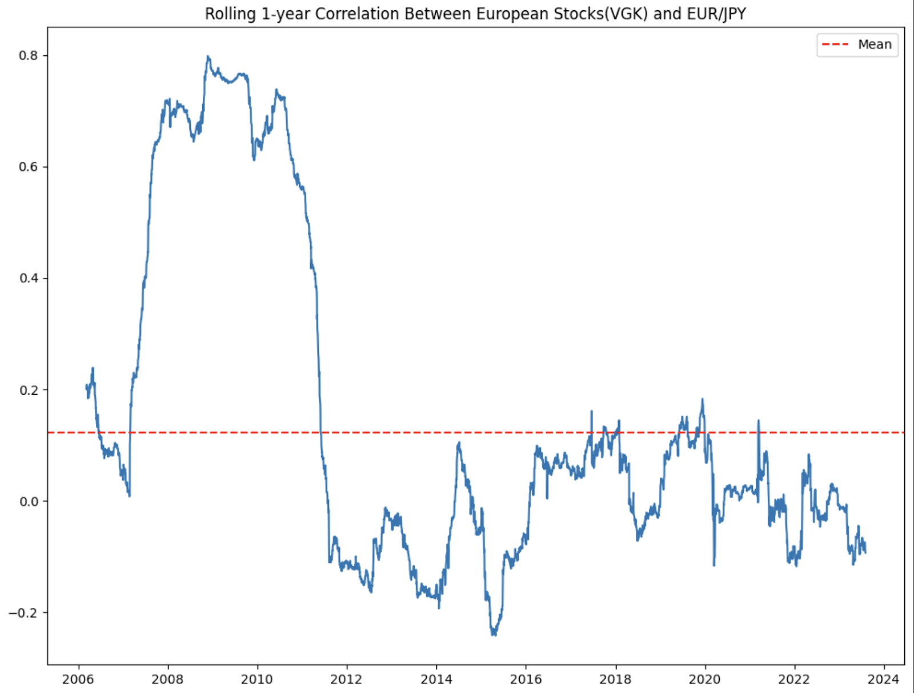

The EUR/JPY currency pair, which represents the trading relationship between the euro and the Japanese yen, stands as a prominent choice for traders within the forex market. This pair's popularity is rooted in the economic strength of both the European Union and Japan, making it an attractive subject for various trading strategies, including algorithmic approaches. Algorithmic trading, characterized by the use of computer algorithms to execute trades at high speeds and frequencies, has emerged as a crucial component in modern financial markets. It provides traders with a systematic methodology to engage with forex pairs like the EUR/JPY, offering a way to systematically exploit market inefficiencies.

A critical aspect of successful algorithmic trading is understanding the correlation of the EUR/JPY pair with other market factors, including other currency pairs and economic indicators. Correlation measures how different financial instruments move in relation to each other, a concept particularly important in the forex market where global economic and geopolitical events can cause significant fluctuations. Traders harness this information to develop strategies that are not only robust but also capable of adapting to varying market conditions.



This article explores the correlation of the EUR/JPY currency pair, highlighting how algorithmic traders can integrate these insights to optimize their trading strategies. By leveraging correlation analysis, traders can better anticipate market movements, implement risk management techniques, and improve their overall trading performance. Understanding these correlations is essential for building more resilient algorithmic trading strategies that stand the test of volatile market environments.

## Table of Contents

## Understanding EUR/JPY Correlation

Correlation in forex trading is a statistical measure that quantifies the degree to which two currency pairs move in relation to each other. This measure, often expressed as a correlation coefficient ranging from -1 to 1, helps traders understand whether the currency pairs tend to move in the same direction, opposite directions, or are largely independent of each other.

The EUR/JPY currency pair frequently exhibits correlations with other major currency pairs, particularly USD/JPY. This correlation arises due to various shared economic and geopolitical influences. For instance, both EUR/JPY and USD/JPY are affected by the monetary policies of the Bank of Japan, which can lead to synchronized movements. Additionally, macroeconomic events impacting the Eurozone or the United States can also influence their interactions with the Japanese yen, further affecting these correlations.

Understanding such correlations is vital for traders as it impacts strategy development, risk management, and portfolio diversification. For instance, if EUR/JPY and USD/JPY have a strong positive correlation, a trader betting on the euro strengthening against the yen might also expect the dollar to strengthen against the yen. This insight can guide traders in making informed decisions and managing risk efficiently.

In [quantitative trading](/wiki/quantitative-trading) and portfolio management, correlation matrices are often used to represent these relationships. A sample Python snippet to calculate and visualize currency pair correlations might look like the following:

```python
import pandas as pd
import numpy as np
import matplotlib.pyplot as plt
import seaborn as sns

# Sample data: Closing prices for currency pairs
data = pd.DataFrame({
    'EUR/JPY': [...],  # Replace with closing prices
    'USD/JPY': [...],
    # Add other pairs as needed
})

# Calculating the percentage changes
returns = data.pct_change().dropna()

# Calculating correlation matrix
correlation_matrix = returns.corr()

# Plotting the correlation matrix
sns.heatmap(correlation_matrix, annot=True, cmap='coolwarm')
plt.title('Currency Pair Correlation Matrix')
plt.show()
```

This code helps traders visualize and understand complex relationships between multiple currency pairs, allowing for more sophisticated and well-informed trading strategies. Recognizing and responding to these correlations effectively can aid traders in optimizing their currency portfolios, minimizing risks, and enhancing overall profitability in the dynamic [forex](/wiki/forex-system) market.

## Importance of Correlation in Algo Trading

Algorithmic traders extensively utilize correlation metrics to identify patterns and relationships among currency pairs. This practice is particularly significant when dealing with the EUR/JPY currency pair, as it allows traders to develop strategies that capitalize on anticipated price movements. By understanding the correlations, algorithmic traders can determine how changes in one currency pair might affect others, thereby facilitating more informed trading decisions.

Correlation analysis is pivotal in risk mitigation by identifying diversification opportunities. When two currency pairs exhibit a positive correlation, they tend to move in the same direction. Conversely, a negative correlation implies that the pairs move in opposite directions. For example, if EUR/JPY and another currency pair display a strong positive correlation, a trader might expect similar directional movements, allowing for strategic adjustments in position sizing or hedging.

Traders often calculate the correlation coefficient, usually denoted as $\rho$, to quantify the strength and direction of the relationship between the returns of two currency pairs. The correlation coefficient ranges between -1 and 1, where:

- $\rho = 1$ indicates a perfect positive correlation.
- $\rho = -1$ indicates a perfect negative correlation.
- $\rho = 0$ implies no correlation.

In Python, the calculation of the correlation coefficient can be executed using libraries such as NumPy or Pandas. Here’s a simple example using Pandas:

```python
import pandas as pd

# Sample data: Assume df contains historical data of EUR/JPY and another pair
df = pd.DataFrame({
    'eur_jpy': [129.53, 129.93, 130.20, 130.75, 130.65],
    'other_pair': [1.18, 1.19, 1.20, 1.22, 1.21]
})

# Calculate the correlation between EUR/JPY and another currency pair
correlation = df['eur_jpy'].corr(df['other_pair'])
print(f'Correlation: {correlation}')
```

The strategic advantage of correlation analysis is its ability to minimize adverse price impacts by optimizing portfolio diversification. In a well-diversified portfolio, the negative movements in some assets can be counterbalanced by positive movements in others, thereby reducing overall risk.

By integrating correlation analysis into their [algorithmic trading](/wiki/algorithmic-trading) strategies, traders can anticipate potential price changes and make decisions that enhance the robustness and profitability of their trades. This method not only aids in risk reduction but also improves the opportunity for achieving higher returns in the dynamic forex market.

## Analyzing EUR/JPY Correlation with USD/JPY

The correlation between EUR/JPY and USD/JPY is primarily influenced by their mutual interaction with the Japanese yen. This correlation can be instrumental for traders interested in developing algorithmic trading strategies, as understanding the connection between these two currency pairs enables effective trade setups and hedging strategies.

### Mathematical Representation of Correlation

In quantitative trading, correlation ($\rho$) is often calculated using the Pearson correlation coefficient. For two currency pairs, $X$ and $Y$, this is given by:

$$
\rho_{X,Y} = \frac{\text{cov}(X, Y)}{\sigma_X \sigma_Y}
$$

where $\text{cov}(X, Y)$ is the covariance between the currency pair returns, and $\sigma_X$ and $\sigma_Y$ are the standard deviations of their returns. A positive correlation indicates that as one pair appreciates, the other tends to appreciate as well, and vice versa.

### Practical Insights for Traders

1. **Trade Setups:**
   EUR/JPY and USD/JPY often move similarly due to influences such as Japanese economic policies or global risk sentiment, which affect the yen. Observing a strong movement in USD/JPY, for instance, might signal an impending move in EUR/JPY, allowing traders to anticipate and prepare their positions accordingly.

2. **Hedging Strategies:**
   By exploiting the correlation, traders can hedge their positions more effectively. For example, if a trader holds a long position in EUR/JPY and expects an adverse yen movement, they might mitigate risk by taking an opposite position in USD/JPY if both pairs historically move together.

### Implementing Correlation Analysis in Python

Traders can use Python to calculate and visualize the correlation between these currency pairs. A basic implementation could employ libraries such as NumPy and Pandas for numerical operations and data handling:

```python
import pandas as pd
import numpy as np

# Sample data: historical price data for EUR/JPY and USD/JPY
data = pd.read_csv('historical_fx_data.csv')

# Calculate daily returns
data['EURJPY_return'] = data['EURJPY'].pct_change()
data['USDJPY_return'] = data['USDJPY'].pct_change()

# Calculate correlation
correlation = data['EURJPY_return'].corr(data['USDJPY_return'])
print(f"Correlation between EUR/JPY and USD/JPY: {correlation:.2f}")
```

This approach can help traders dynamically assess their strategy's viability in response to fluctuations in market conditions influenced by the yen, reinforcing both speculative and hedging decisions.

By leveraging the correlation insights between EUR/JPY and USD/JPY, traders can predict potential movements more accurately, enhancing their algorithmic strategies in the forex market.

## Incorporating Technical Analysis in EUR/JPY Algo Strategies

Technical analysis is essential for the development of algorithmic trading strategies concerning the EUR/JPY pair. Traders utilize various technical indicators to identify optimal entry and [exit](/wiki/exit-strategy) points, thereby maximizing profitability and minimizing risks.

One commonly used indicator is the moving average, which helps traders discern market trends by smoothing price data. The formula for a simple moving average (SMA) over a period $n$ is:

$$
\text{SMA} = \frac{P_1 + P_2 + \ldots + P_n}{n}
$$

where $P_1, P_2, \ldots, P_n$ are the closing prices over $n$ periods. Moving averages can be incorporated into algorithmic strategies to filter out market noise and provide objective trading signals.

The Relative Strength Index (RSI) is another popular tool. It quantifies the [momentum](/wiki/momentum) of price changes to identify overbought or oversold conditions. The RSI is calculated as follows:

$$
\text{RSI} = 100 - \frac{100}{1 + \text{RS}}
$$

where RS is the ratio of average gains to average losses over a defined period. An RSI above 70 may indicate an overbought market, while below 30 suggests an oversold condition. Algorithmic traders may program their systems to execute trades based on these thresholds.

Fibonacci retracements are used to identify potential support and resistance levels, based on the Fibonacci sequence. Traders apply these retracement levels to predict price corrections or reversals. The key levels often used are 23.6%, 38.2%, 50%, and 61.8%. Integration of these levels into algorithmic strategies can improve decision-making by anticipating critical price zones where the market might react.

The effectiveness of EUR/JPY algorithmic strategies can be further enhanced by combining technical analysis with correlation analysis. Correlation analysis provides insights into how EUR/JPY might behave in relation to other pairs, especially those involving shared currencies. For instance, if EUR/JPY displays a strong correlation with USD/JPY, an unexpected movement in USD/JPY could trigger adjustments in EUR/JPY strategy execution.

Python is a preferred tool for implementing these strategies given its numerous libraries for quantitative analysis. For instance, the `pandas` library can compute moving averages, while `numpy` and `scipy` can assist with more complex calculations like RSI. Combining these technical indicators with correlation data can yield robust trading algorithms, as illustrated in the following Python snippet:

```python
import pandas as pd

# Load historical price data
data = pd.read_csv('eur_jpy_data.csv')
data['SMA'] = data['Close'].rolling(window=20).mean()

# RSI calculation
delta = data['Close'].diff()
gain = (delta.where(delta > 0, 0)).rolling(window=14).mean()
loss = (-delta.where(delta < 0, 0)).rolling(window=14).mean()
rs = gain / loss
data['RSI'] = 100 - (100 / (1 + rs))

# Decision rule example based on RSI
def generate_signal(row):
    if row['RSI'] > 70:
        return 'Sell'
    elif row['RSI'] < 30:
        return 'Buy'
    return 'Hold'

data['Signal'] = data.apply(generate_signal, axis=1)

# Check the signals
print(data[['Date', 'Close', 'SMA', 'RSI', 'Signal']])
```

Integrating such indicators with correlation data refines strategy responses to market changes, enhancing traders' readiness to capitalize on EUR/JPY movements while mitigating associated risks.

## Challenges and Considerations

Overreliance on correlation indicators can sometimes lead to ineffective trading strategies, particularly in highly volatile market conditions where traditional correlations may break down. Volatility can cause fluctuations that are not captured by historical correlation data, leading to unexpected losses. Traders should be cautious of blindly following correlation patterns without considering the broader market context, as outliers and sudden market shifts can occur.

To address this, regular [backtesting](/wiki/backtesting) of strategies is essential. Backtesting involves applying trading strategies to historical data to evaluate their effectiveness. This process helps traders adjust their strategies based on past performance and prepare for similar future market conditions. Backtesting can be implemented in Python using libraries such as pandas for data manipulation, and [backtrader](/wiki/backtrader) or zipline for strategy testing. Here is a simple example of a backtesting framework using Python:

```python
import backtrader as bt

class MyStrategy(bt.Strategy):
    def __init__(self):
        self.sma = bt.indicators.SimpleMovingAverage(self.data.close, period=15)

    def next(self):
        if self.data.close[0] > self.sma[0]:
            self.buy(size=1)
        elif self.data.close[0] < self.sma[0]:
            self.sell(size=1)

cerebro = bt.Cerebro()
data = bt.feeds.YahooFinanceData(dataname='EURJPY=X', fromdate=datetime(2020, 1, 1),
                                 todate=datetime(2021, 1, 1))
cerebro.adddata(data)
cerebro.addstrategy(MyStrategy)
cerebro.run()
```

In addition to backtesting, effective risk management is paramount. This includes implementing position sizing strategies and setting stop-loss orders to limit potential losses. Position sizing involves determining the amount of capital to invest in a particular trade, which helps in managing exposure and mitigating risk. Stop-loss orders automatically sell a security when its price falls to a certain level, preventing further losses in adverse market conditions.

Effective risk management and regular strategy evaluations help traders remain agile and responsive to market changes, minimizing the potential impact of adverse correlations and enhancing the overall robustness of their trading strategies.

## Conclusion

Understanding and leveraging EUR/JPY correlations can equip algorithmic traders with a significant advantage in the forex market. By integrating correlation analysis into trading strategies, traders can optimize their decision-making processes, enabling them to anticipate potential price movements more accurately. For example, correlational insights might indicate that a rise in the USD/JPY pair could similarly affect the EUR/JPY pair, allowing traders to position themselves strategically.

Algorithmic trading thrives on adapting to market fluctuations. Therefore, continuously monitoring market conditions and revising strategies accordingly is fundamental. Backtesting forms a core component of strategy refinement, offering a historical perspective on strategy performance and revealing potential weaknesses. By applying robust backtesting methodologies, traders can ensure their algorithms remain effective amidst evolving market dynamics.

Risk management is another critical aspect, with the implementation of techniques such as position sizing and stop-loss orders to mitigate potential losses due to adverse correlations. This systematic approach reduces exposure and enhances portfolio resilience, facilitating longer-term success.

Incorporating these practices allows traders to not only capitalize on opportunities presented by EUR/JPY correlations but also sustain profitability through disciplined and informed trading practices.

## References & Further Reading

[1]: Bergstra, J., Bardenet, R., Bengio, Y., & Kégl, B. (2011). ["Algorithms for Hyper-Parameter Optimization."](https://papers.nips.cc/paper/4443-algorithms-for-hyper-parameter-optimization) Advances in Neural Information Processing Systems 24.

[2]: ["Advances in Financial Machine Learning"](https://books.google.com/books/about/Advances_in_Financial_Machine_Learning.html?id=oU9KDwAAQBAJ) by Marcos Lopez de Prado

[3]: ["Evidence-Based Technical Analysis: Applying the Scientific Method and Statistical Inference to Trading Signals"](https://www.amazon.com/Evidence-Based-Technical-Analysis-Scientific-Statistical/dp/0470008741) by David Aronson

[4]: ["Machine Learning for Algorithmic Trading"](https://github.com/stefan-jansen/machine-learning-for-trading) by Stefan Jansen

[5]: ["Quantitative Trading: How to Build Your Own Algorithmic Trading Business"](https://books.google.com/books/about/Quantitative_Trading.html?id=j70yEAAAQBAJ) by Ernest P. Chan