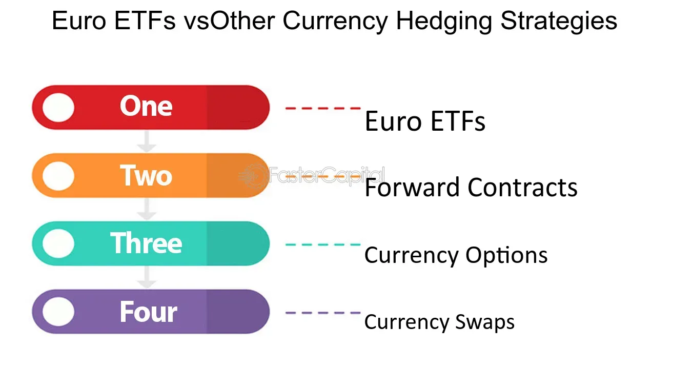

## Table of Contents

## What is a Euro Exchange-Traded Fund (ETF)?

A Euro Exchange-Traded Fund (ETF) is a type of investment fund that is traded on stock exchanges and tracks the performance of the Euro, which is the currency used by many countries in Europe. When you buy shares of a Euro ETF, you're essentially investing in the Euro's value relative to other currencies. This can be a way to gain exposure to the Euro without having to directly buy and sell the currency itself.

Euro ETFs can be useful for investors who want to diversify their portfolios or hedge against currency fluctuations. For example, if an investor believes the Euro will strengthen against the US dollar, they might buy shares in a Euro ETF to potentially profit from this movement. These funds are managed by professionals who aim to closely match the performance of the Euro, making it easier for individual investors to participate in currency markets.

## How does a Euro ETF work?

A Euro ETF works by tracking the value of the Euro compared to other currencies. When you buy shares in a Euro ETF, you're investing in a fund that holds Euros or assets that are priced in Euros. The value of your investment goes up or down based on how the Euro performs against other currencies like the US dollar. If the Euro gets stronger, the value of your ETF shares usually goes up. If the Euro gets weaker, the value of your shares usually goes down.

The Euro [ETF](/wiki/etf-trading-strategies) is managed by professionals who make sure the fund closely follows the Euro's performance. They do this by buying and selling Euros or Euro-related assets to keep the ETF's value in line with the Euro's value. This makes it easier for you to invest in the Euro without having to trade the currency yourself. You can buy and sell shares of the ETF on a stock exchange, just like you would with stocks. This gives you a simple way to gain exposure to the Euro and potentially profit from its movements.

## What are the benefits of investing in a Euro ETF?

Investing in a Euro ETF can be a good way to spread out your money. If you have most of your money in one currency, like the US dollar, a Euro ETF can help you have some money in Euros too. This can be helpful if the Euro gets stronger while the dollar gets weaker. By having money in different currencies, you can protect yourself from big changes in any one currency's value.

Another benefit is that Euro ETFs are easy to buy and sell. You can trade them on a stock exchange just like stocks. This means you don't have to deal with the complicated stuff of buying and selling currencies directly. The people who manage the ETF take care of that for you. They make sure the ETF follows the Euro's value closely, so you can focus on deciding when to buy or sell based on what you think will happen with the Euro.

## What are the risks associated with Euro ETFs?

Investing in a Euro ETF comes with some risks. One big risk is that the value of the Euro can go up and down a lot compared to other currencies. If the Euro loses value, the price of your ETF shares will go down too. This means you could lose money if you need to sell your shares when the Euro is weak. Also, if the countries that use the Euro have economic problems, it could make the Euro weaker and hurt your investment.

Another risk is that ETFs have fees. You have to pay a small amount of money to the people who manage the ETF. These fees can add up over time and might make your investment worth less than if you didn't have to pay them. Also, trading ETFs on the stock market means you might not always get the exact price you want. Sometimes the price can be a bit different from what you expect, which is called a tracking error. This can affect how much money you make or lose from your investment.

## How can one start investing in a Euro ETF?

To start investing in a Euro ETF, you first need to open a brokerage account. This is like a special bank account where you can buy and sell investments like ETFs. You can choose from many different brokers, so pick one that has low fees and a good reputation. Once your account is set up, you'll need to add money to it. This money is what you'll use to buy the Euro ETF shares.

After your account is funded, you can search for a Euro ETF on your broker's website or app. Look for ETFs that track the Euro's value against other currencies. Once you find one you like, you can place an order to buy shares. Decide how many shares you want to buy and at what price, then submit your order. After that, you'll own part of the Euro ETF and can watch its value go up or down based on the Euro's performance.

## What are the key factors to consider when choosing a Euro ETF?

When choosing a Euro ETF, you should first look at how well it follows the Euro's value. Some ETFs do this better than others. Check the fund's past performance and see how closely it matches the Euro's ups and downs. Also, think about the fees. ETFs charge a small amount of money to manage your investment, and these fees can eat into your returns over time. Pick an ETF with low fees to keep more of your money.

Another important thing to consider is the size of the ETF. Bigger ETFs usually have more money invested in them, which can make them more stable and easier to buy and sell. Also, look at how long the ETF has been around. Older ETFs have a longer track record, which can give you more confidence in how they might perform in the future. By thinking about these factors, you can pick a Euro ETF that fits your investment goals and helps you manage your risks.

## How do Euro ETFs compare to other investment options like mutual funds or stocks?

Euro ETFs are different from mutual funds and stocks in a few key ways. First, Euro ETFs are traded on stock exchanges like stocks, which means you can buy and sell them throughout the day at market prices. This is different from mutual funds, which you can only buy or sell at the end of the trading day at their net asset value. Also, Euro ETFs aim to track the value of the Euro against other currencies, so they are more focused on currency movements than stocks or mutual funds, which can invest in a wide range of assets like companies or bonds.

Another difference is that Euro ETFs usually have lower fees than mutual funds. This is because ETFs are often passively managed, meaning they try to match the performance of the Euro instead of trying to beat it. Stocks, on the other hand, can offer higher potential returns but come with more risk because their prices can be affected by many factors like company performance and market conditions. Euro ETFs can be a good choice if you want to diversify your investments and protect against currency fluctuations, but they might not give you the same growth potential as stocks or the broad diversification of mutual funds.

## What are the tax implications of investing in a Euro ETF?

Investing in a Euro ETF can have tax implications that you need to think about. When you earn money from your ETF, like through dividends or if you sell your shares for more than you paid for them, you might have to pay taxes on that money. The tax rules can be different depending on where you live and the type of account you use to invest. For example, if you live in the United States, you might have to pay capital gains tax on any profits you make when you sell your ETF shares. If your ETF pays dividends, those could be taxed as income too.

It's also important to know that some countries might have different rules about taxing foreign investments. Since a Euro ETF is linked to the Euro, which is used in many European countries, there could be extra tax rules to consider. You might need to fill out special tax forms or pay taxes in more than one country. Talking to a tax professional can help you understand all the tax rules and make sure you're following them correctly. This way, you can avoid any surprises when it's time to file your taxes.

## How do currency fluctuations affect the performance of a Euro ETF?

Currency fluctuations can have a big impact on how a Euro ETF performs. When the Euro gets stronger compared to other currencies, like the US dollar, the value of your Euro ETF usually goes up. This is because the ETF is designed to follow the Euro's value. So, if you own shares in a Euro ETF and the Euro becomes worth more, the price of your ETF shares will likely increase too. This can be good news if you're hoping to make money from your investment.

On the other hand, if the Euro gets weaker compared to other currencies, the value of your Euro ETF will usually go down. If the Euro loses value, the price of your ETF shares will drop too. This means you could lose money if you need to sell your shares when the Euro is weak. Currency values can change because of many things, like economic news from Europe or changes in interest rates. Keeping an eye on these factors can help you understand how your Euro ETF might perform.

## What are the different types of Euro ETFs available in the market?

There are a few different types of Euro ETFs that you can find in the market. One type is a currency ETF, which directly tracks the value of the Euro against other currencies like the US dollar. These ETFs hold Euros or assets that are priced in Euros, so their value goes up or down based on how the Euro performs. Another type is a currency-hedged ETF, which tries to reduce the impact of currency changes on the ETF's performance. These ETFs use special financial tools to protect against big swings in the Euro's value, which can be helpful if you want to invest in European stocks or bonds without worrying too much about currency fluctuations.

Another type of Euro ETF is one that focuses on European stocks or bonds but is traded in Euros. These ETFs can give you exposure to the Euro and also to the performance of European companies or debt markets. For example, an ETF that tracks a European stock index like the Euro Stoxx 50 will be affected by both the Euro's value and how well the companies in the index are doing. This can be a good way to invest in Europe's economy while also betting on the Euro's strength. Each type of Euro ETF has its own benefits and risks, so it's important to pick the one that fits your investment goals and how much risk you're comfortable with.

## How do Euro ETFs track their underlying assets?

Euro ETFs track their underlying assets by holding Euros or assets that are priced in Euros. The goal is to make sure the ETF's value goes up and down in the same way as the Euro does against other currencies, like the US dollar. The people who manage the ETF do this by buying and selling Euros or Euro-related assets. They keep a close eye on the Euro's value and make changes to the ETF's holdings to make sure it stays in line with the Euro's performance. This way, when you buy shares in a Euro ETF, you're getting an investment that follows the Euro's value closely.

Some Euro ETFs use a different approach called currency hedging. These ETFs use special financial tools to reduce the impact of big changes in the Euro's value. This can be helpful if you want to invest in European stocks or bonds without worrying too much about currency fluctuations. The ETF managers use these tools to protect the ETF's value, so it doesn't go up or down as much when the Euro moves. This can make the ETF more stable, but it might also mean you miss out on some of the potential gains if the Euro gets stronger.

## What advanced strategies can be used to optimize returns from Euro ETFs?

One way to try to get more out of your Euro ETF is to use a strategy called currency hedging. This means you can invest in a Euro ETF that uses special financial tools to protect against big changes in the Euro's value. By doing this, you can reduce the risk of losing money if the Euro gets weaker. But, you might also miss out on some gains if the Euro gets stronger. It's a good idea to think about how much risk you're okay with and whether you want to protect your investment or try to make more money from the Euro's ups and downs.

Another strategy is to use leverage. This means you can borrow money to buy more shares in a Euro ETF than you could with just your own money. If the Euro goes up in value, you could make more money because you have more shares. But, it's risky because if the Euro goes down, you could lose more money too. It's important to be careful with leverage and understand that it can make your gains bigger but also your losses. Using these strategies can help you try to get more out of your Euro ETF, but they also come with more risk, so make sure you know what you're doing before you start.

## References & Further Reading

[1]: Bergstra, J., Bardenet, R., Bengio, Y., & Kégl, B. (2011). ["Algorithms for Hyper-Parameter Optimization."](https://dl.acm.org/doi/10.5555/2986459.2986743) Advances in Neural Information Processing Systems 24.

[2]: ["Advances in Financial Machine Learning"](https://www.amazon.com/Advances-Financial-Machine-Learning-Marcos/dp/1119482089) by Marcos Lopez de Prado

[3]: ["Evidence-Based Technical Analysis: Applying the Scientific Method and Statistical Inference to Trading Signals"](https://www.amazon.com/Evidence-Based-Technical-Analysis-Scientific-Statistical/dp/0470008741) by David Aronson

[4]: ["Machine Learning for Algorithmic Trading"](https://github.com/stefan-jansen/machine-learning-for-trading) by Stefan Jansen

[5]: ["Quantitative Trading: How to Build Your Own Algorithmic Trading Business"](https://www.amazon.com/Quantitative-Trading-Build-Algorithmic-Business/dp/1119800064) by Ernest P. Chan