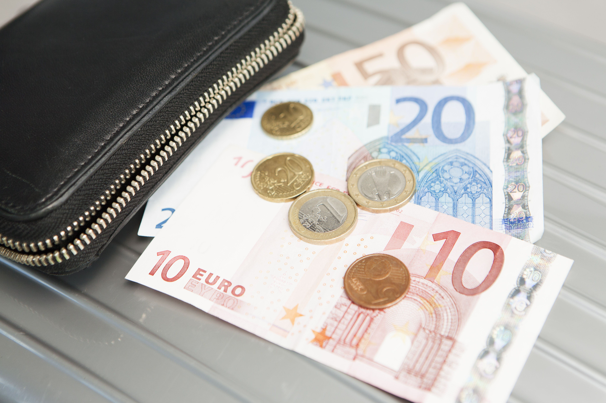

## Table of Contents

## What are Euro notes?

Euro notes are the paper money used in many countries in Europe. They are part of the currency called the euro, which is used by 20 countries in the European Union. Euro notes come in different colors and sizes, making them easy to tell apart. The smallest note is 5 euros, and the largest is 500 euros. Each note has pictures of bridges and windows, symbolizing the connection between European countries.

The design of euro notes is the same in all countries that use the euro. This means that a 20 euro note looks the same whether you are in France, Germany, or Italy. The notes are made to be hard to copy, with special features like holograms and watermarks. These features help prevent people from making fake money. Euro notes are accepted everywhere in the countries that use the euro, making it easy for people to travel and do business across Europe.

## What are the different denominations of Euro notes?

Euro notes come in seven different amounts. These amounts are 5 euros, 10 euros, 20 euros, 50 euros, 100 euros, 200 euros, and 500 euros. Each note has a different color and size to help people tell them apart easily.

The smallest note is the 5 euro note, which is grey. The 10 euro note is red, the 20 euro note is blue, and the 50 euro note is orange. The 100 euro note is green, the 200 euro note is yellow-brown, and the biggest note, the 500 euro note, is purple. These colors and sizes make it simple for everyone to use the notes correctly.

## How do Euro notes look like?

Euro notes are colorful and easy to recognize. Each note has a different color and size, which helps people tell them apart. The smallest note, the 5 euro note, is grey. The 10 euro note is red, the 20 euro note is blue, and the 50 euro note is orange. The 100 euro note is green, the 200 euro note is yellow-brown, and the biggest note, the 500 euro note, is purple. The notes get bigger as the amount on them gets larger, making it simple to see the difference.

Each euro note has pictures of bridges and windows on it. These pictures stand for the idea of connection between European countries. The front of the note shows windows, and the back shows bridges. The notes also have special features to stop people from copying them. These features include holograms, watermarks, and special ink that changes color. All these things make euro notes safe and hard to fake.

## What security features do Euro notes have?

Euro notes have many special features to stop people from making fake money. One important feature is the hologram. When you tilt the note, you can see the value of the note and a window or a doorway in the hologram. Another feature is the watermark. If you hold the note up to the light, you can see a picture of the same person that is on the note, but in a lighter color. The notes also have special ink that changes color when you tilt them, making it hard for people to copy.

There are also raised lines on the notes that you can feel with your fingers. This helps people who are blind or have trouble seeing to know how much the note is worth. The notes have a security thread too. This is a thin line that goes through the paper and has the letters "EURO" and the amount of the note written on it. You can see this thread if you hold the note up to the light. All these features make euro notes very safe and hard to fake.

## How can you check if a Euro note is genuine?

To check if a Euro note is real, you can look at it closely. First, check the hologram on the note. When you tilt the note, you should see the value of the note and a picture of a window or a doorway in the hologram. If you don't see these things, the note might not be real. Next, hold the note up to the light to see the watermark. The watermark shows a picture of the same person that is on the note, but it looks lighter. If you can't see the watermark, the note might be fake.

Another way to check is by feeling the note. Euro notes have raised lines that you can feel with your fingers. These lines help people who are blind or have trouble seeing to know how much the note is worth. If the note feels smooth and you can't feel the lines, it might not be real. Also, look for the security thread. This is a thin line that goes through the paper and has the letters "EURO" and the amount of the note written on it. You can see this thread if you hold the note up to the light. If you can't see the thread, the note might be fake. By checking these things, you can tell if a Euro note is genuine.

## What is the material composition of Euro notes?

Euro notes are made from a special kind of paper. This paper is very strong and hard to tear. It is made from cotton, which is different from the wood pulp used in regular paper. The cotton fibers make the notes durable and give them a unique feel. The paper also has other things added to it, like special fibers and chemicals, to make it even harder to copy.

The special paper used for Euro notes is made in just a few places in Europe. This helps keep the notes safe because it's hard for other people to get the same paper. The paper is then printed with inks that have special properties, like changing color when you tilt the note. All these things together make Euro notes very hard to fake and easy to check if they are real.

## How long do Euro notes typically last in circulation?

Euro notes can last a long time before they need to be replaced. On average, a Euro note stays in use for about 2 to 3 years. How long a note lasts depends on how much it is used. Notes that people use a lot, like the smaller ones, might not last as long as the bigger ones that people use less often.

The European Central Bank keeps track of how long notes last. They do this by looking at how many notes come back to the banks in bad shape. This helps them know when to make new notes. By making sure the notes are strong and hard to tear, they can stay in use for as long as possible.

## What is the history behind the introduction of Euro notes?

The Euro was introduced as the official currency of many European countries on January 1, 1999. At first, it was used only for things like bank accounts and electronic payments. It wasn't until January 1, 2002, that Euro notes and coins started being used by people in shops and stores. This was a big change for the countries that used the Euro because they had to switch from their old money to the new Euro money.

The design of the Euro notes was chosen to show that the countries using the Euro were connected. The notes have pictures of bridges and windows, which stand for the idea of Europe coming together. A lot of work went into making sure the notes were hard to copy. Special features like holograms, watermarks, and special ink were added to the notes to keep them safe. The introduction of Euro notes helped make it easier for people to travel and do business across Europe.

## How are Euro notes designed and who decides on the themes?

Euro notes are designed to show that the countries using the Euro are connected. The notes have pictures of bridges and windows on them. These pictures stand for the idea of Europe coming together. The front of the note shows windows, and the back shows bridges. Each note is a different color and size, which helps people tell them apart easily. The smallest note, the 5 euro note, is grey, and the biggest note, the 500 euro note, is purple. The notes also have special features like holograms, watermarks, and special ink to make them hard to copy.

The themes for Euro notes are chosen by the European Central Bank (ECB) and the national central banks of the countries that use the Euro. They wanted the notes to show that Europe is united. That's why they picked bridges and windows as the main pictures. The ECB worked with artists and designers to come up with the look of the notes. They made sure the notes were easy to use and safe from being copied. The design of the Euro notes has stayed the same since they were first introduced in 2002, showing that the idea of a united Europe is still important.

## What are the production processes involved in making Euro notes?

Making Euro notes starts with special paper that is very strong and hard to tear. This paper is made from cotton, not wood like regular paper. It also has special fibers and chemicals added to it to make it hard to copy. The paper is made in just a few places in Europe to keep it safe. Once the paper is ready, it is printed with special inks that change color when you tilt the note. These inks help stop people from making fake notes. The printing is done on big machines that can print a lot of notes quickly.

After the notes are printed, they go through many checks to make sure they are perfect. Machines look at each note to see if it has all the right features, like holograms and watermarks. If a note is not right, it gets thrown away. The good notes are then cut to the right size and packed up. They are sent to banks all over Europe. The whole process takes a lot of care to make sure the notes are safe and will last a long time. This way, people can trust that their Euro notes are real and will work well when they use them.

## How does the European Central Bank manage the supply of Euro notes?

The European Central Bank (ECB) works hard to make sure there are enough Euro notes for everyone who needs them. They keep track of how many notes are being used and how many are coming back to the banks. If they see that people need more notes, they tell the places that make the notes to print more. They also make sure that the notes are spread out evenly across all the countries that use the Euro. This way, no matter where you are in Europe, you can always get the notes you need.

The ECB also takes old or damaged notes out of use. When notes come back to the banks in bad shape, the ECB checks them and decides if they need to be replaced. They then destroy the old notes and put new ones in their place. By doing this, the ECB makes sure that the Euro notes stay in good condition and that people can trust the money they use. This careful management helps keep the supply of Euro notes just right for everyone.

## What are the future plans or proposed changes for Euro notes?

The European Central Bank is always thinking about how to make Euro notes better. They want to keep the notes safe from being copied and easy for people to use. One big change they are thinking about is stopping the making of the 500 euro note. This is because some people use it for bad things, like hiding money that they got from doing things that are not allowed. By not making the 500 euro note anymore, the ECB hopes to make it harder for these bad things to happen.

Another thing the ECB is looking at is making the notes even harder to copy. They might add new special features to the notes, like better holograms or new kinds of ink. They also want to make sure that the notes are good for the environment. This could mean using different materials or making the notes last longer. All these changes are to make sure that Euro notes stay trusted and useful for everyone who uses them.

## References & Further Reading

[1]: Lopez de Prado, M. (2018). ["Advances in Financial Machine Learning."](https://www.amazon.com/Advances-Financial-Machine-Learning-Marcos/dp/1119482089) John Wiley & Sons.

[2]: Aronson, D. (2006). ["Evidence-Based Technical Analysis: Applying the Scientific Method and Statistical Inference to Trading Signals."](https://www.amazon.com/Evidence-Based-Technical-Analysis-Scientific-Statistical/dp/0470008741) John Wiley & Sons.

[3]: Jansen, S. (2018). ["Machine Learning for Algorithmic Trading."](https://github.com/stefan-jansen/machine-learning-for-trading) Packt Publishing.

[4]: Chan, E. P. (2008). ["Quantitative Trading: How to Build Your Own Algorithmic Trading Business."](https://github.com/ftvision/quant_trading_echan_book) John Wiley & Sons.

[5]: European Central Bank. ["The Euro: Banknotes & Coins."](https://www.ecb.europa.eu/euro/banknotes/info/html/index.en.html)

[6]: Harris, L. (2003). ["Trading and Exchanges: Market Microstructure for Practitioners."](https://academic.oup.com/book/52292) Oxford University Press.

[7]: Hautsch, N. (2012). ["Econometrics of Financial High-Frequency Data."](https://link.springer.com/book/10.1007/978-3-642-21925-2) Springer.