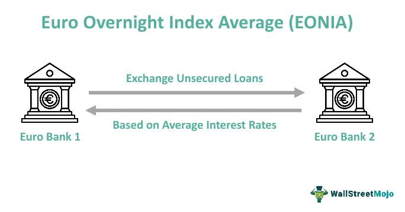

## Table of Contents

## What is the Euro Overnight Index Average (EONIA)?

The Euro Overnight Index Average, or EONIA, is a rate that banks in Europe use to borrow money from each other overnight. It is an important number because it shows how much it costs for banks to get quick loans from other banks. EONIA is calculated every day by taking the average interest rate of all these overnight loans.

Before 2019, EONIA was based on what banks said they would charge each other. But now, it is connected to another rate called the Euro Short-Term Rate (€STR). This change makes EONIA more reliable and accurate. People who work in finance, like traders and investors, use EONIA to help them make decisions about buying and selling money in the market.

## How is EONIA calculated?

EONIA is calculated every day by looking at the interest rates of all the overnight loans between banks in Europe. It's like taking the average price of all the quick loans banks give each other for just one night. Before 2019, banks would tell what rate they would charge, and then the average of those rates became EONIA.

Since 2019, EONIA has changed how it's figured out. Now, it's based on another rate called the Euro Short-Term Rate, or €STR. EONIA is now the €STR rate plus a small extra amount, which is 0.085%. This new way makes EONIA more reliable because it uses real data from actual loans, not just what banks say they might charge.

## What role does EONIA play in the financial markets?

EONIA is a very important number in the world of money and finance. It tells us how much it costs for banks in Europe to borrow money from each other for just one night. This rate is used by people like traders and investors to help them make smart choices about buying and selling money. When EONIA goes up, it usually means borrowing money is more expensive, and when it goes down, borrowing money becomes cheaper.

Because EONIA is used every day, it helps keep the financial markets stable. It's like a thermometer for the health of the banking system. If EONIA changes a lot, it can show that something big is happening in the economy. Banks, companies, and even governments look at EONIA to plan their money moves and make sure they are not taking too much risk.

## Why is there a transition from EONIA to ESTER?

The transition from EONIA to €STR happened because the old way of figuring out EONIA had some problems. Before, EONIA was based on what banks said they would charge each other for overnight loans. But this method was not always accurate because it depended on what banks guessed, not on real loan data. So, to make things more reliable and fair, the European Central Bank decided to switch to €STR, which uses actual loan data to set the rate.

€STR, or the Euro Short-Term Rate, is now the main rate used in Europe for overnight loans between banks. It's more trustworthy because it's based on real transactions. EONIA still exists, but now it's calculated as €STR plus a small extra amount of 0.085%. This change helps everyone in the financial markets have a clearer and more dependable way to understand the cost of borrowing money overnight.

## What is the Euro Short-Term Rate (ESTER)?

The Euro Short-Term Rate, or €STR, is a new rate that shows how much it costs for banks in Europe to borrow money from each other for just one night. It's calculated every day by looking at real loans between banks, not just what banks say they might charge. This makes €STR a very reliable number because it uses actual data.

€STR is important because it helps keep the financial markets fair and stable. Before €STR, people used EONIA, which was not as accurate. Now, with €STR, everyone in the finance world, like banks and investors, can make better decisions about borrowing and lending money. It's like having a clear, honest guide to help with money choices.

## How is ESTER calculated and what data does it use?

The Euro Short-Term Rate, or €STR, is calculated every day by looking at the interest rates of actual overnight loans between banks in the Euro area. The European Central Bank collects data on these loans from a big group of banks. They use this real information to find the average rate of all these overnight loans, which becomes the €STR. This method makes €STR very reliable because it's based on what really happens, not just what banks say might happen.

Using real loan data helps make €STR a fair and accurate measure of how much it costs for banks to borrow money overnight. Every day, the European Central Bank takes all the loan data they get and calculates the €STR. This rate is then used by banks, investors, and other people in the finance world to help them make smart choices about borrowing and lending money.

## When did the transition from EONIA to ESTER begin?

The transition from EONIA to €STR started in 2019. Before this, EONIA was based on what banks said they would charge each other for overnight loans. But this way of figuring out the rate was not always accurate because it relied on guesses, not real data.

In October 2019, the European Central Bank introduced €STR, which uses real loan data to calculate the rate. This change made the rate more reliable and fair. Now, EONIA is calculated as €STR plus a small extra amount of 0.085%. This new method helps everyone in the financial markets have a clearer and more dependable way to understand the cost of borrowing money overnight.

## What are the key differences between EONIA and ESTER?

EONIA and €STR are both important rates that tell us how much it costs for banks in Europe to borrow money from each other overnight. The big difference is how they are calculated. EONIA used to be based on what banks said they would charge each other, which was not always accurate because it depended on guesses. But €STR uses real loan data, which makes it more reliable and fair. This means €STR shows the true cost of borrowing money overnight because it's based on what actually happens, not just what banks think might happen.

Since 2019, EONIA has changed to be based on €STR. Now, EONIA is calculated as €STR plus a small extra amount of 0.085%. This change happened because the old way of figuring out EONIA had problems, and the new way with €STR is more trustworthy. People in the finance world, like banks and investors, use these rates to make decisions about buying and selling money. €STR has become the main rate used in Europe for overnight loans between banks, helping to keep the financial markets stable and fair.

## How does the transition to ESTER affect financial contracts and products?

The transition from EONIA to €STR has a big effect on financial contracts and products. Before, many contracts and financial products used EONIA as a reference rate. Now that EONIA is based on €STR, all these contracts need to be updated to use the new rate or understand how EONIA is calculated differently. This change means banks, companies, and investors have to look at their contracts and make sure they are using the right rate. If they don't update their contracts, they might end up paying more or less than they expected.

The switch to €STR also affects products like loans, mortgages, and derivatives. These products often use the overnight rate to figure out interest payments. With €STR being more reliable because it uses real loan data, these products can be more fair and accurate. But it takes time and effort to change all these products to use the new rate. Everyone in the finance world needs to work together to make sure the transition goes smoothly and that no one is surprised by changes in their interest payments.

## What steps should financial institutions take to prepare for the transition to ESTER?

Financial institutions need to get ready for the transition to €STR by first looking at all their contracts and financial products that use EONIA. They need to see how these contracts and products will change now that EONIA is based on €STR. This means updating the contracts to use €STR directly or understanding that EONIA is now €STR plus a small extra amount. It's important for banks and companies to talk to their customers and partners about these changes so everyone knows what to expect.

Next, financial institutions should update their systems and processes to work with €STR. This includes changing how they calculate interest rates for loans, mortgages, and other products. They also need to train their staff to understand the new rate and how it affects their work. By preparing well, financial institutions can make sure the transition to €STR goes smoothly and that they can keep providing fair and accurate services to their customers.

## What are the potential risks and challenges associated with the transition to ESTER?

The transition to €STR can bring some risks and challenges. One big risk is that if financial institutions do not update their contracts and systems in time, they might face problems with interest payments. This could mean they pay more or less than they planned, which could cause financial losses or disagreements with customers. Another challenge is making sure everyone understands the new rate. If people don't know how €STR works, they might make bad decisions about borrowing and lending money.

Also, the switch to €STR might be hard because it requires a lot of work to change old systems and train staff. This can take time and money, and if not done right, it could lead to mistakes or delays. Financial institutions need to work together and communicate well to make sure the transition goes smoothly. If they don't, there could be confusion and problems in the financial markets, which could affect everyone from banks to regular people who have loans or mortgages.

## How has the transition to ESTER been received by the market and what has been the impact so far?

The transition to €STR has been generally well-received by the market. People in the finance world see €STR as a more reliable and fair way to measure the cost of borrowing money overnight. This is because €STR uses real loan data, not just what banks say they might charge. Many banks and financial institutions have worked hard to update their contracts and systems to use €STR. They've also talked to their customers about the changes, which has helped make the switch smoother. Overall, the market has accepted €STR because it helps make the financial world more stable and honest.

The impact of the transition so far has been mostly positive. Financial products like loans, mortgages, and derivatives are now using €STR, which means they are more accurate and fair. This change has helped keep the financial markets stable, which is good for everyone. However, the transition has also taken a lot of time and effort. Banks have had to update their systems and train their staff, which has been a big job. But because everyone has worked together and communicated well, the move to €STR has been successful and has not caused big problems in the market.

## What is EONIA?

The Euro Overnight Index Average (EONIA) was an essential financial metric that represented the average overnight interest rate at which European banks lent euros to each other. EONIA was pivotal in the financial landscape, functioning as a benchmark for managing interbank liquidity and influencing the structuring of various financial contracts.

Calculated by the European Central Bank (ECB), EONIA was derived from the rates provided by a panel of 28 participating banks distributed across the European Union. These banks reported the rates based on unsecured lending transactions that occurred between them on a given day. The ECB collected this data daily and computed the EONIA as a weighted average of these overnight lending rates. The formula could be represented mathematically as:

$$
\text{EONIA} = \frac{\sum (\text{Lending Rate}_i \times \text{Transaction Volume}_i)}{\sum \text{Transaction Volume}_i}
$$

Here, $\text{Lending Rate}_i$ denotes the [interest rate](/wiki/interest-rate-trading-strategies) of a specific transaction and $\text{Transaction Volume}_i$ represents the transaction's [volume](/wiki/volume-trading-strategy). This approach ensured that EONIA accurately reflected the [liquidity](/wiki/liquidity-risk-premium) conditions of the euro area money market on any given day.

EONIA’s significance in financial markets was underscored by its role as a cornerstone for the pricing of derivative contracts and other financial products such as loans and bonds. By providing a standardized overnight rate, EONIA enabled more efficient management of short-term liquidity and risk for banks and other financial institutions across Europe.

In summary, EONIA served as a crucial benchmark for understanding and managing liquidity among euro area banks. It ensured standardized reporting and transparency, which was fundamental for the functioning of a harmonious and efficient European financial market.

## How did EONIA work?

The Euro Overnight Index Average (EONIA) functioned as a critical component of the European financial landscape by providing a daily reference rate, which encapsulated the weighted average interest rate for unsecured overnight lending within the interbank market. The mechanism of EONIA was rooted in capturing real-time borrowing and lending activities among a selected panel of European banks, which comprised the core of its data sourcing.

EONIA was established by aggregating data from banks that required short-term liquidity. These institutions would typically seek overnight loans from peer banks possessing surplus capital. This system facilitated an essential flow of funds, enabling banks to efficiently manage their immediate liquidity needs. To achieve this, panel banks reported their overnight lending rates to the European Central Bank (ECB), which then calculated the average. The final EONIA rate, therefore, was a reflection of instantaneous market conditions.

The precision of EONIA was attributed to its daily recalibration, which offered critical insights into the liquidity status within the banking sector. By examining these overnight transactions, EONIA effectively demonstrated the cost of short-term lending, thereby guiding financial institutions on liquidity positions and facilitating informed decision-making processes.

Mathematically, the EONIA was determined using the following formula:

$$
\text{EONIA} = \frac{\sum_{i=1}^{n} (L_i \times R_i)}{\sum_{i=1}^{n} L_i}
$$

where:
- $L_i$ represents the loan amount in euros from lender $i$,
- $R_i$ signifies the interest rate applied by lender $i$,
- $n$ is the total number of contributors.

This formula calculated the weighted average rate by taking the sum of the products of loan amounts and their respective rates, divided by the total loan amounts. As a result, EONIA mirrored the real borrowing costs faced by banks, thus serving as a pivotal indicator for understanding short-term liquidity trends and the broader economic implications within the eurozone's financial markets.

## References & Further Reading

[1]: European Central Bank. (2019). ["The euro short-term rate (€STR)."](https://www.ecb.europa.eu/stats/financial_markets_and_interest_rates/euro_short-term_rate/html/index.en.html)

[2]: European Money Markets Institute. (n.d.). ["EURIBOR."](https://www.emmi-benchmarks.eu/)

[3]: European Commission. (2016). ["Regulation (EU) 2016/1011 of the European Parliament and of the Council."](https://eur-lex.europa.eu/legal-content/EN/TXT/?uri=CELEX:32016R1011) 

[4]: Duffie, D., & Stein, J. C. (2015). ["Reforming LIBOR and Other Financial Market Benchmarks."](https://scholar.harvard.edu/files/stein/files/libor_duffie_stein_jep_2015.pdf) Brookings Papers on Economic Activity.

[5]: Bijsterbosch, M., & Falagiarda, M. (2015). ["The macroeconomic impact of financial fragmentation in the euro area."](https://www.sciencedirect.com/science/article/pii/S0261560615000285) European Central Bank Working Paper Series No. 1779.